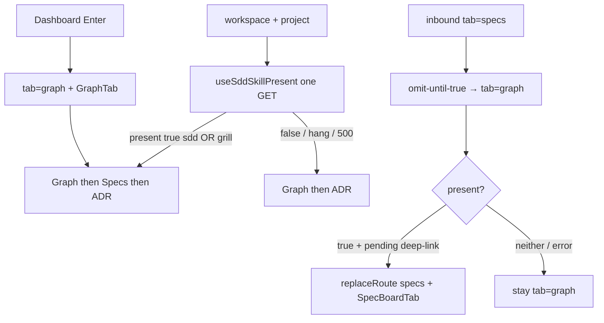

# Task #3 — App strip, deep-link, Enter, omit Gherkin
Reading time: 2-3 min
Last updated: 2026-08-30 — spec-009-t4x-specs-tab-grill-presence | Path=full | Patterns: ✓

## What changed (plain language)

A project that has grill-skill and no sdd-skill now shows the Specs tab, same as an sdd-skill project. The tab name is still Specs. Order stays Graph, then Specs, then ADR.

Opening `?tab=specs` on a grill-only project stays on Specs. Enter from Dashboard still opens Graph; Specs is just available in the strip. If the project has neither skill, or only a future gamedev folder, Specs stays hidden and a specs bookmark falls back to Graph.

## Files modified

`App.tsx` still consumes `present` for the strip and for `fallbackSpecsToGraph`. Product delta is restore of an inbound `tab=specs` after omit-until-true rewrites the URL while the one-shot GET is still false. Tests own the Gherkin table.

| File | What it does | Lines ± |
|---|---|---|
| `graph-ui/src/App.tsx` | `showSpecs={present}`; omit-until-true; restore inbound `tab=specs` when present (sdd OR grill) | +17 / −7; file 158 lines; restore `:74-86` |
| `graph-ui/src/App.test.tsx` | Independent sdd/grill mocks + grill-only / neither / gamedev / Enter Gherkin | +136 / −10; file 670 lines; block `:584-669` |

`WorkspaceTabStrip`, `fallbackSpecsToGraph` signature, tab label key, Enter default (`navigate("graph", p)`), C/HTTP/MCP were not edited. GraphTab stays mocked. No Playwright.

## Key decisions

| Decision | Why | ADR |
|---|---|---|
| Strip still `showSpecs={present}` | Hook OR (Task #1) already means grill-only can join | SDD-ADR-039; US-001 |
| Keep omit-until-true (`fallbackSpecsToGraph` unchanged) | Loading / false / error must rewrite `tab=specs` → Graph immediately | SDD-ADR-010 / 039 |
| Restore inbound `tab=specs` after `present` is true | Omit-while-loading would leave a grill-only deep-link on Graph | US-003; `pendingSpecsDeepLink` `:29`, `:74-86` |
| Enter stays Graph | Default workspace tab is not this spec | US-001; IX.3 |
| neither-skill + gamedev-only = both flags false, no `gamedev_skill_present` key | Dead tab must not appear; do not add C | US-004; SDD-ADR-041 |
| Keep existing GET 500 / hang omit tests | Graph stays usable; no new endpoint | US-001; Error GET 500 |
| graph-ui only; existing spec-008 C zero-write stays owner | Flags already on GET 200 | SDD-ADR-041; US-005 |

## How the strip, deep-link, and Enter work

`paneTab` still uses `fallbackSpecsToGraph(activeTab, present)`. The restore runs only when `pendingSpecsDeepLink` was set from the first `readRoute().tab === "specs"`. Host Kanban gate is Task #2.

## Debugging

| If this fails | File:line | Cause | Fix |
|---|---|---|---|
| Grill-only omits Specs | `useSddSkillPresent.ts:17` or `App.test.tsx:93-99` | Hook still sdd-only, or mock `specBoard: "true"` / `"false"` without grill | Mock `{ sdd: false, grill: true }`. Test `:592` |
| `?tab=specs` rewrites to Graph on grill-only 200 | `App.tsx:74-86` | Restore skipped or `pendingSpecsDeepLink` not set | Capture inbound specs before omit-until-true (`:29`). Test `:613` |
| Deep-link stays `tab=specs` when neither skill | `App.tsx:83-85` / `route.ts:38-40` | `fallbackSpecsToGraph` not applied | Keep `"false"` = both false. Test `:282` / `:636` |
| Enter opens Specs | `App.tsx:151` | `onSelectProject` left `graph` | `navigate("graph", p)`. Test `:659` |
| Tab order not Graph / Specs / ADR | `WorkspaceTabStrip.tsx:19-21` | Strip product edited | `showSpecs` only toggles Specs. Test `:606-610` |
| Accessible name not "Specs" | `WorkspaceTabStrip.tsx:30` | Label key renamed | `t.tabs.specs`. Test `:604-605` |
| gamedev-only shows Specs | `App.test.tsx:646-650` | Mock invented `gamedev_skill_present` or grill true | Both flags false; no gamedev key. Do not add C |
| GET 500 still shows Specs | `App.tsx:126` / hook `:36-38` | `present` defaulted true | Keep `:391`. GraphTab must stay |
| GraphTab boots Three | `App.test.tsx:16-20` | Mock removed | Keep `data-testid="graph-tab"` |
| C/HTTP/MCP edited this task | — | Presence tweak leaked to daemon | SDD-ADR-041. Zero-write owner is spec-008 C |

## Project fit

- Before: Task #1 made `present` true on sdd OR grill. Task #2 paints Kanban on the same OR. The App mock still treated `"false"` / `"true"` as sdd-only, and omit-until-true left an inbound `tab=specs` on Graph after a later true.
- After this task: grill-only shows Specs; `?tab=specs` stays; sdd+grill still shows; neither and gamedev-only omit; Enter is still Graph with Specs in the strip; GET 500 still omits.
- Next: last impl task. @review, then @tester. Closeprep waits @tester PASS.

## Pattern Notes

Patterns: ✓. Same one-shot GET and `present` boolean (SDD-ADR-039). Same `fallbackSpecsToGraph(tab, present)` signature (SDD-ADR-010 kernel). Same Enter → Graph (IX.3). Same tab label and WorkspaceTabStrip product (`showSpecs` only). Restore is the omit-until-true complement, not a second presence source. No `/api/skill-presence`; no 4s strip poll; no C/HTTP/MCP (SDD-ADR-041, IV.3). GraphTab mock kept (V.4). English Then text (II.3). Breadcrumbs on `App.tsx` and `App.test.tsx` (VII.2).

Constitution has I–IX only (no Section X). IX.2 still says spec-008 "tab still omit-until sdd" — this spec supersedes that strip rule; IX append waits for spec close. No constitution gap this task.

## Quick refs

- Spec US-001 / 003 / 004 / 005: `.sdd-skill/specs/spec-009-t4x-specs-tab-grill-presence/spec.md`
- Plan strip / Gherkin owners: `.sdd-skill/specs/spec-009-t4x-specs-tab-grill-presence/plan.md` (SDD-ADR-041)
- ADR: SDD-ADR-041 (graph-ui only); SDD-ADR-039 (present OR); SDD-ADR-010 (omit-until-true kernel)
- Tests: `cd graph-ui && npx vitest run src/App.test.tsx`
- Gherkin owners: strip / deep-link / Enter / neither / gamedev / GET 500 → this file; Kanban pane → Task #2; hook 404 / hang / sdd-only → Task #1; GET zero-write → existing spec-008 C
- Constitution: II.2–3, IV.3, V.1/V.4, VII.2, IX.3 (Enter Graph)
