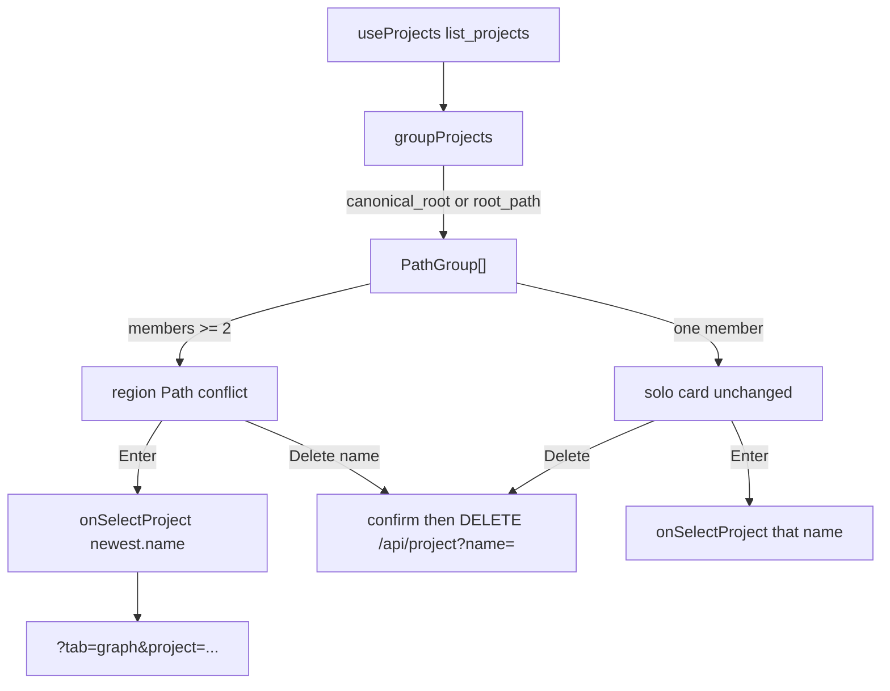

# Task #3 — Dashboard conflict group + Enter newest + delete older
Reading time: 2-3 min
Last updated: 2026-08-29 — spec-003-h7q-path-project-identity | Patterns: ✓

## What changed (plain language)

If two or more indexed names point at the same resolved folder, Dashboard no longer shows them as unrelated rows. They sit in one “Path conflict” block: every name, every last-indexed time, the folder path once. Enter on that block opens the newest name’s Graph. Each name still has its own Delete (confirm, then one HTTP delete). One click cannot wipe two names.

Rows that are the only project on their folder look the same as before (Enter + Delete). Reindex is not on this screen yet (Task #5).

## Files modified

| File | What it does | Lines ± |
|---|---|---|
| `graph-ui/src/lib/pathGroups.ts` | Group key + newest pick (matches C catalog) | +58 (new) |
| `graph-ui/src/lib/pathGroups.test.ts` | canonical_root vs fallback; time then greater name | +53 (new) |
| `graph-ui/src/components/Dashboard.tsx` | Conflict region; solo card extract; same delete helper | ~+84 |
| `graph-ui/src/components/Dashboard.test.tsx` | Two-clone, three-clone Enter a3, delete confirm/cancel | ~+128 |
| `graph-ui/src/lib/i18n.ts` | `conflict` + `deleteNamed` en+zh | +6 |
| `graph-ui/src/lib/i18n.test.ts` | Locks those strings | +5 |

Breadcrumbs present on all six files (`@sdd-task` Task #3).

## Key decisions

| Decision | Why | ADR |
|---|---|---|
| Group on list `canonical_root`, else `root_path` | UI must not invent a JS realpath | SDD-ADR-016 |
| Newest = `indexed_at` string, tie = greater `name` | Same rule as `cbm_identity_cmp_newest` | US-001 / US-004 |
| Path shown once (`newest.root_path`) | Conflict copy is names + times + Path once | spec default 7 |
| One Enter on the group → `onSelectProject(newest.name)` | Opens Graph of the newest clone | US-004 |
| Same `confirm` + `DELETE /api/project?name=` per name | No second delete API; no multi-delete | US-005, VI.3 |
| Conflict strings in `i18n.ts` now (not deferred to #5) | Accessible English names required by tests | II.3 |

## How grouping works

## Debugging

| If this fails | File:line | Cause | Fix |
|---|---|---|---|
| Two clones stay as separate cards | `pathGroups.ts:36-37` | Key used stored `root_path` while list sent different spellings | Group on `canonical_root` when present |
| Enter opens the older name | `pathGroups.ts:17-33` / `Dashboard.tsx:106` | `pickNewest` drifted from C, or Enter used first list row | `indexed_at` string compare; tie → greater `name` (`beta` > `alpha`); click calls `group.newest.name` |
| Path printed once per clone | `Dashboard.tsx:101-103` | Member rows still render `root_path` | Path lives only on the group header |
| One click deletes two names | `Dashboard.tsx:124-125` | A bulk-delete control was added | Each button calls `deleteProject(p.name)` only |
| Delete cancel still DELETEs | `Dashboard.tsx:31-34` | `confirm` not gated | `if (!confirm(...)) return` before `fetch` |
| Confirm-yes uses the wrong URL | `Dashboard.tsx:34` | Query key changed | Must be `DELETE /api/project?name=<that name>` |
| Conflict region has no accessible name | `i18n.ts:50` / `Dashboard.tsx:93` | `projects.conflict` missing | en `"Path conflict"`; `aria-label={t.projects.conflict}` |
| Cannot find Delete a1 | `i18n.ts:48` / `Dashboard.tsx:128` | Solo `deleteTitle` reused on clones | Conflict uses `deleteNamed(name)` |

## Project fit

- Before: Task #1 listed `canonical_root`; Task #2 blocked new clones. Dashboard still painted one card per name, so leftover aliases looked like two projects.
- After: same-Path leftovers are a conflict; Enter newest; delete older is confirm-gated and per name. Create-modal 409 redirect and Reindex are not built.
- Next: Task #4 create-modal `path_exists` → Graph + notice. Task #5 Reindex on every row (including conflict members).

## Quick refs

- Spec US-004 / US-005: `.sdd-skill/specs/spec-003-h7q-path-project-identity/spec.md`
- Plan: `.sdd-skill/specs/spec-003-h7q-path-project-identity/plan.md`
- ADR: SDD-ADR-016 (list field is the group key)
- Tests: `cd graph-ui && npx vitest run src/lib/pathGroups.test.ts src/components/Dashboard.test.tsx src/lib/i18n.test.ts`
- Constitution: II.3 i18n en+zh; VI.3 confirm-gated delete; VII breadcrumbs; IX.2 this spec owns duplicate resolution. No Section X in the draft file.
