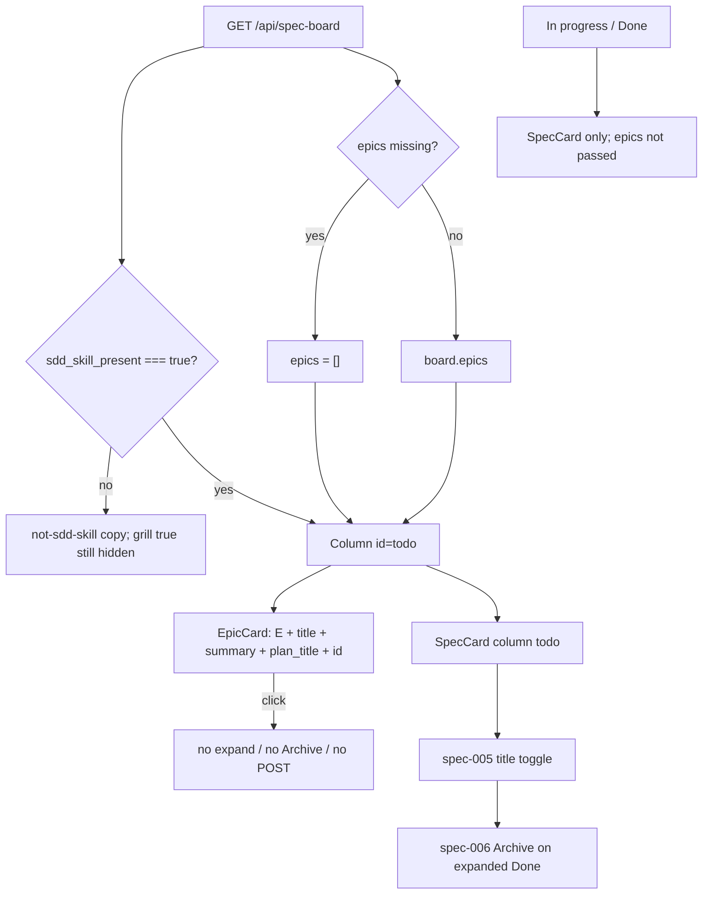

# Task #3 — SpecBoardTab EpicCard + Todo epics-then-specs
Reading time: 2-3 min
Last updated: 2026-08-30 — spec-008-g8r-grill-epic-todo | Patterns: ✓

## What changed (plain language)

The Specs Todo column now paints unconverted grill epics first, then planned spec cards. Each epic shows a letter E, its title, one-line summary, plan name, and file path. Clicking it does nothing: no task list, no Archive, no POST.

In Progress and Done stay spec-only. Spec cards still expand in place and still Archive from expanded Done. The Specs tab still hides until `sdd_skill_present` is true — grill alone does not open it. Old board JSON without `epics` still paints specs.

## Files modified

Working-tree `git diff --numstat` vs last commit (types.ts / SpecBoardTab.tsx also carry earlier uncommitted expand + archive):

| File | What it does | Lines ± |
|---|---|---|
| `graph-ui/src/lib/types.ts` | `SpecBoardEpic`; `SpecBoard.grill_skill_present?` + `epics?` | +28 / −6 tree; this task is epic type + optional keys |
| `graph-ui/src/styles/globals.css` | `--color-epic-mark: #7d8ec9` in `@theme inline` | +6 / −5; this task is the token |
| `graph-ui/src/components/SpecBoardTab.tsx` | `EpicCard`; Todo concatenates epics then spec todos | +227 / −29 tree; this task is EpicCard + Column `epics` |
| `graph-ui/src/components/SpecBoardTab.test.tsx` | Mixed Todo order + no expand/archive; host missing epics + grill-without-sdd | file ~811; this task +~80 (untracked) |

`useSddSkillPresent`, `useSpecBoard` poll, `formatIndexedAt`, `colors.ts`, `i18n.ts`, C HTTP, and MCP were not edited. No new CSS file. Letter E is not an i18n word.

## Key decisions

| Decision | Why | ADR |
|---|---|---|
| Same GET; UI reads sibling `epics[]` (missing = `[]`) | No second poll; old mocks must not throw | SDD-ADR-035 |
| Todo document order = epics then spec todos | Mixed Todo is scannable; conversion already dropped converted ids | grill ADR-005 |
| In progress / Done ignore `epics` | Epic `column` is always todo; those columns stay spec-only | US-003 |
| `EpicCard` display-only: no title button, no Archive, no POST | Expand/archive stay spec-005 / spec-006 | IX.2; SDD-ADR-035 |
| Letter `E` via `--color-epic-mark #7d8ec9`; not i18n, not a pill | One documented chrome hue; graph/health hex stay locked | SDD-ADR-038; constitution III |
| Host still `!board.sdd_skill_present` → not-sdd-skill copy | Grill-only repos wait for epic-002; do not weaken `useSddSkillPresent` | US-004; SDD-ADR-010 |

## How Todo epics-then-specs works

`pendingCount` is epic cards + spec todo cards. Three Column children only.

## Debugging

| If this fails | File:line | Cause | Fix |
|---|---|---|---|
| Letter E is gray / missing | `globals.css:28`, `SpecBoardTab.tsx:104` | Token missing from `@theme` or class not `text-[var(--color-epic-mark)]` | `--color-epic-mark: #7d8ec9`. Literal `"E"`. Test `:757-761` |
| E is a pill / the word Epic | `SpecBoardTab.tsx:104` | Badge chrome or i18n leaked | Single character, no `rounded-full`. Test `:761-762` |
| Function nodes went periwinkle | `colors.ts` (untouched) | Graph map imported the chrome var | `colorForLabel("Function")` stays `#06b6d4`. Do not edit `colors.ts` |
| Epic card appears after the spec in Todo | `SpecBoardTab.tsx:267-278` | Specs mapped first | `todoEpics.map` then `entries.map`. Test `:767` |
| Epic id in In Progress or Done | `SpecBoardTab.tsx:238`, `:371-393` | `epics` passed to those columns | Only Todo passes `board.epics ?? []`. Tests `:770-771` |
| Click epic expands / shows noTasksYet / POSTs | `SpecBoardTab.tsx:100-111`, `:321-334` | EpicCard reused SpecCard | Display-only `
`; `persistArchive` only from SpecCard. Test `:775-791` |
| Spec expand / Archive gone when epics present | `SpecBoardTab.tsx:140-207` | SpecCard rewritten | Title button + Done Archive stay. Test `:794-808` |
| Missing `epics` throws | `types.ts:141-143`, `SpecBoardTab.tsx:362` | Keys required | Optional; `board.epics ?? []`. Test `:315-327` |
| grill true + sdd false paints Todo | `SpecBoardTab.tsx:344-346` | Host gated on grill | Still `!board.sdd_skill_present`. Test `:330-349`. Strip: `useSddSkillPresent.ts:16` `=== true` only |
| Live :9749 has no epic cards | daemon binary | Pre-spec-008 embed (GET lacks `epics`) | Rebuild `scripts/build.sh --with-ui`. Vitest is the Task #3 proof |

## Project fit

- Before: GET already returned `grill_skill_present` + `epics[]` (Tasks #1–#2). The tab still painted spec cards only.
- After: Todo concatenates EpicCard then SpecCard. Expand/archive stay on specs. Omit-until sdd unchanged.
- Next: Task #4 maps remaining Vitest Gherkin (two-plan document order, 64-cap no Has more, colorForLabel lock in the suite).
- Live UI: implementer did not browser-click a spec-008 binary. Proof is Vitest (165 passed, 29 SpecBoardTab). A daemon already on :9749 may be pre-spec-008 (GET has no `epics`). Constitution IX.4 / V.1 make Playwright optional at DEVELOPMENT.

## Pattern Notes

Patterns: ✓. Chrome stays grayscale except the one documented E hue `--color-epic-mark #7d8ec9` (constitution III.1–III.2; SDD-ADR-038). Not health `#e05252`, not Function `#06b6d4` / CALLS `#1DA27E`. spec-005 expand Set + spec-006 Archive stay on SpecCard (IX.2); EpicCard has no title control and never calls `persistArchive`. Omit-until sdd: host still `sdd_skill_present`; `useSddSkillPresent` still `=== true` only (not edited). Same GET (SDD-ADR-035). No new CSS file (II.2). Letter E not i18n (II.3). Missing `epics` defaults `[]` (old mocks). Breadcrumbs on `types.ts`, `globals.css`, `SpecBoardTab.tsx`, `SpecBoardTab.test.tsx` (VII.2).

Constitution has I–IX only (no Section X). IX.2 does not mention grill yet — true; this is spec-008 UI only. No constitution gap this task (IX grill sentence waits for spec close).

## Quick refs

- Spec US-001 / US-003 / US-004 / US-006 (tab): `.sdd-skill/specs/spec-008-g8r-grill-epic-todo/spec.md`
- Plan EpicCard + Todo order: `.sdd-skill/specs/spec-008-g8r-grill-epic-todo/plan.md`
- ADR: SDD-ADR-035 (same GET + separate `epics[]`); SDD-ADR-038 (`--color-epic-mark #7d8ec9`)
- Tests: `cd graph-ui && npx vitest run` (165 passed, 29 SpecBoardTab)
- Constitution: II.2–3, III.1–2, V.1/V.4, VII.1–2, IX.2 (expand + archive stay on spec cards)
