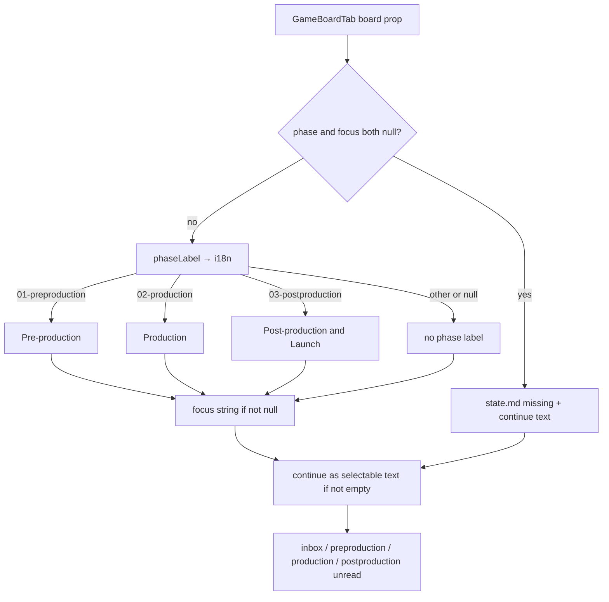

# Task #3 — GameBoardTab chrome only
Reading time: 2-3 min
Last updated: 2026-08-31 — spec-010-c4h-game-tab-silent-win | Path=full | Patterns: ✓

## What changed (plain language)

There is now a Game pane that shows where a gamedev cycle is and what to paste into the IDE. When the board says production, you see "Production", the focus line, and `/gamedev-skill continue` as selectable text — not a launch button. When phase and focus are empty, you see "state.md missing" plus the same continue text. No other phase labels, no columns, no cards.

App does not open this pane yet. The strip still cannot show Game until Task #4.

## Files modified

`GameBoardTab.tsx` / `.test.tsx` are new this task (untracked vs HEAD). `types.ts` already carried Task #2 `WORKSPACE_TABS` + prior specs; this task adds `GameBoard` only.

| File | What it does | Lines ± |
|---|---|---|
| `graph-ui/src/components/GameBoardTab.tsx` | Dedicated chrome pane. Props = board JSON. i18n phase map. Continue is `
` | NEW 45. Map `:16-19`; missing `:26`, `:31-32`; continue `:39-41` |
| `graph-ui/src/components/GameBoardTab.test.tsx` | Production chrome; missing-state; arrays not painted; no launcher | NEW 127. Chrome `:60-84`; missing `:86-106`; arrays `:108-126` |
| `graph-ui/src/lib/types.ts` | `GamePhase` + `GameBoard` match GET keys; arrays typed, not painted | this task +13 (`:146-158`). Breadcrumb rewrite in place. File 167. vs HEAD +48/−6 (prior specs + Task #2 `WORKSPACE_TABS`) |

`i18n.ts` `gameBoard` keys are Task #2 (`:118-123`, `:229-234`). `SpecBoardTab.tsx` still spec-009 Task #2. `App.tsx` still spec-009 (no `GameBoardTab` import). C / `useSpecBoard` / `useSddSkillPresent` not this task.

## Key decisions

| Decision | Why | ADR |
|---|---|---|
| New `GameBoardTab`, not `SpecBoardTab` | Silent win must not paint Specs Kanban (Todo / EpicCard / Archive) | SDD-ADR-042 |
| Props receive `GameBoard`; no GET in the pane | One-shot fetch is Task #4 `useGameBoard`. Second fetch would drift from the strip | SDD-ADR-042; US-003 |
| Phase map in UI/i18n, not C | JSON keeps skill tokens (`02-production`). EN labels: Pre-production / Production / Post-production & Launch | US-003; Task #2 i18n |
| Continue is selectable text, not a button | Map, not launcher. No spawn, no catalog, no gate-review | SDD-ADR-042; grill ADR-009 |
| `phase === null && focus === null` → "state.md missing" | Empty dir / unreadable `state.md` still has continue when present | US-003 Limit |
| Arrays typed (`unknown[]`) and never read in JSX | Epic 002 fills the same keys. This spec paints zero cards | US-003; SDD-ADR-045 |

## How board props become chrome or missing-state

App does not mount `GameBoardTab` (`App.tsx` still spec-009). Tests pass a board object; no `/api/game-board` from this file.

## Debugging

| If this fails | File:line | Cause | Fix |
|---|---|---|---|
| Production missing on `phase: "02-production"` | `GameBoardTab.tsx:16-19`, `:24`, `:33-35`; `i18n.ts:121` | Token not mapped or EN key drifted | `phaseLabel` returns `t.gameBoard.phaseProduction`. Test `:73` |
| Pre-production or Post-production & Launch also visible | `GameBoardTab.tsx:16-19`, `:33-35` | All three labels painted | Render only `mapped`. Tests `:76-77`, `:102-104` |
| Launcher button / click starts the skill | `GameBoardTab.tsx:39-41` | Continue wrapped in `<button>` | `
`. Test `:78` (`queryByRole("button")`) |
| Pane fetches `/api/game-board` | `GameBoardTab.tsx:11-13`, `:22` | Second fetch inside the pane | Props only. `useUiMessages` is `/api/ui-config` (locale), not the board |
| Specs Kanban on Game (Todo / EpicCard / Archive) | `GameBoardTab.tsx:8-9` | `SpecBoardTab` reused or imported | Dedicated file. `SpecBoardTab.tsx` breadcrumb still spec-009. Tests `:79-83` |
| Missing-state copy wrong or a phase label shows | `GameBoardTab.tsx:26`, `:31-32`; `i18n.ts:119` | `missingState` not both-null, or raw English | `t.gameBoard.stateMdMissing` === "state.md missing". Test `:100-104` |
| Inbox / production card titles appear | `GameBoardTab.tsx:28-43`; `types.ts:154-157` | JSX mapped the arrays | Do not read `inbox` / column keys. Test `:108-126` |
| App shows the Game pane this task | `App.tsx:9-10` | Mounted early | No `GameBoardTab` import. Silent-win + fetch is Task #4 |

## Project fit

- Before: GET `/api/game-board` exists (Task #1). URL and strip can name Game (Task #2). There was no Game pane. App still spec-009 (`showSpecs` only).
- After this task: `GameBoardTab` paints chrome or missing-state from props. `GameBoard` type matches GET keys. App does not mount this yet. No columns or cards.
- Next: Task #4 App silent-win + dual fetch + deep-links (mount this pane when `showGame`). Task #5 leftover Vitest Gherkin.

## Pattern Notes

Patterns: ✓. Dedicated pane, not `SpecBoardTab` reuse (SDD-ADR-042). Strings from `useUiMessages` / Task #2 `gameBoard` keys (constitution II.3). Props, not a second board fetch. Continue is text (`select-text` `
`), not a launcher. Grayscale `bg-card` / `text-foreground` (III.1). Region accessible name `t.tabs.game` (VII.1). Arrays typed and unread. `SpecBoardTab` / `useSpecBoard` / `useSddSkillPresent` / App / C unchanged.

Constitution has I–IX only (no Section X). IX.2 still describes spec-009 Specs = sdd OR grill. The AND NOT gamedev sentence waits for spec close (plan note for @planner). No constitution gap this task.

Breadcrumbs on `GameBoardTab.tsx`, `GameBoardTab.test.tsx`, `types.ts`. Confirmed not edited: `SpecBoardTab.tsx` (spec-009 Task #2), `App.tsx` (spec-009 Task #3), C `game_board.c` (spec-010 Task #1).

## Quick refs

- Spec US-003: `.sdd-skill/specs/spec-010-c4h-game-tab-silent-win/spec.md`
- Plan ADR-042 pane: `.sdd-skill/specs/spec-010-c4h-game-tab-silent-win/plan.md`
- ADR: `.sdd-skill/baseline/ARCHITECTURE_ADR.md` — SDD-ADR-042
- Tests: `cd graph-ui && npx vitest run src/components/GameBoardTab.test.tsx` (3 passed)
