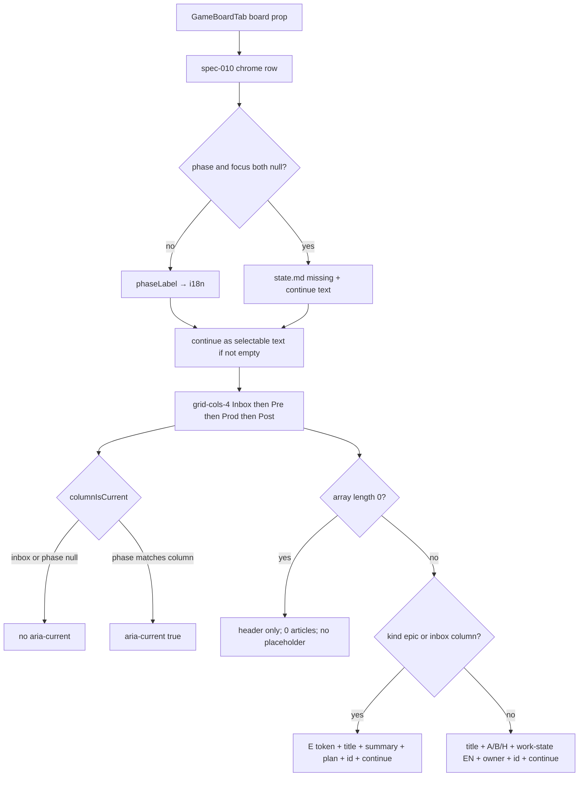

# Task #3 — GameBoardTab four columns + cards + i18n
Reading time: 2-3 min
Last updated: 2026-08-31 — spec-011-q5n-game-phase-board | Path=full | Patterns: ✓

## What changed (plain language)

The Game pane still shows spec-010 chrome (phase label, focus, `/gamedev-skill continue` as selectable text). Under that chrome it now always paints four columns: Inbox, Pre-production, Production, Post-production & Launch. Empty columns keep the header and show zero cards — no "no artifacts in this phase", no dim, no hide. The column that matches GET `phase` gets `aria-current="true"`. Inbox never does. When phase is null, no column is current.

Artifact cards show id, title, track A/B/H, English work-state, owner, and continue text — no letter E. Inbox cards show letter E (same dusty mark as Specs), title, summary, plan title, id, and continue without `@role` — no track, no Pending. Clipboard, drag, and typed kind-filter stay Task #4.

## Files modified

`SpecBoardTab.tsx` / `useSddSkillPresent` / `useSpecBoard` / `App.tsx` / C were not this task. `useGameBoard.test.ts` still spec-010 Task #4.

| File | What it does | Lines ± |
|---|---|---|
| `graph-ui/src/components/GameBoardTab.tsx` | Same pane. Chrome row + 4-col grid. ArtifactCard / InboxCard. No EpicCard import | 168 (was 45 chrome; +123). Map `:19-24`; current `:33-38`; Artifact `:56-73`; Inbox E `:75-94`; grid `:153-164` |
| `graph-ui/src/components/GameBoardTab.test.tsx` | Invert spec-010 no-columns lock; pane Gherkin US-001/002/003 | 428 (was 127; +301). Headers `:183-208`; gdd `:210-237`; Inbox `:296-324`; empty `:326-342` |
| `graph-ui/src/lib/types.ts` | `GameBoardCard` matches GET keys; arrays typed | 183 (was 167; +16). Card `:153-163`; arrays `:170-173` |
| `graph-ui/src/lib/i18n.ts` | Inbox header + work-state en+zh; reuse EN phase strings for headers | 318. Inbox/work-state en `:123-127`; zh `:239-243` |
| `graph-ui/src/lib/i18n.test.ts` | Lock Inbox + Pending / In progress / Done / Blocked en+zh | 108. Locks `:97-106` |
| `graph-ui/src/hooks/useGameBoard.ts` | Arrays `GameBoardCard[]`; pass-through parse; one-shot stays | 98. Cast `:42-45`. Kind skip is Task #4 |
| `graph-ui/src/App.test.tsx` | Empty-dir still Game + missing-state; now also four headers | 991. Invert `:945-948`. Silent-win / no skill-presence stay |

## Key decisions

| Decision | Why | ADR |
|---|---|---|
| Same `GameBoardTab`, not `SpecBoardTab` | Silent win must not paint Specs Kanban (Todo / EpicCard / Archive) | SDD-ADR-042; spec-010 chrome |
| Local InboxCard, no `EpicCard` import | Game Inbox is a map card (continue text, no expand). Specs EpicCard stays Specs-only | US-003; plan crumb 17 |
| Letter E via `--color-epic-mark` | One discreet hue. Not a pill, not "Epic", not a new token | SDD-ADR-038 |
| Track is text A/B/H; no E on artifacts | Track is not a second kind mark | US-002 |
| Four headers always; empty = header only; no dim | Operator must read the skill spine even when a phase is empty | US-001 |
| `aria-current="true"` on matching phase only; Inbox never; phase null → none | Current phase is a11y, not a hide/dim | US-001 |
| Chrome continue stays `
` | Map, not launcher. Card continue button + clipboard is Task #4 | SDD-ADR-042; SDD-ADR-051 later |
| i18n Inbox + work-state en+zh; reuse phase strings for headers | Constitution II.3. EN phase labels already locked in spec-010 | US-006 |
| `useGameBoard` still one-shot; parse pass-through | Kind filter / clipboard parse is Task #4 | SDD-ADR-050 |
| Drop `max-w-2xl` on the column row | Four columns must fit | plan Task #3 notes |

## How board props become chrome + four columns + cards

Pane still does not fetch `/api/game-board`. App still mounts this pane when `showGame`. Card click / clipboard / `draggable` are Task #4.

## Debugging

| If this fails | File:line | Cause | Fix |
|---|---|---|---|
| Only chrome; four headers missing | `GameBoardTab.tsx:153-164`, `:17`, `:26-31` | Grid dropped or `max-w-2xl` hid columns | Always map `COLUMN_KEYS`. Tests `:183-201`, `App.test.tsx:945-948` |
| Production missing `aria-current` when `phase` is `02-production` | `GameBoardTab.tsx:33-38`, `:110`, `:160` | Inbox leaked into the map, or token not matched | Inbox always false. Test `:202-205` |
| Inbox has `aria-current` | `GameBoardTab.tsx:34` | `columnIsCurrent` treated Inbox as a phase | `key === "inbox"` → false. Test `:203` |
| phase null still highlights a phase column | `GameBoardTab.tsx:34`, `:361` | Null gate dropped | `phase === null` → none. Test `:344-362` |
| Empty column hidden, dimmed, or shows "no artifacts in this phase" | `GameBoardTab.tsx:109-127`, `:153-164` | Placeholder copy or `opacity`/`hidden` | Header + empty list only. Test `:326-342` |
| Artifact shows letter E | `GameBoardTab.tsx:56-73`, `:116-124` | InboxCard used for `kind` artifact | ArtifactCard has no E. Test `:236` |
| Inbox missing E, or E is gray / word Epic | `GameBoardTab.tsx:79`; `globals.css` `--color-epic-mark` | Imported EpicCard or raw English | Literal `"E"` + `text-[var(--color-epic-mark)]`. Test `:316` |
| Inbox shows Pending / track A | `GameBoardTab.tsx:75-94`; `workStateLabel:40-48` | Artifact fields painted on epic | Inbox omits track and work-state. Tests `:322-323` |
| Work-state not "In progress" for `in_progress` / ready | `GameBoardTab.tsx:40-48`; `i18n.ts:125` | Raw JSON token or EN key drifted | `t.gameBoard.workStateInProgress`. Tests `:292-293`, `:409-411` |
| Inbox header not "Inbox" | `i18n.ts:123`; `GameBoardTab.tsx:27` | Key missing or chrome-only labels | `t.gameBoard.columnInbox`. Test `i18n.test.ts:97` |
| Specs Kanban on Game (Todo / EpicCard / Archive) | `GameBoardTab.tsx:1-9` | `SpecBoardTab` / `EpicCard` imported | Dedicated file. `SpecBoardTab.tsx` still spec-009. Tests `:122-125` |
| Chrome continue became a launcher button | `GameBoardTab.tsx:149-151` | Chrome `
` replaced with `<button>` | Chrome stays text. Card button is Task #4. Test `:122` |
| "Has more" control on 64 production cards | `GameBoardTab.tsx:114-126` | Extra overflow UI | No `has_more`. Test `:365-387` |
| Pane fetches `/api/game-board` | `GameBoardTab.tsx:131` | Second fetch inside the pane | Props only. Locale is `/api/ui-config` |

## Project fit

- Before: GET fills phase arrays (Task #1) and Inbox (Task #2). Game pane painted chrome only. spec-010 tests locked "no columns/cards".
- After this task: same pane paints four always-visible columns and cards from the four arrays. Chrome, silent win, and no skill-presence stay. Card continue is still text (not a copy button).
- Next: Task #4 clipboard + no-drag + typed card parse. Task #5 leftover Vitest Gherkin.

## Pattern Notes

Patterns: ✓. Same `GameBoardTab` pane, not `SpecBoardTab` (SDD-ADR-042). No `EpicCard` import. Letter E reuses `--color-epic-mark` (SDD-ADR-038). Strings from `useUiMessages` (II.3). Chrome continue stays `select-text` `
`. Grayscale `bg-card` / `text-foreground` (III.1). Region name `t.tabs.game` (VII.1). `useGameBoard` still one-shot (SDD-ADR-050). `SpecBoardTab` / `useSddSkillPresent` / `useSpecBoard` / `App.tsx` / C unchanged.

Constitution has I–IX only (no Section X). IX.2 still describes spec-010 empty column arrays. The filled-column sentence waits for spec close (plan note for @planner). No constitution gap this task.

Breadcrumbs on `GameBoardTab.tsx`, `GameBoardTab.test.tsx`, `types.ts`, `i18n.ts`, `i18n.test.ts`, `useGameBoard.ts`, `App.test.tsx`. Confirmed not edited: `SpecBoardTab.tsx` (spec-009 Task #2), `useSddSkillPresent.ts` (spec-009 Task #1), `useSpecBoard.ts` (spec-006 Task #3), `App.tsx` (spec-010 Task #4), `useGameBoard.test.ts` (spec-010 Task #4), C `game_board.c`.

## Quick refs

- Spec US-001 / US-002 / US-003 (paint): `.sdd-skill/specs/spec-011-q5n-game-phase-board/spec.md`
- Plan UI + 4-col: `.sdd-skill/specs/spec-011-q5n-game-phase-board/plan.md`
- ADR: SDD-ADR-038 (E token); SDD-ADR-042 (dedicated pane); SDD-ADR-050 (one-shot)
- Tests: `cd graph-ui && npx vitest run src/components/GameBoardTab.test.tsx src/lib/i18n.test.ts` (19 passed; full suite 221)
- Constitution: II.3 (i18n), III.1 (grayscale + one E hue), VII.1 (aria-current / names), VII.2 (breadcrumbs), IX.2 (spec-010 chrome / silent win)
