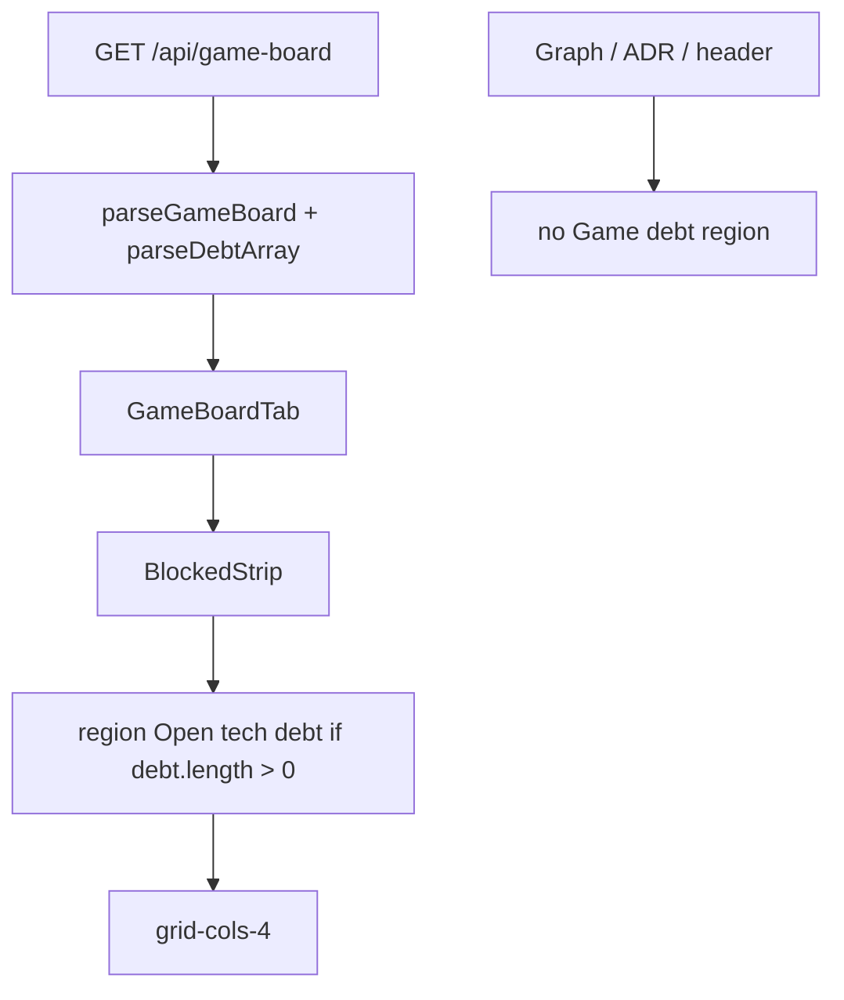

# Task #3 — GameBoardTab strip + leftover Vitest
Reading time: 2-3 min
Last updated: 2026-09-03 — spec-017-b4w-game-debt-chrome | Patterns: ✓ with note

## What changed (plain language)

Game now paints leftover open `debt:*` rows after the Blocked strip and before the four columns. The region uses the same English name as Specs ("Open tech debt"). Rows are dead text that wrap. Empty or missing debt hides the region. Graph, ADR, and the workspace header never show Game debt tags. Show Dones does not hide the strip.

## Files modified

| File | What it does | Lines |
|---|---|---|
| `graph-ui/src/lib/types.ts` | `GameBoardDebt {id,title}`; `GameBoard.debt?` | 217 |
| `graph-ui/src/components/GameBoardTab.tsx` | Local `DebtStrip` after `BlockedStrip`; reuse `t.specBoard.openTechDebt` | 530 |
| `graph-ui/src/hooks/useGameBoard.ts` | `parseDebtArray`; `parseGameBoard` keeps `debt` (missing → `[]`) | 238 |
| `graph-ui/src/hooks/useGameBoard.test.ts` | Parse keeps open rows; missing debt → `[]` | 343 |
| `graph-ui/src/components/GameBoardTab.test.tsx` | Placement, omit, wrap, dead row, Show Dones, 16 / no Has more | 2340 |
| `graph-ui/src/App.test.tsx` | Graph/ADR omit Game debt; Game tab paints it | 1319 |
| `graph-ui/src/components/WorkspaceHeader.test.tsx` | Header still omits `debt:gate-preproduction` | 141 |

`i18n.ts`, `SpecBoardTab.tsx`, `WorkspaceHeader.tsx`, `colors.ts` were not edited.

## Key decisions

| Decision | Why | ADR |
|---|---|---|
| Copy Specs `DebtStrip` JSX; do not import SpecBoardTab | Game-only host; Specs file stays locked | SDD-ADR-074 |
| Reuse `t.specBoard.openTechDebt` | Same English; no new i18n key | SDD-ADR-074 |
| `parseGameBoard` keeps `debt` | Strict constructor would drop live GET rows | SDD-ADR-072 + I.1 |

## How the strip sits

## Debugging

| If this fails | File:line | Cause | Fix |
|---|---|---|---|
| Live GET has debt but strip missing | `useGameBoard.ts` 121, 160 | Constructor dropped the key | `parseDebtArray` on `body.debt` |
| Strip above Blocked / inside header | `GameBoardTab.tsx` 503-505 | Sibling order | After `BlockedStrip`, before `grid-cols-4` |
| Title ellipsis | `GameBoardTab.tsx` 338 | `truncate` leaked | `whitespace-normal break-words` |
| Graph shows Open tech debt | `App.test.tsx` leftover | GameBoardTab stayed mounted | Unmount with tab change |
| Click POSTs / copies | `GameBoardTab.tsx` 337-340 | Row became a control | Keep dead `
` |

## Project fit

- Before: Task #1/#2 emit `debt[]`. Game tab never painted it (and a strict parse would drop it).
- After: Game chrome matches Specs density. Inbox hide and Specs TECH_DEBT.md strip stay.
- Next: closeprep after @review / @tester.

## Pattern Notes

Patterns: ✓ for strip copy + leftover host (same as spec-015 DebtStrip). Deviation: tasks.md DoD said do not edit `useGameBoard`. Spec KPI and constitution I.1 require live GET `debt` to reach the tab. Specs casts JSON; Game already uses a strict constructor for cards/blocked — keeping `debt` there is the Game path, not a second fetch. Flag for @review: architect lock vs live constructor. Not a constitution gap.

## Quick refs

- Spec US-001 / US-002 / US-006: `.sdd-skill/specs/spec-017-b4w-game-debt-chrome/spec.md`
- Tests: `graph-ui npx vitest run` (25 files, 302 passed)
