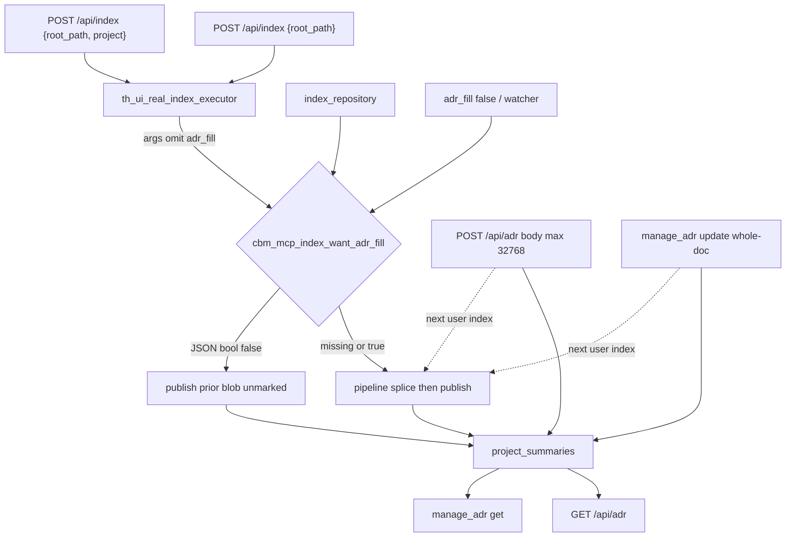

# Task #3 — HTTP + MCP + watcher Gherkin
Reading time: 2-3 min
Last updated: 2026-08-30 — spec-004-j8k-adr-parse-on-reindex | Patterns: ✓

## What changed (plain language)

A Dashboard Reindex, a first create-index, and `index_repository` now leave the same ADR blob that the workspace tab and `manage_adr` get already read. If the folder has `.sdd-skill/`, that blob gets the generated trio plus any notes you already wrote. Background jobs that pass `adr_fill: false` leave the blob unmarked.

Save still posts the whole document. The HTTP body cap is 32768 so a generated block plus a large Phase-1 manual can still return 200. Hand-edits inside the generated region die on the next user-triggered index. The ADR tab stamp is Task #4.

## Files modified

| File | What it does | Lines ± |
|---|---|---|
| `src/ui/http_server.c` | POST `/api/adr` body max `CBM_SZ_32K` (32768) | +~12 (file also has spec-003 admit) |
| `tests/test_httpd.c` | Create/Reindex Gherkin + 16KiB still 200 / over-max 400 | +~650 Task #3 |
| `tests/test_mcp.c` | MCP fill, manage_adr survive, `adr_fill: false` unmarked | +~250 |

No new endpoint. No Dashboard ADR control. spec-003 409/202 admission unchanged.

## Key decisions

| Decision | Why | ADR |
|---|---|---|
| Same store for GET `/api/adr` and `manage_adr` get | UI and MCP stay one backend | US-005, SDD-ADR-021 |
| HTTP create and `{root_path, project}` Reindex both fill | First Path and later refresh share one helper | US-001, SDD-ADR-019 |
| POST body max 32768; 16384 generated+manual still 200 | Real trio + notes exceeded 16384 | SDD-ADR-020 |
| Whole-doc POST / manage_adr update stay allowed | Parse, not the write API, protects manual | SDD-ADR-021 |
| Watcher Gherkin is `adr_fill: false` persist | Plan: prove the flag; do not start a live auto_watch poll | US-003, SDD-ADR-019 |
| No-skill / partial / unreadable still 202 + job success | Best-effort; omit extract only | US-003, US-004 |

## How HTTP and MCP fill the same blob



A 16KiB textarea still saves. A raw body above 32768 is 400 `invalid body`. `manage_adr` has no HTTP cap. Generated `PURPOSE-HAND-EDIT` is replaced by disk `PURPOSE-CANONICAL` on the next user-triggered index; `# New notes` in the manual region stays.

## Debugging

| If this fails | File:line | Cause | Fix |
|---|---|---|---|
| GET after Reindex has no `CBM-GENERATED` (skill present) | `mcp.c:8189` | Executor/pipeline left `adr_fill` at `new()` false | HTTP executor args omit the key (`test_httpd.c:2330-2332`) so want is true |
| Job never leaves indexing | `test_httpd.c:2308-2338` | `index_repository` did not return `"status":"indexed"` | Read `exec.last_resp`; wait is `http_wait_index_done` (`:2459`) |
| Create `{root_path}` unmarked with trio | `test_httpd.c:2906` / `:2936` | Bare POST did not run the real executor | Same fill gate as Reindex; name is `cbm_project_name_from_path` |
| `manage_adr` get lacks `PURPOSE-MCP-FILL` after index | `test_mcp.c:6287` / `mcp.c:8189` | Fill off or trio path wrong | `index_repository` without `adr_fill: false`; GET store via `mcp_adr_load` (`:6322`) |
| Watcher / `adr_fill: false` writes markers | `test_mcp.c:6409` / `mcp.c:1561-1563` | Gate ignored JSON bool false | Only bool false turns want off; watcher args at `application.c:3399` |
| `# New notes` gone after next index | `mcp.c:11029-11031` / `adr_fill.c:189-191` | Write API dropped the MANUAL span, or splice kept generated | `manage_adr` update is whole-doc; next parse keeps only the MANUAL span |
| `# Old notes` still in manual after survive test | `test_mcp.c:6337` | Update never wrote `# New notes` | Check `updated` + `mcp_between` (`:6393`) |
| `PURPOSE-HAND-EDIT` survives Reindex | `test_httpd.c:3091` | Fill skipped or trio missing `PURPOSE-CANONICAL` | POST `/api/adr` then Reindex; GET must drop the hand string (`:3130`) |
| 16KiB Save is 400 `invalid body` | `http_server.c:918` | Cap still 16384 or stale binary | Compare `body_len` to `CBM_SZ_32K` (`constants.h:40`); test `:3140` |
| Body >32768 is not 400 | `http_server.c:918` | Check moved or transport rejected first | Route cap is here; transport max is 1MiB (`httpd.h` `CBM_HTTP_MAX_BODY`) |
| `SECRET-DEVLOG-ALPHA` in GET | `adr_fill.c:20-22` | Extra relative opened | HTTP fixture writes DEV_LOG (`test_httpd.c:2859`) only to prove omit |
| Unreadable ARCHITECTURE still copied | `test_httpd.c:3048` / `adr_fill.c:66-71` | chmod ignored; file still readable | `ui_make_unreadable` replaces with a directory (`:2361`) |
| No-skill tree gained markers | `test_httpd.c:2965` | Fill ran without `.sdd-skill/` | Helper returns NULL; content stays `# Hand only\n` |
| Existing no-skill MCP ADR test fails | `test_mcp.c:6130` | Fill invented markers on a tree without skill | `tool_index_repository_reports_store_backed_adr` must stay green |

## Project fit

- Before: Task #2 spliced on user-triggered persist. Live HTTP/MCP jobs and the 32768 Save cap were not proven.
- After: Create and Reindex fill GET `/api/adr`. `index_repository` fills the same blob `manage_adr` get returns. Watcher-style `adr_fill: false` leaves `# Before watch`. POST `/api/adr` 16384 still 200; over 32768 is 400.
- Next: Task #4 AdrTab generated-at stamp + replace warning (parallel after Task #1).

## Pattern Notes

Patterns: ✓. One worker (`handle_index_repository`) for HTTP executor and MCP, same as spec-003 admit. Existing endpoints only (IV.3). 400 `{error:"invalid body"}` matches other HTTP size rejects. manage_adr stays whole-doc (SDD-ADR-021). Watcher case uses the plan's `adr_fill: false` persist, not a second fill path. No `adr_fill` on the MCP tool schema. No write-back to `.sdd-skill/` (I.2).

Constitution has I–IX only (no Section X). IX.2 names spec-004 but still does not lock the fence, the user-triggered-only gate, or “skill dir is not graph source.” Not a code defect this task.

```
📜 CONSTITUTION RECOMMENDATION
Observed: Task #3 proves HTTP create/Reindex and index_repository fill the same project_summaries blob; watcher-style adr_fill false does not. IX.2 names spec-004 but is silent on the in-document fence and that gate.
Recommendation: Add to Section IX at spec close — "Generated/manual HTML comments are the in-document fence; fill runs on user-triggered index only; `.sdd-skill` is not graph source; skill-file reads are best-effort fopen and never write cycle files."
→ @planner evaluates, creates ADR if agreed
```

## Quick refs

- Spec US-001 / US-002 / US-003 / US-004 / US-005 (not US-006 stamp): `.sdd-skill/specs/spec-004-j8k-adr-parse-on-reindex/spec.md`
- Plan API + Testing Strategy: `.sdd-skill/specs/spec-004-j8k-adr-parse-on-reindex/plan.md`
- ADR: SDD-ADR-019 (user-triggered flag), SDD-ADR-020 (32768 + markers), SDD-ADR-021 (whole-doc)
- Tests: `scripts/test.sh --suites httpd,mcp` (274 passed)
- Constitution: I.2, IV.3, V.3, VI.2, VII.2, IX.2
