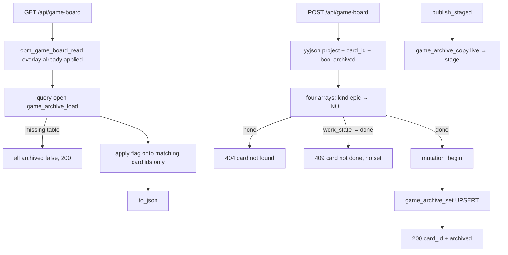

# Task #3 — HTTP POST + GET merge + C Gherkin + publish copy
Reading time: 2-3 min
Last updated: 2026-08-31 — spec-012-m2k-game-expand-archive-deps | Patterns: ✓

## What changed (plain language)

GET `/api/game-board` now stamps `archived` from the project cache table onto cards that already exist on the board. A leftover flag for a missing file does not create a card. POST on the same URL archives or unarchives a done artifact and returns a small flag object, not the whole board. Inbox epics and not-done cards (including blocked overlay) are rejected. Reindex dump publish copies these flags from the live database onto the new file so they survive a full rebuild.

The Game pane still has no Archive button. That is Task #5.

## Files modified

| File | What it does | Lines ± |
|---|---|---|
| `src/ui/http_server.c` | GET merge; POST mutate; dispatch GET vs POST | handlers ~549–802, dispatch ~2537 |
| `src/pipeline/pipeline.c` | `game_archive_copy` in the same live-open as spec_archive | ~1805-1810 |
| `tests/test_httpd.c` | C Gherkin POST/GET merge/publish | new tests ~4254–4651 |

`spec_board.c`, `mcp.c`, graph-ui were not edited.

## Key decisions

| Decision | Why | ADR |
|---|---|---|
| POST on `/api/game-board`, not a sibling URL | constitution IV.3 same family | SDD-ADR-053 |
| Merge in HTTP after read | skill reader stays SQLite-free | SDD-ADR-053 |
| 200 is the flag object | GET remains the only board read | SDD-ADR-053 |
| 409 uses overlay `work_state` | blocked-done must not persist | SDD-ADR-055 |
| publish copy live→stage | dump replace would drop the table | SDD-ADR-053 |

## How GET merge and POST run

## Debugging

| If this fails | File:line | Cause | Fix |
|---|---|---|---|
| GET archived always false | `http_server.c:549-583`, `:615` | Merge skipped / query-open fail | Missing table is all-false 200, not 500. Test `:4366` |
| Orphan id invented a card | `http_server.c:531-546` | Merge appended a card | Apply onto existing ids only. Test `:4366` |
| Inbox POST 200 | `http_server.c:669-671` | kind epic not rejected | Find returns NULL. Test `:4338` |
| 409 still persisted | `http_server.c:763-767` | set before done check | 409 before lock/set. Test `:4392` / `:4440` |
| `archived:"yes"` not 400 | `http_server.c:721-724` | Non-bool accepted | `invalid archived`. Test `:4520` |
| POST spec-board archived a Game id | `http_server.c` spec-board find | Walked game arrays | spec-board still specs[] only. Test `:4572` |
| Flags vanish after Reindex dump | `pipeline.c:1802-1811` | Copy skipped | Same live-open as spec_archive. Test `:4651` |
| POST wrote `.gamedev/` | `http_server.c:756` | fopen write | Read only; set is SQLite. Test `:4392` bytes |

## Project fit

- Before: Task #1 table unused; Task #2 JSON `archived` always false; GET-only.
- After this task: GET merges flags; POST persists; publish copies. UI still one-shot with no Archive control.
- Next: Task #4 expand + blocked strip paint. Task #5 Archive/Unarchive + refresh.

## Pattern Notes

Patterns: ✓. Same POST family as spec-board (yyjson, 4096, mutation lock, flag object, 409 before set). Dedicated `game_archive` table (SDD-ADR-052). Find rejects epic like spec-board rejects epics. Heap calloc for 512-row load (stack would overflow). Breadcrumbs on handlers, dispatch, pipeline copy.

No constitution gap this task (IX.2 still says spec-011 no POST; close will append).

## Quick refs

- Spec US-003 / error bodies: `.sdd-skill/specs/spec-012-m2k-game-expand-archive-deps/spec.md`
- Plan API table: same folder `plan.md`
- ADR: SDD-ADR-053
- Tests: `scripts/test.sh --suites httpd` (108 passed, 1 skipped); game_board 38
- Constitution: I.2 zero-write, IV.3 same GET family + POST, V.3 C tests, VI loopback
