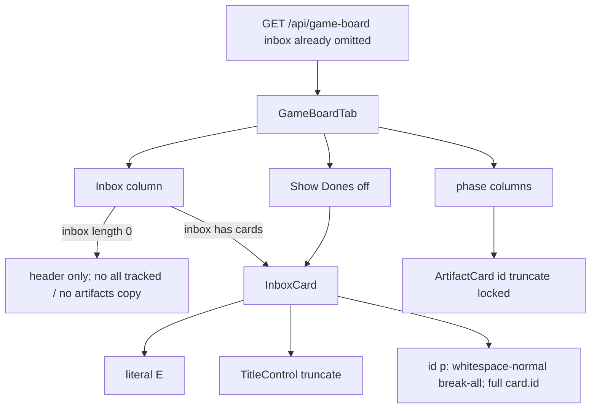

# Task #3 — InboxCard wrap + leftover Vitest
Reading time: 2-3 min
Last updated: 2026-09-02 — spec-016-d9v-game-inbox-registry | Patterns: ✓

## What changed (plain language)

Game Inbox leftover cards now show the full grill path under the short name. The id line wraps instead of cutting off with an ellipsis, so two leftovers in the same plan stay distinguishable. The short title can still truncate. Letter E is unchanged. Phase artifact cards still truncate their id. Hide stays in C: the pane only paints what GET already put in `inbox[]`. An empty Inbox after hide still shows the column header only — no “all tracked” and no “no artifacts in this phase”. Show Dones off still shows a leftover Inbox card.

`useGameBoard`, i18n, types, SpecBoardTab, WorkspaceHeader, and colors.ts were not edited.

## Files modified

| File | What it does | Lines |
|---|---|---|
| `graph-ui/src/components/GameBoardTab.tsx` | InboxCard id: drop `truncate`; `whitespace-normal break-all`; full `card.id` | 515 |
| `graph-ui/src/components/GameBoardTab.test.tsx` | Wrap / empty header / artifact truncate / Show Dones leftover | 2199 |

C, HTTP, spec_board, hooks, and i18n were not edited.

## Key decisions

| Decision | Why | ADR |
|---|---|---|
| Inbox id wraps `break-all`; same `card.id` | Two leftovers in one plan looked alike under `truncate` | SDD-ADR-071 |
| TitleControl truncate + letter E stay | Short name stays one line; E hue already locked | SDD-ADR-071 / SDD-ADR-038 |
| ArtifactCard id keeps `truncate` | Phase paths are short; wrap was Inbox-only | SDD-ADR-071 (lifts SDD-ADR-068 Inbox lock only) |
| Empty Inbox = header, 0 cards, no new copy | Same empty-column rule as spec-011; no i18n empty-state | SDD-ADR-046 / SDD-ADR-071 |
| UI mocks already-filtered `inbox` | Hide is C-owned; client must not re-apply the registry | SDD-ADR-069 |
| Show Dones leftover stays | Inbox is never filtered (spec-014) | SDD-ADR-062 |

## How Inbox paints the path

## Debugging

| If this fails | File:line | Cause | Fix |
|---|---|---|---|
| Inbox id still ellipsis / class `truncate` | `GameBoardTab.tsx:301` | Id `
` still has `truncate` | `whitespace-normal break-all`. Test `GameBoardTab.test.tsx:2076` |
| Inbox title wraps (name no longer short) | `GameBoardTab.tsx:192` | TitleControl lost `truncate` | Title keeps `truncate`. Test `:2104-2105` |
| Letter E missing / word Epic | `GameBoardTab.tsx:292` | Mark became a label | Literal `"E"`. Test `:2098` |
| Artifact id wraps | `GameBoardTab.tsx:259` | ArtifactCard id lost `truncate` | Keep `truncate`. Test `:2131` |
| Empty Inbox shows “all tracked” / “no artifacts in this phase” | `GameBoardTab.tsx` Inbox column | Placeholder copy leaked | Header only; 0 cards. Test `:2109` |
| Empty Inbox still paints a hidden leftover id | `GameBoardTab.test.tsx:2117` | Mock put the id in `inbox[]` | UI does not re-hide. Pass `inbox: []` |
| Show Dones off hides a leftover Inbox card | `GameBoardTab.tsx` `visiblePhaseCards` | Inbox entered the phase filter | Inbox never filtered. Test `:2155` |
| Wrap required a new i18n key | `graph-ui/src/lib/i18n.ts` | Empty-state string added | Do not edit i18n. No new copy |
| Specs EpicCard wrap drifted | `SpecBoardTab.tsx` EpicCard | Specs file edited this task | Do not edit SpecBoardTab. Epic wrap stays spec-015 |

## Project fit

- Before: Inbox hid via Task #1/#2 omit. InboxCard id still used `truncate`, so long `.grill/plans/<slug>/epics/epic-NNN-*.md` paths looked the same.
- After this task: Inbox id wraps like Specs EpicCard. Artifact id truncate stays. Empty column copy and Show Dones leftover stay locked. Last impl task for spec-016.
- Next: @review then @tester. Closeprep after PASS DEV.

## Pattern Notes

Patterns: ✓. Same Tailwind wrap as spec-015 EpicCard (`whitespace-normal break-all`, no new CSS file, II.2). Same lock style as SpecCard/Artifact truncate. Hide stays server omit (IV.3); UI Gherkin mocks already-filtered `inbox` like spec-015 conversion leftover. Empty column = header only (spec-011). Inbox unfiltered (spec-014). Vitest + Testing Library, no live daemon (V.1, V.4). No i18n empty-state (II.3). Breadcrumbs on both graph-ui files (VII.2). Locked files untouched.

Constitution has I–IX only (no Section X). IX.2 does not mention Inbox wrap yet — true; this is spec-016 reader only. No constitution gap this task (IX sentence waits for spec close).

## Quick refs

- Spec US-005 / US-001 (paint) / US-006 (UI lock): `.sdd-skill/specs/spec-016-d9v-game-inbox-registry/spec.md`
- Plan InboxCard wrap: `.sdd-skill/specs/spec-016-d9v-game-inbox-registry/plan.md`
- ADR: SDD-ADR-071 (Inbox wrap; Artifact truncate). Hide ownership: SDD-ADR-069
- Tests: `graph-ui` `npx vitest run` (25 files, 294 passed)
- Constitution: II.2 (Tailwind, no new CSS), II.3 (no new i18n), V.1 / V.4 (Vitest, mock), VII.2 (breadcrumbs)
