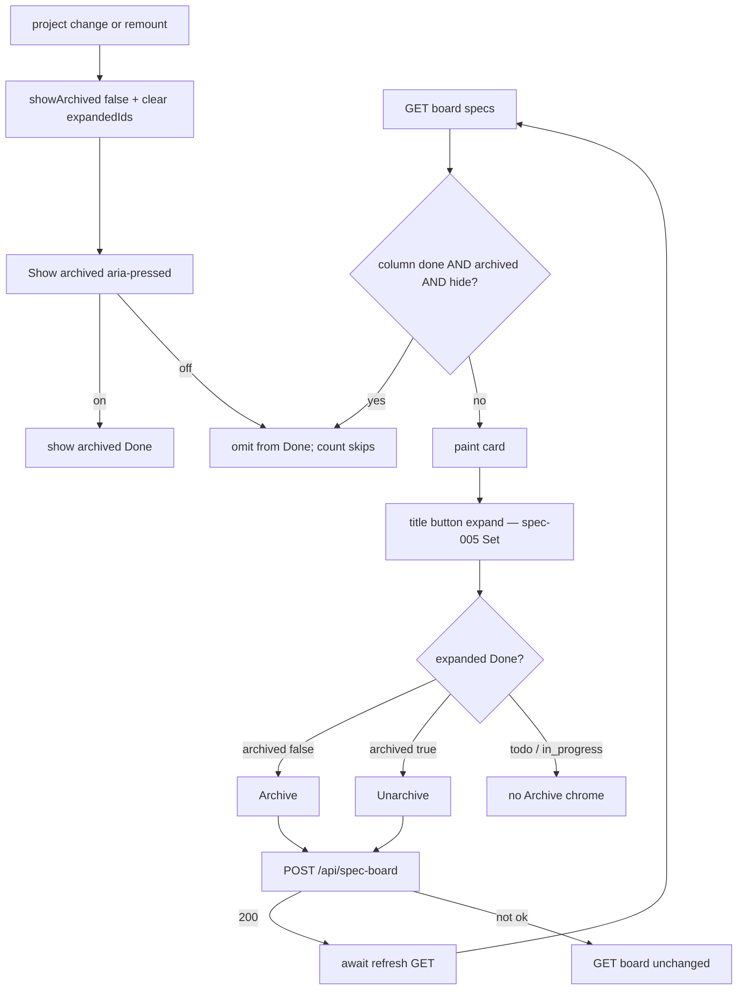

# Task #3 — SpecBoardTab filter + session toggle + Archive/Unarchive
Reading time: 2-3 min
Last updated: 2026-08-30 — spec-006-k3n-spec-archive | Patterns: ✓

## What changed (plain language)

Done cards that are archived stay in the Done column but stay hidden on a fresh Specs visit. A Show archived control in the Done header reveals them for this visit only — switching project or remounting starts hidden again. There is no remembered preference.

Archive and Unarchive sit on an expanded Done card only. Clicking Archive hides that card immediately, with no confirm dialog. The UI POSTs the flag, then waits for a GET refresh so the next 4s poll cannot bring the card back. Unarchive puts it back in Done even if Show archived is off. Todo and In Progress expands never show those controls. A leftover archived flag on a Todo card does not hide it.

## Files modified

Working-tree `git diff --numstat` vs last commit (types.ts / i18n.ts also carry earlier uncommitted chrome):

| File | What it does | Lines ± |
|---|---|---|
| `graph-ui/src/components/SpecBoardTab.tsx` | session `showArchived`; Done filter; Archive/Unarchive POST + `await refresh()` | +199 / −27 |
| `graph-ui/src/components/SpecBoardTab.test.tsx` | filter + toggle + Archive POST (partial Gherkin; poll is Task #4) | file 578; this task +~150 |
| `graph-ui/src/hooks/useSpecBoard.ts` | `refresh(): Promise<void>` is the same `fetchBoard` | +8 / −1 |
| `graph-ui/src/lib/types.ts` | `SpecBoardEntry.archived?: boolean` (missing = false) | +17 / −6 tree; this task is `archived` + breadcrumbs |
| `graph-ui/src/lib/i18n.ts` | `archive` / `unarchive` / `showArchived` en+zh | +16 / −5 |
| `graph-ui/src/lib/i18n.test.ts` | locks the three strings | +17 / −5 |

`formatIndexedAt`, `colors.ts`, Graph, Dashboard, ADR tab, C HTTP/store, and MCP were not edited. Poll interval still 4s. No new CSS file. Three columns only.

## Key decisions

| Decision | Why | ADR |
|---|---|---|
| `showArchived` `useState(false)`; reset with `expandedIds` on `?project=` change | Fresh visit / remount starts hidden; no localStorage | SDD-ADR-032, grill ADR-007 |
| Filter `done && archived && !showArchived` before count | Hidden archived must not increment Done | US-002 / US-003 |
| Archive / Unarchive only on expanded Done | Todo leftover true stays visible; no fourth column | US-001 / US-004 / US-005 |
| POST `/api/spec-board` then `await refresh()` | Flag-object 200 is not the board; poll must see store truth | SDD-ADR-031, SDD-ADR-032 |
| No `window.confirm` / dialog / alertdialog | Archive is not delete; recovery is Unarchive | grill ADR-009, VI.3 N/A |
| spec-005 `expandedIds` Set + blurb + TaskList filter unchanged | This spec adds archive chrome only | IX.2, SDD-ADR-027 |
| i18n en+zh three strings; tests assert English | Constitution II.3 | tasks.md DoD |

## How filter, session toggle, and Archive/Unarchive work

Empty Done with every card archived and hide on → existing "No specs yet" and count 0; the toggle stays. Unarchive while hide → card stays visible because it is no longer archived.

## Debugging

| If this fails | File:line | Cause | Fix |
|---|---|---|---|
| Archived Done still visible on first paint | `SpecBoardTab.tsx:323-328`, `:267` | Filter missed `archived === true`, or toggle defaulted on | `isArchived` is `=== true`. `useState(false)`. Test `:434` |
| Show archived still pressed after remount / project change | `SpecBoardTab.tsx:273-278` | State leaked or localStorage added | Reset with `expandedIds` (`:277-278`). Test `:447` / `:463` |
| Archive opens a confirm / dialog | `SpecBoardTab.tsx:174-176`, `:296-308` | `window.confirm` or a modal leaked | No confirm. Test `:519` / `:531-533` |
| Archive or Unarchive on a Todo expand | `SpecBoardTab.tsx:115-116` | Column gate dropped | Only `expanded && column === "done"`. Test `:497` |
| After POST 200 the card is still visible (hide on) | `SpecBoardTab.tsx:304-305` | `refresh` not awaited, or live mock did not set `archived` | `if (!res.ok) return; await refresh()`. Test `:519` / `:534` |
| Poll after archive resurrects the card | `useSpecBoard.ts:15`, `:59` | `refresh` is not `fetchBoard` | Same GET as the 4s interval. Poll Gherkin is Task #4 |
| Unarchive while hide still hides the card | `SpecBoardTab.tsx:326` | Filter used a stale `archived` true | After refresh the entry is false. Test `:544` / `:572-576` |
| Missing `archived` hides a Done card | `types.ts:120`, `SpecBoardTab.tsx:20-22` | Truthy-missing / default true | Optional field; only `=== true` hides. Test `:507` |
| Fourth column / "Archived" title | `SpecBoardTab.tsx:333-368` | Extra `Column` | Three children: todo / in_progress / done |
| Show archived on Todo or In Progress header | `SpecBoardTab.tsx:225-236` | `id === "done"` gate dropped | Done header only. Test `:443-444` |
| Empty archived Done lost the toggle or used new copy | `SpecBoardTab.tsx:244`, `:225-236` | Toggle inside the empty branch | Toggle stays in the header. Copy is `t.specBoard.noSpecs`. Test `:487` |
| Accessible name drifted | `i18n.ts:113-115`, `:217-219` | Keys renamed | en Archive / Unarchive / Show archived. Lock `i18n.test.ts:81-86` |
| Archive button went teal | `SpecBoardTab.tsx:171-174`, `:230-232` | New CSS or `text-primary` on chrome | `text-foreground/40`. No new CSS file |
| Opened Todo collapses on poll / Todo shows done `#1` | `SpecBoardTab.tsx:273-285`, `:67` | Expand Set or TaskList filter rewritten | spec-005 Set + pending-only unchanged. Tests `:269` / `:370` |

## Project fit

- Before: Task #2 GET already emits `archived`. POST already mutates. Specs still painted every Done card and had no Archive chrome (spec-005).
- After this task: Done hides archived unless the session toggle is on. Archive/Unarchive POST then await GET. Expand Set / blurb / Todo pending-only stay as spec-005.
- Next: Task #4 maps remaining UI Gherkin (poll-after-archive does not resurrect; replace the spec-005 document-wide "no Archive" assert).
- Live UI: implementer did not browser-click. Proof is Vitest only (22 SpecBoardTab / 154 graph-ui). Constitution IX.4 / V.1 make Playwright optional at DEVELOPMENT — not a constitution defect.

## Pattern Notes

Patterns: ✓. `showArchived` is session-only (`useState(false)`, reset with `expandedIds` on project change, no localStorage) — SDD-ADR-032 / grill ADR-007. After POST 200, `await refresh()` is the same `fetchBoard` GET (not a local hidden-ids list, not wait-for-poll) — SDD-ADR-032. Zero `window.confirm` / dialog (grill ADR-009; VI.3 is delete-only). Archive chrome uses existing grayscale tokens (`text-foreground/40`); no new CSS (II.2, III.1). spec-005 `expandedIds` Set, title-button toggle, blurb region, Todo `done === false` unchanged (IX.2). POST stays `/api/spec-board` (IV.3). Three `Column` children. Leftover Todo `archived` true is not hidden and has no Archive/Unarchive. i18n en+zh (II.3). `useSpecBoard` + `fetch` mocked (V.4). Breadcrumbs on `SpecBoardTab.tsx`, `useSpecBoard.ts`, `i18n.ts`, `types.ts` (VII.2); test file also stamped.

Constitution has I–IX only (no Section X). IX.2 still says Archive is not part of spec-005 — true; this is spec-006 UI. IX.5 fill/fence unchanged. No constitution gap this task (IX archive sentence waits for spec close).

## Quick refs

- Spec US-001 / US-002 / US-003 / US-004: `.sdd-skill/specs/spec-006-k3n-spec-archive/spec.md`
- Plan UI + ADR-032: `.sdd-skill/specs/spec-006-k3n-spec-archive/plan.md`
- ADR: SDD-ADR-032 (await GET refresh; session Show archived); SDD-ADR-031 (POST is flag object); SDD-ADR-027 (expand Set stays)
- Tests: `cd graph-ui && npx vitest run` (154 passed, 22 SpecBoardTab)
- Constitution: II.2–3, III.1, IV.3, V.1/V.4, VI.3 N/A, VII.1–2, IX.2 (expand stays; Archive not spec-005), IX.4
