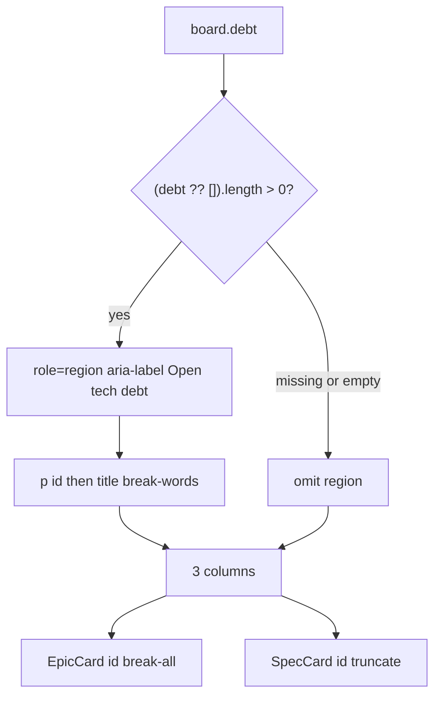

# Task #3 — SpecBoardTab strip + EpicCard wrap
Reading time: 2-3 min
Last updated: 2026-09-02 — spec-015-s5k-specs-debt-and-path | Path=full | Patterns: ✓

## What changed (plain language)

On Specs, open debt rows now sit in a chrome strip above the three columns. Each row is the id then the title. The strip is gone when there are no open items, or when the board never sent a debt list.

Todo epic cards still shorten the name. The grill path under that name wraps so two epics in the same plan can be told apart. Spec card ids still truncate.

## Files modified

| File | What it does | Lines ± |
|---|---|---|
| `graph-ui/src/components/SpecBoardTab.tsx` | `DebtStrip` above the 3-col row; EpicCard id wrap | this task: strip `:216-227`, mount `:373-375`; EpicCard title `:105` / id `:109`; SpecCard id `:151`; file 417 lines |
| `graph-ui/src/components/SpecBoardTab.test.tsx` | Strip paint/omit + wrap vs spec truncate | this task: describe `:1044-1151`; `makeDebt` `:158`; `mockBoard` `debt` `:212`; file 1151 lines |
| `graph-ui/src/lib/types.ts` | `SpecBoardDebt` `{id,title}`; `SpecBoard.debt?` | `:139-149` |
| `graph-ui/src/lib/i18n.ts` | `specBoard.openTechDebt` en `"Open tech debt"`; zh filled | en `:117`; zh `:240` |
| `graph-ui/src/lib/i18n.test.ts` | Locks English (and zh filled) | `:124-125` |

`useSpecBoard` / `useSddSkillPresent` / `formatIndexedAt` / `colors.ts` / `GameBoardTab.tsx` / `WorkspaceHeader.tsx` were not edited. No new CSS file. Letter E unchanged. Same GET / 4s poll.

## Key decisions

| Decision | Why | ADR |
|---|---|---|
| Specs-only strip; `role="region"` + `aria-label`; no required `<h2>` | Same chrome as Game `blockedStrip`; WorkspaceHeader would leak onto Graph/ADR | SDD-ADR-067 |
| Paint when `(board.debt ?? []).length > 0`; omit when missing or `[]` | Old mocks without `debt` must not throw or show an empty header | SDD-ADR-067; US-002 |
| Rows are `
`: `id` then title; `whitespace-normal break-words`; no `truncate` | Dead text; long title wraps; no POST / clipboard / expand | SDD-ADR-067 |
| EpicCard title keeps `truncate`; EpicCard id drops it (`whitespace-normal break-all`) | Paths have no spaces; `break-words` can still clip a kebab segment | SDD-ADR-068 |
| SpecCard id line still `truncate` | Spec / Artifact / Inbox wrap is out of this spec | SDD-ADR-068; US-004 |
| Host OR + `notSddSkill` last-resort unchanged | Grill-only Kanban must stay; missing `debt` is `[]` | SDD-ADR-040 leftover |

## How the strip and wrap sit on Specs

The strip is a sibling above the existing `flex gap-6` column row (parent `flex flex-col`). It is not inside Todo / In progress / Done. Graph, ADR, Game, and WorkspaceHeader do not mount it. Header/Graph/ADR/Game/click-dead locks are Task #4.

## Debugging

| If this fails | File:line | Cause | Fix |
|---|---|---|---|
| Strip missing though `debt` has TD-005 | `SpecBoardTab.tsx:217`, `:374` | `?? []` dropped or length gate inverted | `DebtStrip rows={board.debt ?? []}`. Test `:1052` |
| Strip inside a column or below Todo | `SpecBoardTab.tsx:373-375` | Region nested in `Column` | Parent `flex flex-col`; strip then the `flex gap-6` row. Test `:1068-1072` |
| Empty / missing `debt` still shows the region | `SpecBoardTab.tsx:217`, `:374` | Region mounted on `[]` or undefined | `rows.length === 0` → null; missing key is `[]`. Tests `:1078` / `:1089` |
| Old mock without `debt` throws | `types.ts:149`; `SpecBoardTab.tsx:374` | `debt` required | `debt?` + `?? []`. Test `:1089` |
| Epic id still ellipsis / class `truncate` | `SpecBoardTab.tsx:109` | Id line still `truncate` | `whitespace-normal break-all`. Test `:1100` |
| Epic title wraps (name no longer short) | `SpecBoardTab.tsx:105` | Title lost `truncate` | Title keeps `truncate`. Test `:1117` |
| Spec card id wraps | `SpecBoardTab.tsx:151` | SpecCard id lost `truncate` | Keep `truncate`. Test `:1122` |
| Long debt title ellipsis | `SpecBoardTab.tsx:221` | `truncate` / `break-all` on the row | `
` `whitespace-normal break-words`. Test `:1133` |
| Region name is not "Open tech debt" | `i18n.ts:117` | Copy drifted or visible `<h2>` required | `openTechDebt` === `"Open tech debt"`; aria-label only. Test `i18n.test.ts:124` |
| Row click POSTs / copies / expands | `SpecBoardTab.tsx:220-223` | Row became a control | Dead `
`; no onClick. Test `:1065-1066` (button/link null). Full click-dead = Task #4 |
| Strip on Graph / ADR / Game / header | `SpecBoardTab.tsx:374` only | Painted outside SpecBoardTab | Do not edit `WorkspaceHeader.tsx` / `GameBoardTab.tsx`. Task #4 leftover Vitest |
| Grill-only shows notSddSkill or throws | `SpecBoardTab.tsx:360`, `:374` | Host OR dropped or missing `debt` required | Same sdd OR grill; `?? []`. Tests `:377` / `:395` |

## Project fit

- Before: Task #1/#2 already put open `debt[{id,title}]` on the same GET. Specs still painted only the three columns. Todo epic paths used `truncate`, so two epics in one plan looked alike.
- After this task: Specs paints the strip above the columns when there is open debt. Epic id wraps; spec id still truncates. Graph / ADR / Game / header do not host the strip.
- Next: Task #4 leftover Vitest (header / Graph / ADR / Game / click-dead). Then @review on this task's code.

## Pattern Notes

Patterns: ✓. Strip matches Game `blockedStrip` (`GameBoardTab.tsx:309-331`, mount `:490`): `role="region"` + `aria-label`, no required `<h2>`, omit when length 0. Missing `debt` is `[]`, same class as missing Game `blocked`. EpicCard wrap vs SpecCard truncate leftover (only the epic id drops `truncate`). Same GET; `useSpecBoard` 4000 ms untouched (IV.3). No new CSS file (II.2). i18n en+zh; tests assert English (II.3). Chrome grayscale; no severity color (III.1). Host OR + last-resort + Show archived leftover (IX.2 / SDD-ADR-040). Letter E `--color-epic-mark` untouched (SDD-ADR-038). Expand / archive stay on SpecCard. GameBoardTab / WorkspaceHeader not edited (SDD-ADR-067). Breadcrumbs on `SpecBoardTab.tsx`, `SpecBoardTab.test.tsx`, `types.ts`, `i18n.ts`, `i18n.test.ts` (VII.2).

Constitution has I–IX only (no Section X). IX.2 does not mention Specs debt chrome yet — true; this is spec-015 UI. Same-GET additive is locked by SDD-ADR-065. No constitution gap this task (IX debt sentence waits for spec close).

## Quick refs

- Spec US-001 / US-002 / US-004 / US-005 (Specs-only strip): `.sdd-skill/specs/spec-015-s5k-specs-debt-and-path/spec.md`
- Plan strip + wrap CSS: `.sdd-skill/specs/spec-015-s5k-specs-debt-and-path/plan.md` (SDD-ADR-067, SDD-ADR-068)
- ADR: SDD-ADR-067 (Specs-only strip; aria-label; dead text); SDD-ADR-068 (EpicCard id wraps; other card ids locked)
- Tests: `cd graph-ui && npx vitest run src/components/SpecBoardTab.test.tsx src/lib/i18n.test.ts` (49 passing — 43 + 6 `it()` in those two files)
- Gherkin owners: strip paint/omit + wrap + spec truncate + long title → this file; header / Graph / ADR / Game / click-dead / Has more / grill-only leftover → Task #4
- Constitution: II.2–3, III.1, IV.3, V.1/V.4, VII.1–2, IX.2 (expand / archive / Game filters stay)
