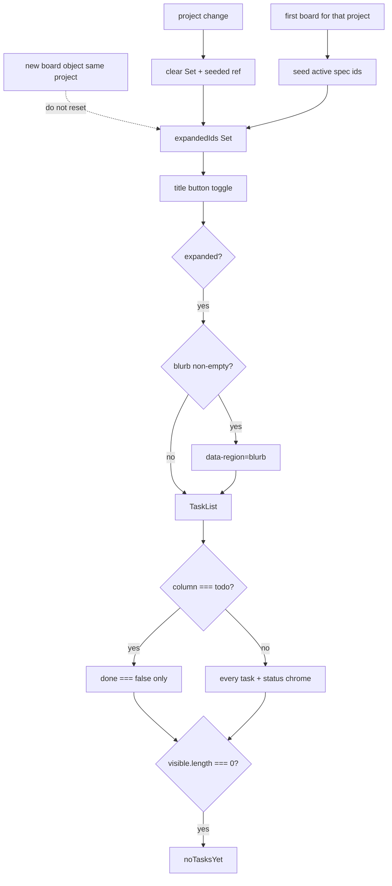

# Task #3 — SpecCard expand Set + blurb region + TaskList filter
Reading time: 2-3 min
Last updated: 2026-08-30 — spec-005-v2m-spec-card-expand | Patterns: ✓

## What changed (plain language)

Any Kanban card title can now be clicked to grow that same card in place. Todo lists only unfinished work. In Progress and Done list every task. A short objective appears only when the board sent one; if it did not, the card still opens.

Several cards can stay open. Switching project starts over. A later poll of the same project does not close what you opened. There is no Archive control and no extra page.

## Files modified

Working-tree `git diff --numstat` vs last commit (types.ts also carries earlier uncommitted TabId / `canonical_root`):

| File | What it does | Lines ± |
|---|---|---|
| `graph-ui/src/components/SpecBoardTab.tsx` | `expandedIds` Set; title toggle; blurb region; Todo pending filter | +105 / −22 |
| `graph-ui/src/components/SpecBoardTab.test.tsx` | NEW — expand, filter, empty blurb, zero tasks, poll persist | +336 (untracked) |
| `graph-ui/src/lib/types.ts` | `SpecBoardEntry.blurb: string` (missing treated as `""`) | +16 / −6 tree; Task #3 is `blurb` + breadcrumbs |

`useSpecBoard` poll interval unchanged. No new CSS. No i18n key. `i18n.ts` tree dirty from prior specs, not this task.

## Key decisions

| Decision | Why | ADR |
|---|---|---|
| `expandedIds: Set<string>` on SpecBoardTab; seed active; poll does not reset | Local `useEffect(active)` remount-collapses; accordion forbidden | SDD-ADR-027 |
| Title `<button>` is the only expand control; `canExpand` always true | Overlay / new page / zero-task lock rejected | SDD-ADR-027, grill ADR-002 |
| Blurb region only when `blurb` is non-empty | Empty Executive Summary still expands | SDD-ADR-025 |
| Additive `blurb` on the existing GET | No second fetch on click | SDD-ADR-024 |
| Todo = `done === false`; In Progress / Done = all | Column-appropriate list | US-003 / US-004 / US-005 |
| Reuse `t.specBoard.noTasksYet` | Zero pending / zero tasks; no new string | II.3 |

## How seed, toggle, and filter work

Active agent / N/M / checklist / blocked stay outside the task list, collapsed or expanded.

## Debugging

| If this fails | File:line | Cause | Fix |
|---|---|---|---|
| Opened Todo collapses on poll | `SpecBoardTab.tsx:220-231` | Seed/reset ran on board identity | `seededRef` stays true after first board. Only `project` change clears the Set (`:220-225`). Test `:278` |
| Todo shows a done task (`#1 Write parser`) | `SpecBoardTab.tsx:63` | Filter is not `done === false` | `column === "todo" ? tasks.filter((t) => !t.done) : tasks`. Test `:198` / `:208` |
| Empty blurb still painted | `SpecBoardTab.tsx:107`, `:155-159` | Region rendered without `blurb !== ""` | `entry.blurb ?? ""` then omit `[data-region='blurb']`. Test `:240` / `:250` |
| Zero-task card cannot expand | `SpecBoardTab.tsx:106`, `:115-120` | `canExpand` still `active && task_count > 0` | `canExpand = true`. Test `:266` |
| Archive / Unarchive leaked | `SpecBoardTab.tsx:153-162` | Done expand grew a new control | Expand body is optional blurb + TaskList only. Test `:224` |
| In Progress starts collapsed | `SpecBoardTab.tsx:20-26`, `:228-231` | First-board seed missed `entry.active` | `seedActiveIds` adds every active id. Test `:211` |
| Chrome gone when card is collapsed | `SpecBoardTab.tsx:129-151` | Agent / N/M moved inside `{expanded && …}` | Chrome stays outside TaskList. Test `:323` |

## Project fit

- Before: only the active spec with `task_count > 0` could expand; a `useEffect` on `entry.active` could collapse on remount. Task #2 already filled title/blurb/tasks on GET.
- After: every listed card title toggles an in-place body. Todo hides finished tasks. Empty objective omits the blurb region. Poll keeps the Set.
- Next: Task #4 full Vitest Gherkin table (two cards at once, document-wide no Archive, poll persist asserted as the scenario, `colorForLabel` lock if in the suite).
- Live UI: implementer did not browser-click. Proof is Vitest only (144 passed). Constitution IX.4 / V.1 make Playwright optional at DEVELOPMENT — not a constitution defect.

## Pattern Notes

Patterns: ✓. Title button only (VII.1 `aria-expanded`). No overlay/modal/new page (grill ADR-002). `noTasksYet` reused; no new i18n key (II.3). No new CSS file (II.2 Tailwind tokens). Chrome stays grayscale; Graph hex untouched (III). `useSpecBoard` mocked (V.4). No Archive (US-005). Breadcrumbs on `SpecBoardTab.tsx`, `SpecBoardTab.test.tsx`, `types.ts` (VII.2). Deleted `useEffect(() => setExpanded(entry.active))` as plan required.

Constitution has I–IX only (no Section X). No new gap this task.

## Quick refs

- Spec US-001..005: `.sdd-skill/specs/spec-005-v2m-spec-card-expand/spec.md`
- Plan expanded Set: `.sdd-skill/specs/spec-005-v2m-spec-card-expand/plan.md` (Answers → Expanded ids across poll)
- ADR: SDD-ADR-027 (Set), SDD-ADR-024 (GET + blurb), SDD-ADR-025 (omit empty region)
- Tests: `cd graph-ui && npx vitest run` (144 passed)
- Constitution: II.2–3, III.1, V.1/V.4, VII.1–2, IX.4
