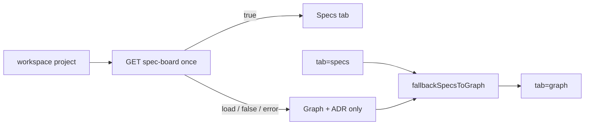

# Task #3 — Specs presence + tab strip
Reading time: 2-3 min
Last updated: 2026-08-29 — spec-002-p8w-project-workspace | Patterns: ✓

## What changed (plain language)

A project can show a Specs tab only after the existing spec-board API says the repo has sdd-skill. Until that answer is a clear yes, Specs is absent — not disabled. Graph and ADR stay available. The Kanban no longer shows the “pick a project” message when a project is already chosen.

The strip is not mounted in App yet. Task #5 places it under the brand header and rewrites `?tab=specs` to Graph while Specs is omitted.

## Files modified

| File | What it does |
|---|---|
| `graph-ui/src/hooks/useSddSkillPresent.ts` | One-shot GET `/api/spec-board`; true only on 200 + `sdd_skill_present === true` |
| `graph-ui/src/hooks/useSddSkillPresent.test.ts` | loading / false / 500 / true |
| `graph-ui/src/components/WorkspaceTabStrip.tsx` | tablist Graph \| Specs? \| ADR |
| `graph-ui/src/components/WorkspaceTabStrip.test.tsx` | order, omit, aria-selected |
| `graph-ui/src/lib/route.ts` | `fallbackSpecsToGraph` |
| `graph-ui/src/components/SpecBoardTab.tsx` | picker only when `project === null` |
| `graph-ui/src/components/SpecBoardTab.test.tsx` | no picker copy when project set |

## Key decisions

| Decision | Why | ADR |
|---|---|---|
| One-shot, not `useSpecBoard` poll | A later 500 would flicker the tab away | SDD-ADR-010 |
| Do not call `/api/skill-presence` | Spec names spec-board | US-003 |
| `fallbackSpecsToGraph` in route.ts | App #5 replaceState; unit-testable now | plan D3 |

## Debugging

| If this fails | File:line | Cause | Fix |
|---|---|---|---|
| Specs never appears | `useSddSkillPresent.ts` | Body missing `sdd_skill_present: true` or mocked `columns` | Mock `{ sdd_skill_present, specs: [] }` |
| Specs flickers off | strip used `useSpecBoard` | 4s poll 500 | Strip uses one-shot hook only |
| Picker copy in workspace | `SpecBoardTab.tsx` | `project` null | Pass the workspace name |

## Pattern Notes

Patterns: ✓. Same spec-board JSON. No skill-presence. No C change.

## Quick refs

- Tests: `cd graph-ui && npx vitest run src/hooks/useSddSkillPresent.test.ts src/components/WorkspaceTabStrip.test.tsx src/components/SpecBoardTab.test.tsx src/lib/route.test.ts`
