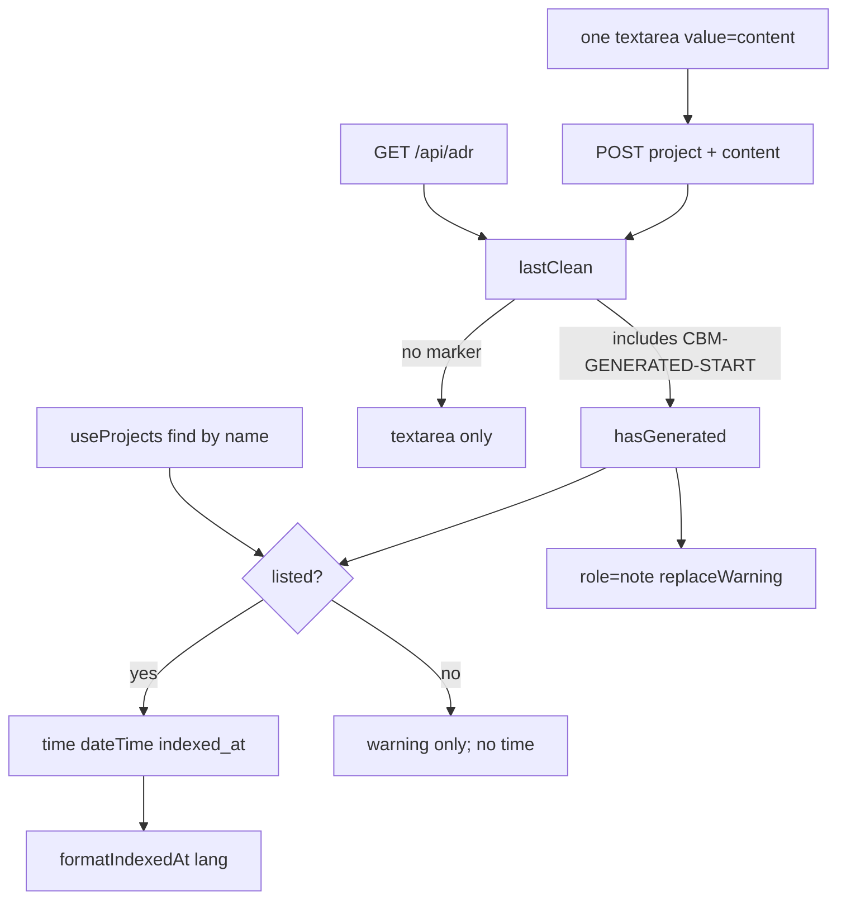

# Task #4 — AdrTab generated-at + replace warning
Reading time: 2-3 min
Last updated: 2026-08-30 — spec-004-j8k-adr-parse-on-reindex | Patterns: ✓

## What changed (plain language)

When the ADR blob already has a generated region, the workspace ADR tab now shows when that fill last ran (the same last-indexed clock as the Dashboard row) and a short warning that edits inside that region die on the next Reindex or `index_repository`.

The editor is still one textarea of the whole document. Save still posts `{project, content}`. Leaving with unsaved text still uses the same browser confirm. The clock is chrome only — it is not written into the markdown.

## Files modified

| File | What it does | Lines ± |
|---|---|---|
| `graph-ui/src/components/AdrTab.tsx` | Stamp + warning when `CBM-GENERATED-START` in last GET/save; one textarea | +~25 (173 total) |
| `graph-ui/src/components/AdrTab.test.tsx` | Gherkin stamp/warning, omit when unmarked, POST does not add ISO | +~70 (238 total) |
| `graph-ui/src/lib/i18n.ts` | `adr.generatedAt` / `adr.replaceWarning` en+zh | +~10 |
| `graph-ui/src/lib/i18n.test.ts` | Locks those four strings | +~8 |

No C change. No second textarea. No Dashboard ADR control. `App.tsx` dirty `window.confirm` not edited.

## Key decisions

| Decision | Why | ADR |
|---|---|---|
| Stamp from `Project.indexed_at` via `useProjects` + `formatIndexedAt` | No second freshness field; same clock as header | SDD-ADR-016, plan Performance |
| `<time dateTime>` only when GET/save has `CBM-GENERATED-START` and the name is listed | Markers absent or ghost name → no stamp | US-006, SDD-ADR-013 |
| Warning is i18n chrome (`role="note"`); blob H1s stay English | Skill files are English; stamp/warning follow UI language | SDD-ADR-022, II.3 |
| One textarea; POST still `{project, content}` | Parse, not the editor, protects manual | SDD-ADR-021 |
| Dirty leave stays `window.confirm` in App | Do not change spec-002 confirm | SDD-ADR-012 |

## How stamp and warning appear

Typing a marker into the draft does not show chrome until a successful load or save. The ISO string never goes into the POST body.

## Debugging

| If this fails | File:line | Cause | Fix |
|---|---|---|---|
| Stamp missing but blob has `CBM-GENERATED-START` | `AdrTab.tsx:113`, `:120` | `lastClean` not yet set, or `listed` miss | Wait for GET; `useProjects` must return that `name` + `indexed_at` |
| Visible text is the raw ISO | `AdrTab.tsx:124` | `formatIndexedAt` got an invalid ISO | Same helper as Dashboard; mock `2026-08-30T12:00:00Z` |
| Stamp shows on unmarked `# Existing ADR` | `AdrTab.tsx:113` | Gate used `content` or a substring that unmarked text can hit | Gate is `lastClean.includes("CBM-GENERATED-START")` |
| Warning missing with markers | `AdrTab.tsx:129-132` / `i18n.ts:81-82` | `role="note"` removed or copy drifted | en: "Edits inside the generated region are replaced on the next user-triggered index." |
| ISO `2026-08-30T12:00:00Z` inside the textarea | `AdrTab.tsx:77-81` | Stamp written into `content` | Chrome only; POST equals GET blob (`AdrTab.test.tsx:220`) |
| Two textareas | `AdrTab.tsx:144` | Generated/manual split | One `textbox`; Save still `{project, content}` |
| Dirty leave skips confirm | `App.tsx:80` | `onDirtyChange` unwired or confirm deleted | Unchanged: `window.confirm(t.adr.unsavedConfirm)` (`AdrTab.tsx:69-71`) |

## Project fit

- Before: Task #3 filled the store blob. The ADR tab still looked like a plain Phase-1 editor.
- After: Open `?tab=adr&project=alpha` with markers → visible datetime from list `indexed_at` + replace warning + one textarea. Unmarked blob omits both chrome pieces.
- Next: @review / @tester. Spec closeprep (Trigger B) is after all four tasks pass — not this step.

## Pattern Notes

Patterns: ✓. Stamp is the WorkspaceHeader recipe (`useProjects` find by name, `formatIndexedAt`, `<time dateTime>`) — IV.4 / SDD-ADR-016, not a second field. i18n en+zh (II.3). Whole-doc POST (SDD-ADR-021). Confirm path untouched (SDD-ADR-012). Grayscale chrome; `colorForLabel` not imported. No `get_graph_schema`. Breadcrumbs on AdrTab + i18n.

Constitution has I–IX only (no Section X). IX.2 names spec-004 but still does not lock the in-document fence. Same planner note as Task #3; not a code defect this task.

## Quick refs

- Spec US-006 + Gherkin "ADR tab shows generated-at and replace warning": `.sdd-skill/specs/spec-004-j8k-adr-parse-on-reindex/spec.md`
- Plan AdrTab stamp: `.sdd-skill/specs/spec-004-j8k-adr-parse-on-reindex/plan.md` (Performance / US-006)
- ADR: SDD-ADR-012 (confirm), SDD-ADR-016 (indexed_at), SDD-ADR-021 (whole-doc), SDD-ADR-022 (i18n chrome)
- Tests: `cd graph-ui && npx vitest run src/components/AdrTab.test.tsx src/lib/i18n.test.ts src/lib/colors.test.ts` (17 passed)
- Constitution: II.3, III.1, IV.4, V.1, VII.1–2
