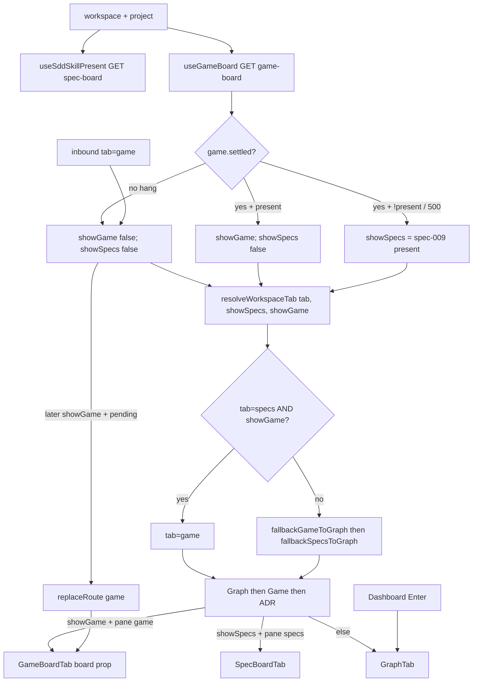

# Task #4 — App silent-win, dual fetch, deep-links
Reading time: 2-3 min
Last updated: 2026-08-31 — spec-010-c4h-game-tab-silent-win | Path=full | Patterns: ✓

## What changed (plain language)

A project whose folder has `.gamedev/` now shows a Game tab and hides Specs, even when sdd-skill or grill live on the same path. The workspace fires two one-shot reads (game-board and spec-board) and waits for game-board to finish before showing either extra tab — so Specs cannot flash while Game is still loading.

`?tab=game` comes back after that wait. A leftover `?tab=specs` on a gamedev project becomes Game, not Graph. Enter from Dashboard still opens Graph; Game is just in the strip.

## Files modified

`App.tsx` consumes `useGameBoard` next to unchanged `useSddSkillPresent`. Strip and pane use settled-aware `showGame` / `showSpecs`, then `resolveWorkspaceTab`. Tests own the Gherkin table. Hook files are new.

| File | What it does | Lines ± |
|---|---|---|
| `graph-ui/src/App.tsx` | Dual one-shot; `showGame` / `showSpecs`; restore `tab=game`; specs-on-gamedev → game; mount `GameBoardTab` | file 186; vs HEAD +52/−14. Flags `:35-36`; restore `:84-111`; pane `:125-128`, `:168-169`; Enter `:179` |
| `graph-ui/src/App.test.tsx` | `mockAppFetch` default game-board 200 present false; hang/500/true opt-in; silent-win / deep-link Gherkin | file 917; vs HEAD +386/−13 (stat 399). Mock `:106-184` default `:118`; block `:731-917` |
| `graph-ui/src/hooks/useGameBoard.ts` | One-shot GET `/api/game-board`; `{ settled, present, board }` | NEW 98. Fetch `:69`; present `:80`; hang stays `settled` false `:63-65` |
| `graph-ui/src/hooks/useGameBoard.test.ts` | One-shot / hang / 500 / 4xx / throw / no 4s poll / no skill-presence | NEW 131 |

`useSddSkillPresent.ts` still spec-009 Task #1 (not edited). `fallbackSpecsToGraph(tab, present): TabId` signature unchanged (`route.ts:40-43`). `GameBoardTab` still props-only (Task #3). No C / no Playwright. GraphTab stays mocked.

## Key decisions

| Decision | Why | ADR |
|---|---|---|
| New `useGameBoard` one-shot, same shape as `useSddSkillPresent` | Game presence is GET `/api/game-board` only. Do not teach the Specs hook a second URL | SDD-ADR-043; US-001 |
| `showGame = settled && present`; `showSpecs = settled && !showGame && specsPresent` | In-flight must omit both (no Specs flash). 500 settles false → Specs follows spec-009 | US-002; SDD-ADR-043 |
| App calls `resolveWorkspaceTab` for URL + pane | Leftover `tab=specs` + gamedev → `game`, not Graph. Sibling kernels stay visible | SDD-ADR-043; US-004 |
| `pendingGameDeepLink` + `pendingSpecsDeepLink` | Omit-until-true would leave inbound `tab=game` on Graph; specs+gamedev must not restore Specs | US-004 |
| `mockAppFetch` default game-board 200 present false | Existing spec-009 Specs tests stay green. Hang / 500 / true are opt-in | plan Testing |
| Enter stays `navigate("graph", p)` | Default workspace tab is not this spec | US-001; IX.3 |
| Never `/api/skill-presence`; no 4s game-board interval | Frozen presence source; strip is not `useSpecBoard` | US-001; US-005 |

## How dual fetch becomes strip and pane

`useSddSkillPresent` is unchanged. Pane uses `showGame` / `showSpecs`, not raw specs `present` while game is in flight.

## Debugging

| If this fails | File:line | Cause | Fix |
|---|---|---|---|
| In-flight shows Game or Specs (Specs flash) | `App.tsx:35-36`; `useGameBoard.ts:63-65` | `showSpecs` used raw `specsPresent` before `game.settled` | Both flags require `gameSettled`. Hang never sets `settled` true. Test `App.test.tsx:876-891` |
| game-board 500 hides Specs | `useGameBoard.ts:71-75`; `App.tsx:36` | Non-200 left `settled` false, or `showSpecs` required Game 200 | 4xx/5xx/throw → `settled` true, `present` false. Specs = spec-009. Test `:894-902` |
| `?tab=specs` + gamedev stays Specs or goes Graph | `route.ts:59`; `App.tsx:94-99` | Silent-win step skipped, or `pendingSpecsDeepLink` restored Specs | `tab === "specs" && gamePresent` → `"game"`. Pending specs + `showGame` → `replaceRoute("game")`. Test `:786-800` |
| Inbound `tab=game` stays Graph after present true | `App.tsx:38`, `:86-92` | `pendingGameDeepLink` not set, or restore skipped | Capture inbound game before omit-until-true. Test `:855-873` (`resolveGameBoard`) |
| Enter opens Game | `App.tsx:179` | `onSelectProject` left `graph` | `navigate("graph", p)`. Game tab still in strip. Test `:833-842` |
| Grill-only / sdd-only without gamedev hides Specs or shows Game | `App.tsx:36`; `App.test.tsx:118` | Default mock present true, or `showGame` without settle | Default `gameBoard ?? "false"`. Tests `:803-818`, `:845-852` |
| `useSddSkillPresent` fetches game-board | `useSddSkillPresent.ts:34` | Hook taught a second URL | Still GET spec-board only. Presence AND NOT is App-only |
| `/api/skill-presence` or 4s game poll | `useGameBoard.ts:54-95` | Interval or leftover path | One `fetch`. Tests `useGameBoard.test.ts:116-129`; App `:753` / `:891` |
| GraphTab boots Three | `App.test.tsx:16-20` | Mock removed | Keep `data-testid="graph-tab"` |

## Project fit

- Before: Task #1 GET `/api/game-board`. Task #2 URL + strip can name Game (`resolveWorkspaceTab` unused by App). Task #3 `GameBoardTab` chrome exists unmounted. App still spec-009 (`showSpecs={present}`).
- After this task: dual one-shot; silent win; in-flight omits both; 500 does not hide Specs; `tab=game` restore; `tab=specs` + gamedev → game; Enter still Graph. `useSddSkillPresent` / `fallbackSpecsToGraph` signature unchanged.
- Next: Task #5 leftover Vitest only (strip a11y/order Thens, empty-dir tab if not already green, App fetch log no skill-presence, spec-009 tests stay green). Not closeprep.

## Pattern Notes

Patterns: ✓. One-shot hook like `useSddSkillPresent` (cancelled flag, no `setInterval`, no `/api/skill-presence`). Settled-aware strip — not a second presence source. `fallbackSpecsToGraph(tab, present): TabId` kept (`route.ts:40-43`). Enter → Graph (IX.3). Sibling kernels + `resolveWorkspaceTab` (SDD-ADR-043). Default mock present false so spec-009 tests stay. `useSddSkillPresent` unchanged (still spec-009 Task #1). GraphTab mock kept (V.4). English Then text (II.3). Breadcrumbs on `App.tsx`, `App.test.tsx`, `useGameBoard.ts`, `useGameBoard.test.ts` (VII.2).

Constitution has I–IX only (no Section X). IX.2 still describes spec-009 Specs = sdd OR grill. The AND NOT gamedev sentence waits for spec close (plan note for @planner). No constitution gap this task.

## Quick refs

- Spec US-001 / 002 / 004: `.sdd-skill/specs/spec-010-c4h-game-tab-silent-win/spec.md`
- Plan dual fetch / router: `.sdd-skill/specs/spec-010-c4h-game-tab-silent-win/plan.md` (SDD-ADR-043)
- ADR: `.sdd-skill/baseline/ARCHITECTURE_ADR.md` — SDD-ADR-043
- Tests: `cd graph-ui && npx vitest run src/App.test.tsx src/hooks/useGameBoard.test.ts` (48 passed; full graph-ui 209)
- Gherkin owners: silent-win / deep-links / in-flight / 500 / Enter → this file; chrome pane → Task #3; leftover strip a11y / no skill-presence log → Task #5; GET bytes → Task #1 C
- Constitution: II.2–3, IV.3, V.1/V.4, VII.2, IX.3 (Enter Graph)
