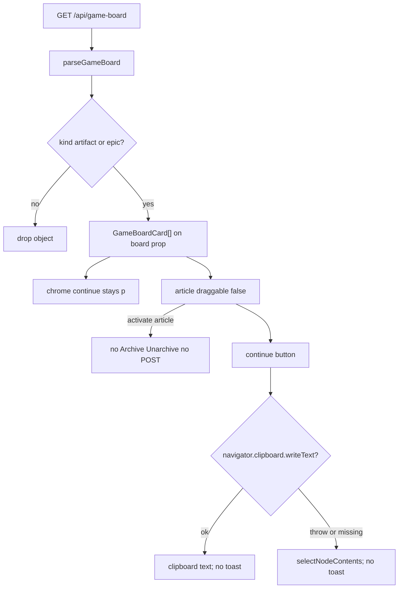

# Task #4 — Clipboard, no-drag, typed card parse
Reading time: 2-3 min
Last updated: 2026-08-31 — spec-011-q5n-game-phase-board | Path=full | Patterns: ✓

## What changed (plain language)

Card continue is now a copy control, not more selectable chrome. An artifact button copies `/gamedev-skill continue @role`. An Inbox button copies `/gamedev-skill continue` with no `@role`. Denied or missing clipboard selects that button text so the operator can Cmd+C. Neither path shows a toast. Chrome continue stays a `
` (spec-010). Clicking the card body does not expand, Archive, or POST. Cards are not draggable.

`useGameBoard` still one-shots GET `/api/game-board`. `parseGameBoard` now types each array as `GameBoardCard[]` and drops objects whose `kind` is not `artifact` or `epic`.

## Files modified

`App.tsx` / `SpecBoardTab.tsx` / `useSddSkillPresent` / `useSpecBoard` / C were not this task. Paint + i18n stay Task #3.

| File | What it does | Lines ± |
|---|---|---|
| `graph-ui/src/hooks/useGameBoard.ts` | `parseGameBoardCard` skip !artifact\|epic; arrays typed; one-shot stays | 133 (was 98; +35). Skip `:36`; arrays `:50-57`; effect `:89-130` |
| `graph-ui/src/hooks/useGameBoard.test.ts` | Kind skip + hook skip; no 4s poll / no skill-presence stay | 206 (was 131; +75). Parse `:132-182`; hook `:184-205`; one-shot `:116-130` |
| `graph-ui/src/components/GameBoardTab.tsx` | Card `ContinueControl` button; `writeText` then `selectNodeContents`; `draggable={false}`; chrome `
` | 196 (was 168; +28). Copy `:57-71`; button `:73-86`; chrome `:177-179` |
| `graph-ui/src/components/GameBoardTab.test.tsx` | Artifact/inbox copy; denied select-text; no toast/POST; no expand; no drag | 641 (was 428; +213). Copy `:459-519`; denied `:521-581`; activate `:583-610`; drag `:612-640` |

## Key decisions

| Decision | Why | ADR |
|---|---|---|
| Keep `useGameBoard` one-shot (no `setInterval`) | Heavier walk than spec-010; a 4s poll could re-settle presence | SDD-ADR-050 |
| Parse skip objects without `kind` `artifact`\|`epic` | Malformed GET entries must not paint | US-005; plan crumb 16 |
| Card continue is a `<button>` named with the continue string | Gherkin "continue control"; chrome stays map text | SDD-ADR-051 |
| `writeText` first; `selectNodeContents` on throw/missing API | Denied clipboard still copyable | SDD-ADR-051 |
| No toast / Copied / `role="status"` either path | US-006 forbids toast | SDD-ADR-051 |
| Chrome continue stays `
` | spec-010 map, not a launcher | SDD-ADR-042; SDD-ADR-051 |
| Card activate: no Archive / Unarchive / "No tasks planned yet" / POST | Map only; gamedev-skill stays the writer | US-006 |
| `draggable={false}`; drop does not reorder | No local column move | US-006 |

## How parse + continue copy work

Pane still does not fetch `/api/game-board`. App still mounts this pane when `showGame`. Artifact copies `@role`; Inbox copies the bare continue string.

## Debugging

| If this fails | File:line | Cause | Fix |
|---|---|---|---|
| Artifact click does not copy `@role` | `GameBoardTab.tsx:73-86`, `:57-63` | Chrome `
` used as the control, or `writeText` not called | Card button name is the continue string. Test `:459-485` |
| Inbox copies `@director` / `@role` | `GameBoardTab.tsx:119`; card `continue` | Artifact continue painted on epic | Inbox JSON is `/gamedev-skill continue`. Test `:491-518` |
| Clipboard denied shows a toast / Copied | `GameBoardTab.tsx:64-70` | Success/fail painted `role="status"` | Catch → `selectNodeContents` only. Test `:521-549` |
| Missing clipboard API does nothing | `GameBoardTab.tsx:59-61`, `:64-70` | Missing `writeText` not thrown into fallback | Treat missing as fail. Test `:551-580` |
| Chrome continue became a button | `GameBoardTab.tsx:177-179` | Pane `
` replaced | Chrome stays text. Empty-board tests `:153`, `:183` |
| Card activate shows Archive / Unarchive / "No tasks planned yet" | `GameBoardTab.tsx:88-122` | SpecBoardTab / expand leaked | Article has no expand. Test `:583-610` |
| POST `/api/game-board` or `/api/spec-board` on click | `GameBoardTab.tsx:78-81` | Mutate on activate | Copy only. Tests `:487`, `:608-609` |
| Drop moves a card to another column | `GameBoardTab.tsx:92`, `:107` | Local reorder or `draggable` true | `draggable={false}`; no drop handler. Test `:612-640` |
| Junk objects paint (kind `spec` / missing kind) | `useGameBoard.ts:36`, `:50-57` | Cast-through parse | Skip unless `artifact`\|`epic`. Tests `useGameBoard.test.ts:132-182`, `:184-205` |
| 4s game-board poll / `/api/skill-presence` | `useGameBoard.ts:89-130` | `setInterval` or leftover path | One-shot. Tests `:116-130`, `:203-204` |

## Project fit

- Before: Task #3 painted four columns and cards. Card continue was still text. `parseGameBoard` passed arrays through. spec-010 one-shot and chrome `
` stayed.
- After this task: same pane copies via the card button; denied path selects text; no toast/drag/expand/POST. Parse drops junk kinds. One-shot and chrome `
` stay.
- Next: Task #5 leftover Vitest Gherkin (silent-win / Enter Graph / no skill-presence log). Not closeprep.

## Pattern Notes

Patterns: ✓. `useGameBoard` still one-shot like spec-010 / `useSddSkillPresent` (cancelled flag, no `setInterval`, no `/api/skill-presence`) — SDD-ADR-050. Chrome continue stays `
` (SDD-ADR-042 / SDD-ADR-051). Card continue is the new button; that split is the ADR, not a second chrome launcher. No toast either copy path. No `SpecBoardTab` / `EpicCard` import. No POST game-board. `App.tsx` / Specs hooks / C unchanged.

Constitution has I–IX only (no Section X). IX.2 still describes spec-010 empty column arrays. The filled-column + clipboard sentence waits for spec close (plan note for @planner). No constitution gap this task.

Breadcrumbs on `useGameBoard.ts`, `useGameBoard.test.ts`, `GameBoardTab.tsx`, `GameBoardTab.test.tsx`. Confirmed not edited: `App.tsx` (spec-010 Task #4), `SpecBoardTab.tsx` (spec-009 Task #2), `useSddSkillPresent.ts` (spec-009 Task #1), `useSpecBoard.ts` (spec-006 Task #3), C `game_board.c`.

## Quick refs

- Spec US-006: `.sdd-skill/specs/spec-011-q5n-game-phase-board/spec.md`
- Plan clipboard + parse: `.sdd-skill/specs/spec-011-q5n-game-phase-board/plan.md`
- ADR: SDD-ADR-050 (one-shot); SDD-ADR-051 (writeText + select-text, no toast)
- Tests: `cd graph-ui && npx vitest run src/components/GameBoardTab.test.tsx src/hooks/useGameBoard.test.ts` (26 passed)
- Constitution: II.3 (English Then text), VII.1 (button name), VII.2 (breadcrumbs), IX.2 (spec-010 chrome / one-shot)
