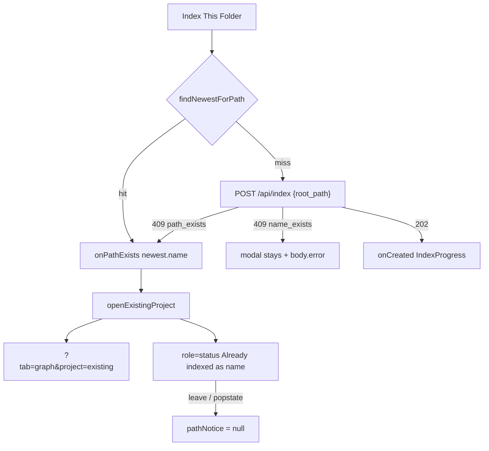

# Task #4 — Create modal path_exists redirect + notice
Reading time: 2-3 min
Last updated: 2026-08-29 — spec-003-h7q-path-project-identity | Patterns: ✓

## What changed (plain language)

“Index This Folder” on a folder that already has a project no longer starts another job. The modal closes and you land on that project’s Graph with a status line that names it. If the list already knows that folder, the UI skips the network call and does the same redirect.

A different folder that would reuse an existing project name stays in the modal with the server error. The create form still sends only the folder path — no Project ID, no `project` key. Reindex is not in this modal (Task #5).

## Files modified

| File | What it does | Lines ± |
|---|---|---|
| `graph-ui/src/components/CreateIndexModal.tsx` | 409 `path_exists` → `onPathExists`; `name_exists` stays; listed Path skip | ~+35 |
| `graph-ui/src/components/CreateIndexModal.test.tsx` | Both 409 codes; no Project ID; no `project` key; skip POST | +188 (new) |
| `graph-ui/src/App.tsx` | `openExistingProject` → `?tab=graph&project=`; `role="status"`; clear on navigate | ~+25 |
| `graph-ui/src/App.test.tsx` | Redirect + notice; `name_exists` stays; skip POST; notice clears on leave | ~+90 |
| `graph-ui/src/components/Dashboard.tsx` | Wire `onPathExists`; pass `existingProjects` | ~+12 |
| `graph-ui/src/lib/pathGroups.ts` | `findNewestForPath` + trailing-slash fold | +20 |
| `graph-ui/src/lib/pathGroups.test.ts` | Newest owner + slash fold | +7 |
| `graph-ui/src/lib/i18n.ts` | `pathExistsNotice(name)` en+zh | +2 |
| `graph-ui/src/lib/i18n.test.ts` | Locks notice copy | +2 |

Breadcrumbs present on all nine files (`@sdd-task` Task #4).

## Key decisions

| Decision | Why | ADR |
|---|---|---|
| POST still `{root_path}` only | Create is never a reindex; spec-001 regression | SDD-ADR-015 |
| 409 `path_exists` → close + Graph + notice | Owned Path must not 202-then-redirect | US-001 |
| 409 `name_exists` stays in modal | Different Path; do not open the other repo | US-006 |
| Skip POST if list has that Path | Same outcome as 409; no IndexProgress | US-001 optional |
| Skip uses `findNewestForPath` (`pickNewest`) | Same newest as Dashboard conflict; no JS realpath | SDD-ADR-016 |
| Notice `role="status"`; `navigate` / popstate clears it | Visible, not a confirm; one-shot | spec default 4 |
| `openExistingProject` does not call `navigate` | `navigate` would wipe the notice it just set | App.tsx:43-44 vs 55-62 |

## How create 409 is handled

## Debugging

| If this fails | File:line | Cause | Fix |
|---|---|---|---|
| 409 `path_exists` starts IndexProgress | `CreateIndexModal.tsx:127-133` | 409 treated as 202 | Call `onPathExists` + `onClose`; never `onCreated` |
| 409 `path_exists` stays on Dashboard | `App.tsx:142` / `Dashboard.tsx:160-162` | `onPathExists` not wired | App passes `openExistingProject`; Dashboard must not only close the modal |
| Notice missing after redirect | `App.tsx:55-62` / `App.tsx:121-126` | Route went through `navigate` | `openExistingProject` sets `pathNotice` then `setRoute`; `navigate` clears it (line 44) |
| Notice survives Back | `App.tsx:44` / `App.tsx:36` | Leave skipped `navigate` | Leave and popstate must `setPathNotice(null)` |
| 409 `name_exists` opens Graph | `CreateIndexModal.tsx:127` | Code matched `path_exists` | Only `code === "path_exists"` + `existing_project`; else throw `data.error` (line 132) |
| Modal POST has `project` | `CreateIndexModal.tsx:124` | Reindex key leaked into create | `JSON.stringify({ root_path: path })` only |
| Listed Path still POSTs | `CreateIndexModal.tsx:112-116` / `Dashboard.tsx:164` | Skip missed or list not passed | `existingProjects={projects}`; `findNewestForPath` on `canonical_root` / `root_path` |
| Skip picks the older clone | `pathGroups.ts:47-55` | First list row used | `pickNewest` — `indexed_at` then greater `name` |
| Skip misses trailing slash | `pathGroups.ts:41-43` | Exact string only | `foldPathKey` strips trailing `/` or `\` |
| Status text has no project name | `i18n.ts:72` | Copy not interpolated | `pathExistsNotice(name)` → `"Already indexed as ${name}"` |
| Notice is `role="alert"` or missing role | `App.tsx:123` | Wrong a11y role | Must be `role="status"` |

## Project fit

- Before: Task #2 returned 409 on the wire; Task #3 grouped leftovers on Dashboard. The create modal still treated every non-OK as a stay-in-modal error, and 202 was the only success path (IndexProgress, stay home).
- After: `path_exists` opens the existing Graph + status notice; `name_exists` stays; listed Path skips POST. Dashboard Reindex is not built.
- Next: Task #5 Reindex on every row (`{root_path, project}`), remaining i18n, compose Gherkin.

## Quick refs

- Spec US-001 / US-006: `.sdd-skill/specs/spec-003-h7q-path-project-identity/spec.md`
- Plan: `.sdd-skill/specs/spec-003-h7q-path-project-identity/plan.md`
- ADR: SDD-ADR-015 (bare POST is create), SDD-ADR-016 (list `canonical_root` is the skip key)
- Tests: `cd graph-ui && npx vitest run src/components/CreateIndexModal.test.tsx src/App.test.tsx src/lib/pathGroups.test.ts src/lib/i18n.test.ts`
- Constitution: II.3 i18n en+zh; IV.2 no `project_name` from create; VII breadcrumbs; IX.1 `?tab=` + `?project=`; IX.2 this spec owns Path 1:1. No Section X in the draft file.
