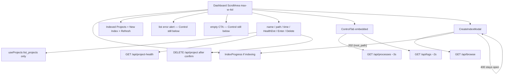

# Task #4 — Dashboard page: list + Control + create-index
Reading time: 2-3 min
Last updated: 2026-08-29 — spec-001-w3q-executive-dashboard | Patterns: ✓

## What changed (plain language)

Account home is now one page: the indexed-folder list on top, full daemon Control underneath, same scroll. Each row is name, folder path, last-indexed time, a health dot, Enter, and Delete (with confirm). Graph-size cards, label chips, and ADR are gone from this screen.

Starting an index posts only the folder path. On success the modal closes, a progress banner stays on this page, and Graph does not open. Empty list and list errors still show Control below.

## Files modified

| File | What it does | Lines ± |
|---|---|---|
| `graph-ui/src/components/Dashboard.tsx` | Stacked home: list then `ControlTab embedded`; New Index / Refresh; error + empty CTA | +133 (new) |
| `graph-ui/src/components/Dashboard.test.tsx` | Gherkin: identity rows, path-only POST, polls, empty, list error, index 400, delete cancel | +371 (new) |
| `graph-ui/src/components/CreateIndexModal.tsx` | Folder browse + POST `{ root_path }` only; no Project ID | +278 (extract) |
| `graph-ui/src/components/ControlTab.tsx` | `embedded` skips outer ScrollArea; polls 3s / 2s unchanged | +15 / −2 |
| `graph-ui/src/components/HealthDot.tsx` | Per-row health via `/api/project-health`; semantic hex | +76 (extract) |
| `graph-ui/src/components/IndexProgress.tsx` | Banner while `/api/index-status` has indexing jobs | +89 (extract) |
| `graph-ui/src/components/IndexProgress.test.tsx` | Poll / done / error; empty list is not success | +141 (migrate) |
| `graph-ui/src/components/AdrButton.tsx` | ADR chrome extracted; Dashboard does not import it | +112 (extract) |
| `graph-ui/src/components/AdrButton.test.tsx` | Isolated ADR save/delete | +58 (migrate) |
| `graph-ui/src/lib/i18n.ts` | `enter` + `lastIndexed` en/zh; `useUiLanguage` for `<time>` | +8 / −0 |
| `graph-ui/src/lib/i18n.test.ts` | Locks Enter / Last indexed / empty + Control copy | +6 / −0 |
| `graph-ui/src/App.tsx` | Leftover `stats` slot mounts Dashboard (TabBar still there) | +3 / −2 |
| `graph-ui/src/components/StatsTab.tsx` | Removed after extract | deleted |
| `graph-ui/src/components/StatsTab.test.tsx` | Moved to Dashboard / IndexProgress / AdrButton tests | deleted |

`ProjectCard.tsx` stays unwired. App header tabs and default route are Task #5.

## Key decisions

| Decision | Why | ADR |
|---|---|---|
| One ScrollArea: list, then border, then full Control | Side pane clips 400px logs; empty/error must still show Control | SDD-ADR-002 / plan D1 |
| `ControlTab embedded` | Dashboard owns `max-w-4xl`; no nested page scroll | SDD-ADR-002 |
| POST `/api/index` body is `{ root_path }` only | Name comes from path in C; Project ID created aliases | SDD-ADR-007 / plan D6 |
| 202 → `indexing=true`, no `onSelectProject` | Stay on Dashboard; IndexProgress is the job UI | US-005 / plan API |
| Delete uses `window.confirm`; cancel = no fetch | Destructive actions stay explicit | constitution VI.3 |
| `AdrButton` extracted, not imported | Rows are identity + freshness only | US-002 |
| Reuse `useProjects` + `formatIndexedAt` | No second list RPC; no second freshness field | SDD-ADR-006, SDD-ADR-003 |

## How the page is stacked

Before: Projects tab (StatsTab) dumped nodes/edges and opened Graph after index. After: one executive page; Control is on the same scroll. Next: Task #5 makes this the default URL and removes the header tab strip.

## Debugging

| If this fails | File:line | Cause | Fix |
|---|---|---|---|
| List error with no Control | `Dashboard.tsx:65-69` and `121-123` | Error return skipped the Control mount | Banner is inline; `ControlTab embedded` must stay after the list, not inside an early return |
| Empty page, no Control | `Dashboard.tsx:71-80` and `121-123` | Empty CTA replaced the whole page | Empty block is only the CTA; Control is always below the border |
| Graph opens after a 202 index | `CreateIndexModal.tsx:105-106` / `Dashboard.tsx:125-128` | `onCreated` called `onSelectProject` | `onCreated` only `setIndexing(true)` + `refresh()`; URL `tab=graph` is Task #5 |
| POST body has `project_name` | `CreateIndexModal.tsx:98-102` | Leftover Project ID state | Body must be `JSON.stringify({ root_path: path })` only |
| Index 400 closes the modal | `CreateIndexModal.tsx:103-108` | `onCreated`/`onClose` ran on `!res.ok` | Throw `data.error`; modal stays; show body text |
| Delete cancel still DELETEs | `Dashboard.tsx:29-30` | `confirm` not gated | `if (!confirm(...)) return` before `fetch` |
| Control clipped / polls die | `ControlTab.tsx:220-222` | `embedded` false or a second page ScrollArea | Dashboard owns the outer ScrollArea; embedded returns `{body}` only |
| Banner never appears | `IndexProgress.tsx:28-34` / `Dashboard.tsx:42-44` | `indexing` never set, or `[]` treated as done | Empty status list keeps polling; do not call `onDone` on `[]` |
| ADR button on a row | `Dashboard.tsx` imports | `AdrButton` remounted | Import is `HealthDot` + `IndexProgress` only; ADR lives in `AdrButton.tsx` |

## Project fit

- Before: home was a four-tab lab. Projects (StatsTab) showed schema leftovers. Control was a separate tab.
- After: Dashboard is the page (list then Control). App still defaults to Specs and still shows header tabs — Task #5 deletes that strip and aliases old `?tab=` values.
- Next: Task #5 — `TabId` = `dashboard | graph`; default URL opens this page; Enter keeps existing Graph.

## Pattern Notes

Patterns: ✓. Same list hook (Task #1), same chrome tokens (Task #2), same `formatIndexedAt` + `<time>` (Task #3), same HTTP contracts, same confirm-gated delete. No second list fetch. No C change. `i18n.test.ts` was missing the `@sdd-*` header; trainer added it. App `stats` slot mounts Dashboard only so deleting StatsTab does not break the shell — not Task #5 routing.

## Quick refs

- Spec US-002 / US-003 / US-005 / US-006: `.sdd-skill/specs/spec-001-w3q-executive-dashboard/spec.md`
- Plan D1 + API: `.sdd-skill/specs/spec-001-w3q-executive-dashboard/plan.md`
- ADR: `.sdd-skill/baseline/ARCHITECTURE_ADR.md` — SDD-ADR-002, SDD-ADR-007
- Tests: `graph-ui/src/components/Dashboard.test.tsx` — `cd graph-ui && npx vitest run src/components/Dashboard.test.tsx src/components/IndexProgress.test.tsx src/components/AdrButton.test.tsx`
- Constitution: III (chrome vs health), IV.2–4 (no `project_name`, existing `indexed_at`), VI.3 (delete confirm), VIII (no schema poll; Control 3s/2s)
