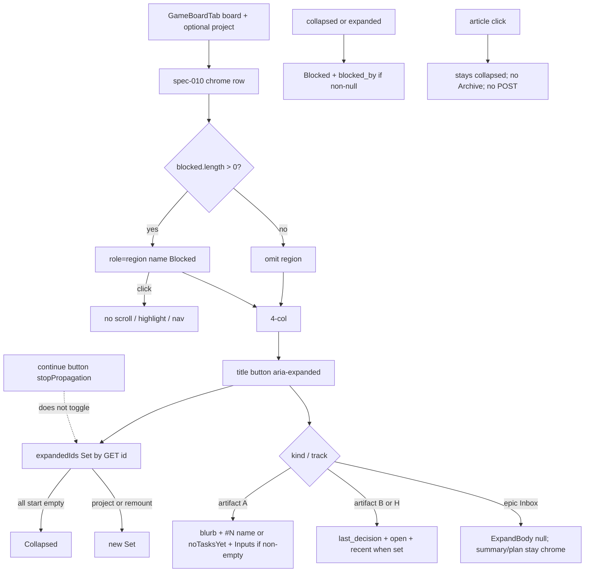

# Task #4 — GameBoardTab expand + blocked strip + i18n
Reading time: 2-3 min
Last updated: 2026-08-31 — spec-012-m2k-game-expand-archive-deps | Path=full | Patterns: ✓

## What changed (plain language)

On Game, the card title is now a button. Click it and that same card grows in place — no modal, no extra page. Track A shows the short blurb, every task (`#N name`, or “No tasks planned yet”), and Inputs only when the GET sent some. Track B / level / playtest show header `last_decision` / `open` / `recent` when present. Inbox still shows summary and plan on the card; expand adds nothing and never Archive.

A Blocked region appears above the four columns when GET `blocked[]` is non-empty. Overlay text (`Blocked` + `blocked_by`) stays on the card even when collapsed. Archive POST, Show archived, and hook refresh stay Task #5.

## Files modified

`App.tsx` / `SpecBoardTab.tsx` / `useSddSkillPresent` / `useSpecBoard` / C were not this task. `App.test.tsx` only gained type defaults (`blocked: []`, expand fields) so fixtures type-check.

| File | What it does | Lines ± |
|---|---|---|
| `graph-ui/src/components/GameBoardTab.tsx` | Title `<button aria-expanded>`; `expandedIds` Set; Track A/B/H/Inbox bodies; Blocked region; overlay prefix | 356 (was clipboard-era ~194). TitleControl `:148-167`; Set `:305-320`; ExpandBody `:105-146`; BlockedByLine `:90-103`; BlockedStrip `:229-251`, mount `:338` |
| `graph-ui/src/hooks/useGameBoard.ts` | Parse additive fields; missing `archived`→false; missing `blocked`→`[]`; still one-shot | 194. Task parse `:41-60`; blocked parse `:62-81`; card `:83-107`; board `:119-143`; hook `:145-193` |
| `graph-ui/src/lib/types.ts` | `GameBoardTask`, `GameBoardBlocked`, expand fields, `blocked[]` | 204. Task `:153-157`; Blocked `:159-163`; card `:175-182`; board `:190` |
| `graph-ui/src/lib/i18n.ts` | `gameBoard.inputs` + `blockedStrip` en+zh; reuse `specBoard.noTasksYet` | 322. en `:128-129`; zh `:246-247`; reuse `:112` |
| `graph-ui/src/components/GameBoardTab.test.tsx` | Invert spec-011 title-lock; body-click still no expand; pane Gherkin | 1147. Body-click `:608-638`; Track A `:809`; Track B `:836`; strip `:869`; Inbox `:922`; empty A `:950`; omit Inputs `:976`; multi+continue `:1002`; empty strip `:1047` |
| `graph-ui/src/hooks/useGameBoard.test.ts` | Parse defaults + additive fill; one-shot stays | 269. Missing defaults `:132-189`; fill `:191-245`; one-shot `:247` |
| `graph-ui/src/lib/i18n.test.ts` | Lock Inputs / Blocked en+zh | 113. Locks `:107-110` |
| `graph-ui/src/App.test.tsx` | Fixture defaults only (`blocked: []`, expand fields) | 1215. `emptyGameBoard` `:57`; `gameArtifact` `:74-81`. Breadcrumbs still spec-011 Task #5 |

## Key decisions

| Decision | Why | ADR |
|---|---|---|
| Title `<button aria-expanded>` like SpecCard | In-place grow; not modal/popover/side panel | US-001; spec-005 SDD-ADR-027 |
| `expandedIds` Set keyed by GET `id`; all collapsed; multi-open | Same Set as Specs; no Specs-style auto-seed | US-001 |
| UI paints GET `blocked[]` + `blocked_by`; does not recompute overlay | Overlay already in C before JSON | SDD-ADR-055 |
| Blocked region Game-only; click does nothing | Specs has no deps strip; rows are not links | US-005 |
| Reuse `specBoard.noTasksYet`; add `inputs` + `blockedStrip` | EN already matches Gherkin; no duplicate Archive strings this task | SDD-ADR-057 |
| Parse missing `archived`→false, `blocked`→`[]` | Same default as spec `archived === true` | plan deploy note |
| `useGameBoard` still one-shot; no POST | Archive UI + `refresh()` are Task #5 | SDD-ADR-054 later |
| Invert spec-011 title-never-expands; keep body-click | Title is the control; article click is not | plan crumb 28 |

## How title Set, bodies, and the Blocked region run

Pane still does not fetch `/api/game-board`. Overlay `work_state` `"blocked"` is C (Task #2). `App.tsx` still does not pass `project` or `refresh` (Task #5). Tests pass `project` to prove remount/project-change collapse.

## Debugging

| If this fails | File:line | Cause | Fix |
|---|---|---|---|
| Title click does not expand (title still `
`) | `GameBoardTab.tsx:148-167`, `:184`, `:213` | TitleControl dropped; title is a plain `
` | Wrap title in `<button aria-expanded>`. Test `:822` |
| Strip missing though GET has rows | `useGameBoard.ts:73-81`, `:137`; `GameBoardTab.tsx:236`, `:338` | `blocked` not parsed or region gated wrong | Missing/non-array → `[]` omits region; non-empty mounts `role=region` name Blocked. Tests `useGameBoard.test.ts:191`, `GameBoardTab.test.tsx:869` / `:1047` |
| Inputs heading on Track B | `GameBoardTab.tsx:107-131` vs `:133-145` | Track A body used for B | Inputs only inside `track === "A"`. Test `:836-865` |
| Body click expands the card | `GameBoardTab.tsx:183`, `:158-161` | Toggle on `<article>` | Only TitleControl `onClick`. Test `:608-638` |
| Continue toggles expand | `GameBoardTab.tsx:80-82` | `stopPropagation` dropped | Continue stays a nested button. Test `:1002-1044` |
| Chrome continue became an expand control | `GameBoardTab.tsx:334-336` | Chrome `
` replaced | Chrome stays text. Test `:1069-1091` |
| Overlay text only when expanded | `GameBoardTab.tsx:90-103`, `:191` | Prefix inside `{expanded && …}` | `BlockedByLine` outside ExpandBody. Test `:914-917` |
| Empty `blocked` still shows a Blocked heading | `GameBoardTab.tsx:236` | Region mounted on `[]` | `rows.length === 0` → null. Test `:1047-1066` |
| Inbox expand shows Archive / “No tasks planned yet” | `GameBoardTab.tsx:105-106`, `:224` | Artifact body on epic | `kind === "epic"` → ExpandBody null. Test `:922-947` |
| Empty Track A cannot expand | `GameBoardTab.tsx:113-114`, `:158` | Zero-task lock | Title always toggles; `noTasksYet` when `tasks.length === 0`. Test `:950-973` |
| Missing `archived` paints true / missing `blocked` drops the key | `useGameBoard.ts:105`, `:137` | Default not `=== true` / skip key | `archived === true` else false; `parseBlockedArray` → `[]`. Test `:184-188` |
| Two cards accordion / project keeps Set | `GameBoardTab.tsx:305-320` | Single id or no project clear | Multi Set; clear when `project` changes. Tests `:1002`, `:1093-1116` |
| 4s game-board poll or POST this task | `useGameBoard.ts:145-193` | `refresh` / `setInterval` / pane POST | One-shot GET only. Tests `useGameBoard.test.ts:247`, `GameBoardTab.test.tsx:636` |

## Project fit

- Before: Task #2 JSON has expand fields + `blocked[]`; Task #3 GET merge + POST. Game pane still clipboard-only: title was `
`, spec-011 tests locked “activate never expands.”
- After this task: same pane paints in-place expand + Blocked region from GET. Overlay prefix on cards. Hook still one-shot. No Archive control. `App.tsx` unwired for `project`/`refresh`.
- Next: Task #5 Archive / Unarchive / Show archived / `refresh()` / App pass-through / leftover Vitest. Not closeprep.

## Pattern Notes

Patterns: ✓.

- Title button like SpecCard (`SpecBoardTab.tsx:140-152`): `<button type="button" aria-expanded>` wrapping a truncated title `
`.
- `expandedIds` Set like SpecBoard (`SpecBoardTab.tsx:291-318`): `useState(new Set())`, toggle add/delete, render-phase clear on project change. Intentional delta: Game does not seed active ids (US-001 “no Specs-style auto-expand”).
- Blocked region Game-only: `SpecBoardTab.tsx` / `useSddSkillPresent` / `useSpecBoard` not edited. UI does not recompute overlay (SDD-ADR-055).
- Parse defaults like spec archived false: `archived: obj.archived === true`; missing `blocked` → `[]` (same “only true is true” as spec flags).
- i18n: reuse `specBoard.noTasksYet`; new `gameBoard.inputs` / `blockedStrip` en+zh (SDD-ADR-057). Archive/unarchive/showArchived keys exist for Task #5 paint; unused this task.
- Continue `stopPropagation` + chrome `
` + `draggable={false}` + one-shot stay (SDD-ADR-050/051).
- No second CSS file. Grayscale chrome. Graph hex untouched.

`App.test.tsx` still carries spec-011 Task #5 breadcrumbs — type defaults only, not a substantial edit (constitution VII.2). Not a defect.

No constitution gap this task (IX.2 still describes spec-011 no expand/POST; close will append). Inbox `ExpandBody` null is US-002, not a second expand pattern.

## Quick refs

- Spec US-001 / US-002 / US-005 (paint): `.sdd-skill/specs/spec-012-m2k-game-expand-archive-deps/spec.md`
- Plan UI expand + strip: same folder `plan.md`
- ADR: SDD-ADR-055 (overlay in C; UI paints GET); SDD-ADR-057 (i18n reuse + inputs/blockedStrip)
- Tests: `cd graph-ui && npx vitest run` → 249 passed
- Constitution: II.2–3 (Tailwind + i18n), III.1 (grayscale), V.1/V.4 (Vitest, no live daemon), VII.1–2 (aria-expanded / region name / breadcrumbs), IX.2 (silent win / four columns stay)
