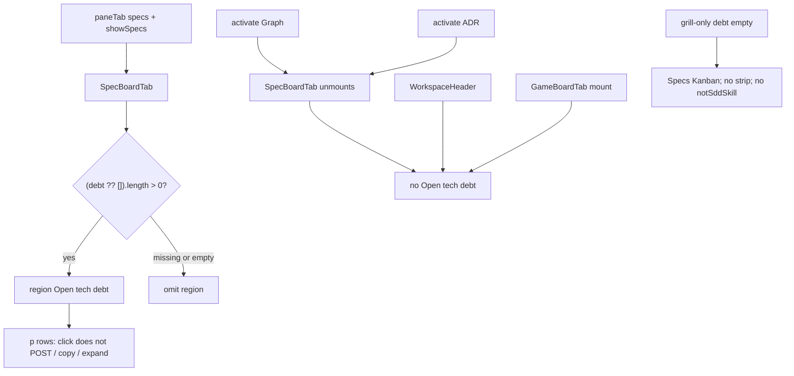

# Task #4 — leftover Vitest locks
Reading time: 2-3 min
Last updated: 2026-09-02 — spec-015-s5k-specs-debt-and-path | Path=full | Patterns: ✓

## What changed (plain language)

The Open tech debt strip stays on Specs only. Leaving Specs for Graph or ADR takes the strip with it. The workspace header, Graph, ADR, and Game never show those rows.

Clicking a debt row does nothing — no archive POST, no clipboard copy, no card expand. Grill-only Specs still works: the Kanban is there, the strip is gone, and the "doesn't use sdd-skill" copy stays off. Product Game and header files were not edited this task.

## Files modified

`GameBoardTab.tsx` / `WorkspaceHeader.tsx` / `SpecBoardTab.tsx` / `App.tsx` / C were not this task. Strip paint stays Task #3 (`SpecBoardTab.tsx:216-227`, mount `:374`). GraphTab stays mocked.

| File | What it does | Lines ± |
|---|---|---|
| `graph-ui/src/components/SpecBoardTab.test.tsx` | Grill-only omit; Companion-to mock; 16 debt no Has more; dead row | 1250. This task: grill-only `:1166`; Companion-to `:1190`; Has more `:1206`; click-dead `:1224`; `sixteenOpenDebt` `:209` |
| `graph-ui/src/App.test.tsx` | Graph/ADR unmount the region; App grill-only; GraphTab mocked | 1280. This task: describe `:1222`; Graph/ADR `:1232`; grill-only `:1264`; GraphTab mock `:16-20`; debt flags `:187-213` |
| `graph-ui/src/components/GameBoardTab.test.tsx` | Game mount has no Open tech debt; Function hex | 2097. This task: Game omit `:2076`; hex `:2094` |
| `graph-ui/src/components/WorkspaceHeader.test.tsx` | Header has no TD-005 / Open tech debt | 139. This task: `:128` |

No Playwright. No live daemon. `colors.test.ts` Function hex lock was run, not edited (`:27`).

## Key decisions

| Decision | Why | ADR |
|---|---|---|
| Leftover locks live in tests; do not edit `GameBoardTab.tsx` / `WorkspaceHeader.tsx` | Strip is SpecBoardTab-only; patching Game/header to "pass" would leak chrome | SDD-ADR-067 |
| Graph/ADR omit = SpecBoardTab unmounts (`App.tsx:171-176`) | Region cannot survive if the pane is gone; GraphTab mock avoids Three | SDD-ADR-067; V.4 |
| Conversion leftover = mock `epics: []` | Matcher is C-owned; UI must not re-match Companion-to | SDD-ADR-035 leftover; US-005 |
| Dead `
` click: no POST / writeText / expand | Rows are not controls; archive stays spec cards | SDD-ADR-067; US-001 |
| 16-row mock, no "Has more" | Cap omit is C; UI must not invent overflow chrome | SDD-ADR-065; US-006 |
| Grill-only (sdd false, grill true, `debt: []`) still paints Specs | spec-009 OR host; missing TECH_DEBT.md is omit, not hide Specs | SDD-ADR-040 leftover; US-002 |
| Function hex in-suite | Debt chrome must not recolor Graph | III.2 |

## How Specs hosts the strip; Graph / ADR / Game / header omit

`App.test.tsx` mocks GraphTab (`:16-20`) so Graph activate never boots GraphScene/Three. Game lock mounts `GameBoardTab` with a production board fixture — it does not edit `GameBoardTab.tsx`. Header lock mounts `WorkspaceHeader` alone.

## Debugging

| If this fails | File:line | Cause | Fix |
|---|---|---|---|
| Header shows TD-005 or Open tech debt | `WorkspaceHeader.tsx` (no debt); test `:128` | Strip leaked into header | Do not edit `WorkspaceHeader.tsx`. Strip is `SpecBoardTab.tsx:374` only |
| Graph still shows Open tech debt | `App.tsx:171-176`; test `App.test.tsx:1232` | SpecBoardTab stayed mounted | Pane is XOR: Graph unmounts Specs. GraphTab mock `:16-20`. Assert `:1252-1254` |
| ADR still shows Open tech debt | `App.tsx:173-174`; test `:1256` | Specs pane leaked under ADR | `paneTab === "adr"` → AdrTab. Assert `:1260` |
| Game shows Open tech debt | `GameBoardTab.tsx` (no debt region); test `:2076` | Strip copied into Game | Do not patch `GameBoardTab.tsx` to pass. Game `blockedStrip` is a different region. Assert `:2088-2090` |
| Debt click POSTs / copies / expands | `SpecBoardTab.tsx:220-223`; test `:1224` | Row became a control | Dead `
`; no onClick. Assert POST `:1243`; writeText `:1244`; blurb `:1246` |
| "Has more" appears with 16 debt rows | `SpecBoardTab.tsx` (no such control); test `:1206` | Overflow chrome leaked | Cap omit is C. UI paints the 16 mock. Assert `:1217-1219`. Helper `:209` |
| Converted epic id in Todo | test `:1190` | Mock put the path in `epics[]` | UI does not re-match Companion-to. Pass `epics: []`. Assert `:1200` |
| Grill-only hides Specs or shows notSddSkill | `SpecBoardTab.tsx:360`; `App.tsx:37`; tests `:1166` / `App.test.tsx:1264` | Host OR dropped | sdd false + grill true still Kanban. `debt: []` omits strip. Host leftover `:384` |
| Function hex drifted | `colors.test.ts:27`; tests `:1220` / `:2094` | Chrome token leaked into Graph | `colorForLabel("Function") === "#06b6d4"` |
| GraphTab boots Three | `App.test.tsx:16-20` | Mock removed | Keep `data-testid="graph-tab"` |

## Project fit

- Before: Task #1/#2 put open `debt[{id,title}]` on the same GET. Task #3 painted the Specs strip and wrapped epic ids. Header / Graph / ADR / Game / click-dead / Has more / grill-only leftover Thens were still pending.
- After this task: every remaining UI Then has a Vitest owner. Strip still SpecBoardTab-only. GameBoardTab.tsx and WorkspaceHeader.tsx unchanged. GraphTab stays mocked.
- Next: @review then @tester. Last impl task — closeprep waits for @tester PASS. Trigger A (NOT closeprep). Do not write spec-summary or PROJECT-OVERVIEW here.

## Pattern Notes

Patterns: ✓. Same leftover-Then pattern as spec-010 Task #5 / spec-014 Task #2 Specs lock / spec-008 Task #4: locks live in tests; production Game/header not patched (I.1, SDD-ADR-067). GraphTab mock kept (V.4; spec-010 `:16-20`). Conversion not reimplemented in Vitest — mocks already-filtered `epics` (SDD-ADR-035). Grill-only host OR not weakened (`SpecBoardTab.test.tsx:384` stays; new `:1166` adds empty-debt omit). spec-014 Specs lock stays (`:1033`). Dead-row is the same fetch-spy class as epic-activate leftover (V.1). English Then text (II.3). No Playwright (IX.4). Function hex in-suite (III.2). No new CSS / i18n / HTTP / MCP. Breadcrumbs on the four edited test files (VII.2).

Constitution has I–IX only (no Section X). IX.2 does not mention Specs debt chrome yet — true; this is spec-015 leftover Vitest. Same-GET additive is locked by SDD-ADR-065. No constitution gap this task (IX debt sentence waits for spec close).

## Quick refs

- Spec US-001–US-006 leftover UI Thens: `.sdd-skill/specs/spec-015-s5k-specs-debt-and-path/spec.md`
- Plan Gherkin → owner: same folder `plan.md` (header / Graph / ADR / Game / click-dead / Has more / grill-only → #4)
- ADR: SDD-ADR-067 (Specs-only strip; dead text; do not edit WorkspaceHeader / GameBoardTab)
- Tests: `cd graph-ui && npx vitest run` → 290 passed
- Gherkin owners: strip paint/omit + wrap → Task #3; parse/HTTP → Tasks #1/#2; leftover UI → this file
- Constitution: I.1, II.3, III.2, V.1/V.4, VII.2, IX.4
