# Task #4 — Vitest Gherkin mapping remaining UI archive scenarios
Reading time: 2-3 min
Last updated: 2026-08-30 — spec-006-k3n-spec-archive | Patterns: ✓

## What changed (plain language)

Tests now lock every Specs-tab archive story: Archive hides a Done card with no confirm, Show archived then Unarchive puts it back even with hide on, a fresh visit starts hidden, Done count skips hidden cards, a leftover Todo flag still shows the card, and an all-archived Done column keeps "No specs yet" plus the toggle.

A later GET poll with `archived: true` must not bring a hidden card back while Show archived is off. Archive and Unarchive names exist only on an expanded Done card — the spec-005 "document has none" assert is gone.

Product hide/POST/refresh did not change this task. C already owns GET merge, orphan ignore, idempotent POST, and 409/404/400.

## Files modified

Working-tree `SpecBoardTab.test.tsx` is untracked (Task #3 created it; Task #4 grew the Gherkin table). `git diff --numstat` vs last commit shows no Task #4 product delta.

| File | What it does | Lines ± |
|---|---|---|
| `graph-ui/src/components/SpecBoardTab.test.tsx` | Maps every UI Gherkin Then; poll GET `archived: true` does not resurrect; Archive/Unarchive names only on expanded Done | 665 total (~+87 from Task #3) |
| `graph-ui/src/lib/colors.test.ts` | `colorForLabel("Function") === "#06b6d4"` lock (run, not edited) | 0 |

No C change. No i18n. No Playwright. `useSpecBoard` still mocked. Host tests (no picker when `project` is set / loading / not-sdd-skill) still hold.

## Key decisions

| Decision | Why | ADR |
|---|---|---|
| Poll proof is a rerender with GET `archived: true`, toggle off | 4s `setBoard` cannot undo Archive | SDD-ADR-032, US-006 |
| spec-005 document-wide "no Archive/Unarchive" replaced | Those names belong on expanded Done only | US-001 / US-004, grill ADR-003 |
| Title button is the click target (name contains spec id) | Same in-card expand as spec-005 | SDD-ADR-027 |
| UI Gherkin in Vitest; C keeps merge / 409 / 404 / 400 / orphan / idempotent | Plan Gherkin → owner table | V.2 |
| English assertions; mock `{sdd_skill_present, specs}` | No live daemon; no `columns` mock | II.3, V.4 |

## How Gherkin maps to Vitest

```mermaid
flowchart TB
  G1["Archive hides Done, no confirm"] --> V1["SpecBoardTab.test.tsx:542"]
  G2["Show archived + Unarchive stays visible"] --> V2["test.tsx:572"]
  G3["Fresh visit starts hidden"] --> V3["test.tsx:453"]
  G4["Done count ignores hidden"] --> V4["test.tsx:496"]
  G5["Leftover Todo flag still shows"] --> V5["test.tsx:519"]
  G6["All Done archived + empty copy + toggle"] --> V6["test.tsx:508"]
  G7["Poll GET archived true does not resurrect"] --> V7["test.tsx:612"]
  G8["Archive/Unarchive names only on expanded Done"] --> V8["test.tsx:643"]
  Host["selectProject / loading / not-sdd-skill"] --> H["test.tsx:234"]
  Pal["colorForLabel Function"] --> Lock["colors.test.ts:27"]
  C["GET merge / orphan / 409 / 404 / 400 / idempotent"] --> Cown["test_httpd.c Task #2"]
```

`expectNoArchiveOrUnarchive` (`:201-207`) is scoped: In Progress first paint still calls it on the document (`:314`); leftover Todo uses the card (`:526`); the old document-wide Done-expand ban is replaced by `:643`.

## Debugging

| If this fails | File:line | Cause | Fix |
|---|---|---|---|
| Poll resurrects a hidden archived card | `SpecBoardTab.tsx:323-328`, `:267` / `test.tsx:612` | Rerender used `archived: false`, or `showArchived` leaked true, or filter skipped `=== true` | Poll payload must be GET `archived: true` with toggle off. Filter is `done && isArchived && !showArchived`. Assert `:632-639` |
| Show archived pressed after a poll rerender | `SpecBoardTab.tsx:267-278` / `test.tsx:632` | New `board` object treated as a project change | Only `project` change resets the toggle. `seededRef` stays true on poll |
| Archive / Unarchive leaked on Todo / In Progress | `SpecBoardTab.tsx:115-116` / `test.tsx:643` | Column gate dropped, or spec-005 helper still forbids Done names | Names only on expanded Done. Leftover Todo `:519`. In Progress `:314` |
| Archive opened confirm / dialog | `SpecBoardTab.tsx:296-308` / `test.tsx:542` | `window.confirm` or a modal leaked | `confirm` not called; no `dialog` / `alertdialog` (`:554-556`) |
| After Archive the card is still in Done | `SpecBoardTab.tsx:304-305` / `test.tsx:542` | `refresh` not awaited or live mock left `archived` false | `await refresh()` after `res.ok`. POST body `archived: true` (`:558-568`) |
| Unarchive while hide still hides the card | `SpecBoardTab.tsx:326` / `test.tsx:572` | Filter used a stale `archived` true | After 200 the entry is false. Card stays after toggle off (`:606-608`) |
| Fresh visit shows archived Done | `SpecBoardTab.tsx:267` / `test.tsx:453` | Toggle defaulted on | `useState(false)`. Remount `:466`. Project change `:482` |
| Function hex drifted | `colors.test.ts:27` | `LABEL_COLORS` or CSS vars leaked | `colorForLabel("Function") === "#06b6d4"` |

## Project fit

- Before: Task #3 shipped the session toggle, Done filter, and Archive/Unarchive POST + `await refresh()`. Poll-after-archive and the spec-005 document-wide "no Archive" remap were still Task #4.
- After: every UI Gherkin Then has a Vitest owner. Poll rerender with `archived: true` keeps the card hidden while Show archived is off. Archive/Unarchive names exist only on expanded Done. Graph Function hue still locked.
- Next: @review then @tester. This is the last impl task — if @tester PASS, @human-trainer Trigger B closeprep (not this step). Do not write spec-summary or PROJECT-OVERVIEW here.
- Live UI: implementer did not browser-click. Proof is Vitest (156 passed: 24 SpecBoardTab + colorForLabel in the suite). Constitution IX.4 / V.1 make Playwright optional at DEVELOPMENT.

## Pattern Notes

Patterns: ✓. Same hook-mock + `fetch` stub as Task #3 / spec-005 host tests (V.1, V.4). Poll proof is a new `board` object (same pattern as spec-005 expand persist), now with GET `archived: true` — not a local hidden-ids list, not wait-for-interval (SDD-ADR-032). English Then text (II.3). Title `getByRole("button", { name: spec id })` (VII.1). Breadcrumbs on `SpecBoardTab.test.tsx` (VII.2) — see below. No new CSS (II.2). No new i18n key. Chrome grayscale; Graph hex locked in the same suite run (III.2). POST stays `/api/spec-board` (IV.3). C Gherkin not duplicated. No Playwright.

Breadcrumbs on `SpecBoardTab.test.tsx` (lines 1-7): `@sdd-task` Task #4 Vitest Gherkin mapping remaining UI scenarios; `@sdd-spec` spec-006-k3n-spec-archive; `@sdd-decision` SDD-ADR-032; `@sdd-why` map every UI Then + poll must not resurrect; `@human-debug` poll resurrect → rerender used `archived` false or `showArchived` stayed true.

Constitution has I–IX only (no Section X). IX.2 still says Archive is not part of spec-005 — true; this is spec-006 test mapping. IX archive sentence waits for Trigger B / spec close. No constitution gap this task.

## Quick refs

- Spec US-001–US-004 + US-006 poll: `.sdd-skill/specs/spec-006-k3n-spec-archive/spec.md`
- Plan Gherkin → owner: `.sdd-skill/specs/spec-006-k3n-spec-archive/plan.md` (Testing Strategy)
- ADR: SDD-ADR-032 (await GET refresh; session Show archived). Expand Set stays SDD-ADR-027
- Tests: `cd graph-ui && npx vitest run` (156 passed, 24 SpecBoardTab)
- Constitution: I.1, II.3, III.2, V.1/V.2/V.4, VII.1–2, IX.2 (expand stays), IX.4
