# Task #4 — Vitest Gherkin mapping remaining UI grill-epic scenarios
Reading time: 2-3 min
Last updated: 2026-08-30 — spec-008-g8r-grill-epic-todo | Patterns: ✓

## What changed (plain language)

Tests now lock every Specs-tab grill-epic story the UI owns: Mixed Todo paints letter E plus title, summary, plan, and ids with the epic card first; an already-omitted epic stays off Todo; Done shows the claiming spec and never the epic path; two plans follow index then NNN then specs; a similarly named spec without Companion-to sits beside the epic; a 64-epic list has no "Has more"; activating an epic never expands, archives, or POSTs.

Product paint did not change this task. C already owns conversion match, order, cap, skip, and POST 404. The UI tests mock `epics` already filtered.

## Files modified

Working-tree `SpecBoardTab.test.tsx` is untracked (Task #3 created it; Task #4 grew the remaining UI Gherkin table). `git diff --numstat` vs last commit shows no Task #4 product delta (`SpecBoardTab.tsx` / `types.ts` / `globals.css` are Task #3).

| File | What it does | Lines ± |
|---|---|---|
| `graph-ui/src/components/SpecBoardTab.test.tsx` | Maps remaining UI Gherkin Thens; host grill-true + sdd-false still not-sdd-skill; Function hex in-suite | 965 total (~+154 from Task #3 ~811) |
| `graph-ui/src/lib/colors.test.ts` | `colorForLabel("Function") === "#06b6d4"` lock (run, not edited) | 0 |

No C change. No i18n. No Playwright. `useSpecBoard` still mocked. Host tests (no picker when `project` is set / loading / not-sdd-skill with `grill_skill_present: true`) still hold.

## Key decisions

| Decision | Why | ADR |
|---|---|---|
| UI mocks already-filtered `epics` | Conversion is C-owned; Vitest must not re-match Companion-to | SDD-ADR-035, US-002 |
| Companion-to omit = `epics: []` + spec still in Todo | UI paints the GET list; it does not fopen spec.md | grill ADR-002 |
| Two-plan order is mock array order | C already sorts index.md then NNN; UI concatenates `epics` then spec todos | grill ADR-005 |
| 64-epic mock, no "Has more" | Cap omit is C; UI must not invent overflow chrome | grill ADR-007, US-005 |
| Function hex asserted in the same file | Chrome E must not leak into GraphTab | constitution III.2; SDD-ADR-038 |
| English assertions; mock `{sdd_skill_present, specs, epics?}` | No live daemon; no GraphTab/Three | II.3, V.4 |

## How Gherkin maps to Vitest

```mermaid
flowchart TB
  G1["Mixed Todo E + title + summary + plan + order"] --> V1["SpecBoardTab.test.tsx:808"]
  G2["Companion-to omit: Todo has no epic id"] --> V2["test.tsx:878"]
  G3["Done spec claiming epic: Done has spec id, not epic; In progress none"] --> V3["test.tsx:893"]
  G4["Two plans: index.md then NNN then specs"] --> V4["test.tsx:911"]
  G5["Missing Companion-to shows both cards"] --> V5["test.tsx:933"]
  G6["64-epic mock; no Has more; Function hex"] --> V6["test.tsx:948"]
  G7["Epic activate: no Archive / no-tasks / POST"] --> V7["test.tsx:837"]
  G8["Specs still requires sdd_skill_present"] --> V8["test.tsx:389"]
  Host["selectProject / loading / not-sdd-skill + grill true"] --> H["test.tsx:322"]
  Pal["colorForLabel Function"] --> Lock["test.tsx:963 / colors.test.ts:27"]
  C["Companion-to match / order / cap / POST 404"] --> Cown["test_spec_board.c + test_httpd.c Tasks #1–#2"]
```

`columnCardIds` (`:280-284`) reads `.font-mono` id texts in document order. Companion-to omit (`:878`) and Done-claim (`:893`) pass `epics: []` — if those tests fopen'd spec.md, conversion would have leaked into the UI.

## Debugging

| If this fails | File:line | Cause | Fix |
|---|---|---|---|
| Two-plan Todo ids not index then NNN then spec | `SpecBoardTab.tsx:267-278` / `test.tsx:911` | Mock shuffled, or specs mapped before epics | Mock `[planAFirst, planASecond, planBOther]` then `planned`. Product is `todoEpics.map` then `entries.map`. Assert `:920-925` |
| "Has more" appears with 64 epics | `SpecBoardTab.tsx` (no such control) / `test.tsx:948` | Overflow chrome leaked | Cap omit is C. UI paints the 64 mock as-is. Assert no button/link/text `:960-962` |
| Omitted epic id still in Todo | `test.tsx:878` | Mock put the path in `epics[]` | UI does not re-match Companion-to. Pass `epics: []`. Assert `:887-889` |
| Done / In progress shows an epic id | `SpecBoardTab.tsx:238, 371-393` / `test.tsx:893` | `epics` passed off todo, or mock listed it | Only Todo gets `board.epics ?? []`. Done-claim mock is `epics: []`. Assert `:902-906` |
| Mixed Todo lost E / title / plan / order | `SpecBoardTab.tsx:104, 267-278` / `test.tsx:808` | EpicCard or concat rewritten | Literal `"E"` + texts. Assert `:819-828` |
| Click epic expands / Archives / POSTs | `SpecBoardTab.tsx:100-111` / `test.tsx:837` | EpicCard reused SpecCard | Display-only `
`. Assert `:851-857` |
| grill true + sdd false paints Todo | `SpecBoardTab.tsx:344-346` / `test.tsx:389` | Host gated on grill | Still `!board.sdd_skill_present`. Assert `:405-409`. Strip: `useSddSkillPresent.ts:16` `=== true` only |
| Host picker leaked when `project` is set | `test.tsx:322` | Workspace host broke | No `selectProject`. Tests `:322` / `:338` / `:354` (grill true) |
| Function hex drifted | `colors.test.ts:27` / `test.tsx:963` | `LABEL_COLORS` or CSS vars leaked | `colorForLabel("Function") === "#06b6d4"` |

## Project fit

- Before: Task #3 shipped EpicCard, Todo epics-then-specs, no expand/archive/POST, and host missing-epics / grill-without-sdd. Two-plan document order, 64-cap no Has more, Companion-to omit mock, and Done/In progress isolation were still Task #4.
- After: every UI Gherkin Then has a Vitest owner. Conversion stays C-owned (already-filtered mocks). Graph Function hue still locked in the same file and in `colors.test.ts`.
- Next: @review then @tester. This is the last impl task — if @tester PASS, @human-trainer Trigger B closeprep (not this step). Do not write spec-summary or PROJECT-OVERVIEW here.
- Live UI: implementer did not browser-click. Proof is Vitest (170 passed: 34 SpecBoardTab + colorForLabel in the suite). Constitution IX.4 / V.1 make Playwright optional at DEVELOPMENT.

## Pattern Notes

Patterns: ✓. Same hook-mock + `fetch` stub as Task #3 / spec-006 host tests (V.1, V.4). Conversion not reimplemented in Vitest — mocks already-filtered `epics` (SDD-ADR-035; C owns Companion-to / `source.grill_epic`). Host not-sdd-skill not weakened: `grill_skill_present: true` + `sdd_skill_present: false` still `notSddSkill` (`:389`); `useSddSkillPresent` unedited. `colorForLabel("Function") === "#06b6d4"` locked in-suite (`:963`) and `colors.test.ts:27` (III.2). English Then text (II.3). Breadcrumbs on `SpecBoardTab.test.tsx` (VII.2) — see below. No new CSS (II.2). No new i18n key. Letter E still literal. POST stays `/api/spec-board` and is not called on epic activate (IV.3). C Gherkin not duplicated. No Playwright. No GraphTab/Three.

Breadcrumbs on `SpecBoardTab.test.tsx` (lines 1-7): `@sdd-task` Task #4 Vitest Gherkin mapping remaining UI scenarios; `@sdd-spec` spec-008-g8r-grill-epic-todo; `@sdd-decision` SDD-ADR-035; `@sdd-why` map remaining UI Thens + conversion stays C-owned; `@human-debug` omitted epic paints → mock leaked it; Has more → chrome leaked; Specs paints with sdd false → host skipped notSddSkill.

Constitution has I–IX only (no Section X). IX.2 does not mention grill yet — true; this is spec-008 test mapping. IX grill sentence waits for Trigger B / spec close. No constitution gap this task.

## Quick refs

- Spec US-001–US-006 (UI Thens): `.sdd-skill/specs/spec-008-g8r-grill-epic-todo/spec.md`
- Plan Gherkin → owner: `.sdd-skill/specs/spec-008-g8r-grill-epic-todo/plan.md` (Testing Strategy)
- ADR: SDD-ADR-035 (same GET + separate `epics[]`; UI paints mock-filtered list). E hue stays SDD-ADR-038
- Tests: `cd graph-ui && npx vitest run` (170 passed, 34 SpecBoardTab)
- Constitution: I.1, II.3, III.2, V.1/V.2/V.4, VII.1–2, IX.2 (expand + archive stay on spec cards), IX.4
