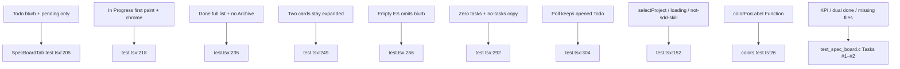

# Task #4 — Vitest Gherkin + poll persist + no Archive
Reading time: 2-3 min
Last updated: 2026-08-30 — spec-005-v2m-spec-card-expand | Patterns: ✓

## What changed (plain language)

Tests now lock every Specs-tab expand story: a Todo shows only unfinished work, In Progress starts open with its objective and both tasks, and a Done card can open its full list. Two cards can stay open at once. A later board refresh must not close what you opened. There is no Archive button.

Product expand/filter did not change this task. C already owns KPI-not-blurb, the dual done matcher, and missing-file degrade.

## Files modified

Working-tree `SpecBoardTab.test.tsx` is untracked (Task #3 created it; Task #4 grew the Gherkin table). `git diff --numstat` vs last commit shows no Task #4 product delta.

| File | What it does | Lines ± |
|---|---|---|
| `graph-ui/src/components/SpecBoardTab.test.tsx` | Maps every UI Gherkin Then; multi-expand; poll persist; document Archive/Unarchive absent | 362 total (~+26 from Task #3) |
| `graph-ui/src/lib/colors.test.ts` | `colorForLabel("Function") === "#06b6d4"` lock (run, not edited) | 0 |

No C change. No i18n. No Playwright. `useSpecBoard` still mocked. Host tests (no picker when `project` is set / loading / not-sdd-skill) still hold.

## Key decisions

| Decision | Why | ADR |
|---|---|---|
| `expandedIds` Set: add/remove one id; poll must not reset | Two cards stay open; 4s `setBoard` cannot collapse | SDD-ADR-027 |
| Title button is the click target (name contains spec id) | Same in-card expand; no overlay | SDD-ADR-027, grill ADR-002 |
| Document has no control named Archive or Unarchive | Grill ADR-003 Archive-on-Done is epic-002 / later spec | US-005, plan Key Decisions |
| UI Gherkin in Vitest; C keeps extract/matcher/degrade | Plan Gherkin → owner table | V.2 |
| English assertions; mock `{sdd_skill_present, specs}` | No live daemon; no `columns` mock | II.3, V.4 |

## How Gherkin maps to Vitest

`expectNoArchiveOrUnarchive` (`:138-143`) queries button and link named Archive or Unarchive on the whole document. Done expand calls it (`:246`); In Progress first paint does too (`:232`).

## Debugging

| If this fails | File:line | Cause | Fix |
|---|---|---|---|
| Archive / Unarchive leaked | `SpecBoardTab.tsx:153-162` / `SpecBoardTab.test.tsx:138-143` | Grill ADR-003 Archive landed on Done | Expand body is optional blurb + TaskList only. Assert `:235` / `:246` |
| Opened Todo collapses on poll | `SpecBoardTab.tsx:220-231` / `test.tsx:304` | Seed/reset ran on new `board` identity | `seededRef` stays true. Rerender a new board object with the same ids (`:312-318`) |
| Second card closes the first | `SpecBoardTab.tsx:233-239` / `test.tsx:249` | Toggle replaced the Set | `next.add(id)` must not clear other ids. Both blurbs at `:260-261` |
| In Progress missing `1/2 tasks` | `SpecBoardTab.tsx:136-139` / `test.tsx:218` | Chrome inside `{expanded &&}` or i18n drifted | First paint: blurb, both `#N`, implementer, `tasksDone(1, 2)` (`:230-231`) |
| Todo shows `#1 Write parser` | `SpecBoardTab.tsx:63` / `test.tsx:205` | Filter skipped | Pending-only. `#2` present; `#1` absent (`:214-215`) |
| Function hex drifted | `colors.test.ts:26` | `LABEL_COLORS` or CSS vars leaked | `colorForLabel("Function") === "#06b6d4"` |

## Project fit

- Before: Task #3 shipped the Set, title toggle, blurb region, and column filters. Poll persist was already green; multi-expand and document-wide no Archive were still Task #4.
- After: every UI Gherkin Then has a Vitest owner. Two cards stay open. Poll rerender keeps the opened Todo blurb. Archive/Unarchive are absent. Graph Function hue still locked.
- Next: @review then @tester. This is the last task — if @tester PASS, @human-trainer Trigger B closeprep (not this step). Do not write spec-summary or PROJECT-OVERVIEW here.
- Live UI: implementer did not browser-click. Proof is Vitest (16 passed: SpecBoardTab + colorForLabel). Constitution IX.4 / V.1 make Playwright optional at DEVELOPMENT.

## Pattern Notes

Patterns: ✓. Same hook-mock as Task #3 / spec-002 host tests (V.1, V.4). English Then text (II.3). Title `getByRole("button", { name: spec id })` (VII.1). Breadcrumbs on `SpecBoardTab.test.tsx` (VII.2). No new CSS (II.2). No new i18n key. Chrome grayscale; Graph hex locked in the same suite run (III.2). Grill ADR-003 Archive not implemented (I.1 — spec Out of Scope). C Gherkin not duplicated. No second endpoint. No Playwright.

Constitution has I–IX only (no Section X). No new gap this task.

## Quick refs

- Spec US-001 / US-005 + UI Gherkin: `.sdd-skill/specs/spec-005-v2m-spec-card-expand/spec.md`
- Plan Gherkin → owner: `.sdd-skill/specs/spec-005-v2m-spec-card-expand/plan.md` (Testing Strategy)
- ADR: SDD-ADR-027 (Set / multi-open / poll). Grill spec-board-detail ADR-003 Archive-on-Done is out of this spec
- Tests: `cd graph-ui && npx vitest run src/components/SpecBoardTab.test.tsx src/lib/colors.test.ts` (16 passed)
- Constitution: I.1, II.3, III.2, V.1/V.2/V.4, VII.1–2, IX.4
