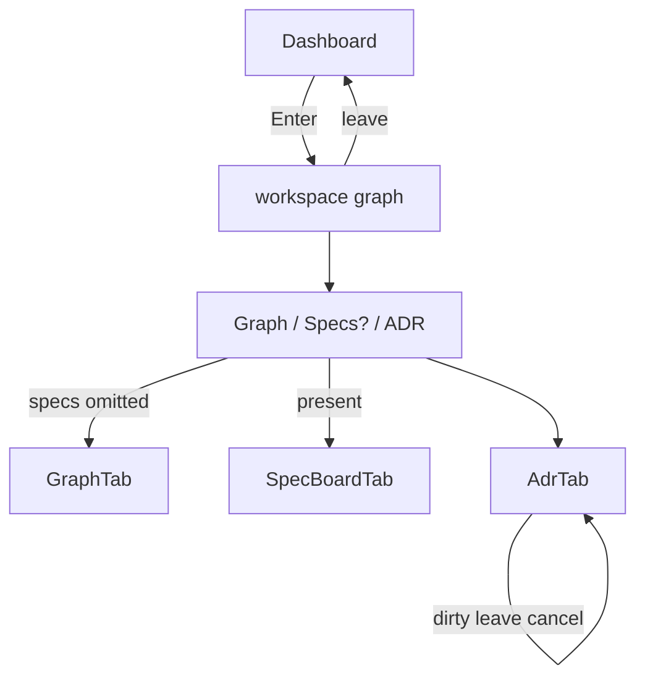

# Task #5 — App compose + Gherkin
Reading time: 2-3 min
Last updated: 2026-08-29 — spec-002-p8w-project-workspace | Patterns: ✓

## What changed (plain language)

Entering a project now opens a workspace: name and last-indexed in the header, tabs underneath (Graph, Specs only if sdd-skill exists, ADR always). Leaving returns to Dashboard. Unsaved ADR asks before leaving. The old ADR popup is gone.

## Files modified

| File | What it does |
|---|---|
| `graph-ui/src/App.tsx` | Workspace vs Dashboard; dirty confirm; specs fallback |
| `graph-ui/src/App.test.tsx` | All remaining Gherkin scenarios |
| `graph-ui/src/components/AdrButton.tsx` | deleted |
| `graph-ui/src/components/AdrButton.test.tsx` | deleted |

## Key decisions

| Decision | Why | ADR |
|---|---|---|
| Tab strip under `<header>`, not inside | spec-001 header queries stay valid | SDD-ADR-009 D2 |
| `fallbackSpecsToGraph` + replaceState immediately | Omit-while-loading | SDD-ADR-010 |
| `window.confirm` on dirty leave/tab | Same gate family as delete | SDD-ADR-012 |

## Debugging

| If this fails | File:line | Cause | Fix |
|---|---|---|---|
| Specs is a header button | `App.tsx` strip | Mounted inside header | Sibling under header |
| `?tab=specs` stays without skill | `App.tsx` fallback effect | replaceState missing | `fallbackSpecsToGraph` then replaceRoute |
| Dirty leave drops draft | `requestNavigate` | confirm not stubbed / not checked | Dismiss keeps adr + textarea |

## Pattern Notes

Patterns: ✓. Same route kernel. Same useProjects header. No C change. No get_graph_schema on header.

## Quick refs

- Tests: `cd graph-ui && npx vitest run src/App.test.tsx`
