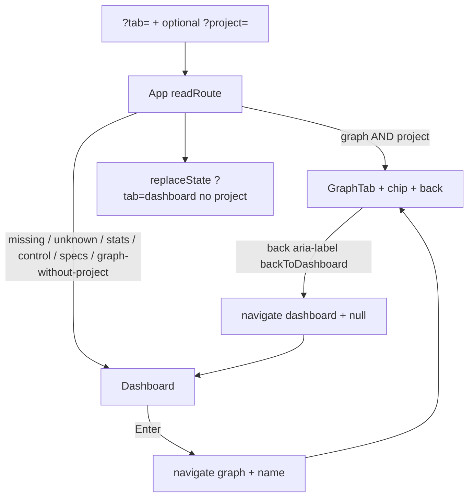

# Task #5 — App routing + TabBar delete
Reading time: 2-3 min
Last updated: 2026-08-29 — spec-001-w3q-executive-dashboard | Patterns: ✓

## What changed (plain language)

Opening the UI with no query now lands on Dashboard (project list + Control). The four-tab header (Specs / Graph / Projects / Control) is gone. Old bookmarks like `?tab=stats` or `?tab=control` also open Dashboard.

Enter on a row still opens the existing Graph for that project. The Graph header chip has a back control that returns home without leaving `project=` in the URL.

## Files modified

| File | What it does | Lines ± |
|---|---|---|
| `graph-ui/src/App.tsx` | `readRoute` + header IA: Dashboard default; Graph only with project; no TabBar | +24 / −70 |
| `graph-ui/src/App.test.tsx` | US-001 Gherkin: default URL, aliases, Enter/back, deep link, 202 stays home | +202 (new) |
| `graph-ui/src/lib/types.ts` | `TabId` = `"dashboard" \| "graph"` | +8 / −1 |
| `graph-ui/src/lib/i18n.ts` | `graph.backToDashboard` en + zh | +6 / −4 |
| `graph-ui/src/lib/i18n.test.ts` | Locks Back to Dashboard / 返回仪表盘 | +9 / −0 |
| `graph-ui/src/components/TabBar.tsx` | Account tab strip removed (TD-003) | deleted |

`SpecBoardTab.tsx` stays on disk, unrouted. `GraphTab` is mocked in `App.test.tsx` so tests do not boot Three.

## Key decisions

| Decision | Why | ADR |
|---|---|---|
| `TabId` is only `dashboard` \| `graph` | Leftover ids invited the old four-tab strip | SDD-ADR-008 / plan D7 |
| Aliases live in `readRoute` | One place maps missing/unknown/`stats`/`control`/`specs` to Dashboard and clears `project` | SDD-ADR-008 |
| Graph requires `tab=graph` and a non-empty project | `?tab=graph` alone must not mount GraphTab | US-001 / plan D7 |
| First load `replaceState` writes `?tab=dashboard` without `project` | Canonical URL; stale selection cannot stick | plan D7 |
| Header: brand on Dashboard; chip + back on Graph | No sibling tabs named Specs, Graph, Projects, or Control | US-001 |
| Back is `navigate("dashboard", null)` | Replaces × → stats; URL must not require `project=` | US-001 |
| Delete `TabBar.tsx`; do not rebuild a workspace strip | Account IA is two-level (home vs Graph), not four tabs | plan D3 / constitution IX.2 |
| Enter stays `navigate("graph", name)` | Existing GraphTab until spec-002 | constitution IX.3 |

## How routing splits home vs Graph

Before: default tab was Specs; header had four account tabs; `stats` was the Projects page. After: two-level shell — Dashboard is home, Graph is Enter/deep-link only. Next: @review then @tester; spec-summary is Trigger B after tester PASS (closeprep).

## Debugging

| If this fails | File:line | Cause | Fix |
|---|---|---|---|
| Default load shows Specs or a tab strip | `App.tsx:22-29`, `96-101` | `readRoute` still defaults to specs, or `SpecBoardTab` / `TabBar` remounted | Only `graph`+project is Graph; else Dashboard. Header has brand only — no Specs/Graph/Projects/Control buttons |
| `?tab=stats` still shows old Projects/Stats | `App.tsx:26-29`, `45-48` | Alias branch missing; `replaceState` not run | `stats` is not Graph → `{ tab: "dashboard", project: null }`; first load writes `?tab=dashboard` |
| `?tab=graph` with no project opens Graph | `App.tsx:26-27`, `64` | Guard dropped (`&& project`) | Empty/missing `project` must return Dashboard and clear `project` from the URL |
| Back leaves `?project=` on Dashboard | `App.tsx:32-36`, `87` | Back passed a name, or `routeUrl` always sets `project` | `navigate("dashboard", null)`; `routeUrl` sets `project` only when truthy |
| Back has no accessible name | `i18n.ts:32`, `121` / `App.tsx:86` | `messages.*.graph.backToDashboard` missing | en = "Back to Dashboard"; zh = "返回仪表盘"; `aria-label={t.graph.backToDashboard}` |
| GraphTab boots Three in tests | `App.test.tsx:15-19` | `vi.mock("./components/GraphTab")` missing | Keep the mock; assert `data-testid="graph-tab"` |
| Create-index 202 becomes `tab=graph` | `App.test.tsx:189-200` / Dashboard `onCreated` | Enter wired to create | 202 stays Dashboard; URL must not contain `tab=graph` |

## Project fit

- Before: lab console. Default `?tab=` was Specs. Header tabs jumped between Specs, Graph, Projects, Control. Task #4 already built Dashboard but mounted it only on leftover `stats`.
- After: account home is Dashboard. Graph is a second level (Enter or `?tab=graph&project=`). Old bookmarks alias home. SpecBoard is unrouted until spec-002.
- Next: @review audits Task #5; @tester runs US-001 Gherkin. Do not write spec-summary until tester PASS (Trigger B / closeprep).

## Pattern Notes

Patterns: ✓. Same `?tab=` + `?project=` contract (constitution IX). Same `pushState` / `replaceState` / `popstate` shell. Same Dashboard from Task #4. Same `onSelectProject → graph`. Same i18n catalog (en+zh). No second router. No workspace tab strip. No C change. `i18n.tabs.*` catalog keys remain but are not rendered as header tabs.

## Quick refs

- Spec US-001: `.sdd-skill/specs/spec-001-w3q-executive-dashboard/spec.md`
- Plan D3 + D7: `.sdd-skill/specs/spec-001-w3q-executive-dashboard/plan.md`
- ADR: `.sdd-skill/baseline/ARCHITECTURE_ADR.md` — SDD-ADR-008
- Tests: `graph-ui/src/App.test.tsx` — `cd graph-ui && npx vitest run src/App.test.tsx src/lib/i18n.test.ts`
- Constitution: II.3 (i18n), VII.2 (breadcrumbs), IX.1–3 (route query, no workspace shell, Enter → Graph)
