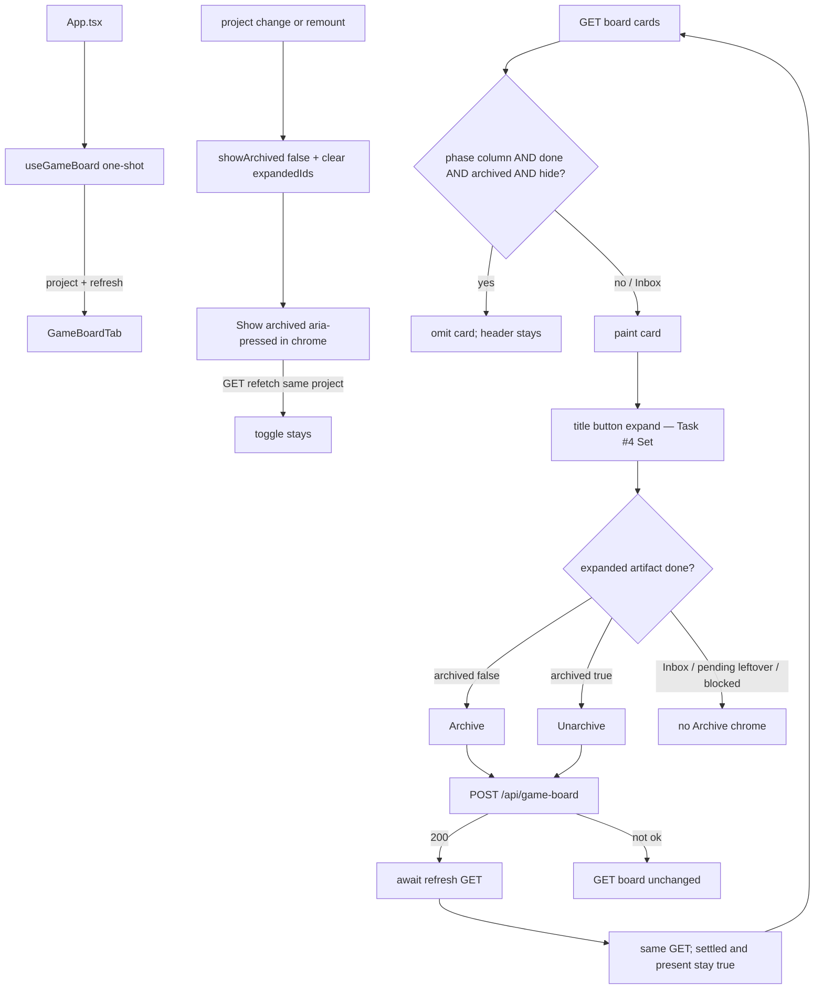

# Task #5 — Archive UI + refresh + remaining Vitest
Reading time: 2-3 min
Last updated: 2026-08-31 — spec-012-m2k-game-expand-archive-deps | Path=full | Patterns: ✓

## What changed (plain language)

On Game, a done artifact can be archived from its expanded card. The card leaves the phase column on a fresh visit. Show archived sits in the pane chrome (not Inbox, not a fifth column) and reveals those cards for this visit only. Switching project or remounting starts hidden again. There is no remembered preference.

Archive and Unarchive POST the flag, then wait for the same GET refresh so a later paint cannot bring the card back. That refresh never flips the Game tab off. Unarchive while hide is on still shows the card. Inbox is never filtered. A leftover archived flag on a pending card stays visible and has no Archive control. No confirm dialog.

## Files modified

`SpecBoardTab.tsx` / `useSpecBoard` / `useSddSkillPresent` / `colors.ts` / C / constitution were not this task. `i18n.ts` / `types.ts` already had archive strings and `archived` (Task #4); this task reuses them.

| File | What it does | Lines ± |
|---|---|---|
| `graph-ui/src/hooks/useGameBoard.ts` | `refresh(): Promise<void>` same GET; never sets `settled`/`present` false | 219. Interface `:23`; refresh `:160-176`; return `:218` |
| `graph-ui/src/App.tsx` | Pass `project` + `refresh` into `GameBoardTab`; one-shot settled gate stays | 187. Hook `:30-35`; mount `:170` |
| `graph-ui/src/components/GameBoardTab.tsx` | Show archived chrome; phase filter; Archive/Unarchive POST then `await refresh()` | 455. Filter `:60-62`; eligibility `:64-67`; persist `:393-406`; toggle `:375-382`, `:423-432`; Inbox unfiltered `:441` |
| `graph-ui/src/components/GameBoardTab.test.tsx` | Archive hide / session toggle / unarchive / leftover pending / header-only / Inbox / refresh-keeps-toggle / Function hex | 1515. Archive `:1233`; session `:1272`; unarchive `:1309`; leftover `:1357`; header-only `:1385`; Inbox `:1419`; project vs refetch `:1479`; hex `:1512` |
| `graph-ui/src/hooks/useGameBoard.test.ts` | refresh re-GET; 500 keeps settled+present | 328. Happy `:270`; 500 `:309` |
| `graph-ui/src/App.test.tsx` | Show archived in Game chrome; silent-win / Enter Graph / leftover `tab=specs`→game / no skill-presence stay | 1216. Chrome `:1127`; skill-presence `:1164`; Enter `:1185`; leftover specs `:1199` |

## Key decisions

| Decision | Why | ADR |
|---|---|---|
| `refresh` is the same GET; never `setSettled(false)` / `setPresent(false)` | Silent-win in-flight omits Game; Archive must not unmount the pane | SDD-ADR-054 |
| `showArchived` `useState(false)`; reset with `expandedIds` on `?project=` / remount; GET refetch does not reset | Same session rule as Specs; no localStorage | SDD-ADR-054; spec-006 SDD-ADR-032 |
| Show archived in pane chrome, not Inbox header, not a fourth column | Game has phase columns, not a Done column | US-004; tasks.md DoD |
| Filter `work_state==="done" && archived && !showArchived`; Inbox never | Hide only archived done; leftover pending stays | US-003 / US-004 |
| Archive only expanded done && !archived; Unarchive only expanded done && archived | Same eligibility as Specs Done; Inbox never | US-003 |
| POST `/api/game-board` `{project, card_id, archived}` then `await refresh()` | Flag-object 200 is not the board; no poll on game-board | SDD-ADR-053, SDD-ADR-054 |
| No `window.confirm` / dialog / alertdialog | Archive is not delete; recovery is Unarchive | grill ADR-009; VI.3 N/A |
| Reuse `specBoard.archive` / `unarchive` / `showArchived` | EN already matches Gherkin | SDD-ADR-057 |
| Invert leftover UI Thens; keep silent-win / Enter Graph / `tab=specs`→game / no `/api/skill-presence` / Function `#06b6d4` | Last impl task; do not weaken spec-010/011 | IX.2; III.2 |

## How session toggle, phase filter, POST, and refresh run

Empty phase with every card archived and hide on → header only; Show archived stays in chrome. Unarchive while hide → card stays visible because it is no longer archived. Refresh 500 leaves the pane mounted.

## Debugging

| If this fails | File:line | Cause | Fix |
|---|---|---|---|
| Archived done still visible on first paint | `GameBoardTab.tsx:60-62`, `:375`, `:441` | Filter missed `work_state==="done"`, or toggle defaulted on | `visiblePhaseCards` hides done+archived when `!showArchived`. `useState(false)`. Test `:1272` |
| Show archived still pressed after remount / project change | `GameBoardTab.tsx:378-382` | State leaked or localStorage added | Reset with `expandedIds`. Tests `:1272` / `:1479` |
| GET refetch after POST resets the toggle | `GameBoardTab.tsx:378-382`; `useGameBoard.ts:160-176` | New `board` treated as remount, or refresh unmounted the pane | Reset only when `project` changes. Test `:1479` |
| Game tab vanishes after Archive | `useGameBoard.ts:160-176`, `:174` | `refresh` set `settled`/`present` false | Refresh must not unset. Tests `useGameBoard.test.ts:270` / `:309` |
| Archive opened a confirm / dialog | `GameBoardTab.tsx:393-406`, `:188-212` | `window.confirm` or a modal leaked | No confirm. Test `:1233` / `:1261-1263` |
| Archive on Inbox / pending / blocked | `GameBoardTab.tsx:64-67`, `:341-348` | Eligibility not done-artifact | Inbox is `InboxCard` (no persist). Leftover pending shows, no chrome. Tests `:1357` / `:1419` / `:1445` |
| After POST 200 the card is still visible (hide on) | `GameBoardTab.tsx:401-402` | `refresh` not awaited, or live mock did not set `archived` | `if (!res.ok) return; await refresh()`. Test `:1233` |
| Unarchive while hide still hides the card | `GameBoardTab.tsx:60-62` | Filter used a stale `archived` true | After refresh the card is false. Test `:1309` |
| Inbox archived epic disappeared | `GameBoardTab.tsx:441` | Inbox passed through `visiblePhaseCards` | Inbox uses `board.inbox` unfiltered. Test `:1419` |
| All-archived column lost the header or grew a fifth column | `GameBoardTab.tsx:435-449`, `:423-432` | Extra `ColumnKey`, or toggle inside the column | Four keys stay; empty = header only; toggle in chrome. Test `:1385` |
| POST went to `/api/spec-board` | `GameBoardTab.tsx:396-399` | Spec persist copied with spec_id | `{project, card_id, archived}` on `/api/game-board`. Test `:1264-1269` |
| App never POSTs / empty `project` | `App.tsx:170` | Pane not given `selectedProject` + `refresh` | Pass both. Test `App.test.tsx:1127` |
| `/api/skill-presence` in App fetch / Enter opens Game / `tab=specs` stays Specs | `App.tsx` / `route.ts` | Silent-win or leftover path weakened | Stay GET game-board; Enter Graph; leftover specs+gamedev → game. Tests `:1164` / `:1185` / `:1199` |
| Function hex drifted | `colors.ts` (do not edit) | `LABEL_COLORS` or CSS vars leaked | `colorForLabel("Function") === "#06b6d4"`. Test `GameBoardTab.test.tsx:1512` |

## Project fit

- Before: Task #3 HTTP merge + POST. Task #4 title expand + Blocked region. App still did not pass `project`/`refresh`. spec-011 tests locked “activate never archives.”
- After this task: same pane archives done artifacts, session Show archived, phase filter, POST then await refresh without unmounting Game. Silent-win / Enter Graph / leftover `tab=specs` stay.
- Next: @review then @tester. Last impl task — Trigger A (NOT closeprep). Closeprep waits for @tester PASS.

## Pattern Notes

Patterns: ✓.

- Session Show archived like Specs (`SpecBoardTab.tsx:292`, `:273-278`): `useState(false)`, reset with `expandedIds` on project change, no localStorage. GET refetch does not reset (same as spec-006 poll must not reset).
- POST then `await refresh()` like Specs persist (`SpecBoardTab.tsx:321-333`): `if (!project) return`; `if (!res.ok) return`; `await refresh()`; catch keeps GET as truth. Body uses `card_id` on `/api/game-board` (SDD-ADR-053), not `spec_id` on spec-board.
- No `window.confirm` / dialog (grill ADR-009; VI.3 is delete-only).
- No fourth column. Four phase headers stay. Empty archived phase = header only (spec-011 empty rule). Show archived lives in pane chrome because Game has no Done header — DoD, not a second archive pattern.
- Filter is the same hide rule with Game’s `work_state==="done"` instead of Specs `column==="done"`. Inbox never filtered (Specs never filters Todo). Leftover archived on pending stays; no Archive/Unarchive.
- `refresh` must not unset `settled`/`present` (SDD-ADR-054). Specs has no silent-win gate; this is the same “don’t flash the board away” idea, not a second refresh style.
- i18n reuse `specBoard.archive` / `unarchive` / `showArchived` (SDD-ADR-057). Chrome tokens `text-foreground/40` / `/35` / `/70`. No new CSS (II.2, III.1).
- `useGameBoard` stays one-shot (no `setInterval`). Vitest + fetch mock (V.1/V.4). Breadcrumbs on `GameBoardTab.tsx`, `useGameBoard.ts`, `App.tsx`, and the three test files (VII.2). `i18n.ts` / `types.ts` unchanged this task (still Task #4 stamps).

Constitution has I–IX only (no Section X). IX.2 still describes spec-011 no expand/archive/POST — true until close appends this spec. Not a gap this task.

## Quick refs

- Spec US-003 / US-004 / US-006 (UI): `.sdd-skill/specs/spec-012-m2k-game-expand-archive-deps/spec.md`
- Plan UI + refresh: same folder `plan.md`
- ADR: SDD-ADR-054 (one-shot + refresh; never unset settled); SDD-ADR-053 (POST flag object); SDD-ADR-057 (i18n reuse); spec-006 SDD-ADR-032 (session Show archived; await GET)
- Tests: `cd graph-ui && npx vitest run` → 260 passed
- Constitution: II.2–3, III.1–2, IV.3, V.1/V.4, VI.3 N/A, VII.1–2, VIII (no poll), IX.2 (silent win / four columns stay; archive supersedes spec-011 lock at close)
