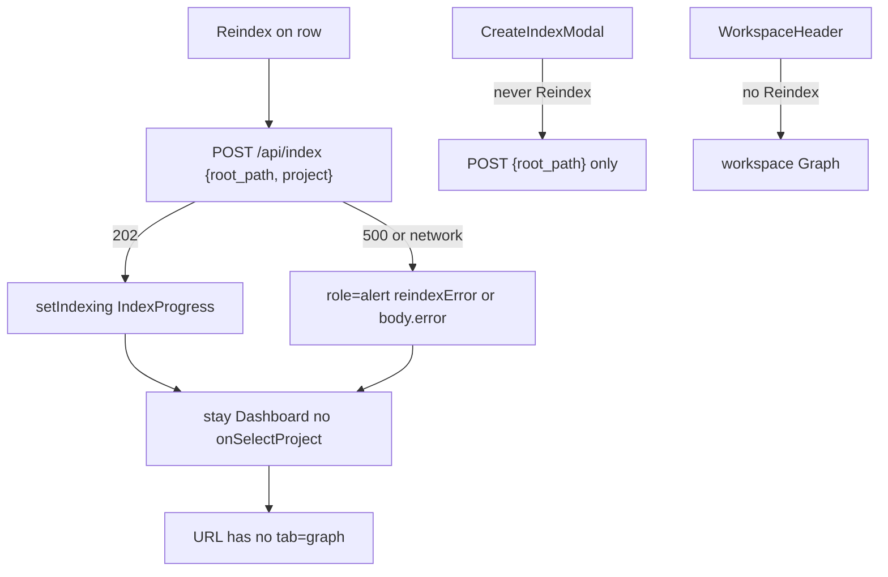

# Task #5 — Dashboard Reindex + i18n + remaining Gherkin
Reading time: 2-3 min
Last updated: 2026-08-29 — spec-003-h7q-path-project-identity | Patterns: ✓

## What changed (plain language)

Every Dashboard row — including each name inside a Path conflict — now has Reindex. That button refreshes the existing project: it sends the folder path plus that row’s name, shows the same progress banner as a new index, and stays on Dashboard. It never opens Graph and never invents a second project.

If the server fails (HTTP 500), a red error line appears, the row stays, and you are still on Dashboard. The create modal and the workspace header do not get Reindex. English and Chinese copy for the button, the failure line, name collision, conflict, and the “already indexed” notice is in the same catalog as the rest of the UI.

## Files modified

| File | What it does | Lines ± |
|---|---|---|
| `graph-ui/src/components/Dashboard.tsx` | Per-row Reindex; 202 → IndexProgress; 500 → alert; stay home | ~+70 |
| `graph-ui/src/components/Dashboard.test.tsx` | Reindex happy, `custom`, 500, conflict-member body | ~+115 |
| `graph-ui/src/App.test.tsx` | Same Gherkin through App; no header Reindex | ~+80 |
| `graph-ui/src/lib/i18n.ts` | `reindex`, `reindexError`, `nameExists` en+zh | +6 |
| `graph-ui/src/lib/i18n.test.ts` | Locks Reindex / error / nameExists / conflict / notice | +6 |
| `graph-ui/src/components/CreateIndexModal.tsx` | `name_exists` i18n fallback; still no Reindex | ~+4 |
| `graph-ui/src/components/CreateIndexModal.test.tsx` | Asserts modal has no Reindex control | +1 |
| `graph-ui/src/components/WorkspaceHeader.test.tsx` | Asserts header has no Reindex | +10 |

`App.tsx` and `WorkspaceHeader.tsx` were not given a Reindex control. Breadcrumbs Task #5 on Dashboard, i18n, App.test, CreateIndexModal. `CreateIndexModal.test.tsx` still says Task #4; `WorkspaceHeader.test.tsx` still says Task #2.

## Key decisions

| Decision | Why | ADR |
|---|---|---|
| POST `{root_path, project}` never `project_name` | `project` is the reindex key; create modal stays path-only | SDD-ADR-015 |
| 202 → `setIndexing(true)` + `refresh`; no `onSelectProject` | IndexProgress on Dashboard; URL stays `?tab=dashboard` | US-002 / US-007 |
| 500 → `role="alert"`; no `refresh`; no navigate | Visible error; row remains; same banner as list error | US-007 |
| Reindex on every member, not the group | Conflict clones refresh that name’s store | US-007 |
| No Reindex on header or create modal | Create is never a reindex; workspace Reindex is out of spec | spec default 2 |
| `nameExists(name)` in i18n; modal uses body.error first | US-006 stay-in-modal copy locked en+zh | II.3 |

## How Reindex is handled

## Debugging

| If this fails | File:line | Cause | Fix |
|---|---|---|---|
| Reindex opens Graph | `Dashboard.tsx:47-73` / `261-268` | `onSelectProject` wired on the button | Call `reindexProject` only; Enter is the other button (line 256) |
| POST body has `project_name` or no `project` | `Dashboard.tsx:53` | Wrong key | `JSON.stringify({ root_path: p.root_path, project: p.name })` |
| 202 is silent (no banner) | `Dashboard.tsx:55-57` / `81-83` | `setIndexing` skipped | On 202 set `indexing` true then `refresh`; `IndexProgress` mounts when `indexing` |
| 202 still navigates | `App.test.tsx:484` / `Dashboard.tsx:205` | App treated Reindex like `onPathExists` | Reindex must not call `openExistingProject`; create 202 is `onCreated` only |
| 500 drops the row | `Dashboard.tsx:60-69` | `refresh()` on error | Do not refresh on non-202; `setReindexError` only |
| 500 has no visible text | `Dashboard.tsx:76` / `104-107` | Error not merged into `listError` | `listError = error \|\| reindexError`; `role="alert"` |
| Empty 500 body shows nothing | `Dashboard.tsx:60-68` | JSON parse required | Fallback `t.projects.reindexError` when body has no `error` |
| Conflict member Reindex missing | `Dashboard.tsx:160-167` | Only solo card got the control | Each `group.members` row has `aria-label={t.projects.reindex}` |
| `getByRole` cannot find Reindex | `i18n.ts:51` | Copy drifted | en must be exactly `"Reindex"`; zh `"重新索引"` (line 150) |
| Reindex on workspace header | `WorkspaceHeader.tsx` (whole file) | Control added to chrome | Header is leave + name + time only; App.test line 533 |
| Create modal sends `project` or shows Reindex | `CreateIndexModal.tsx:124` | Reindex leaked into create | Body `{ root_path: path }` only; no Reindex button (test line 74) |
| `name_exists` toast is English-only | `i18n.ts:75` / `174` | Hardcoded string | `nameExists(name)` en+zh; modal fallback at `CreateIndexModal.tsx:133-136` |
| Function nodes went gray | `graph-ui/src/lib/colors.ts` | Palette edit | `colorForLabel("Function")` must stay `#06b6d4` |

## Project fit

- Before: Task #2 admitted `{root_path, project}` as reindex on the wire. Task #3 grouped leftovers. Task #4 made create redirect on `path_exists`. The only UI path to `/api/index` was the create modal (`{root_path}` only), so an operator could not refresh a named row without risking a second identity.
- After: Dashboard Reindex is the UI reindex. Create stays path-only. 202 stays home with IndexProgress. 500 stays home with an alert. Header and modal have no Reindex.
- Next: @review Task #5, then @tester. Trigger B (PROJECT-OVERVIEW + spec-summary) waits for all tasks + tester + human confirmation.

## Quick refs

- Spec US-002 / US-007: `.sdd-skill/specs/spec-003-h7q-path-project-identity/spec.md`
- Plan: `.sdd-skill/specs/spec-003-h7q-path-project-identity/plan.md`
- ADR: SDD-ADR-015 (HTTP `project` is reindex; never create a new name)
- Tests: `cd graph-ui && npx vitest run src/components/Dashboard.test.tsx src/App.test.tsx src/lib/i18n.test.ts src/components/CreateIndexModal.test.tsx src/components/WorkspaceHeader.test.tsx`
- Constitution: II.3 i18n en+zh; IV.2 create still no `project_name`; IV.3 no new endpoint; VII accessible name + breadcrumbs; IX.1 stay on `?tab=dashboard`; IX.2 this spec owns Reindex vs create. No Section X in the draft file.
