# Task #5 — Remaining Vitest Gherkin mapping
Reading time: 2-3 min
Last updated: 2026-08-31 — spec-011-q5n-game-phase-board | Path=full | Patterns: ✓

## What changed (plain language)

Leftover Game-phase UI Thens now live in Vitest. Phase `01` and `03` highlight the matching column; Done and Blocked paint as English labels; an unconverted Inbox epic can sit beside a SYS card; empty or non-current columns stay visible (no dim). Chrome continue stays a `
` even when card continue is a button.

App fetch never hits `/api/skill-presence`. Game-board and spec-board stay GET-only from this pane. Inbox cards come from GET `/api/game-board` `inbox`, not spec-board `epics`. Silent win, Enter→Graph, and leftover `tab=specs`→game stay green on a filled board. `colorForLabel("Function") === "#06b6d4"` stays locked in the suite run.

Product strip, pane, parse, and C did not change this task.

## Files modified

Working-tree product files stay Tasks #1–#4. This task is test-only. `git diff --numstat` vs last commit still includes earlier product; this task grew leftover Thens + fetch-log helpers.

| File | What it does | Lines ± |
|---|---|---|
| `graph-ui/src/App.test.tsx` | Filled-board activate; inbox not spec-board; GET zero-write UI; Enter Graph / leftover specs→game stay | 1197 (was 991 Task #3; +206). Helpers `filledBevyBoard` `:90`; `assertGetOnlySkillBoards` `:138`; leftover describe `:1081` |
| `graph-ui/src/components/GameBoardTab.test.tsx` | Leftover pane Thens: 01/03 aria-current, Done/Blocked, no dim, sit-beside, chrome `
` | 766 (was 641 Task #4; +125). Leftover its `:642-765` |
| `graph-ui/src/hooks/useGameBoard.test.ts` | Leftover GET zero-write UI half; one-shot + no skill-presence stay | 207 (was 206; breadcrumb + GET method `:43`). No poll `:117` |
| `graph-ui/src/lib/i18n.test.ts` | Leftover lock Inbox + work-state EN/zh; phase headers spec-010 | 108 (count unchanged). Locks `:97-106` |
| `graph-ui/src/lib/colors.test.ts` | `colorForLabel("Function") === "#06b6d4"` lock (run, not edited) | 0 |

No C change. No Playwright. No `/api/skill-presence`. `App.tsx` / `GameBoardTab.tsx` / `useGameBoard.ts` stay Task #4 / spec-010. `useSddSkillPresent` still spec-009. GraphTab stays mocked.

## Key decisions

| Decision | Why | ADR |
|---|---|---|
| Leftover pane Thens in `GameBoardTab.test.tsx` | #3 owned 02-production highlight + Pending/In progress; #5 owns 01/03, Done/Blocked, sit-beside, no dim, chrome `
` with card buttons | plan leftover #5; US-001; US-002; US-006 |
| Filled-board App its use `filledBevyBoard()` | Empty-dir `gameBoard: "true"` stays `emptyGameBoard(true)`. Filled GET must paint cards without weakening silent win | SDD-ADR-042; US-003; US-005 |
| Inbox from game-board, not spec-board `epics` | US-003: one poll URL. Spec leftover epic must not appear on Game | SDD-ADR-046 |
| afterEach + dedicated + filled GET-only assert | Hook unit already bans skill-presence; App must prove no path on silent-win, grill-only, and filled board; boards stay GET | US-005; US-006; SDD-ADR-043; SDD-ADR-050 |
| Default `gameBoard ?? "false"` unchanged | spec-009 grill-only / neither / spec-board 500 must stay green | plan Testing; SDD-ADR-041 |
| Function hex asserted in the suite run, not this file | Chrome Game must not leak into GraphTab | constitution III.2 |
| English assertions; no Playwright | Same fetch-mock as Tasks #3/#4; IX.4 optional E2E | II.3, V.1, V.4 |

## How leftover Gherkin maps to Vitest

```mermaid
flowchart TB
  G1["01/03 aria-current"] --> V1["GameBoardTab.test.tsx:642"]
  G2["Done / Blocked labels"] --> V2["test.tsx:659"]
  G3["no dim / hide non-current"] --> V3["test.tsx:687"]
  G4["sit-beside Inbox + SYS"] --> V4["test.tsx:708"]
  G5["chrome continue stays p"] --> V5["test.tsx:741"]
  G6["activate Game paints GET cards"] --> V6["App.test.tsx:1090"]
  G7["Inbox from game-board not spec-board"] --> V7["App.test.tsx:1115"]
  G8["Error GET no skill-presence UI half"] --> V8["App.test.tsx:1145"]
  G9["Enter Graph on filled board"] --> V9["App.test.tsx:1166"]
  G10["leftover tab=specs → game filled"] --> V10["App.test.tsx:1180"]
  After["afterEach fetch log"] --> A1["routing :327"]
  After --> A2["spec-009 :740"]
  After --> A3["spec-010 :829"]
  After --> A4["spec-011 :1082"]
  Ded["dedicated silent-win + grill-only"] --> V11["App.test.tsx:1046"]
  Hook["GET method + no skill-presence"] --> V12["useGameBoard.test.ts:39 / :117"]
  I18n["Inbox + work-state EN/zh"] --> V13["i18n.test.ts:97"]
  Pal["colorForLabel Function"] --> Lock["colors.test.ts:27"]
  S9["spec-009 grill-only / neither / spec-board 500"] --> Stay["App.test.tsx:748 / :792 / :546"]
  C["GET bytes / conversion / 400 / 404"] --> Cown["test_httpd.c + test_game_board.c Tasks #1/#2"]
```

`filledBevyBoard()` (`:90-127`) is present true + phase `02-production` + gdd / SYS / inbox epic. `assertGetOnlySkillBoards` (`:138-149`) walks every `fetch` URL: no `/api/skill-presence`; game-board and spec-board method GET; no POST. C still owns the byte-identical skill-tree half of the same Error scenario.

## Debugging

| If this fails | File:line | Cause | Fix |
|---|---|---|---|
| 01/03 phase missing `aria-current` | `GameBoardTab.tsx:34-39`, `:188`; `GameBoardTab.test.tsx:642` | Map only handled `02-production` | `01` → Pre-production; `03` → Post-production & Launch. Inbox never. Test `:642-657` |
| Done / Blocked not painted | `GameBoardTab.tsx:47-48`; `i18n.ts`; `GameBoardTab.test.tsx:659` | `workStateLabel` dropped those tokens | `workStateDone` / `workStateBlocked`. Tests `:659-685`, `i18n.test.ts:101-102` |
| Non-current columns dimmed or hidden | `GameBoardTab.tsx:138`, `:181-192`; `GameBoardTab.test.tsx:687` | `opacity` / `hidden` on `!current` | Header stays visible. Test `:687-706` |
| Sit-beside empty (Inbox or SYS missing) | `GameBoardTab.tsx:187`; `GameBoardTab.test.tsx:708` | inbox + production arrays unread | Both paint. Test `:708-738` |
| Chrome continue became a button | `GameBoardTab.tsx:177-179`; `GameBoardTab.test.tsx:741` | Pane `
` replaced | Chrome stays text. Card button is Task #4. Test `:741-765` |
| `/api/skill-presence` appears in App fetch | `App.tsx`; `useGameBoard.ts:104`; `App.test.tsx:315` | App or hook called the unused GET | Presence is GET `/api/game-board` only. afterEach `:327` / `:740` / `:829` / `:1082`. Dedicated `:1046-1078`. Filled `:1145-1164` |
| Game Inbox shows a spec-board epic | `App.test.tsx:1115`; `App.tsx` `showGame` | Inbox read `epics[]` | Game pane uses game-board `inbox` only. Test `:1115-1143` |
| POST `/api/game-board` or `/api/spec-board` from Game | `App.test.tsx:138-149` | Mutate on activate | Boards stay GET. Tests `:1112`, `:1142`, `:1162` |
| Enter opens Game on a filled board | `App.tsx` navigate graph; `App.test.tsx:1166` | Default tab changed | Enter stays Graph. Test `:1166-1178` |
| `tab=specs` + filled gamedev stays Specs | `route.ts` `resolveWorkspaceTab`; `App.test.tsx:1180` | Silent-win skipped | Leftover specs + gamedev → `tab=game`. Test `:1180-1196` |
| spec-009 grill-only hides Specs or shows Game | `App.test.tsx:207`, `:748`; `App.tsx` | Default mock present true | Keep `gameBoard ?? "false"`. Tests `:748` / `:792` / `:546` |
| Function hex drifted | `colors.test.ts:27` | `LABEL_COLORS` or CSS vars leaked | `colorForLabel("Function") === "#06b6d4"` |

## Project fit

- Before: Task #1 GET objects. Task #2 Inbox + conversion + C bytes. Task #3 four columns + cards. Task #4 clipboard / no-drag / typed parse. Leftover: 01/03 highlight, Done/Blocked, sit-beside pane, chrome `
` with card buttons, App filled-board paint, no skill-presence log on filled GET, Inbox not from spec-board.
- After this task: every leftover UI Then has a Vitest owner. spec-010 silent-win / Enter Graph / leftover `tab=specs`→game stay green. spec-009 grill-only / neither / GET 500 stay green. Graph Function hue still locked. Product files unchanged.
- Next: @review then @tester. This is the last impl task — closeprep waits until @tester PASSes Task #5, then @human-trainer Trigger B (not this step). Do not write spec-summary or PROJECT-OVERVIEW here.
- Live UI: implementer did not browser-click. Proof is Vitest (238 graph-ui). Constitution IX.4 / V.1 make Playwright optional at DEVELOPMENT.

## Pattern Notes

Patterns: ✓. Test-only mapping (same leftover-Then pattern as spec-010 Task #5 / spec-008 Task #4). Product complete in #3/#4; this task does not weaken silent win: filled-board Enter Graph `:1166`, leftover `tab=specs`→game `:1180`, hide Specs `:1111`. Default `gameBoard` 200 present false; grill-only `:748`, neither `:792`, spec-board 500 `:546` still omit/show as before. No Playwright. One-shot GET `/api/game-board` + GET `/api/spec-board`; never `/api/skill-presence` (V.1, IV.3, SDD-ADR-043, SDD-ADR-050). English Then text (II.3). GraphTab mock kept (V.4). `colorForLabel("Function") === "#06b6d4"` locked in-suite (`colors.test.ts:27`) (III.2). Breadcrumbs on implementer files `App.test.tsx`, `GameBoardTab.test.tsx`, `useGameBoard.test.ts`, `i18n.test.ts` (VII.2). Product breadcrumbs stay Task #4 (`App.tsx` spec-010, `useGameBoard.ts`, `GameBoardTab.tsx`). No new CSS (II.2). No new i18n key. C Gherkin not duplicated. No second presence source.

Breadcrumbs on `App.test.tsx` (lines 1-7): `@sdd-task` Task #5 Remaining Vitest Gherkin mapping; `@sdd-spec` spec-011-q5n-game-phase-board; `@sdd-decision` SDD-ADR-046, SDD-ADR-050; `@sdd-why` leftover UI Thens; App fetch log never `/api/skill-presence`; GET zero-write UI half; `@human-debug` skill-presence URL → App/useGameBoard fetched unused GET; spec epic on Game → inbox not from game-board.

Breadcrumbs on `GameBoardTab.test.tsx` (lines 1-7): `@sdd-task` Task #5; `@sdd-decision` SDD-ADR-046, SDD-ADR-050, SDD-ADR-051; `@sdd-why` leftover pane Thens — 01/03 aria-current, Done/Blocked, sit-beside, chrome p, no dim; `@human-debug` 01/03 highlight fails → `columnIsCurrent` map; sit-beside empty → inbox+production unread.

Breadcrumbs on `useGameBoard.test.ts` (lines 1-7): `@sdd-task` Task #5; `@sdd-decision` SDD-ADR-050; `@sdd-why` leftover GET zero-write UI half; one-shot + no skill-presence stay.

Breadcrumbs on `i18n.test.ts` (lines 1-7): `@sdd-task` Task #5; `@sdd-decision` SDD-ADR-046; `@sdd-why` leftover i18n lock Inbox + work-state EN/zh stay.

Constitution has I–IX only (no Section X). IX.2 still describes spec-010 empty column arrays. The filled-column + leftover-Then sentence waits for spec close (plan note for @planner). No constitution gap this task.

## Quick refs

- Spec US-001–US-006 leftover UI Thens: `.sdd-skill/specs/spec-011-q5n-game-phase-board/spec.md`
- Plan Gherkin → owner: `.sdd-skill/specs/spec-011-q5n-game-phase-board/plan.md` (Error GET skill-trees = #2 C + #5 App; leftover UI = #5)
- ADR: SDD-ADR-043 (presence GET game-board only); SDD-ADR-046 (Inbox walk local); SDD-ADR-050 (one-shot); SDD-ADR-051 (chrome `
` / card button)
- Tests: `cd graph-ui && npx vitest run` (238 passed)
- Gherkin owners: leftover pane + no skill-presence UI → this file; columns/cards → Task #3; copy/drag/parse → Task #4; GET bytes / conversion → Tasks #1/#2 C
- Constitution: I.1, II.3, III.2, V.1/V.2/V.4, VII.2, IX.4
