# Task #5 — Remaining Vitest Gherkin mapping
Reading time: 2-3 min
Last updated: 2026-08-31 — spec-010-c4h-game-tab-silent-win | Path=full | Patterns: ✓

## What changed (plain language)

Leftover Game-tab Thens now live in Vitest. An empty `.gamedev/` folder (present true, no `state.md`) still shows the Game tab; opening it shows "state.md missing" plus `/gamedev-skill continue`, not phase labels. App fetch never hits `/api/skill-presence` — checked after every spec-009 / spec-010 strip test and in a dedicated silent-win + grill-only case. The Game pane still paints no columns, cards, launcher, or gate-review.

Product strip, pane, and dual fetch did not change this task. spec-009 grill-only / neither / spec-board 500 stay green on the default game-board 200 present false mock.

## Files modified

Working-tree `GameBoardTab.test.tsx` is untracked (Task #3 created it; Task #5 grew leftover pane Thens). `App.test.tsx` grew helpers + afterEach + two leftover its. `git diff --numstat` vs last commit still includes Tasks #2–#4 product; this task is test-only.

| File | What it does | Lines ± |
|---|---|---|
| `graph-ui/src/App.test.tsx` | Empty-dir tab+chrome; afterEach + dedicated no `/api/skill-presence` | 990 total (~+73 from Task #4 917). Helpers `:228-237`; spec-009 afterEach `:652-653`; spec-010 afterEach `:741-742`; empty-dir `:928`; skill-presence `:957` |
| `graph-ui/src/components/GameBoardTab.test.tsx` | Leftover pane Thens: no columns/cards/launcher/gate-review | 142 total (~+15 from Task #3 127). Chrome `:78-83`; missing `:105-112`; arrays `:115-141` |
| `graph-ui/src/lib/colors.test.ts` | `colorForLabel("Function") === "#06b6d4"` lock (run, not edited) | 0 |

No C change. No i18n. No Playwright. `App.tsx` / `GameBoardTab.tsx` / `useGameBoard.ts` stay Task #4 / #3. `useSddSkillPresent` still spec-009. GraphTab stays mocked.

## Key decisions

| Decision | Why | ADR |
|---|---|---|
| Empty-dir tab Then in App; pane Thens also in App after activate | Task #3 owned missing-state chrome only; Task #4 owned present-true tab, not empty-dir activate | plan leftover #5; US-001 |
| `gameBoard: "true"` is `emptyGameBoard(true)` (phase/focus null) | Empty dir = present + no `state.md`. Production chrome stays Task #3 fixture | SDD-ADR-042; US-003 |
| afterEach + dedicated fetch-log assert | Hook unit already bans skill-presence; App must prove no path on silent-win and grill-only | US-001; US-005; SDD-ADR-043 |
| Pane leftover Thens stay in `GameBoardTab.test.tsx` | Do not paint `inbox` / phase arrays even if GET keys carry cards | SDD-ADR-042; grill ADR-009 |
| Default `gameBoard ?? "false"` unchanged | spec-009 grill-only / neither / spec-board 500 must stay green | plan Testing; SDD-ADR-041 |
| Function hex asserted in the suite run, not this file | Chrome Game must not leak into GraphTab | constitution III.2 |
| English assertions; no Playwright | Same fetch-mock as Tasks #3/#4; IX.4 optional E2E | II.3, V.1, V.4 |

## How leftover Gherkin maps to Vitest

```mermaid
flowchart TB
  G1["Limit empty-dir: Game tab + state.md missing chrome"] --> V1["App.test.tsx:928"]
  G2["Error GET does not write: graph-ui no skill-presence"] --> V2["App.test.tsx:957"]
  After["afterEach fetch log"] --> A1["spec-009 :652"]
  After --> A2["spec-010 :741"]
  G3["Chrome: no Inbox/Todo/In Progress/Done / gate-review / launcher"] --> V3["GameBoardTab.test.tsx:60"]
  G4["Missing-state: no phase labels / launcher / gate-review"] --> V4["test.tsx:86"]
  G5["Arrays not painted even when GET keys carry cards"] --> V5["test.tsx:115"]
  G6["Strip a11y Game + Graph then Game then ADR"] --> V6["App.test.tsx:749 and :938"]
  Pal["colorForLabel Function"] --> Lock["colors.test.ts:27"]
  S9["spec-009 grill-only / neither / spec-board 500"] --> Stay["App.test.tsx:660 / :704 / :458"]
  C["GET bytes / empty arrays / 400 / 404"] --> Cown["test_httpd.c + test_game_board.c Task #1"]
```

`emptyGameBoard(true)` (`:51-61`) is the empty-dir body: present true, phase/focus null, continue `/gamedev-skill continue`. `gameBoard: "true"` equals that object (`:929-933`). `assertNoSkillPresence` (`:228-232`) walks every `fetch` URL. C still owns the byte-identical skill-tree half of the same Error scenario.

## Debugging

| If this fails | File:line | Cause | Fix |
|---|---|---|---|
| Empty-dir omits Game tab | `App.tsx:35`; `App.test.tsx:51-61`, `:928` | `gameBoard` left default false, or `showGame` ignored present + null chrome | `gameBoard: "true"` → `emptyGameBoard(true)`. `present` is 200 AND `gamedev_skill_present === true`, not "has state.md". Test `:938-953` |
| Empty-dir tab shown but chrome is Production | `App.test.tsx:51-61`, `:928` | Fixture filled `phase`, or used Task #3 production board | `emptyGameBoard(true)` keeps phase/focus null. Assert `:942-947` |
| `/api/skill-presence` appears in App fetch | `App.tsx`; `useGameBoard.ts:69`; `App.test.tsx:228` | App or hook called the unused GET | Presence is GET `/api/game-board` only. afterEach `:652` / `:741`. Dedicated silent-win + grill-only `:957-988` |
| Columns / cards / launcher / gate-review in Game pane | `GameBoardTab.tsx:28-43`; `GameBoardTab.test.tsx:115` | JSX mapped `inbox` / phase arrays, or continue wrapped in `<button>` | Do not read arrays. Continue is `
`. Tests `:78-83` / `:105-112` / `:115-141` |
| spec-009 grill-only hides Specs or shows Game | `App.test.tsx:118`, `:660`; `App.tsx:36` | Default mock present true | Keep `gameBoard ?? "false"`. Tests `:660` / `:704` / `:458` |
| Function hex drifted | `colors.test.ts:27` | `LABEL_COLORS` or CSS vars leaked | `colorForLabel("Function") === "#06b6d4"` |

## Project fit

- Before: Task #1 GET `/api/game-board`. Task #2 URL + strip can name Game. Task #3 pane chrome (unmounted then mounted in #4). Task #4 dual one-shot, silent win, deep-links, Enter Graph. Leftover: empty-dir tab+chrome in App, App-wide no skill-presence log, pane no columns/cards/launcher/gate-review if not already green.
- After this task: every leftover UI Then has a Vitest owner. spec-009 grill-only / neither / GET 500 stay green. Graph Function hue still locked. Product files unchanged.
- Next: @review then @tester. This is the last impl task — closeprep waits until @tester PASSes Task #5, then @human-trainer Trigger B (not this step). Do not write spec-summary or PROJECT-OVERVIEW here.
- Live UI: implementer did not browser-click. Proof is Vitest (211 graph-ui). Constitution IX.4 / V.1 make Playwright optional at DEVELOPMENT.

## Pattern Notes

Patterns: ✓. Test-only mapping (same leftover-Then pattern as spec-008 Task #4 / spec-006 Task #4). spec-009 omit-until not weakened: default `gameBoard` 200 present false; grill-only `:660`, neither `:704`, spec-board 500 `:458` still omit/show as before. No Playwright. One-shot GET `/api/game-board` + GET `/api/spec-board`; never `/api/skill-presence` (V.1, IV.3, SDD-ADR-043). English Then text (II.3). GraphTab mock kept (V.4). `colorForLabel("Function") === "#06b6d4"` locked in-suite (`colors.test.ts:27`) (III.2). Breadcrumbs on implementer files `App.test.tsx` and `GameBoardTab.test.tsx` (VII.2) — see below. Product breadcrumbs stay Task #4 (`App.tsx`, `useGameBoard.ts`) and Task #3 (`GameBoardTab.tsx`). No new CSS (II.2). No new i18n key. C Gherkin not duplicated. No second presence source.

Breadcrumbs on `App.test.tsx` (lines 1-7): `@sdd-task` Task #5 Remaining Vitest Gherkin mapping; `@sdd-spec` spec-010-c4h-game-tab-silent-win; `@sdd-decision` SDD-ADR-043; `@sdd-why` leftover UI Thens; empty-dir tab+chrome in App; fetch log never `/api/skill-presence`; `@human-debug` empty-dir tab missing → showGame ignored present+null chrome; skill-presence URL → App/useGameBoard fetched the unused GET.

Breadcrumbs on `GameBoardTab.test.tsx` (lines 1-7): `@sdd-task` Task #5 Remaining Vitest Gherkin mapping; `@sdd-decision` SDD-ADR-042; `@sdd-why` leftover pane Thens; no columns/cards/launcher/gate-review; `@human-debug` Production missing → phase token / i18n map; launcher button → continue must be text.

Constitution has I–IX only (no Section X). IX.2 still describes spec-009 Specs = sdd OR grill. The AND NOT gamedev sentence waits for spec close (plan note for @planner). No constitution gap this task.

## Quick refs

- Spec US-001–US-006 leftover UI Thens: `.sdd-skill/specs/spec-010-c4h-game-tab-silent-win/spec.md`
- Plan Gherkin → owner: `.sdd-skill/specs/spec-010-c4h-game-tab-silent-win/plan.md` (Error GET skill-trees = #1 C + #5 App; leftover UI = #5)
- ADR: SDD-ADR-043 (presence GET game-board only). Chrome leftover SDD-ADR-042
- Tests: `cd graph-ui && npx vitest run` (211 passed)
- Gherkin owners: empty-dir tab+chrome + no skill-presence → this file; silent-win / deep-links → Task #4; pane chrome → Task #3; GET bytes / empty arrays → Task #1 C
- Constitution: I.1, II.3, III.2, V.1/V.2/V.4, VII.2, IX.4
