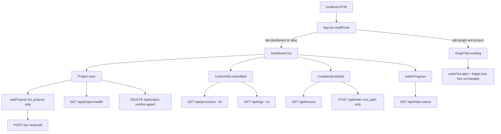

# Technical Plan — Spec-001: Executive Dashboard
Status: Final | Created: 2026-08-29
Spec: spec-001-w3q-executive-dashboard | Mode: ADOPT | Stack: unchanged

## Executive Summary
Account home becomes a single Dashboard screen in graph-ui. `App.tsx` drops the four-tab header (Specs / Graph / Projects / Control). No-query and unknown `?tab=` load Dashboard. `?tab=stats` and `?tab=control` alias Dashboard. `?tab=graph&project=<name>` still mounts today's `GraphTab`. Enter on a row is `navigate("graph", name)`. The Graph header chip returns home (`navigate("dashboard", null)`), replacing `× → stats`.

Dashboard is a vertical stack on one `ScrollArea`: Indexed Projects (identity + freshness + HealthDot + Enter + Delete) then the full current Control panel. `useProjects` stops calling `get_graph_schema`. Create-index posts `{ "root_path" }` only. Chrome tokens in `globals.css` go grayscale. `colorForLabel` and `EdgeLines` hex maps stay byte-identical.

No C change. `Project.indexed_at` is already on `list_projects`. Empty `project_name` on POST `/api/index` already derives the name via `cbm_project_name_from_path` (`application_background_index` omits `"name"` when the UI string is empty). Spec-002/003/004 stay untouched: no workspace tab strip, no Path 1:1, no ADR parse.

## Technology Stack
Unchanged. Do not add packages.

| Component | Tech | Version | Rationale |
| graph-ui | React + react-dom | ^19.0.0 | existing shell |
| graph-ui | TypeScript | ^5.7.0 | existing |
| graph-ui | Vite | ^6.4.3 | existing |
| graph-ui | Tailwind | ^4.1.0 (`globals.css` `@theme`) | chrome tokens live here |
| graph-ui | Vitest + Testing Library | ^4.1.0 / ^16.1.0 | same fetch-mock style as `StatsTab.test.tsx` |
| graph-ui | Three / R3F | ~0.183.0 / ^9.5.0 | GraphTab only; do not retouch canvas |
| engine | C11 daemon + HTTP | Makefile.cbm | existing contracts; no field added |

## System Architecture


Flow:
1. `readRoute()` — `graph` + non-empty `project` → Graph; everything else (missing/unknown/`stats`/`control`/`specs`) → Dashboard with `project` cleared from route state.
2. Dashboard mounts `useProjects` (one `list_projects` RPC) and `ControlTab` (`embedded`).
3. Enter pushes `?tab=graph&project=<name>`. Back pushes `?tab=dashboard` with no `project`.
4. Create-index 202 stays on Dashboard and shows `IndexProgress`. Never `navigate("graph", ...)`.

## Directory Structure
```
graph-ui/src/
  App.tsx                         EDIT — route + header (no account tabs)
  App.test.tsx                    NEW — default URL, aliases, Enter/back, graph deep link
  components/
    Dashboard.tsx                 NEW — list + Control stack
    Dashboard.test.tsx            NEW — rows, empty, error, delete cancel, polls, create-index
    ControlTab.tsx                EDIT — `embedded` skips outer ScrollArea
    CreateIndexModal.tsx          EXTRACT from StatsTab — no Project ID field/state
    IndexProgress.tsx             EXTRACT (keep export + existing tests)
    HealthDot.tsx                 EXTRACT — semantic colors + existing tooltip
    AdrButton.tsx                 EXTRACT — do not import from Dashboard
    AdrButton.test.tsx            MOVE existing ADR delete test here
    StatsTab.tsx                  DELETE after extract (no longer home)
    TabBar.tsx                    DELETE (TD-003)
    GraphTab.tsx                  EDIT chrome surfaces only (`#0b1920` → token)
    SpecBoardTab.tsx              EDIT ProjectPicker for `Project[]` (unrouted)
    ProjectCard.tsx               LEAVE unused — do not mount
  hooks/
    useProjects.ts                EDIT — list_projects only
    useProjects.test.ts           NEW — zero get_graph_schema
  lib/
    types.ts                      EDIT — TabId = "dashboard" | "graph"
    formatIndexedAt.ts            NEW
    formatIndexedAt.test.ts       NEW
    colors.ts                     DO NOT CHANGE
    colors.test.ts                NEW — hex lock
    i18n.ts                       EDIT — enter / lastIndexed / backToDashboard / en+zh
    i18n.test.ts                  EDIT — assert new keys exist
  styles/globals.css              EDIT — grayscale chrome tokens
  components/EdgeLines.tsx        DO NOT CHANGE hex maps
```

C tree: no edits. `@sdd-*` breadcrumbs on every new/substantially edited graph-ui file (constitution VII.2).

## Database Schema
No migration. No new column.

Existing (read-only for this spec), already exposed on `list_projects`:

```
projects (
  name TEXT PRIMARY KEY,
  indexed_at TEXT NOT NULL,   -- ISO 8601; display this; do not invent a twin field
  root_path TEXT
)
```

SQLite files remain `~/.cache/codebase-memory-mcp/<name>.db`. Path uniqueness is spec-003.

## API Contracts
Prefer existing HTTP/MCP. No new endpoints.

### POST /rpc — tools/call list_projects
Request: `{ "jsonrpc":"2.0", "id":n, "method":"tools/call", "params":{ "name":"list_projects", "arguments":{} } }`
Response content text: `{ "projects":[ { "name":"alpha", "root_path":"/tmp/alpha", "indexed_at":"2026-08-29T10:00:00Z" } ] }`
Errors: non-OK HTTP or `json.error` → `useProjects.error` (destructive banner). Control still mounts.

### POST /rpc — get_graph_schema
Forbidden on the Dashboard data path (TD-001). Do not call from `useProjects`, Dashboard, HealthDot, or CreateIndexModal.

### POST /api/index
Request JSON: `{ "root_path": "<selected path>" }` only. No `project_name` key, even empty.
Success: HTTP 202 `{ "status":"indexing", "slot":n }` → close modal, set indexing, stay on Dashboard.
Error: HTTP 400 body `{ "error":"..." }` → modal stays open, show `error` text.

Breadcrumb: Gherkin mocks `{ "error":"not a directory" }`. Live C currently replies `"directory not found"` (`handle_index_start`). Tests mock the Gherkin string. Do not change C to match.

Name derivation (already in C): empty UI name → `application_background_index` does not add `"name"` → `cbm_project_name_from_path`. Spec-001 does not add Path 1:1 reject.

### GET /api/browse, GET /api/index-status, DELETE /api/project?name=, GET /api/project-health
Unchanged. Delete remains `window.confirm` gated (cancel → no fetch).

### GET /api/processes (~3s) and GET /api/logs?lines=200 (~2s)
Unchanged intervals. Initial fetch + interval must keep running while Dashboard is visible (including empty list).

### GET /api/adr
Not called from Dashboard. `AdrButton` may keep calling it if tests render it in isolation.

## Key Decisions
### D1 — Stacked list + Control, one ScrollArea
Context: spec asked stack vs two-pane. Planner default is full Control on the same scroll surface.
Options: (a) vertical stack one ScrollArea (b) two-pane list | Control (c) compact Control teaser.
Decision: (a). List first, then a top border, then full Control (gauges, process grid, 400px logs).
Rationale: Control logs are 400px; a side pane forces nested scroll or clipping. Empty list still shows Control below the CTA.
Consequence: `ControlTab` grows `embedded?: boolean`. When true, no outer `ScrollArea` / no second `max-w-*`. Dashboard owns `ScrollArea` + `max-w-4xl mx-auto p-8`.
→ SDD-ADR-002

### D2 — `indexed_at` visible locale string, UTC, `<time dateTime>`
Context: locale vs raw ISO; must be derived and visible.
Decision: `formatIndexedAt(iso, lang)` via `Intl.DateTimeFormat` (`en-US` / `zh-CN`), `year/month/day/hour/minute`, `timeZone: "UTC"`, `timeZoneName: "short"`. Render `<time dateTime={indexed_at} title={indexed_at}>{formatIndexedAt(...)}</time>`. Invalid ISO falls back to the raw string (still visible).
Rationale: UTC keeps CI deterministic. `dateTime` is the contract instant; visible text is derived (Gherkin: contains a datetime derived from the ISO).
Tests: `formatIndexedAt("2026-08-29T10:00:00Z","en")` is non-empty, includes `2026` and `29`, is not only the raw ISO. DOM: a `time` with `dateTime="2026-08-29T10:00:00Z"`.
Do not assert a single locale phrase in Gherkin tests.
→ SDD-ADR-003

### D3 — Delete `TabBar.tsx` (TD-003)
Context: stub `export {}`; tabs live in `App.tsx`.
Decision: delete the file. Spec-001 has no account tab strip. Spec-002 will add workspace tabs as new code, not revive a dead stub.
→ SDD-ADR-004

### D4 — Prove `colorForLabel("Function")` unchanged
Decision: new `graph-ui/src/lib/colors.test.ts` locks the full `LABEL_COLORS` map and `expect(colorForLabel("Function")).toBe("#06b6d4")`. Add `EdgeLines` lock: `CALLS === "#1DA27E"` and `DEFAULT_EDGE_COLOR === "#1C8585"` (export those two constants or test via a tiny exported `GRAPH_EDGE_PALETTE` object — do not change values). `colors.ts` body stays as-is. Chrome may use `#1DA27E` nowhere except those graph maps + comments.
Do not pass `--color-primary` into `colorForLabel`. Graph loader CSS `#22d3ee` stays (constellation, not chrome).
→ SDD-ADR-005

### D5 — `useProjects` is list-only (TD-001)
Decision: return `{ projects: Project[], loading, error, refresh }`. Drop the per-project `get_graph_schema` loop. SpecBoard `ProjectPicker` maps `Project` (name + path only). If schema is needed later, a new hook — not this spec.
→ SDD-ADR-006

### D6 — Create-index never sends `project_name`
Decision: delete `projectName` state and the Project ID input. `submit` always `JSON.stringify({ root_path: path })`. Rewrite the existing test that posted a custom name.
→ SDD-ADR-007

### D7 — `TabId` shrinks to `dashboard | graph`; aliases in `readRoute`
Decision: `stats` / `control` / `specs` / missing / unknown → `{ tab: "dashboard", project: null }`. Graph requires both `tab=graph` and a project; otherwise Dashboard. First-load `replaceState` writes `?tab=dashboard` without `project`.
Header: brand only on Dashboard. On Graph: brand + selected-project chip + back control (`aria-label` = `t.graph.backToDashboard`). No sibling tabs named Specs, Graph, Projects, or Control.
`?tab=specs` is not account IA (spec-002). Treat as alias → Dashboard. `SpecBoardTab` remains in the tree, unrouted.
→ SDD-ADR-008

### D8 — Chrome tokens grayscale; hardcoded teal surfaces on chrome only
Decision: rewrite `@theme` in `globals.css` (values in SDD-ADR-005). Replace App header / Dashboard / Control / CreateIndexModal / HealthDot tooltip / IndexProgress chrome hex `#0b1920` / `#0e2028` with `bg-card` / `bg-background`. Control `Gauge` healthy fill `#1DA27E` → gray (`#a3a3a3` or `var(--color-primary)`). Keep Gauge >80 `#e05252` and >50 `#eab308`. Keep HealthDot `#34d399` / `#fbbf24` / `#f87171` / `#555`.
GraphTab / NodeDetailPanel / DisplaySettingsMenu `#0b1920` panels are chrome (sidebar/menus), not canvas — swap to `bg-card`. Do not restyle the 3D scene.
→ SDD-ADR-005

## Performance Targets
| Target | Value |
| Dashboard list paint | 0 `get_graph_schema` RPC |
| Control polls | `/api/processes` ~3s, `/api/logs` ~2s (unchanged) |
| New polls | none (no schema poll) |
| C / DB | n/a (no engine change) |
| Coverage | >80% on touched graph-ui files |

HealthDot still calls `/api/project-health` per row (existing). That is not `get_graph_schema`. Leave it.

## Security Considerations
- Loopback UI HTTP unchanged. Do not widen bind/auth.
- Delete stays confirm-gated. Cancel = no `DELETE`.
- Create-index posts only a path the operator browsed; C still applies workspace-root policy.
- No secrets in source. XSS: render project fields as text, not HTML.
- `window.confirm` is the existing delete gate; keep it (Gherkin: dismiss confirm → no DELETE).

## Testing Strategy
Vitest + Testing Library, jsdom, same `fetch` stub style as `StatsTab.test.tsx`. No live daemon for DEVELOPMENT.

Gherkin → test file (every scenario maps to ≥1 test):

| Gherkin scenario | Primary test |
| Default URL opens Dashboard | `App.test.tsx` — no query; "Indexed Projects" or empty CTA; "Control Panel"; no header tabs Specs/Graph/Projects/Control |
| Two projects identity + freshness | `Dashboard.test.tsx` + `useProjects.test.ts` — names, paths, `<time dateTime>`; no aggregate `messages.en.projects.nodes` / `.edges`; no chip "Function"/"Class"; no ADR button; spy 0 `get_graph_schema` |
| Enter then back | `App.test.tsx` — Enter → `tab=graph&project=alpha`; back → Dashboard; list does not require `project=alpha` |
| Create index posts path only | `Dashboard.test.tsx` — body `{root_path:"/home/dev"}`; no `project_name`; no accessible name "Project ID (optional — permanent, cannot be renamed)"; 202 → IndexProgress; URL not `tab=graph` |
| Control polls same screen | `Dashboard.test.tsx` fake timers 3.5s — `/api/processes` ≥2, `/api/logs` ≥2 |
| Zero projects still Control | `Dashboard.test.tsx` — "No indexed projects", "Index your first repository", "Control Panel" |
| `?tab=stats` alias | `App.test.tsx` |
| `?tab=control` alias | `App.test.tsx` |
| Graph deep link + Function color | `App.test.tsx` (mock GraphTab showing project) + `colors.test.ts` `colorForLabel("Function")==="#06b6d4"` |
| list_projects RPC fails | `Dashboard.test.tsx` — destructive region, non-empty error, Control visible |
| index POST fails | `Dashboard.test.tsx` — modal open, "not a directory" |
| delete cancelled | `Dashboard.test.tsx` — stub `confirm` false; "alpha" remains; no DELETE `/api/project?name=alpha` |

Breadcrumbs:
- Do not use `document.body.textContent.includes("nodes")`. HealthDot tooltip may contain "N nodes, M edges, X MB" (existing tooltip — keep). Assert exact i18n standalone labels / roles.
- Mock `GraphTab` in `App.test.tsx` so deep-link tests do not boot Three.
- Rewrite `StatsTab` create-index "custom project name" test; migrate IndexProgress tests with the extract.
- Playwright optional (constitution IX.4). Not required to close DEVELOPMENT.

## Deployment Plan
- UI-only: `cd graph-ui && npm test` then `scripts/build.sh --with-ui` embeds the Vite build as today.
- No DB migration. No daemon flag. No env var.
- Old bookmarks `?tab=stats` / `?tab=control` keep working (alias).

## Risks & Mitigation
| Risk | Probability | Impact | Mitigation |
| Chrome token rewrite desaturates graph | medium | high | lock `colorForLabel` + EdgeLines hex; do not read CSS vars in those maps |
| Gherkin "nodes"/"edges" vs HealthDot tooltip | medium | test flake | exact i18n queries, not raw textContent |
| Nested ScrollArea kills Control polls visibility | medium | AC miss | `ControlTab embedded` |
| App tests mount GraphTab/Three | medium | timeout | `vi.mock` GraphTab |
| Live C error string ≠ Gherkin | low | confusion | mock Gherkin body; no C edit |
| `?tab=specs` surprise | low | IA leak | alias to Dashboard; SpecBoard unrouted |

## Success Criteria
- [ ] All 6 US + all Gherkin scenarios have a mapped test
- [ ] Zero `get_graph_schema` on Dashboard list path
- [ ] No C diff unless a later proof (none expected)
- [ ] `colorForLabel("Function") === "#06b6d4"` in CI
- [ ] Create-index JSON has no `project_name` key
- [ ] Enter still opens existing GraphTab (no workspace shell)
- [ ] @implementer can execute task-by-task without guessing layout, datetime, or TabBar

## External Integrations & Special Tools
None new. Existing daemon HTTP + MCP `list_projects` only.

| Tool | Type | Purpose | Tasks | Setup | Fallback |
| list_projects via POST /rpc | existing MCP-over-HTTP | project rows | 1, 4 | running daemon in prod; fetch mock in tests | show destructive error, keep Control |
| get_graph_schema | existing MCP | must not run on Dashboard | 1 | n/a | n/a — forbid |
| codebase-memory-mcp graph tools | session MCP | skipped this cycle (`mcp_idx=no`) | — | `/sdd-skill reindex` later | file/grep (this plan) |

## Constitution validation
Checked against `.sdd-skill/docs/constitution.md` (draft — not rewritten):
- II/III: React 19, tokens in `globals.css`, chrome grayscale, graph palette untouched
- IV: no `project_name`, no new endpoint, display existing `indexed_at`
- V: Vitest maps every Gherkin; no C change
- VI: confirm-gated delete, loopback unchanged
- VIII: no Dashboard schema RPC; Control polls kept
- IX: port 9749; `?tab=` + `?project=`; Enter → Graph; no workspace shell

## Implementation breadcrumbs for @implementer
1. Do not send `project_name` even if leftover state exists — delete the state.
2. Do not call `get_graph_schema` from the Dashboard data path.
3. Do not build workspace tabs. SpecBoard stays unrouted.
4. Do not "fix" EdgeLines `#1DA27E` / `#1C8585` to match chrome.
5. `StatsTab` aggregate cards (`t.projects.nodes` / `t.projects.edges`) and label chips must not ship on Dashboard.
6. New Index is page-level only. Rows: Enter + Delete.
7. After first successful index: stay on Dashboard.
8. Header must not render buttons whose accessible name is Specs, Graph, Projects, or Control.
9. Export `useUiLanguage` (or pass lang) so `formatIndexedAt` can use `zh-CN` when UI is zh.
10. Breadcrumb headers on touched files.
