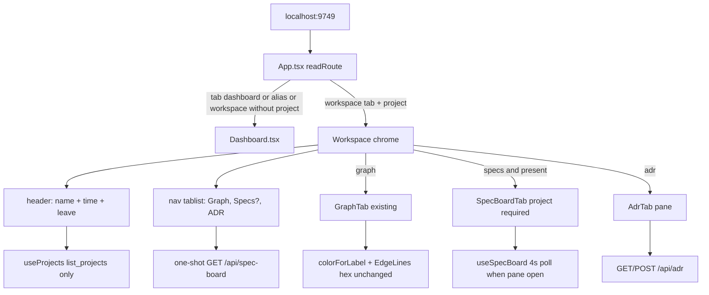

# Technical Plan — Spec-002: Project Workspace
Status: Final | Created: 2026-08-29
Spec: spec-002-p8w-project-workspace | Mode: FEATURE | Stack: unchanged

## Executive Summary
Account home stays Dashboard (spec-001). Enter and `?tab=graph|specs|adr&project=<name>` open a project workspace: brand header (name + last-indexed + leave) plus a tab strip under the header, not inside it. Default pane is GraphTab. Specs is in the strip only after GET `/api/spec-board` returns `sdd_skill_present === true`. ADR is always a full pane that reuses today's GET/POST `/api/adr` blob. The AdrButton modal is deleted.

No C change. `GET /api/skill-presence` already exists and is cheaper; it is out of contract — presence is the spec-board field. Live spec-board JSON is `{ "sdd_skill_present": bool, "specs": [...] }` (not Gherkin's illustrative `columns` object). Tests mock the live shape.

SDD-ADR-008 is partially superseded: `?tab=specs` without `project=` still aliases Dashboard; `?tab=specs&project=` is now a workspace tab (fallback to Graph while Specs is omitted).

## Technology Stack
Unchanged. Do not add packages.

| Component | Tech | Version | Rationale |
| graph-ui | React + react-dom | ^19.0.0 | existing shell |
| graph-ui | TypeScript | ^5.7.0 | existing |
| graph-ui | Vite | ^6.4.3 | existing |
| graph-ui | Tailwind | ^4.1.0 (`globals.css` `@theme`) | spec-001 grayscale tokens |
| graph-ui | Vitest + Testing Library | ^4.1.0 / ^16.1.0 | same fetch-mock style as `App.test.tsx` |
| graph-ui | Three / R3F | ~0.183.0 / ^9.5.0 | GraphTab only; do not retouch canvas |
| engine | C11 daemon + HTTP | Makefile.cbm | existing `/api/adr` + `/api/spec-board`; no field added |

## System Architecture


Flow:
1. `readRoute()` — `graph|specs|adr` + non-empty `project` → that workspace tab. Everything else (missing/unknown/`stats`/`control`/`dashboard`, or any workspace tab without `project`) → Dashboard with `project` cleared.
2. Workspace mounts header + tablist. Graph and ADR tabs always. Specs tab only when a one-shot `/api/spec-board` has returned `sdd_skill_present === true`.
3. While presence is loading, failed, or false: Specs omitted. If the URL is `tab=specs`, `replaceState` to `tab=graph` immediately (do not wait for the request).
4. Leave (×) and workspace tab changes go through `requestNavigate`. If AdrTab is dirty, `window.confirm`; dismiss keeps ADR + draft.
5. Enter from Dashboard is still `navigate("graph", name)`.

## Directory Structure
```
graph-ui/src/
  App.tsx                         EDIT — workspace vs Dashboard; requestNavigate + dirty
  App.test.tsx                    EDIT — workspace Gherkin; keep Dashboard alias cases
  components/
    WorkspaceHeader.tsx           NEW — name + optional <time> + leave
    WorkspaceHeader.test.tsx      NEW — ghost name / no time
    WorkspaceTabStrip.tsx         NEW — Graph | Specs? | ADR; role=tablist
    WorkspaceTabStrip.test.tsx    NEW — order, omit Specs, aria-selected
    AdrTab.tsx                    NEW — full-pane editor (not modal)
    AdrTab.test.tsx               NEW — load/save/empty/error/dirty (move delete case here)
    AdrButton.tsx                 DELETE — modal must not mount anywhere
    AdrButton.test.tsx            DELETE after migrate
    SpecBoardTab.tsx              EDIT — when project set, never ProjectPicker
    SpecBoardTab.test.tsx         NEW or EDIT — no picker copy when project set
    Dashboard.tsx                 LEAVE — still no AdrButton
    GraphTab.tsx                  DO NOT CHANGE canvas / colorForLabel
    EdgeLines.tsx                 DO NOT CHANGE hex
  hooks/
    useProjects.ts                REUSE — workspace header indexed_at
    useSddSkillPresent.ts         NEW — one-shot spec-board; true only on explicit true
    useSddSkillPresent.test.ts    NEW — loading/false/500 omit
    useSpecBoard.ts               LEAVE poll — Specs pane only, not the strip
  lib/
    types.ts                      EDIT — TabId + WORKSPACE_TABS extension point
    route.ts                      NEW — readRoute / routeUrl (testable)
    route.test.ts                 NEW — aliases + workspace tabs
    formatIndexedAt.ts            REUSE
    colors.ts                     DO NOT CHANGE
    i18n.ts                       EDIT — tabs.adr, adr save/error/unsaved, en+zh
    i18n.test.ts                  EDIT — new keys exist
```

C tree: no edits. `@sdd-*` breadcrumbs on every new/substantially edited graph-ui file (constitution VII.2).

## Database Schema
No migration. No new column.

ADR text stays in `project_summaries` via existing `cbm_store_adr_*`. `Project.indexed_at` stays on `list_projects`. Path uniqueness is spec-003. Generated vs manual ADR fence is spec-004.

## API Contracts
Prefer existing HTTP. No new endpoints. Do not call `GET /api/skill-presence` (exists, unused, not the AC source).

### GET /api/spec-board?project=<name>
Used twice:
- Strip presence (one-shot, Task #3): `sdd_skill_present === true` → show Specs. HTTP 4xx/5xx, network fail, or body without `true` → omit. Do not poll.
- Specs pane (`useSpecBoard`, existing 4s poll): Kanban from `specs[]`.

Live 200 body (C `cbm_spec_board_to_json`):
```
{ "sdd_skill_present": true|false, "specs": [ { "id", "title", "column": "todo"|"in_progress"|"done", ... } ] }
```
Absent `.sdd-skill/` is HTTP 200 `{ "sdd_skill_present": false, "specs": [] }`, not an error.
HTTP 400 missing project, 404 project not found, 500 OOM/serialize.

Tests must mock this shape. Ignore Gherkin's `"columns":{"backlog":...}` illustration.

### GET /api/adr?project=<name>
200 `{ "has_adr": true, "content": "<md>", "updated_at": "<iso>" }` or `{ "has_adr": false }` (content omitted).
400 `{ "error": "missing project" }`. Missing store → 200 `has_adr:false`.

### POST /api/adr
Body `{ "project": "<name>", "content": "<markdown>" }`. Empty `content` is the existing Delete action (AdrButton `save("")`). C upserts `""`; it does not call `cbm_store_adr_delete`. A following GET can still be `has_adr:true` with empty content. Do not add a C delete. Do not assert `has_adr:false` after Delete.
200 `{ "saved": true }`. 400 invalid body/json/fields. 423 busy. 500 open/save fail.
AdrTab must treat `!res.ok` as failure (AdrButton today ignores status — that is a bug vs this spec's error scenario).

### POST /rpc list_projects
Unchanged. Workspace header reads `indexed_at` from this list only. Forbidden: `get_graph_schema`, `/api/index-status`, `/api/project-health` for the workspace header field.

### GET /api/skill-presence
Do not call. Spec frozen to spec-board.

## Key Decisions

### D1 — One TabId union; WORKSPACE_TABS is the extension point
Context: spec asked one union vs account/workspace split.
Decision: `TabId = "dashboard" | "graph" | "specs" | "adr"`. Export
```
/** Closed set. Later tabs (gamedev): add the id here and to TabId. No plugin runtime. */
export const WORKSPACE_TABS = ["graph", "specs", "adr"] as const;
export type WorkspaceTabId = (typeof WORKSPACE_TABS)[number];
```
Visibility of Specs is not membership in this list. `stats`/`control` never become TabId values; `readRoute` still aliases them to Dashboard.
Rationale: one `navigate(tab, project)` path; extension is a documented const, not a registry.
Consequence: SDD-ADR-008's "specs always → Dashboard" applies only when `project` is missing.
→ SDD-ADR-009

### D2 — Tab strip lives under the brand header, not inside it
Context: spec-001 `assertNoAccountHeaderTabs` queries `<header>` for Specs/Graph/Projects/Control.
Decision: `<header>` = brand + (workspace: name + optional last-indexed + leave). Sibling `<nav role="tablist">` below for Graph / Specs? / ADR (`role="tab"`, selected = `aria-selected="true"` plus `aria-current="page"`).
Rationale: Gherkin distinguishes "workspace tab" vs "header tab named Projects or Control". Putting Graph inside `<header>` as a button named Graph would break spec-001 tests and the IA rule.
Order: Graph, Specs (if present), ADR. Labels: existing `t.tabs.graph` / `t.tabs.specs` + new `t.tabs.adr`.
→ SDD-ADR-009

### D3 — Specs omit-until-true via one-shot spec-board; fallback immediately
Context: flicker vs disabled placeholder; `/api/skill-presence` exists; `useSpecBoard` polls 4s.
Decision: `useSddSkillPresent(project)` GETs spec-board once. `showSpecs` is true only after a 200 body with `sdd_skill_present === true`. Loading, error, false → omit (not disabled, no `notSddSkill` in the strip). `?tab=specs&project=` while omitted → `replaceState` to `tab=graph` immediately. Later true only adds the tab; do not bounce the user back to Specs. Do not use the 4s poll for the strip (a later 500 would flicker the tab away).
Rejected: `/api/skill-presence` (spec AC names spec-board). Rejected: wait-for-presence before fallback (violates omit-while-loading → Graph URL).
→ SDD-ADR-010

### D4 — New AdrTab pane; delete AdrButton
Context: spec asked lift vs wrap.
Decision: `AdrTab.tsx` is a full-pane editor (textarea + Save + Delete-when-has_adr + visible success/error). Placeholder stays the current English headings string (Gherkin: contains "Architecture Decision Record"). Empty GET → empty value, no POST until Save. Whole blob is human-editable. No `CBM-GENERATED`, HTML comment fence, or split UI. Delete `AdrButton.tsx` and its modal trigger. Dashboard still does not import ADR.
Save: check `res.ok` (AdrButton ignored HTTP status and still closed the modal). On fail set `role="alert"` error (non-empty) and keep textarea. On success set `role="status"` success text; clear success on next edit. Baseline for dirty = last successful load or save. Delete stays POST `""`; after refetch, Delete may still show if the engine reports `has_adr:true` for the empty row.
→ SDD-ADR-011

### D5 — Dirty ADR uses window.confirm on tab change and leave
Decision: AdrTab calls `onDirtyChange(boolean)`. App `requestNavigate` / leave: if dirty, `window.confirm(t.adr.unsavedConfirm)`; false → do not pushState, stay on ADR with draft. popstate is not required to confirm (browser already left); do not invent a custom modal.
→ SDD-ADR-012

### D6 — Last-indexed from useProjects + formatIndexedAt; ghost omits <time>
Decision: WorkspaceHeader calls `useProjects` (same list cache contract as Dashboard; one mount while workspace is open). `projects.find(p => p.name === projectName)`. Hit → `<time dateTime={indexed_at} title={indexed_at}>{formatIndexedAt(...)}</time>` (SDD-ADR-003). Miss → show the URL name, render zero `time` elements in the header. No `/api/index-status`.
→ SDD-ADR-013

### D7 — No C change
`/api/spec-board` already returns `sdd_skill_present` without requiring the operator to open Specs. `/api/adr` already matches AdrButton. 16KB POST cap and 423 busy stay as engine behavior; AdrTab surfaces HTTP errors. Spec-003/004 stay untouched.

## Performance Targets
| Target | Value |
| Workspace header | 0 `get_graph_schema`; 0 `/api/index-status` |
| Specs strip | 1 GET `/api/spec-board` per project enter (not the 4s poll) |
| Specs pane | existing `useSpecBoard` 4s poll only while that pane is mounted |
| Control polls | unchanged; unmounted in workspace |
| New packages | none |
| Coverage | >80% on touched graph-ui files (reporter may be absent) |

## Security Considerations
- Loopback UI HTTP unchanged. Do not widen bind/auth.
- ADR content is operator-authored markdown rendered in a textarea (text), not `dangerouslySetInnerHTML`.
- Delete-ADR is POST empty (existing). Leave/tab-change confirm is `window.confirm` (same gate family as Dashboard delete).
- XSS: project name in header is text. No new HTML from API.
- Do not persist the placeholder.

## Testing Strategy
Vitest + Testing Library, jsdom. Mock `GraphTab` in App tests (no Three). No live daemon for DEVELOPMENT.

Gherkin → test file (every scenario maps to ≥1 test):

| Gherkin scenario | Primary test |
| Enter opens workspace Graph with last-indexed and Graph+ADR tabs | `App.test.tsx` — Enter; `tab=graph&project=alpha`; GraphTab mock; workspace tabs Graph+ADR; no Specs (spec-board false); header contains alpha + `time[dateTime=2026-08-29T10:00:00Z]`; header has no Projects/Control tabs |
| Specs tab appears when sdd-skill is present | `App.test.tsx` — spec-board `{sdd_skill_present:true,specs:[]}`; click Specs; URL specs; Kanban columns visible; no `t.specBoard.selectProject` |
| ADR tab loads and saves the existing blob | `AdrTab.test.tsx` + App click — textarea Existing; Save → POST `{project,content}`; document has no `CBM-GENERATED` |
| Leave project returns to Dashboard | `App.test.tsx` — leave; Dashboard; no `project=` |
| Limit — spec-board still loading omits Specs | `useSddSkillPresent.test.ts` + App — hung fetch; Graph+ADR; no Specs |
| Limit — empty ADR placeholder, no POST until Save | `AdrTab.test.tsx` |
| Limit — specs deep link without sdd-skill → Graph | `App.test.tsx` — open `?tab=specs&project=alpha`; URL becomes graph; no Specs tab |
| Limit — indexed_at missing omits datetime | `WorkspaceHeader.test.tsx` / App — ghost; name shown; header has no `time` |
| Limit — Dashboard aliases still home | `App.test.tsx` — `?tab=stats` → Dashboard + Control; no workspace ADR tab |
| Error — ADR save 500 keeps draft | `AdrTab.test.tsx` — alert non-empty; textarea `# Draft`; stay on adr |
| Error — unsaved leave cancelled stays on ADR | `App.test.tsx` — stub `confirm` false; still adr + draft; not Dashboard |
| Error — spec-board 500 omits Specs | `useSddSkillPresent.test.ts` + App |
| Error — `?tab=adr` without project is Dashboard | `App.test.tsx` / `route.test.ts` |

Breadcrumbs:
- Mock spec-board as `{ sdd_skill_present, specs }` never `columns`.
- Do not assert `notSddSkill` in the strip (it may still exist inside SpecBoardTab if tests render that component in isolation).
- Keep spec-001 Dashboard tests: 0 ADR on rows, 0 `get_graph_schema`.
- Playwright optional (constitution IX.4).

## Deployment Plan
- UI-only: `cd graph-ui && npm test` then `scripts/build.sh --with-ui`.
- No DB migration. No daemon flag. No env var.
- Bookmarks: `?tab=stats` / `?tab=control` still Dashboard. `?tab=graph&project=` unchanged. `?tab=specs&project=` now workspace (or Graph if no skill). `?tab=specs` without project still Dashboard.

## Risks & Mitigation
| Risk | Probability | Impact | Mitigation |
| Graph tab button inside `<header>` breaks spec-001 queries | high | IA / test fail | tablist sibling under header (D2) |
| useSpecBoard 4s poll flickers Specs tab | medium | AC miss | one-shot hook for strip only (D3) |
| Gherkin `columns` mocked → Kanban blank | medium | false fail | mock live `specs[]` |
| AdrButton ignored HTTP status | high | error scenario fail | AdrTab checks `res.ok` |
| App tests boot Three | medium | timeout | `vi.mock` GraphTab |
| Immediate specs→graph fallback surprises operators | low | UX | specified; later true only adds tab |
| skill-presence used "because cheaper" | low | spec drift | forbid in DoD |

## Success Criteria
- [ ] All 6 US + all 13 Gherkin scenarios have a mapped test
- [ ] Default enter = Graph; Specs omitted until `sdd_skill_present === true`
- [ ] ADR is a tab; Dashboard mounts 0 AdrButton; no `CBM-GENERATED`
- [ ] Last-indexed `<time>` when name is in `useProjects` list; omitted for ghost
- [ ] Zero C diff
- [ ] `colorForLabel("Function") === "#06b6d4"` still locked
- [ ] @implementer can execute without guessing strip placement, fallback timing, or mock shape

## External Integrations & Special Tools
None new.

| Tool | Type | Purpose | Tasks | Setup | Fallback |
| GET /api/spec-board | existing HTTP | Specs presence + Kanban | 3, 5 | daemon in prod; fetch mock in tests | omit Specs; Graph+ADR stay |
| GET/POST /api/adr | existing HTTP | ADR blob | 4, 5 | same | visible error; keep draft |
| list_projects via POST /rpc | existing MCP-over-HTTP | header indexed_at | 2, 5 | same | show name; omit `<time>` |
| GET /api/skill-presence | existing HTTP | unused | — | n/a | n/a — forbid |
| codebase-memory-mcp graph tools | session MCP | skipped (`mcp_idx=no`) | — | `/sdd-skill reindex` later | file/grep (this plan) |

## Constitution validation
Checked against `.sdd-skill/docs/constitution.md` (draft — not rewritten):
- II/III: React 19, tokens, chrome grayscale, graph palette untouched
- IV: no new endpoint; display existing `indexed_at`
- V: Vitest maps every Gherkin; no C change
- VI: confirm on dirty leave; loopback unchanged
- VII: tabs have accessible names; breadcrumbs
- VIII: no schema RPC on header path
- IX: port 9749; `?tab=` + `?project=`; this spec is the workspace shell IX.2 already named

## Implementation breadcrumbs for @implementer
1. Do not mount AdrButton anywhere. Delete the file.
2. Do not call `get_graph_schema` or `/api/index-status` from the workspace header.
3. Do not call `/api/skill-presence`.
4. Do not write a generated-region marker or `CBM-GENERATED` into ADR content.
5. Do not change `colorForLabel` / EdgeLines hex.
6. Do not put workspace tabs inside the brand `<header>`.
7. Do not use `useSpecBoard`'s 4s poll to decide strip membership.
8. Mock `{ sdd_skill_present, specs }` not `columns`.
9. `?tab=specs` without project → Dashboard (spec-001 preserved).
10. Dirty confirm: stub `window.confirm`; dismiss = no navigation.
11. SpecBoardTab with a non-null project must not render `t.specBoard.selectProject`.
12. POST ADR `""` is upsert-empty, not store-delete. Do not change C. Do not assert `has_adr:false` after Delete.
13. Breadcrumb headers on touched files.
