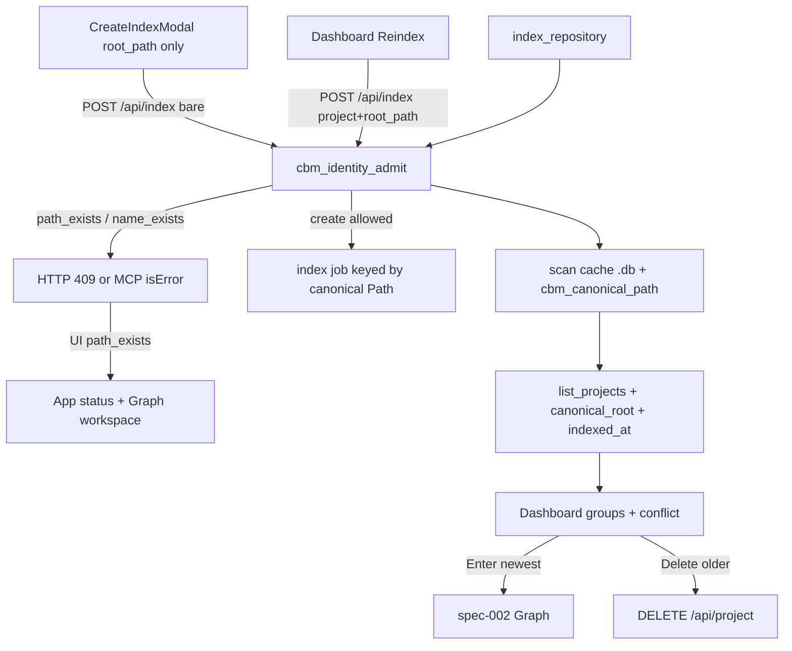

# Technical Plan — Spec-003: Path–Project Identity
Status: Final | Created: 2026-08-29
Spec: spec-003-h7q-path-project-identity | Mode: FEATURE | Stack: unchanged + C admission

## Executive Summary
Each project is its own `~/.cache/codebase-memory-mcp/<name>.db`. There is no global `projects` table, so Path 1:1 cannot be a SQLite UNIQUE. A shared C catalog scans those DBs, canonicalizes `root_path` with existing `cbm_canonical_path`, and admits create vs reindex.

Bare POST `/api/index` `{root_path}` is create: owned Path → 409 `path_exists`. POST `{root_path, project}` where `project` already owns that Path is reindex → 202. MCP `index_repository` without `name` (or `name` = owner) on a single-owner Path is reindex. Dashboard groups by `canonical_root`, Enter newest, confirm-delete older, Reindex per row. Create modal never sends `project`.

## Technology Stack
Unchanged. Do not add packages.

| Component | Tech | Version | Rationale |
| graph-ui | React + react-dom | ^19.0.0 | Dashboard + modal |
| graph-ui | TypeScript | ^5.7.0 | existing |
| graph-ui | Vite | ^6.4.3 | existing |
| graph-ui | Tailwind | ^4.1.0 | spec-001 tokens |
| graph-ui | Vitest + Testing Library | ^4.1.0 / ^16.1.0 | fetch-mock |
| engine | C11 | Makefile.cbm | admission + HTTP + MCP |
| store | SQLite per name | existing | no global UNIQUE |

## System Architecture


Admission is one helper used by HTTP and MCP (same pattern as `cbm_workspace_root_allowed`). UI grouping uses the list field, not a JS realpath.

## Directory Structure
```
src/foundation/identity.h|.c     # catalog + admit (new)
src/ui/http_server.c             # POST /api/index 409 + project field
src/mcp/mcp.c                    # list_projects fields; index_repository admit
src/daemon/application.c         # job subscribe also by canonical Path
tests/                           # C tests for admit + HTTP 409
graph-ui/src/lib/pathGroups.ts   # group by canonical_root, pickNewest
graph-ui/src/components/Dashboard.tsx
graph-ui/src/components/CreateIndexModal.tsx
graph-ui/src/App.tsx             # path_exists notice
graph-ui/src/lib/i18n.ts
graph-ui/src/lib/types.ts        # canonical_root
```

Exact filenames for identity.* are implementer-flexible if the symbol prefix stays `cbm_identity_`.

## Database Schema
No new table. No UNIQUE on `root_path` (each `.db` has its own `projects` row). Catalog is a cache-dir scan (same as `list_projects`).

## API Contracts

### POST /api/index
Create (modal):
```
{"root_path":"/tmp/alpha"}
```
202 `{"status":"indexing","slot":N,"path":"..."}` if Path and derived name are free.

409 create-blocked:
```
{"error":"<message>","code":"path_exists"|"name_exists","existing_project":"<name>","indexed_at":"<iso or empty>"}
```
No job slot allocated.

Reindex (Dashboard):
```
{"root_path":"/tmp/alpha","project":"alpha"}
```
202 if `project` exists and its canonical root equals the request Path.

`project_name` on HTTP is treated as `project` (reindex key only). It must not create a new name.

### MCP index_repository
- New Path, no `name` or free `name` → start (today).
- Owned Path, no `name`, exactly one owner → reindex that owner.
- Owned Path, no `name`, two or more owners → isError, text contains `path_exists` and newest name (ambiguous; UI Reindex always sends `project`).
- Owned Path, `name` ≠ owner → isError `path_exists`.
- New Path, `name` taken by another Path → isError `name_exists`.
- In-flight create of same canonical Path → HTTP 409 `path_exists` / MCP isError `path_exists` (Gherkin). Reindex of the same running `project` may subscribe (existing job).

### list_projects project object
Add (always, not metadata_only-gated):
- `indexed_at` from `cbm_store_get_project` (emit if missing today)
- `canonical_root`: `cbm_canonical_path(root_path)` or stored `root_path` if resolve fails

Display `root_path` unchanged.

## Key Decisions
- Admission-only 1:1 → SDD-ADR-014
- HTTP `project` = reindex → SDD-ADR-015
- `canonical_root` + `indexed_at` on list → SDD-ADR-016
- Job key includes canonical Path → SDD-ADR-017
- MCP multi-owner without name is error → SDD-ADR-018

## Performance Targets
Catalog scan = same order as `list_projects` (one open per `.db`). Do not add a poll. Admission on index only.

## Security Considerations
409 bodies are local project names/paths, not secrets. Delete stays confirm-gated. Do not widen bind. `project` must name an existing store that owns the Path — do not create on a spoofed `project`.

## Testing Strategy
C: admit cases (path_exists, name_exists, reindex, trailing slash, newest/tie, in-flight). Vitest: conflict region, Enter newest, delete cancel/confirm, create 409 redirect + notice, Reindex POST body, Reindex 500, no Project ID, no `project` from modal.

## Deployment Plan
Rebuild daemon + UI (`scripts/build.sh --with-ui`). No cache migration. Existing alias `.db` files stay until operator deletes.

## Risks & Mitigation
| Risk | Probability | Impact | Mitigation |
| list_projects lacks indexed_at live | high | newest wrong | Task #1 emits it |
| JS path fold ≠ realpath | med | missed UI group | group on server `canonical_root` |
| HTTP project_name leftover | med | new alias | treat as reindex key only |
| Reindex vs create same Path | high | 409 vs 202 | `project` present + owns Path |

## Success Criteria
- [ ] all Gherkin Then clauses have a C or Vitest owner
- [ ] create modal never 202 on an owned Path
- [ ] Reindex 202 keeps one row
- [ ] @implementer can execute without a new endpoint

## External Integrations & Special Tools
| Tool | Type | Purpose | Tasks | Setup | Fallback |
| index_repository | MCP | reindex / create admit | #2 | running daemon | C unit on handle |
| list_projects | MCP | catalog + UI list | #1 #3 | existing RPC | mock in Vitest |
| delete_project | HTTP DELETE /api/project | older clone | #3 | existing | mock fetch |

## Breadcrumbs for @implementer
- Do not add UNIQUE SQL.
- Do not send `project` from CreateIndexModal.
- Do not redirect on `name_exists`.
- Do not add workspace Reindex.
- Do not change `colorForLabel`.
- Watcher jobs are reindex, not create.
- Newest: strcmp `indexed_at`; tie: strcmp `name`, greater wins (`beta` > `alpha`).
