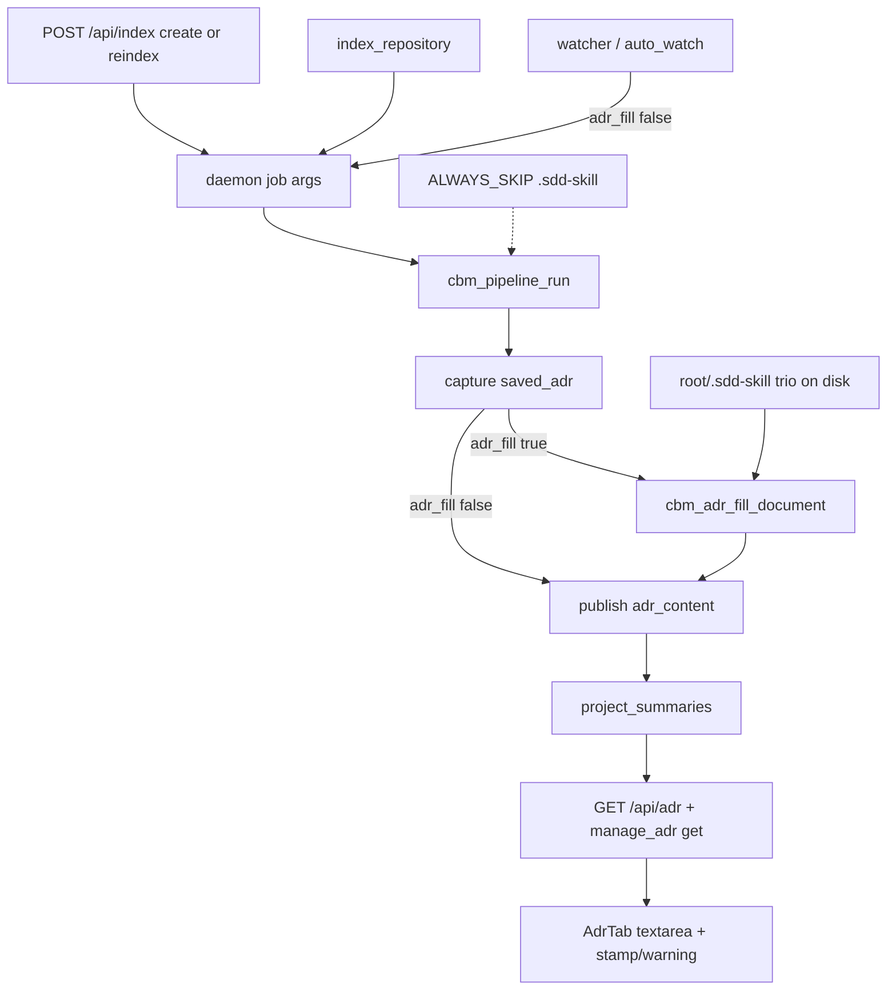

# Technical Plan — Spec-004: ADR parse on reindex
Status: Final | Created: 2026-08-30
Spec: spec-004-j8k-adr-parse-on-reindex | Mode: FEATURE | Stack: unchanged + C fill helper

## Executive Summary
One SQLite `project_summaries` blob. On a user-triggered index only, after ADR capture and before publish writes it back, splice a generated region from the Phase 2 trio. Watcher jobs pass `adr_fill: false` and never splice. No new HTTP/MCP endpoints. No LLM.

Markers live in the markdown. Parse (not POST `/api/adr` / `manage_adr`) is what protects the manual region. Whole-doc writes stay allowed. Generated hand-edits die on the next user-triggered index.

## Technology Stack
Unchanged packages. Do not add npm or C libraries.

| Component | Tech | Version | Rationale |
| graph-ui | React + react-dom | ^19.0.0 | AdrTab chrome only |
| graph-ui | TypeScript | ^5.7.0 | existing |
| graph-ui | Vite | ^6.4.3 | existing |
| graph-ui | Tailwind | ^4.1.0 | spec-001 tokens |
| graph-ui | Vitest + Testing Library | ^4.1.0 / ^16.1.0 | US-006 |
| engine | C11 | Makefile.cbm | fill + hook + skip dir |
| store | SQLite `project_summaries` | existing | no second table |

## System Architecture


User-triggered is the job intent, not the pipeline route. A Dashboard Reindex that takes `try_incremental_or_delete_db` still fills. A watcher incremental that uses the same persist path does not.

Fill reads trio files with fopen. Those paths are not passed to discover/extract. Adding `.sdd-skill` to `ALWAYS_SKIP_DIRS` makes that mechanical (today `.md` is a language and the dir is not skipped).

## Directory Structure
```
src/adr/adr_fill.h|.c          # NEW — extract + splice; cbm_ prefix; no store link
src/pipeline/pipeline.h|.c     # EDIT — adr_fill flag; splice after capture, before publish
src/pipeline/pipeline_incremental.c  # EDIT — same splice on saved_adr before dump_and_persist
src/discover/discover.c        # EDIT — ALWAYS_SKIP_DIRS += ".sdd-skill"
src/mcp/mcp.c                  # EDIT — default adr_fill true; explicit false skips
src/daemon/application.c       # EDIT — watcher JSON adr_fill false; strip key in args-equal
src/ui/http_server.c           # EDIT — POST /api/adr body max 32768
tests/test_adr_fill.c          # NEW — splice/extract/unreadable
tests/test_httpd.c             # EDIT — HTTP fill Gherkin + body cap
tests/test_mcp.c               # EDIT — MCP fill + manage_adr survive
graph-ui/src/components/AdrTab.tsx|.test.tsx
graph-ui/src/lib/i18n.ts|.test.ts
```

Exact `src/adr/` vs `src/store/adr_fill.c` is implementer-flexible if the symbol prefix stays `cbm_adr_` and pipeline does not grow a UI dependency.

## Database Schema
No new table. No new column. No UNIQUE SQL.

ADR remains `project_summaries.summary`. Markers are in-document. `indexed_at` stays the list field (stamp chrome). Do not write generated-at into the blob.

## API Contracts
Prefer existing HTTP/MCP. No new endpoints. No new MCP tool.

### POST /api/index
Unchanged admission (spec-003). Create `{root_path}` and Reindex `{root_path, project}` both fill when the Path has `.sdd-skill/`. Job success is independent of fill.

### MCP index_repository
Unchanged admission. After a successful run that owns that Path, the store blob matches GET `/api/adr`. Default fill on. Explicit `"adr_fill": false` is watcher-only (not advertised to agents).

### GET /api/adr
Unchanged `{has_adr, content, updated_at}`. Content may contain the four HTML comments.

### POST /api/adr
Body still `{project, content}` whole document. Raise `body_len` max from 16384 to 32768 so a bounded generated region plus a Phase-1 manual still saves. 400 `invalid body` above that. 423 busy unchanged. Empty content still upsert-empty.

### manage_adr
`mode=update` / `store` stay whole-document (`semantics: whole_document_replaced`). Do not reject dropped markers. `mode=get` returns the same blob as GET `/api/adr`.

## Answers to Questions for Architect

### Hook
Splicing runs in the pipeline after `saved_adr` capture and before `cbm_pipeline_publish_generation` / incremental `dump_and_persist` write-back. That is the restore path: capture, optionally splice, publish one ADR write. Do not add a second post-job store write.

User-triggered vs watcher is not “full vs incremental”. Both HTTP and watcher already share the same physical worker and `handle_index_repository`. Distinguish with a pipeline flag:

- `cbm_pipeline_new` → `adr_fill = false` (existing direct `cbm_pipeline_run` tests stay inert).
- `handle_index_repository` in-process: `adr_fill = true` unless args contain JSON `adr_fill: false`.
- Watcher `application_background_index(..., require_live_watch=true)` adds `"adr_fill": false` to job args.
- `application_index_args_normalize_defaults` strips `adr_fill` so a watcher poll can still subscribe to an in-flight user job (existing options-equal contract).

Race: watcher-started job (fill false) that a later user Reindex subscribes to will not fill that run. Next user-triggered index after the job ends fills. Acceptable; Gherkin watcher case is exclusive of POST `/api/index` and `index_repository`.

Do not hook “job-complete callback only” — HTTP/MCP/CLI would drift from the incremental persist site.

### Extract + byte cap
Not a byte-copy of the trio (this repo is already ~22KiB). Per readable file:

1. Open `root_path` + fixed relative path only (the three grill ADR-006 paths). Never DEV_LOG, TECH_DEBT, constitution, human/*, specs/*, history/*.
2. Read at most 65536 bytes. Missing or unreadable → omit that extract (and its H1).
3. Drop a UTF-8 BOM if present. Take the first 1536 bytes. If truncated, cut back to the last newline inside the window (no mid-line junk). Empty file → omit that H1.
4. Generated inner order: Purpose, then Stack, then Decisions. English H1s (not basenames): `# Purpose`, `# Stack`, `# Decisions`.
5. Whole generated region (markers + H1s + extracts) stays well under 6KiB. Raise POST `/api/adr` to 32768 so generated + a large Phase-1 manual can still save. Do not raise again in this spec. manage_adr has no HTTP body cap.

### manage_adr whole-doc
Stay whole-doc (planner default 8). Parse, not the write API, protects manual. Rejecting dropped markers would break Phase-1 clients and the Gherkin “unmarked save migrates on next parse” case.

### Unreadable detection
Unreadable ≠ missing. Missing = `stat` fails or not a regular file → omit extract. Unreadable = path exists as a regular file and `fopen`/`fread` fails.

Tests: POSIX `chmod 0` on `ARCHITECTURE_ADR.md`. If the process can still read (root), use a directory at that path so `fopen` as a file fails. Do not treat chmod-skip as a job failure. Gherkin only forbids a full copy of that file and requires sibling extracts + job success.

### H1s
Yes, generated headings are English role titles (`Purpose` / `Stack` / `Decisions`), not `context_ai.md`. Skill files are English; stamp and warning chrome are i18n.

## Key Decisions
- Capture-then-splice before publish; intent flag not route → SDD-ADR-019
- Bounded extract + POST 32768; in-document four comments → SDD-ADR-020
- manage_adr / POST stay whole-doc → SDD-ADR-021
- Unreadable = open fail; English role H1s → SDD-ADR-022
- `.sdd-skill` ALWAYS_SKIP; fill is out-of-graph IO → SDD-ADR-023

Planner defaults 1–12 frozen. No Gherkin change. SDD-ADR-011 “no CBM-GENERATED” is superseded only after a user-triggered index of a repo that has `.sdd-skill/` (spec Related Specs).

## Performance Targets
Fill is three short reads + one string splice on the user-triggered persist path. No extra poll. No `get_graph_schema`. AdrTab stamp uses the existing `useProjects` list cache (`indexed_at`), same as WorkspaceHeader.

## Security Considerations
- Loopback bind/auth unchanged.
- Trio paths are constants under `root_path`. No caller-supplied relative path. No write-back to `.sdd-skill/` or source (constitution I.2).
- ADR textarea stays text, not `dangerouslySetInnerHTML`. Markers are HTML comments in markdown source.
- `adr_fill: false` is not an auth control; UI HTTP is loopback. Do not advertise the flag on the MCP tool schema.
- 32768 body still bounded. Do not widen bind.

## Testing Strategy
C unit (`test_adr_fill.c`) for splice/extract. C HTTP/MCP for job Gherkin. Vitest for US-006. No live daemon for graph-ui DEVELOPMENT. Watcher Gherkin: call the fill helper / pipeline with `adr_fill=false`, or `cbm_daemon_application_watcher_index` if a fixture can complete without POST `/api/index`. Do not start a real auto_watch poll if a direct call proves the flag.

Gherkin → owner:

| Gherkin scenario | Primary test |
| Dashboard Reindex fills + migrates unmarked | `test_httpd.c` after job done; unit splice covers migrate |
| MCP index_repository fills same blob | `test_mcp.c` manage_adr get + optional GET `/api/adr` |
| First create-index empty manual | `test_httpd.c` bare POST `{root_path}` |
| ADR tab stamp + warning | `AdrTab.test.tsx` (+ App route if needed) |
| Limit — no .sdd-skill unmarked | C HTTP + unit (`cbm_adr_fill_document` returns no-op) |
| Limit — only context_ai.md; job success | C HTTP |
| Limit — watcher incremental does not fill | C: watcher args / `adr_fill=false` persist |
| Error — unreadable ARCHITECTURE_ADR | unit + C HTTP; chmod or directory fixture |
| Error — manage_adr survives Reindex | `test_mcp.c` |
| Error — generated-region edits replaced | `test_httpd.c` POST `/api/adr` then Reindex |

Existing `tool_index_repository_reports_store_backed_adr` uses a temp tree without `.sdd-skill/` — must keep passing (no markers).

## Deployment Plan
Rebuild daemon + UI (`scripts/build.sh --with-ui`). No cache migration. Phase-1 unmarked blobs migrate on the next user-triggered index of that Path. Watcher-only trees stay unmarked until a user Reindex or `index_repository`.

## Risks & Mitigation
| Risk | Probability | Impact | Mitigation |
| Hook on incremental route = watcher fill | high | AC miss | intent flag; watcher args false |
| User Reindex takes incremental and skips fill | high | empty generated | splice on both persist sites when flag true |
| Byte-copy trio blows 16KiB POST | high | 400 after real trio | 1536/file + 32768 |
| Pipeline depends on spec_board.c | med | layering | presence check inside adr_fill |
| Existing ADR-preserve MCP tests | med | false fail | no-skill fixtures unchanged |
| chmod 0 ignored as root | low | unreadable test skip | directory-at-path fallback |
| Subscribe race watcher-first | low | one missed fill | next user index; do not OR-upgrade mid-worker |

## Success Criteria
- [ ] all 10 Gherkin scenarios have a C or Vitest owner
- [ ] watcher / incremental intent never writes CBM-GENERATED
- [ ] no `.sdd-skill` file becomes a graph File node from this fill
- [ ] POST `/api/adr` and manage_adr still whole-doc
- [ ] @implementer can execute without a new endpoint or LLM

## External Integrations & Special Tools
None new.

| Tool | Type | Purpose | Tasks | Setup | Fallback |
| index_repository | MCP | user-triggered fill | #2 #3 | daemon or in-process | C handle_tool |
| manage_adr | MCP | get/update same blob | #3 | existing | C unit |
| GET/POST /api/adr | HTTP | tab + replace Gherkin | #3 #4 | test_httpd / fetch mock | mock |
| POST /api/index | HTTP | create + Reindex fill | #3 | test_httpd | mock UI |
| codebase-memory-mcp graph tools | session MCP | skipped (`mcp_idx=no`) | — | `/sdd-skill reindex` later | file/grep (this plan) |

## Constitution validation
Checked against `.sdd-skill/docs/constitution.md` (draft — not rewritten):
- I.2: fill reads skill files; never writes cycle files
- II: C11 `cbm_`; React 19; i18n en+zh for chrome
- III: no GraphTab / `colorForLabel` touch
- IV: no new endpoint; `indexed_at` reused; admission unchanged
- V: every Gherkin mapped; C + Vitest
- VI: loopback; body still capped
- VII: breadcrumbs; accessible warning/stamp
- VIII: no schema RPC
- IX.2: this spec is ADR parse on reindex

Proposed for @planner at close (do not edit constitution now): a Phase 2 rule that generated/manual markers are the in-document fence; fill is user-triggered only; `.sdd-skill` is not graph source.

## Implementation breadcrumbs for @implementer
- Do not fill from watcher / auto_watch / `require_live_watch` jobs.
- Do not use “pipeline incremental vs full” as the fill gate.
- Do not index trio `.md` into the graph; skip the directory; do not add them to the file list.
- Do not write back to `.sdd-skill/` or source.
- Do not copy DEV_LOG or any non-trio path.
- Do not reject whole-doc updates that drop markers.
- Do not add a Dashboard or workspace-header ADR/Reindex control.
- Do not change `colorForLabel` hex.
- Do not put generated-at inside the blob.
- Dirty-leave `window.confirm` unchanged (SDD-ADR-012).
- Default `adr_fill` on `cbm_pipeline_new` is false.
- Fill failure (OOM, read errors) must not fail the index job.
- Keep `tool_index_repository_reports_store_backed_adr` green.
