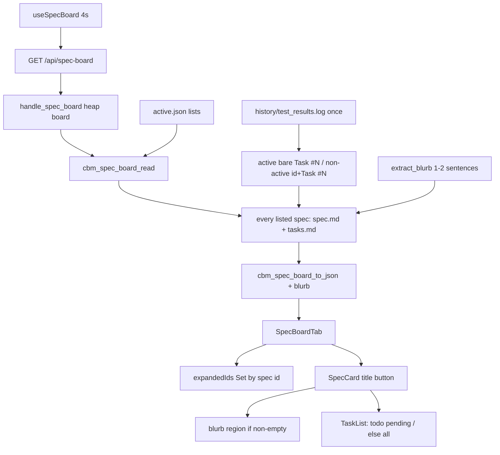

# Technical Plan — Spec-005: Spec card expand
Status: Final | Created: 2026-08-30
Spec: spec-005-v2m-spec-card-expand | Mode: FEATURE | Stack: unchanged

## Executive Summary
GET `/api/spec-board` stays the only spec-board HTTP read. `cbm_spec_board_read` already lists planned/draft/completed from `active.json` but only deep-parses `active_spec` (title, tasks, log, checklist, state.md). This spec runs the same title/tasks reads for every listed entry and adds an additive `blurb` from `spec.md` `## Executive Summary` (first 1–2 sentences). `spec_board.c` stays zero-write.

graph-ui reuses the existing SpecCard title-button expand (grill ADR-002). `canExpand` becomes true for every listed card, including `task_count === 0`. Expanded ids live in a `Set` on `SpecBoardTab` keyed by spec id so a 4s poll cannot remount-collapse an opened card. Todo filters `done === false`; In Progress and Done show the full list. Archive/Unarchive and last-indexed timezone are later specs.

No new endpoint. Caps stay 64 specs / 48 tasks. `useSpecBoard` poll stays ~4s. `colorForLabel` / EdgeLines hex and `formatIndexedAt` UTC stay untouched.

## Technology Stack
Unchanged packages. Do not add npm or C libraries.

| Component | Tech | Version | Rationale |
| graph-ui | React + react-dom | ^19.0.0 | existing SpecCard |
| graph-ui | TypeScript | ^5.7.0 | existing |
| graph-ui | Vite | ^6.4.3 | existing |
| graph-ui | Tailwind | ^4.1.0 | spec-001 tokens |
| graph-ui | Vitest + Testing Library | ^4.1.0 / ^16.1.0 | fetch-mock / hook-mock |
| engine | C11 | Makefile.cbm | spec_board reader + JSON |
| HTTP | GET `/api/spec-board` | existing | additive `blurb` only |

## System Architecture


Flow:
1. `handle_spec_board` is unchanged: resolve project root, heap `cbm_spec_board_t`, `cbm_spec_board_read`, `cbm_spec_board_to_json`, HTTP 200.
2. `read_active_json` still appends planned/draft → `todo`, completed → `done`, then appends `active_spec` as `in_progress` (same order as today).
3. After the list exists, every entry gets one `spec.md` open (H1 title + blurb) and one `tasks.md` open. Missing/unreadable degrades that entry only.
4. `test_results.log` is read once and applied to every entry. Active keeps today's bare `Task #N` last-line-wins matcher. Non-active requires the spec id on the same line.
5. `state.md` / checklist / `current` / agent / blocked stay active-only.
6. UI: first board for a project seeds `expandedIds` with the active spec id. Later polls replace `board` but must not clear the Set. Title button toggles membership. Expand body = optional blurb + TaskList.

## Directory Structure
```
src/ui/spec_board.h              EDIT — blurb[512]; extract_blurb prototype
src/ui/spec_board.c              EDIT — extract; enrich all; dual matcher; JSON blurb
src/ui/http_server.c             LEAVE handle_spec_board (already calls read+to_json)
tests/test_spec_board.c          EDIT — extract + enrich + degrade + log matcher
graph-ui/src/lib/types.ts        EDIT — SpecBoardEntry.blurb: string
graph-ui/src/components/SpecBoardTab.tsx
graph-ui/src/components/SpecBoardTab.test.tsx
graph-ui/src/hooks/useSpecBoard.ts   LEAVE poll 4s
graph-ui/src/lib/formatIndexedAt.ts  DO NOT CHANGE (later spec)
graph-ui/src/lib/colors.ts           DO NOT CHANGE
```

`@sdd-*` breadcrumbs on every new/substantially edited file (constitution VII.2).

## Database Schema
No migration. No new table or column. Spec-board data is fopen of skill files, not SQLite.

## API Contracts
Prefer existing HTTP. No new endpoint. GET `/api/skill-presence` stays unused.

### GET /api/spec-board?project=<name>
Unchanged status codes: 400 missing project, 404 project not found, 500 OOM/serialize, 200 otherwise (including absent `.sdd-skill/` → `{sdd_skill_present:false,specs:[]}`).

Live 200 body — additive `blurb` on each spec (empty string when omitted):
```
{
  "sdd_skill_present": true|false,
  "specs": [
    {
      "id": "<folder>",
      "title": "<H1 stripped or empty>",
      "blurb": "<0-2 sentences or empty>",
      "column": "todo"|"in_progress"|"done",
      "active": true|false,
      "current_agent": "<state.md role or empty>",
      "blocked_note": "<or empty>",
      "task_count": 0-48,
      "tasks_done": 0-48,
      "checklist_percent": -1 or number,
      "tasks": [{ "number", "name", "done", "current" }]
    }
  ]
}
```

Caps: `CBM_SPEC_BOARD_MAX_SPECS` 64, `CBM_SPEC_BOARD_MAX_TASKS` 48. Do not raise.

`task_count` is headings parsed from that spec's `tasks.md` (not pending-only). Todo pending filter is UI-only.

### Forbidden
- Second expand/lazy endpoint
- Write to `.sdd-skill/` (`active.json`, `spec.md`, `tasks.md`, Status, history)
- Archive / Unarchive HTTP or UI
- Changing `formatIndexedAt` timezone (SDD-ADR-003)
- Changing `colorForLabel` / EdgeLines hex (SDD-ADR-005)

## Answers to Questions for Architect

### Blurb buffer and third sentence
`char blurb[512]` (511 usable + NUL). `CBM_SPEC_BOARD_BLURB_MAX 512`.

Extract:
1. Find a line that is `## Executive Summary` (optional leading whitespace; next char is whitespace or EOL). Not `###`. Not H1.
2. Body = after that line's newline until the next H2 (`\n## `). `## KPI` and any other H2 stop the body.
3. Markdown links `[text](url)` → `text` only. Do not invent other fallbacks.
4. Sentence end = `.` / `?` / `!` followed by `isspace` or end of body. Take at most two sentences. A third sentence is dropped entirely (not used to fill leftover bytes).
5. Collapse `\r`/`\n` inside the kept text to a single space so the field is one or two sentences.
6. If the two-sentence result is longer than 511 bytes: byte-truncate to 511, then walk back to the last space in the window if one exists. Never pull in a third sentence.
7. Missing heading, empty/whitespace-only body → `""`.

Escaped JSON buffer for blurb: ≥1024 (quotes/backslashes expand).

### Active done matcher
Keep two matchers (planner default 6). Do not unify to spec-id-qualified.

- Active: existing `Task #N` on the line; `done = (strstr PASS)` last matching line wins (FAIL unsets). No spec id required.
- Non-active: line must contain `e->id` and `Task #N`. Last such line wins; `done` is true only if that last line also contains `PASS`. A bare `Task #N` without the spec id does not mark a non-active task.

`current` remains active-only (`state.md` task number). Non-active tasks stay `current=false`.

### Expanded ids across poll
Lift expanded state to `SpecBoardTab` as `Set<string>` of spec ids. Do not keep `useEffect(() => setExpanded(entry.active), [entry.active])` — that is the remount/sync footgun.

- On `project` change: clear the Set and a `seeded` ref.
- On first `board` for that project: add every `entry.active` id (In Progress starts expanded).
- Title button toggles that id. Opening one card does not remove another (grill ADR-008).
- Poll: `useSpecBoard` `setBoard(data)` must not clear the Set. `key={entry.id}` stays as a secondary guard.
- `canExpand` is true for every listed card, including `task_count === 0`.

### Read budget
Stay naive fopen. No mtime cache, no in-process TTL, no lazy expand endpoint.

Per poll, implementer must:
- Open each listed spec's `spec.md` once (title + blurb from the same buffer). Do not open it twice.
- Open each listed spec's `tasks.md` once.
- Open `history/test_results.log` once and apply to all entries.
- Open `state.md` + `checklist.md` only for the active entry (today).

64 specs × two small files on localhost every 4s is acceptable under the frozen caps. `SPEC_BOARD_MAX_FILE` stays 4MiB as a safety cap, not a target read.

## Key Decisions
- Same GET; additive `blurb`; enrich every listed spec → SDD-ADR-024
- 1–2 ES sentences; 512 B; third dropped then byte-truncate; KPI never used → SDD-ADR-025
- Dual done matcher (active bare / non-active id-qualified) → SDD-ADR-026
- `expandedIds` Set on SpecBoardTab; seed active; poll does not reset → SDD-ADR-027
- Naive fopen; one spec.md + one shared log; no cache this spec → SDD-ADR-028

Planner defaults 1–9 frozen. Grill ADR-003 Archive button is out of this spec (epic-002). Grill ADR-002/006/008 apply.

## Performance Targets
| Target | Value |
| Endpoint | existing GET only; no second fetch on expand |
| Poll | `useSpecBoard` 4000 ms unchanged |
| Caps | 64 specs / 48 tasks unchanged |
| IO | one spec.md + one tasks.md per listed spec; one shared log |
| Dashboard / Graph / ADR | 0 new RPCs; 0 `get_graph_schema` |
| Coverage | >80% on touched `spec_board.c` + SpecBoardTab (reporter may be absent) |

## Security Considerations
- Loopback bind/auth unchanged. Do not widen.
- Reader only: no write to skill files (constitution I.2). Paths are `root_path` + constants (`specs/<id>/spec.md`, `tasks.md`, `history/test_results.log`). `id` comes from `active.json` strings already listed today — do not accept a client-supplied relative path.
- JSON escape `blurb` via `cbm_json_escape`. UI renders blurb as text, not `dangerouslySetInnerHTML`.
- Unreadable/missing files degrade one entry; HTTP stays 200.
- No new destructive control. Archive is forbidden this spec.

## Testing Strategy
C: `tests/test_spec_board.c` (existing `/tmp` fixtures; never the real repo `.sdd-skill/`). Export `cbm_spec_board_extract_blurb` so extract cases do not need a full tree. HTTP handler needs no new `test_httpd` suite if `to_json` is asserted in C — `handle_spec_board` only wraps read+json.

Vitest: mock `useSpecBoard` (same as today's host tests). No live daemon for DEVELOPMENT. Playwright optional (constitution IX.4).

Gherkin → owner:

| Gherkin scenario | Primary test |
| Todo card expands with blurb and pending tasks only | `SpecBoardTab.test.tsx` |
| In Progress card shows blurb and every task with status chrome | `SpecBoardTab.test.tsx` first paint |
| Done card expands with full task list and no Archive | `SpecBoardTab.test.tsx` |
| Two cards stay expanded at once | `SpecBoardTab.test.tsx` |
| Limit — empty Executive Summary omits blurb and still expands | Vitest (blurb `""`) + C extract |
| Limit — zero tasks still expands with no-tasks copy | `SpecBoardTab.test.tsx` |
| Limit — KPI section is not used as blurb | `test_spec_board.c` extract + full read |
| Limit — poll does not collapse an opened non-active card | `SpecBoardTab.test.tsx` rerender new board object |
| Limit — non-active done requires spec id in the log line | `test_spec_board.c` |
| Error — missing spec.md degrades one entry | `test_spec_board.c` (200 via to_json / present) |
| Error — missing tasks.md is empty task list | `test_spec_board.c` |
| Error — unreadable spec.md omits blurb | `test_spec_board.c` chmod 0 or directory-at-path |

Existing `spec_board_idle_planned_draft_done` still holds when those ids have no files (empty title/blurb/tasks). Update the comment that says non-active skip deep parse. Add fixtures with files for the new Then clauses. Keep `spec_board_active_compact_state` bare-`Task #N` PASS/FAIL behavior.

## Deployment Plan
- `scripts/build.sh --with-ui` (C + embed UI).
- No DB migration. No env var. No daemon flag.
- Old UIs ignore unknown `blurb` if any leftover binary; new UI requires the field (treat missing as `""` if a mock omits it).

## Risks & Mitigation
| Risk | Probability | Impact | Mitigation |
| Existing idle test assumes non-active `task_count==0` | high | false fail | still true without files; new tests add files |
| Local `useState` + `useEffect(active)` collapses on remount | high | poll Gherkin fail | lift Set; delete that effect |
| Unifying done matcher breaks active compact fixture | high | regress Task #1/#2 PASS | dual matcher (ADR-026) |
| 64 × 4MiB reads | low | stall | same 4MiB cap; typical spec.md is KB; one open per spec |
| Grill ADR-003 Archive leaks into Done | med | AC miss | DoD + Gherkin: zero Archive/Unarchive controls |
| `formatIndexedAt` "fix" while touching header | low | later-spec scope | do not open that file |
| Gherkin `columns` mock | low | blank Kanban | mock live `{sdd_skill_present,specs}` |

## Success Criteria
- [ ] All 6 US + all 12 Gherkin scenarios have a C and/or Vitest owner
- [ ] GET `/api/spec-board` is the only spec-board read; `blurb` additive
- [ ] Zero writes to `.sdd-skill/` from this feature
- [ ] Zero Archive/Unarchive chrome
- [ ] Last-indexed TZ and Graph hex unchanged
- [ ] @implementer can execute without a second endpoint or overlay

## External Integrations & Special Tools
None new.

| Tool | Type | Purpose | Tasks | Setup | Fallback |
| GET `/api/spec-board` | existing HTTP | list + enrich + blurb | #1–#4 | daemon in prod; C + fetch mock in tests | 200 degrade per entry |
| codebase-memory-mcp graph | session MCP | architect INIT only | — | mcp_idx=yes | file read (done) |

## Constitution validation
Checked against `.sdd-skill/docs/constitution.md` (draft — not rewritten):
- I.1–I.2: implement frozen spec only; reader never writes cycle files
- II: C11 `cbm_`; React 19; no new CSS file; i18n only if a new string appears (prefer `noTasksYet`)
- III: chrome grayscale; `colorForLabel` locked
- IV.3: no new endpoint
- IV.4: do not invent a second freshness field; do not change `indexed_at` display
- V: every Gherkin mapped; C + Vitest; no live daemon for UI
- VI: loopback; no new destructive action
- VII: title button accessible name; breadcrumbs
- VIII: no `get_graph_schema` on this path
- IX: workspace Specs tab already exists (spec-002); this spec only expands cards

No constitution edit this spec. Archive and local-TZ last-indexed stay later features.

## Implementation breadcrumbs for @implementer
1. Do not add a second spec-board HTTP route.
2. Do not write `.sdd-skill/`.
3. Do not render Archive or Unarchive.
4. Do not change `formatIndexedAt`, WorkspaceHeader last-indexed, or SDD-ADR-003 TZ.
5. Do not change `colorForLabel` / EdgeLines hex.
6. Do not raise 64/48 caps.
7. Do not change `useSpecBoard` poll interval unless a test cannot meet AC without it (it can).
8. Do not keep `canExpand = entry.active && entry.task_count > 0`.
9. Do not keep `useEffect(() => setExpanded(entry.active), [entry.active])`.
10. Do not use KPI, H1, or invented copy as blurb.
11. Do not unify non-active done onto the bare `Task #N` matcher.
12. Do not parse `state.md` / checklist onto non-active cards.
13. Update the idle-test comment; do not delete the idle test.
14. Mock `{ sdd_skill_present, specs }` never `columns`.
15. Existing host tests (no picker when project set) must stay green.
16. Breadcrumb headers on touched files.
17. Heap-only `cbm_spec_board_t` (already). Adding `blurb[512]` per entry is fine on the heap.
