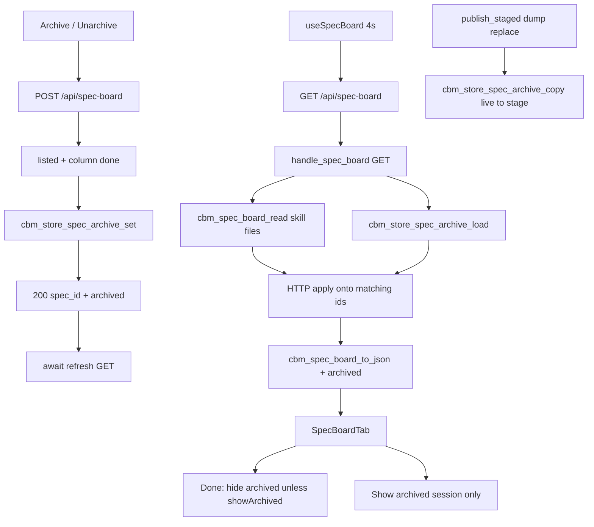

# Technical Plan — Spec-006: Spec archive
Status: Final | Created: 2026-08-30
Spec: spec-006-k3n-spec-archive | Mode: FEATURE | Stack: unchanged

## Executive Summary
Archive is a CBM SQLite flag, not a skill-file write. GET `/api/spec-board` stays the only board read and adds additive `archived` on every entry (false when no row). POST `/api/spec-board` `{project, spec_id, archived}` is the mutate on the same family — constitution IV.3; the GET-only dispatch today cannot meet AC, so POST is added on this path (not a sibling). `spec_board.c` stays a skill-file reader (zero-write). Flags are merged after `cbm_spec_board_read`, in HTTP, from a store load.

graph-ui keeps the spec-005 expand Set. New session-only `showArchived` on SpecBoardTab (false on mount and on `?project=` change). Done filters `column==="done" && archived && !showArchived`. Archive / Unarchive appear only on an expanded Done card. After POST 200 the UI awaits `useSpecBoard.refresh()` so the 4s poll cannot resurrect a hidden card.

No new MCP tool. Caps stay 64 / 48. `colorForLabel` / `formatIndexedAt` / Graph / Dashboard / ADR tab / Path 1:1 / ADR fill / spec-005 expand rules stay untouched.

## Technology Stack
Unchanged packages. Do not add npm or C libraries.

| Component | Tech | Version | Rationale |
| graph-ui | React + react-dom | ^19.0.0 | existing SpecBoardTab |
| graph-ui | TypeScript | ^5.7.0 | existing |
| graph-ui | Vite | ^6.4.3 | existing |
| graph-ui | Tailwind | ^4.1.0 | spec-001 tokens |
| graph-ui | Vitest + Testing Library | ^4.1.0 / ^16.1.0 | fetch-mock / hook-mock |
| engine | C11 | Makefile.cbm | store + HTTP |
| SQLite | vendored | existing | new table in project `.db` |
| HTTP | GET+POST `/api/spec-board` | existing path | GET merge; POST mutate |

## System Architecture


Flow:
1. GET: `resolve_project_root_path` (unchanged 400/404). Heap `cbm_spec_board_t`. `cbm_spec_board_read` (still zero-write). Query-open the project `.db`, `cbm_store_spec_archive_load`, apply flags onto matching `e->id` only. `cbm_spec_board_to_json` emits `"archived"`. Missing table / open fail after resolve → all false, still 200.
2. POST: yyjson body `{project, spec_id, archived}`. Resolve project. Read board. Unknown `spec_id` → 404 `spec not found`. `column` not `"done"` → 409 `spec not done`, no write. Else mutation lock (same as `handle_adr_save`), `cbm_store_open_path`, `cbm_store_spec_archive_set`, 200 flag object. Repeat same value is 200.
3. UI: `showArchived` useState(false). Reset on project change. Done header button accessible name "Show archived". Filter Done before count. After 200, `await refresh()` (GET). No confirm. No fourth column.
4. Persist across dump publish: incremental clone already copies the whole `.db` (`cbm_delta_stage_clone`). Full dump (`cbm_gbuf_dump_to_sqlite`) does not. `cbm_pipeline_publish_staged` copies `spec_archive` from live `final_db_path` onto the stage after ADR write. Do not change `adr_fill`.

## Directory Structure
```
src/store/store.h                EDIT — spec_archive row + set/load/copy
src/store/store.c                EDIT — init_schema table; set/load/copy
src/ui/spec_board.h              EDIT — bool archived on entry
src/ui/spec_board.c              EDIT — to_json "archived"; read does not set it
src/ui/http_server.c             EDIT — GET merge; POST mutate; dispatch POST
src/pipeline/pipeline.c          EDIT — publish_staged copy only (not adr_fill)
tests/test_store_spec_archive.c  NEW — set/load/copy/missing table
tests/test_spec_board.c          EDIT — to_json emits archived
tests/test_httpd.c               EDIT — POST/GET Gherkin errors + merge
Makefile.cbm                     EDIT — TEST_STORE_SRCS += test_store_spec_archive.c
graph-ui/src/lib/types.ts        EDIT — SpecBoardEntry.archived: boolean
graph-ui/src/lib/i18n.ts         EDIT — archive / unarchive / showArchived en+zh
graph-ui/src/hooks/useSpecBoard.ts  EDIT — refresh(): Promise<void> (same fetch)
graph-ui/src/components/SpecBoardTab.tsx
graph-ui/src/components/SpecBoardTab.test.tsx
graph-ui/src/lib/formatIndexedAt.ts  DO NOT CHANGE
graph-ui/src/lib/colors.ts           DO NOT CHANGE
src/mcp/mcp.c                        DO NOT CHANGE (no archive tool)
```

`@sdd-*` breadcrumbs on every new/substantially edited file (constitution VII.2).

## Database Schema
New table in the project `.db` (filename = project name). Project key is the store file, not a column. Do not reuse `store_meta` (db_uid / mutation_gen) or `project_summaries` (ADR blob). Do not add a daemon-global table. Do not add this table to the hand-built sqlite writer DDL.

```sql
CREATE TABLE IF NOT EXISTS spec_archive (
  spec_id TEXT PRIMARY KEY,
  archived INTEGER NOT NULL CHECK (archived IN (0, 1)),
  updated_at TEXT NOT NULL
);
```

- `spec_id` = skill folder id (`cbm_spec_board_entry_t.id`, max 191 bytes).
- UPSERT on set. Unarchive writes `archived=0`; do not DELETE (orphan-keep).
- Orphan row (id not on current board): keep; GET does not invent a card.
- `init_schema` adds the CREATE so write-open creates it. Query-open (`cbm_store_open_path_query`) skips `init_schema` — load must probe `sqlite_master` like `cbm_store_adr_get` and treat missing table as zero rows (all false).
- Relationships: none. No FK to `projects` / graph tables.

## API Contracts
Prefer existing HTTP. No new path. No new MCP tool. GET `/api/skill-presence` stays unused.

### GET /api/spec-board?project=<name>
Unchanged status codes: 400 missing project, 404 `{"error":"project not found"}`, 500 OOM/serialize, 200 otherwise (absent `.sdd-skill/` → `{sdd_skill_present:false,specs:[]}`).

Live 200 body — additive `archived` on each spec (`false` when no flag):
```
{
  "sdd_skill_present": true|false,
  "specs": [
    {
      "id": "<folder>",
      "title": "<...>",
      "blurb": "<...>",
      "column": "todo"|"in_progress"|"done",
      "archived": true|false,
      "active": true|false,
      ...unchanged spec-005 fields...
    }
  ]
}
```

Orphan store rows do not appear in `specs`. Leftover true flag on todo/in_progress: JSON `archived` true, `column` unchanged.

Caps: `CBM_SPEC_BOARD_MAX_SPECS` 64, `CBM_SPEC_BOARD_MAX_TASKS` 48. Do not raise.

### POST /api/spec-board
Body max 4096. yyjson (same as `handle_adr_save` / `handle_index_start`).

Request:
```
{"project":"<name>","spec_id":"<folder>","archived":true|false}
```

200 (planner default — flag object, not full board):
```
{"project":"<name>","spec_id":"<folder>","archived":true|false}
```

| Status | Body | When |
| 400 | `{"error":"..."}` | missing `project` or `spec_id` (empty counts as missing) |
| 400 | `{"error":"invalid archived"}` | missing or non-boolean `archived` (string `"yes"` is 400) |
| 400 | `{"error":"invalid json"}` / `invalid body` | bad JSON / empty / oversize (same family as ADR) |
| 404 | `{"error":"project not found"}` | unknown project (same string as GET) |
| 404 | `{"error":"spec not found"}` | `spec_id` not on current board (orphan POST) |
| 409 | `{"error":"spec not done"}` | listed but `column` != `"done"`; no persist |
| 423 | project busy | mutation lock held (same as ADR save); not in Gherkin |
| 500 | `{"error":"save failed"}` / cannot open store | persist fail |

Idempotent: same `archived` again → 200, row unchanged except `updated_at`.

Dispatch today is `is_get && /api/spec-board*`. Change to path match then GET vs POST. Other methods fall through (no 405 required).

### Forbidden
- New `/api/spec-archive` (or any sibling) unless this family cannot meet AC — it can
- Write to `.sdd-skill/` (`active.json`, spec.md Status, `completed_specs`)
- Fourth column / "Archived" title
- Confirm dialog / `window.confirm` on Archive or Unarchive
- New MCP archive tool
- Persist Show archived (localStorage or CBM)
- Changing `formatIndexedAt` or `colorForLabel` / EdgeLines hex
- Changing ADR fill / `adr_content` capture

## Answers to Questions for Architect

### Exact SQLite shape
New table `spec_archive` in the project `.db` (ADR-029). Evidence: `init_schema` already has `projects`, `file_hashes`, `nodes`, `edges`, `project_summaries`, `lsp_surface`, `index_coverage*`. `store_meta` is k/v for `db_uid`/`mutation_gen` only. `project_summaries` is the ADR blob (`cbm_store_adr_store`). Reusing either mixes lifetimes. One `.db` per project name (`db_path_for_project`) so the project half of the key is the file; PK is `spec_id`.

### POST stays `/api/spec-board`
Yes (ADR-030). Evidence: `dispatch_request` is GET-only for this path; `handle_spec_board` reads query `project`. Adding POST on the same path meets mutate AC. A sibling path is constitution IV.3 "new endpoint" — not required.

### Where merge lives
HTTP after `cbm_spec_board_read`, using `cbm_store_spec_archive_load` (ADR-030). Evidence: `handle_spec_board` already wraps read+to_json; `cbm_spec_board_read` is fopen of skill files only. Do not open SQLite inside `spec_board.c`. Do not re-parse JSON after `to_json`. Add `bool archived` on `cbm_spec_board_entry_t` (memset 0). Static apply loop in `http_server.c`: match `spec_id` → set `e->archived`; unmatched entries stay false. Store does not include `spec_board.h`.

### POST 200 body
Single flag object `{project, spec_id, archived}` (ADR-031). Gherkin only asserts `spec_id` + `archived`. Full board JSON would couple POST to GET shape and is unnecessary because the UI must refetch GET anyway.

### How UI avoids poll-resurrect
Mandatory `await refresh()` after POST 200 (ADR-032). Evidence: `useSpecBoard` already returns `refresh: fetchBoard` (GET). Change the type to `() => Promise<void>` and await it in Archive/Unarchive. Do not keep a local hiddenIds list that fights GET. Filter is `!(column==="done" && archived && !showArchived)`. Optional in-memory patch of that entry's `archived` before refresh is allowed but not sufficient DoD — refresh is required so the next 4s tick sees store truth.

## Key Decisions
- New `spec_archive` table in project `.db`; not skill; not localStorage → SDD-ADR-029
- POST on `/api/spec-board`; merge in HTTP after read → SDD-ADR-030
- 200 returns flag object → SDD-ADR-031
- Await GET refresh after 200; session-only Show archived → SDD-ADR-032
- `publish_staged` copies `spec_archive` live→stage (dump replace) → SDD-ADR-033

Planner defaults 1–9 frozen. Grill ADR-001/004/007/009 apply.

## Performance Targets
| Target | Value |
| GET | existing poll; one extra query-open + SELECT (≤64 rows) |
| POST | one write-open + UPSERT |
| Poll | `useSpecBoard` 4000 ms unchanged |
| Caps | 64 specs / 48 tasks unchanged |
| Dashboard / Graph / ADR | 0 new RPCs; 0 `get_graph_schema` |
| Coverage | >80% on touched store/HTTP/spec_board JSON + SpecBoardTab (reporter may be absent) |

## Security Considerations
- Loopback bind/auth unchanged. Do not widen.
- POST `spec_id` is looked up on the current board (ids from `active.json`), never used as a filesystem path. `spec_board.c` still builds `specs/<id>/` only from listed ids.
- Mutation lock on POST (same as ADR) so a persist does not land on a file `publish_staged` is about to replace.
- JSON escape `spec_id` / `project` on 200 via `cbm_json_escape`.
- UI renders Archive labels via i18n text, not HTML.
- Constitution VI.3 does not apply (archive is not delete).
- No secrets. Cache DBs stay under the user cache dir.

## Testing Strategy
C store: `tests/test_store_spec_archive.c` via `cbm_store_open_memory` — set/load/copy/idempotent/missing table. Add to `TEST_STORE_SRCS`.

C board JSON: `tests/test_spec_board.c` — `to_json` emits `"archived":false` by default and `true` when the field is set. Read still does not invent flags.

C HTTP: `tests/test_httpd.c` following `ui_adr_post_request` / `th_http`. Fixtures under `/tmp` (never the real repo `.sdd-skill/`). Snapshot `active.json` bytes around POST.

Vitest: mock `useSpecBoard` (same as today) plus stub `fetch` for POST. No live daemon for DEVELOPMENT. Playwright optional (constitution IX.4).

Gherkin → owner:

| Gherkin scenario | Primary test |
| Archive hides a Done card without a confirm dialog | `SpecBoardTab.test.tsx` + `test_httpd.c` POST 200 |
| Show archived reveals the card and Unarchive restores it | `SpecBoardTab.test.tsx` |
| Fresh visit starts with archived hidden | `SpecBoardTab.test.tsx` remount |
| GET keeps archived specs in Done with archived true | `test_httpd.c` GET + store seed |
| Limit — Done count ignores hidden archived | `SpecBoardTab.test.tsx` |
| Limit — leftover flag on a Todo spec does not hide it | `SpecBoardTab.test.tsx` |
| Limit — orphan flag does not invent a card | `test_httpd.c` GET |
| Limit — all Done archived shows empty copy and keeps the toggle | `SpecBoardTab.test.tsx` |
| Limit — repeat archive is idempotent | `test_httpd.c` |
| Limit — poll after archive does not resurrect the card | `SpecBoardTab.test.tsx` rerender new board |
| Error — archive a Todo spec is 409 and writes nothing | `test_httpd.c` + following GET |
| Error — unknown spec_id is 404 | `test_httpd.c` |
| Error — missing project on POST is 400 | `test_httpd.c` |
| Error — invalid archived on POST is 400 | `test_httpd.c` |
| Error — unknown project on POST is 404 | `test_httpd.c` |

Existing host tests (no picker when project set; loading / not-sdd-skill) stay green. The spec-005 "document has no Archive/Unarchive" assertion is replaced: those names appear only on expanded Done as specified.

## Deployment Plan
- `scripts/build.sh --with-ui` (C + embed UI).
- No env var. No daemon flag.
- Schema: `CREATE TABLE IF NOT EXISTS` on next write-open; GET without the table = all `archived` false.
- Old UIs ignore unknown `archived`; new UI treats missing as `false`.

## Risks & Mitigation
| Risk | Probability | Impact | Mitigation |
| Full dump publish drops extra tables | high | flags vanish; cards resurrect after Reindex | ADR-033 copy in `publish_staged`; incremental clone already keeps the table |
| Query-open GET on pre-table `.db` | high | SELECT fail → 500 | sqlite_master probe; missing = empty |
| POST vs publish race | med | write lost on rename | mutation_begin like ADR |
| spec-005 test forbids Archive chrome | high | false fail | remap in Task #4 |
| Local patch without refresh | med | poll resurrects | mandatory await refresh |
| Confirm leaks in (VI.3 habit) | med | Gherkin fail | DoD: zero dialog / confirm |
| Fourth column leak | low | AC miss | three Column children only |
| `formatIndexedAt` / hex drive-by | low | later-spec scope | do not open those files |

## Success Criteria
- [ ] All 6 US + all 15 Gherkin scenarios have a C and/or Vitest owner
- [ ] GET is the only board read; POST is the only mutate; both `/api/spec-board`
- [ ] Zero writes to `.sdd-skill/` from this feature
- [ ] Zero fourth column; zero confirm; zero MCP archive tool
- [ ] Last-indexed TZ and Graph hex unchanged
- [ ] @implementer can execute without a sibling path or skill sidecar

## External Integrations & Special Tools
None new.

| Tool | Type | Purpose | Tasks | Setup | Fallback |
| GET/POST `/api/spec-board` | existing HTTP family | read+merge / mutate flag | #2–#4 | daemon in prod; C + fetch mock in tests | GET degrade flags to false |
| codebase-memory-mcp graph | session MCP | architect INIT only | — | mcp_idx=yes | file read (done) |

## Constitution validation
Checked against `.sdd-skill/docs/constitution.md` (draft — not rewritten):
- I.1–I.2: frozen spec only; no cycle-file writes
- II: C11 `cbm_`; React 19; no new CSS file; i18n en+zh for three new strings
- III: chrome grayscale; `colorForLabel` locked
- IV.3: same path family; POST added because GET-only cannot mutate
- IV.4: no second freshness field
- V: every Gherkin mapped; C + Vitest; no live daemon for UI
- VI.3: does not apply (not delete)
- VII: Archive / Unarchive / Show archived accessible names; breadcrumbs
- VIII: no `get_graph_schema` on this path
- IX.2: spec-005 expand stays; this spec adds archive only

No constitution edit this spec.

## Implementation breadcrumbs for @implementer
1. Do not add `/api/spec-archive` or an MCP archive tool.
2. Do not write `.sdd-skill/`.
3. Do not put SQLite in `spec_board.c`. `cbm_spec_board_read` must not set `archived`.
4. Do not reuse `store_meta` or `project_summaries`.
5. Do not add `spec_archive` to the sqlite writer hand-built DDL.
6. Do not change `adr_fill`, `saved_adr`, or `generation->adr_content`.
7. Do not change `formatIndexedAt`, WorkspaceHeader last-indexed, or Graph hex.
8. Do not raise 64/48 caps or change the 4s poll interval.
9. Do not persist `showArchived`.
10. Do not open `window.confirm` or a dialog on Archive/Unarchive.
11. Do not add a fourth Column.
12. POST 200 is the flag object, not `cbm_spec_board_to_json`.
13. After POST 200, `await refresh()` — do not wait for the next interval.
14. Leftover true on todo/in_progress: show the card; no Archive/Unarchive.
15. Orphan store row: keep; GET list unchanged.
16. 409 must not call `cbm_store_spec_archive_set`.
17. Mock `{ sdd_skill_present, specs }` never `columns`.
18. Mutation lock on POST like `handle_adr_save`.
19. Heap-only `cbm_spec_board_t` (already). `bool archived` per entry is fine.
20. Breadcrumb headers on touched files.
21. Existing host tests must stay green; replace the spec-005 "no Archive in document" assertion.
