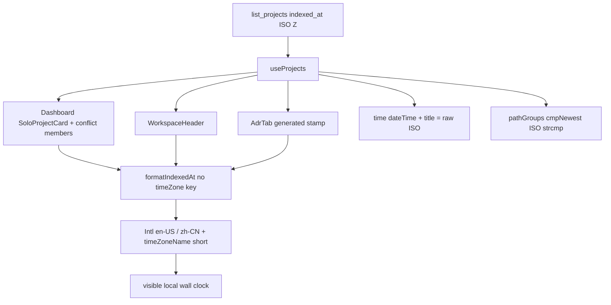

# Technical Plan — Spec-007: Last indexed local
Status: Final | Created: 2026-08-30
Spec: spec-007-n6p-last-indexed-local | Mode: FEATURE | Stack: unchanged

## Executive Summary
`formatIndexedAt` is the only freshness formatter. Graph INIT (mcp_idx=yes) shows it defined in `graph-ui/src/lib/formatIndexedAt.ts` and already called from Dashboard (`SoloProjectCard` + conflict member rows), WorkspaceHeader, and AdrTab. App is hop-2 via the header. No surface bypasses the helper. No second formatter exists.

This spec drops `timeZone: "UTC"` from the helper options (grill ADR-005 / reverse of SDD-ADR-003 display TZ). Locale stays `en-US` / `zh-CN`. `timeZoneName: "short"` stays. `Date` parse + raw-string fallback stay. `<time dateTime>` and `title` stay the raw `indexed_at` ISO. Conflict newest stays `cmpNewest` ISO string compare in `pathGroups.ts`. `list_projects` / `Project.indexed_at` stay daemon ISO Z.

Zero C, HTTP, MCP, i18n, and schema change. Graph hex, Specs expand/archive, Path 1:1, and ADR fill are out of the edit set.

## Technology Stack
Unchanged packages. Do not add npm or C libraries.

| Component | Tech | Version | Rationale |
| graph-ui | React + react-dom | ^19.0.0 | existing `<time>` surfaces |
| graph-ui | TypeScript | ^5.7.0 | existing helper |
| graph-ui | Vite | ^6.4.3 | existing |
| graph-ui | Tailwind | ^4.1.0 | spec-001 tokens; no new CSS |
| graph-ui | Vitest + Testing Library | ^4.1.0 / ^16.1.0 | Intl oracles + fetch-mock |
| graph-ui | Intl.DateTimeFormat | runtime | display TZ = host default |
| engine | C11 daemon + HTTP | Makefile.cbm | no edit |

## System Architecture


Flow:
1. Helper: `new Date(iso)` → NaN → return raw `iso`. Else `Intl.DateTimeFormat(locale, parts).format(date)` where `parts` has year/month/day/hour/minute and `timeZoneName: "short"` and does **not** include a `timeZone` key (runtime default).
2. Surfaces already render `{formatIndexedAt(indexed_at, lang)}` inside `<time dateTime={indexed_at} title={indexed_at}>`. Do not rewire. Do not add a second clock.
3. Newest: `cmpNewest` compares `indexed_at` strings then name. Do not open `pathGroups.ts` except to confirm it stays.
4. Host TZ UTC is honest: local Intl may equal the old UTC-pinned string. `dateTime` is still the raw ISO.

## Directory Structure
```
graph-ui/src/lib/formatIndexedAt.ts          EDIT — drop timeZone:"UTC"; keep short name
graph-ui/src/lib/formatIndexedAt.test.ts     EDIT — Intl localFmt / utcFmt oracles
graph-ui/src/components/Dashboard.test.tsx   EDIT — Then: dateTime + title + helper text + invalid ISO
graph-ui/src/components/WorkspaceHeader.test.tsx  EDIT — helper text + invalid ISO (ghost stays)
graph-ui/src/components/AdrTab.test.tsx      EDIT — invalid ISO stamp; keep helper equality
graph-ui/src/components/Dashboard.tsx        LEAVE — already calls helper (list + conflict)
graph-ui/src/components/WorkspaceHeader.tsx  LEAVE — already calls helper
graph-ui/src/components/AdrTab.tsx           LEAVE — already calls helper
graph-ui/src/lib/pathGroups.ts               DO NOT CHANGE (ISO newest)
graph-ui/src/lib/colors.ts                   DO NOT CHANGE
graph-ui/src/lib/i18n.ts                     DO NOT CHANGE (no UTC/local suffix)
src/                                         DO NOT CHANGE
```

`@sdd-*` breadcrumbs on every substantially edited file (constitution VII.2). Update helper headers from SDD-ADR-003 to SDD-ADR-034.

## Database Schema
No migration. No new column. `indexed_at` remains the existing ISO Z field on `list_projects` / `Project`.

## API Contracts
No HTTP or MCP change. Prefer existing contracts (constitution IV.3–IV.4).

### POST /rpc list_projects
Unchanged. Rows still carry `indexed_at` as ISO Z from the daemon. UI must not invent a second freshness field or call `/api/index-status` for this stamp.

### Forbidden
- New endpoint or MCP field
- C change (identity, store, HTTP, fill)
- Second formatter or per-surface clock
- `timeZone: "UTC"` (or any explicit IANA zone) in the helper
- New i18n keys that say "UTC" or "local"
- Changing `dateTime` / `title` off the raw `indexed_at` string
- Changing `cmpNewest` / conflict Enter target
- Changing `colorForLabel` / EdgeLines hex
- Specs expand/archive, Path 1:1 admission, ADR fill / watcher

## Answers to Questions for Architect

### Do any surfaces bypass the helper?
No. Inbound `trace_path` callers: `Dashboard`, `SoloProjectCard`, `WorkspaceHeader`, `AdrTab` (plus helper + AdrTab tests). All three product surfaces already call `formatIndexedAt`. App only reaches it via WorkspaceHeader. No rewiring task.

### TZ= in CI?
Do not require `process.env.TZ`. Tests compare to a same-process Intl oracle (no `timeZone` key = `localFmt`; with `timeZone: "UTC"` = `utcFmt`). If `localFmt !== utcFmt`, assert the helper is not `utcFmt`. If they are equal (host is UTC), that is the Limit Case — still pass. Optional `TZ=` is not part of DoD.

### ADR id
SDD-ADR-034 supersedes the **display TZ** half of SDD-ADR-003. Instant contract (`dateTime`, `title`, stored ISO, newest strcmp) stays SDD-ADR-003 / SDD-ADR-016.

### C/HTTP files
Zero. AC is met by dropping one option key in the existing helper. Architect does not need a daemon timezone.

## Key Decisions
- One helper; drop `timeZone: "UTC"` only; keep `timeZoneName: "short"` → SDD-ADR-034
- `dateTime` + `title` + storage + newest stay raw ISO → SDD-ADR-003 instant half + SDD-ADR-016 (unchanged)
- Tests: Intl oracles, not hardcoded wall clock, no required `TZ=` → SDD-ADR-034
- Zero C/HTTP/MCP; surfaces already wired → this plan (no ADR)

Planner defaults 1–8 frozen. Grill ADR-005 applies.

## Performance Targets
| Target | Value |
| New RPCs | 0 |
| Header / Dashboard / AdrTab stamp | still `useProjects` only; 0 `/api/index-status`; 0 `get_graph_schema` |
| New packages | none |
| Coverage | >80% on touched `formatIndexedAt.ts` + edited tests (reporter may be absent) |

## Security Considerations
- Loopback bind/auth unchanged.
- Visible text is `Intl` output, not HTML from the API. Keep `indexed_at` as text in `dateTime` / `title`.
- Invalid ISO stays visible as the raw string (no invented clock).
- No new destructive control.

## Testing Strategy
Vitest + Testing Library, jsdom. No live daemon. Playwright optional (constitution IX.4).

Helper assertions must use this oracle shape (do not hardcode `"Aug 29, 2026, 10:00 AM UTC"` or a local wall-clock literal):

```
const iso = "2026-08-29T10:00:00Z"
const instant = new Date(iso)
const parts = { year:"numeric", month:"numeric", day:"numeric", hour:"numeric", minute:"numeric", timeZoneName:"short" }
const localFmt = new Intl.DateTimeFormat("en-US", parts).format(instant)
const utcFmt = new Intl.DateTimeFormat("en-US", { ...parts, timeZone:"UTC" }).format(instant)
```

Surface tests assert `textContent === formatIndexedAt(iso, "en")` so they track the helper, not a pinned zone.

Gherkin → owner:

| Gherkin scenario | Primary test |
| Helper matches runtime-local Intl and not the UTC pin when those differ | `formatIndexedAt.test.ts` |
| Helper zh locale is the same instant in zh-CN local | `formatIndexedAt.test.ts` |
| Dashboard row time is local text and raw ISO dateTime | `Dashboard.test.tsx` list row |
| Dashboard conflict member uses the same helper | `Dashboard.test.tsx` conflict (newest still `alpha`) |
| Workspace header last-indexed is local | `WorkspaceHeader.test.tsx` |
| AdrTab generated stamp is local | `AdrTab.test.tsx` (already compares helper; keep) |
| Limit — invalid ISO returns the raw string | `formatIndexedAt.test.ts` (exists; keep) |
| Limit — runtime timezone is UTC | `formatIndexedAt.test.ts` (localFmt===utcFmt branch) + Dashboard `dateTime` still raw ISO |
| Limit — ghost workspace omits time | `WorkspaceHeader.test.tsx` (exists; keep) |
| Limit — AdrTab without generated markers omits the stamp | `AdrTab.test.tsx` (exists; keep) |
| Error — Dashboard invalid indexed_at stays visible as raw | `Dashboard.test.tsx` (new) |
| Error — workspace header invalid indexed_at stays visible as raw | `WorkspaceHeader.test.tsx` (new) |
| Error — AdrTab invalid indexed_at with markers stays visible as raw | `AdrTab.test.tsx` (new) |

Existing list/conflict tests that only check year/day/`not.toBe(iso)` must be tightened to `formatIndexedAt` equality + `title` = raw ISO + document contains "Last indexed". Do not delete the conflict Enter→`alpha` assert.

## Deployment Plan
- UI-only: `cd graph-ui && npm test` then `scripts/build.sh --with-ui`.
- No DB migration. No daemon flag. No env var.
- Human docs: QUICK-DEBUG today tells operators to force UTC — @human-trainer flips that after implementation (not this plan's code tasks).

## Risks & Mitigation
| Risk | Probability | Impact | Mitigation |
| Implementer adds `TZ=America/…` to make a hardcoded string pass | med | flaky CI / extra DoD | oracle only; TZ= not required |
| Host is UTC so localFmt===utcFmt and "not utcFmt" is skipped | high in some CI | false "still pinned" fear | Limit Case allows equality; pin-fail only when oracles differ |
| Rewiring surfaces "to be safe" | low | extra diffs / clock drift | LEAVE the three components; helper is the clock |
| Hardcoded wall-clock in Dashboard tests | med | fail off-UTC or stay green on UTC pin | compare to `formatIndexedAt` |
| Touching `pathGroups` / colors / i18n | low | regress newest / hex / copy | DoD forbids |
| QUICK-DEBUG still says pin UTC | certain until closeprep | human confusion | trainer after impl |

## Success Criteria
- [ ] All 6 US + all 13 Gherkin scenarios have a Vitest owner
- [ ] Helper has no `timeZone` key; one helper only
- [ ] Three surfaces still call that helper; `dateTime`/`title` raw ISO
- [ ] Newest still ISO-compared; Enter conflict still `alpha`
- [ ] Zero C/HTTP/MCP/i18n diff
- [ ] `colorForLabel("Function") === "#06b6d4"` still locked in the suite
- [ ] @implementer can execute without a daemon TZ or a second formatter

## External Integrations & Special Tools
None new.

| Tool | Type | Purpose | Tasks | Setup | Fallback |
| list_projects via POST /rpc | existing MCP-over-HTTP | `indexed_at` ISO | #2 mocks | daemon in prod; fetch mock in tests | show raw / omit time (existing) |
| codebase-memory-mcp graph | session MCP | architect INIT only | — | mcp_idx=yes | file read (done) |

## Constitution validation
Checked against `.sdd-skill/docs/constitution.md` (draft — not rewritten):
- I.1: implement frozen spec only
- II: React 19; no new CSS; no new i18n keys
- III: chrome grayscale; `colorForLabel` locked
- IV.3–IV.4: no new endpoint; display existing `indexed_at`; no second freshness field
- V: every Gherkin mapped to Vitest; no C change; no live daemon
- VI: loopback unchanged
- VII: breadcrumbs on edited files
- VIII: no `get_graph_schema` on this path
- IX: Dashboard / workspace / AdrTab already exist; this spec only changes display TZ

No constitution edit this spec. Trainer may note IX later if planner wants a display-TZ sentence at close.

## Implementation breadcrumbs for @implementer
1. Drop `timeZone: "UTC"` only. Do not pass any `timeZone` key.
2. Keep `timeZoneName: "short"`. Keep year/month/day/hour/minute. Keep NaN → raw string.
3. Do not add a second formatter. Do not rewire Dashboard / WorkspaceHeader / AdrTab unless a test proves a bypass (graph says there is none).
4. Do not change `dateTime` or `title` off the raw `indexed_at`.
5. Do not change `cmpNewest` / conflict newest.
6. Do not add i18n "UTC" or "local". "Last indexed" / "Generated at" stay.
7. Do not hardcode a wall-clock string. Oracle = Intl without `timeZone`; fail the UTC pin only when `localFmt !== utcFmt`.
8. Do not require `process.env.TZ`.
9. Do not add C/HTTP/MCP.
10. Do not change `colorForLabel` / EdgeLines hex.
11. Do not change Specs expand/archive, Path 1:1, or ADR fill.
12. Host UTC: helper may equal the old UTC-pinned format; `dateTime` stays ISO.
13. Breadcrumb headers: SDD-ADR-034 on the helper.
14. Commit held unless the user asks.
