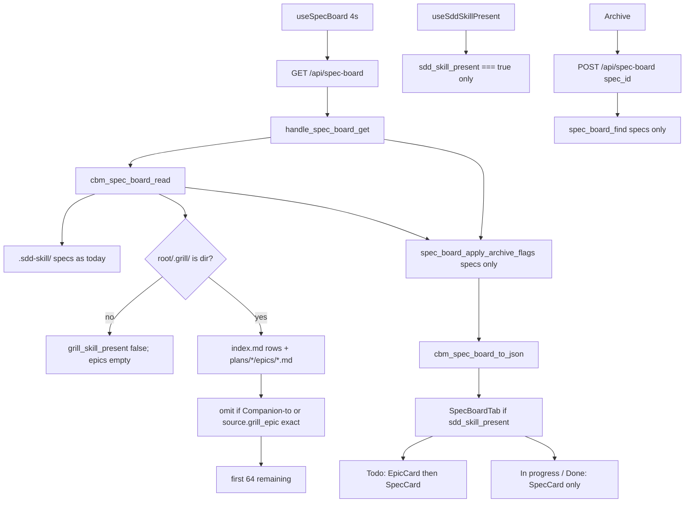

# Technical Plan — Spec-008: Grill epic Todo
Status: Final | Created: 2026-08-30
Spec: spec-008-g8r-grill-epic-todo | Mode: FEATURE | Stack: unchanged

## Executive Summary
GET `/api/spec-board` stays the only board read. The C skill-file reader grows a second zero-write walk of `.grill/` and emits additive `grill_skill_present` plus a separate `epics[]` (cap 64, independent of specs 64). Conversion is a read-side exact path match against listed spec.md `Companion to:` tokens and `active.json.source.grill_epic`. CBM does not write, move, or rename `.grill/` or `.sdd-skill/`.

HTTP stays the spec-006 shape: `cbm_spec_board_read` → archive merge onto `specs[]` only → `cbm_spec_board_to_json`. POST `/api/spec-board` stays spec-only; an epic `id` is 404 `spec not found` because `spec_board_find` never looks in `epics[]`.

graph-ui Specs tab still omit-until `sdd_skill_present === true`. Todo concatenates epic cards then spec cards. New `EpicCard` shows letter E + title + summary + plan_title + id; no expand, no Archive, no POST. In progress and Done stay spec-only.

No new MCP tool. No second poll URL. Do not read `.gamedev/`. Do not emit `gamedev_skill_present` on this GET. `colorForLabel` / EdgeLines hex / `formatIndexedAt` stay locked.

## Technology Stack
Unchanged packages. Do not add npm or C libraries.

| Component | Tech | Version | Rationale |
| graph-ui | React + react-dom | ^19.0.0 | existing SpecBoardTab |
| graph-ui | TypeScript | ^5.7.0 | existing |
| graph-ui | Vite | ^6.4.3 | existing |
| graph-ui | Tailwind | ^4.1.0 | spec-001 tokens + one chrome var |
| graph-ui | Vitest + Testing Library | ^4.1.0 / ^16.1.0 | fetch-mock / hook-mock |
| engine | C11 | Makefile.cbm | spec_board.c + HTTP |
| SQLite | vendored | existing | untouched (no new table) |
| HTTP | GET+POST `/api/spec-board` | existing path | GET additive; POST spec-only |

## System Architecture


Flow:
1. GET: `resolve_project_root_path` (unchanged 400/404). Heap `cbm_spec_board_t`. `cbm_spec_board_read(root)`: sdd fill as today; `grill_skill_present = cbm_is_dir(root/.grill)`; if true, walk grill and fill `epics[]` (skip unreadable, omit converted, cap 64). Archive merge still specs-only. `to_json` adds the two additive keys. Missing `.grill/` → flag false, `epics: []`, still 200 when the project exists.
2. Grill walk is independent of sdd presence: if `.grill/` exists and `.sdd-skill/` does not, GET may still list epics (no conversion tokens). The Specs tab stays hidden (`useSddSkillPresent` unchanged). Epic-002 owns showing the tab.
3. POST: unchanged contract. `spec_board_find` iterates `specs[]` only. Epic path as `spec_id` → 404 `{"error":"spec not found"}`, no store write, no skill-file write.
4. UI: Todo document order = `board.epics` (missing treated as `[]`) then `specs` with `column==="todo"`. In progress / Done ignore `epics`. `EpicCard` is not a title-expand control and does not call `persistArchive`.

## Directory Structure
```
src/ui/spec_board.h              EDIT — grill_skill_present; epic cap + entry; board.epics
src/ui/spec_board.c              EDIT — grill dir check; index.md + epic.md walk; conversion; to_json
src/ui/http_server.c             EDIT — none required for GET/POST dispatch; POST find stays specs-only
tests/test_spec_board.c          EDIT — grill Gherkin: match/order/cap/skip/present/to_json
tests/test_httpd.c               EDIT — GET additive JSON; POST epic id 404; GET byte-identical trees
Makefile.cbm                     DO NOT CHANGE (no new .c)
graph-ui/src/lib/types.ts        EDIT — SpecBoardEpic; SpecBoard.grill_skill_present + epics
graph-ui/src/lib/i18n.ts         DO NOT CHANGE unless a new string is required (letter E is literal)
graph-ui/src/styles/globals.css  EDIT — --color-epic-mark only (chrome @theme)
graph-ui/src/components/SpecBoardTab.tsx
graph-ui/src/components/SpecBoardTab.test.tsx
graph-ui/src/hooks/useSddSkillPresent.ts  DO NOT CHANGE
graph-ui/src/hooks/useSpecBoard.ts        DO NOT CHANGE (poll 4000; same GET)
graph-ui/src/lib/formatIndexedAt.ts       DO NOT CHANGE
graph-ui/src/lib/colors.ts                DO NOT CHANGE
src/mcp/mcp.c                             DO NOT CHANGE (no board tool)
```

`@sdd-*` breadcrumbs on every new/substantially edited file (constitution VII.2).

## Database Schema
None. No new SQLite table. `spec_archive` merge stays spec-006. Do not store epic↔spec links in CBM.

## API Contracts
Prefer existing HTTP. No new path. No new MCP tool. GET `/api/skill-presence` stays unused by this tab (pre-existing `gamedev_skill` check is out of this spec; do not call it from spec-board GET).

### GET /api/spec-board?project=<name>
Unchanged status codes: 400 missing project, 404 `{"error":"project not found"}`, 500 OOM/serialize, 200 otherwise.

Live 200 body — additive keys. Spec objects keep spec-005/006 fields. They do not gain `kind`.

```
{
  "sdd_skill_present": true|false,
  "grill_skill_present": true|false,
  "specs": [ { ...unchanged spec-006 fields, no "kind"... } ],
  "epics": [
    {
      "kind": "epic",
      "id": ".grill/plans/<slug>/epics/epic-NNN-<name>.md",
      "title": "<epic.md name>",
      "summary": "<epic.md summary>",
      "plan_title": "<index.md title or plan.md title>",
      "column": "todo"
    }
  ]
}
```

| Field | Rule |
| grill_skill_present | true iff `root_path/.grill` exists as a directory (`cbm_is_dir`). File-at-path or missing → false |
| epics | omitted converted + unreadable skipped; length ≤ 64; missing key on old mocks → UI treats as `[]` |
| epics[].kind | always `"epic"` |
| epics[].id | relative from project root, starts with `.grill/plans/`, ends `.md`. Size cap 256 |
| epics[].title | epic.md line-start `name:` value. Empty if missing |
| epics[].summary | epic.md line-start `summary:` value (1 line). Do not reuse spec `blurb` extract. Cap 512 |
| epics[].plan_title | index.md table title for that slug; else plan.md YAML frontmatter `title:`; else the slug |
| epics[].column | always `"todo"` |
| specs[].kind | not emitted this spec |
| has_more | never emitted |

Caps: `CBM_SPEC_BOARD_MAX_SPECS` 64, `CBM_SPEC_BOARD_MAX_EPICS` 64, `CBM_SPEC_BOARD_MAX_TASKS` 48. Filling the epic cap does not reduce spec slots.

### POST /api/spec-board
Unchanged. Body `{project, spec_id, archived}`. Lookup is `specs[]` only.

| Status | Body | When |
| 404 | `{"error":"spec not found"}` | `spec_id` is an epic path (or any id not on `specs[]`) |
| 404 | `{"error":"project not found"}` | unknown project (same string as GET) |

No persist on that 404. epic.md and active.json stay byte-identical.

### Forbidden
- New `/api/grill-board` or a second poll
- New MCP board tool
- Putting epic objects inside `specs[]`
- `"kind":"spec"` on spec entries this spec
- Writing `.grill/` or `.sdd-skill/`
- Reading `.gamedev/` from spec-board GET / `cbm_spec_board_read`
- Emitting `gamedev_skill_present` on this GET
- Showing Specs when only `grill_skill_present` (epic-002)
- Has-more chrome or a JSON field named `has_more`
- Changing `formatIndexedAt` or `colorForLabel` / EdgeLines hex
- Changing spec-005 expand or spec-006 Archive rules for spec cards

## Answers to Questions for Architect

### Exact epic JSON field names
`summary` and `plan_title`. Do not reuse spec `blurb` (that is Executive Summary extract, 512 B, SDD-ADR-025). Do not name the plan field `plan` (ambiguous with slug vs title). Gherkin Then clauses use these names. Title stays `title` (= epic.md `name:`).

### Whether `kind` is also added onto spec entries
Only on epics, value `"epic"`. Spec entries do not get `"kind":"spec"` this spec. Array membership (`specs` vs `epics`) is the discriminator. Grill ADR-006 stays satisfied: a later gamedev plan can add a third array or additive `kind` without rewriting this GET family. Adding unused `kind` on every spec would churn spec-006 JSON tests for no Gherkin Then.

### Where `.grill/` parse lives
In `spec_board.c`, called from `cbm_spec_board_read`. Not a sibling reader called from HTTP. Evidence: `handle_spec_board_get` is read → archive merge → to_json (SDD-ADR-030). Archive merge is CBM SQLite. Grill is skill-tree fopen, same class as sdd reads already in this file. HTTP must not grow skill-tree IO. Conversion needs listed spec.md + `active.json` already opened here.

Public API stays `spec_board.h`. Do not add `grill_board.c` this spec (no Makefile.cbm change). Mark a `/* grill */` section with static helpers.

### Exact "E" token/hex
Chrome CSS variable `--color-epic-mark: #7d8ec9` in `graph-ui/src/styles/globals.css` `@theme inline` (same block as other chrome tokens). EpicCard letter uses `text-[var(--color-epic-mark)]`. Literal `"E"` in the DOM (same en/zh; not an i18n word; no "Epic"; no pill/badge).

Not health: not `--color-destructive` `#e05252`, not TaskList emerald, not blocked amber. Not graph: not any `colorForLabel` hex (Function `#06b6d4`, Class `#a855f7`, File `#3b82f6`, …) and not EdgeLines CALLS `#1DA27E` / default `#1C8585` / TRPC `#a78bfa` / CROSS_TRPC `#c4b5fd`. Dusty periwinkle, mid saturation, readable on `bg-card`.

### How index.md is parsed vs missing catalog
Parse GFM table rows only. Skip the header row (`slug` in the slug cell) and separator rows (`---` in the slug cell). Skip non-`|` lines (the `# .grill/` title). Split on `|`; trimmed cell 1 = slug, cell 2 = title (leading empty cell before the first pipe). Row order is plan-group order.

Fallback: `cbm_opendir(root/.grill/plans)`. A plan directory not listed in index.md is appended after indexed slugs, `strcmp` ascending on the directory name. Missing or unreadable `index.md`: every plan dir is "unlisted" → slug ascending, titles from plan.md `title:` else slug. Within a plan, files matching `epic-NNN-*.md`; sort by NNN numeric; skip other names.

## Key Decisions
- Same GET; additive `grill_skill_present` + separate `epics[]`; `kind` only on epics → SDD-ADR-035
- Grill walk in `spec_board.c` / `cbm_spec_board_read`; HTTP stays archive merge → SDD-ADR-036
- Epic JSON `summary` + `plan_title`; conversion exact path; index.md table then slug-asc → SDD-ADR-037
- Letter E uses `--color-epic-mark #7d8ec9` chrome exception → SDD-ADR-038

Planner defaults 1–10 frozen. Grill ADR-001 (display-only Mixed Todo; tab-without-sdd is epic-002 here), ADR-002, ADR-003, ADR-004, ADR-005, ADR-006 (no `.gamedev/` read), ADR-007, ADR-008 apply.

## Performance Targets
| Target | Value |
| GET | existing 4s poll; extra opendir + bounded fopen of epic.md (stop filling at 64) |
| POST | unchanged |
| Poll | `useSpecBoard` 4000 ms unchanged |
| Caps | 64 specs / 64 epics / 48 tasks |
| Dashboard / Graph / ADR | 0 new RPCs; 0 `get_graph_schema` |
| Coverage | >80% on touched spec_board + httpd Gherkin + SpecBoardTab (reporter may be absent) |

## Security Considerations
- Loopback bind/auth unchanged. Do not widen.
- Grill paths: join `root_path` + `/.grill/plans/` + readdir name + `/epics/` + filename. Reject dirent names containing `/`, `\`, or `..`. Do not fopen a Companion-to token as a path (match is `strcmp` against constructed relative ids).
- POST `spec_id` is still looked up on `specs[]` only, never used as a filesystem path into `.grill/`.
- JSON escape epic `id` / `title` / `summary` / `plan_title` via `cbm_json_escape`.
- UI renders E / title / summary / plan_title as text, not HTML.
- GET and epic UI are zero-write (constitution I.2). Snapshot epic.md, index.md, active.json bytes around GET and around POST-with-epic-id.
- Do not follow this spec into `/api/skill-presence` (existing `.gamedev/` stat stays that endpoint's problem, not this GET).

## Testing Strategy
C board: `tests/test_spec_board.c` fixtures under `/tmp` (`th_mktempdir`). Never the real repo `.grill/` or `.sdd-skill/`. fopen rb only.

C HTTP: `tests/test_httpd.c` existing `ui_spec_board_get` / `ui_spec_board_post`. POST epic id 404 + byte snapshots. Unknown project 404 unchanged.

Vitest: mock `useSpecBoard` (same as today). Missing `epics` / `grill_skill_present` must not crash (host tests). No live daemon. Playwright optional (constitution IX.4).

Gherkin → owner:

| Gherkin scenario | Primary test |
| Mixed Todo paints an unconverted epic then a planned spec | `test_spec_board.c` JSON + `SpecBoardTab.test.tsx` |
| Companion-to exact path omits the epic | `test_spec_board.c` + GET bytes |
| active.json source.grill_epic omits the epic | `test_spec_board.c` |
| Companion-to trailing notes still match | `test_spec_board.c` |
| Done spec claiming an epic still omits it from Todo | `test_spec_board.c` + Vitest Done has no epic id |
| Limit — two plans follow index.md then epic-NNN then specs | `test_spec_board.c` array order + Vitest document order |
| Limit — closed plan leftover unconverted epic stays | `test_spec_board.c` |
| Limit — pending and detailed both listed | `test_spec_board.c` |
| Limit — missing Companion-to keeps epic beside similarly named spec | `test_spec_board.c` + Vitest |
| Limit — 65th epic omitted; spec slots stay 64; no has_more | `test_spec_board.c` + Vitest no "Has more" |
| Limit — epic card does not expand or archive | `SpecBoardTab.test.tsx` |
| Limit — no .grill directory | `test_spec_board.c` |
| Limit — Specs tab still requires sdd_skill_present | `useSddSkillPresent.test.ts` stays; SpecBoardTab host + strip tests |
| Error — unreadable epic skipped; GET 200 | `test_spec_board.c` (dir-at-path like spec.md) |
| Error — POST archive with epic id is 404; no writes | `test_httpd.c` |
| Error — unknown project on GET is 404 | `test_httpd.c` (existing; keep green) |
| Error — GET does not write skill trees | `test_httpd.c` or `test_spec_board.c` byte snapshots |

Existing host tests (no picker when project set; loading / not-sdd-skill) stay green. Mocks `{ sdd_skill_present, specs }` without `epics` still work.

## Deployment Plan
- `scripts/build.sh --with-ui` (C + embed UI).
- No env var. No daemon flag. No schema migration.
- Old UIs ignore unknown `grill_skill_present` / `epics`. New UI treats missing as false / `[]`.

## Risks & Mitigation
| Risk | Probability | Impact | Mitigation |
| HTTP grows a second grill reader | med | splits skill IO; archive merge confusion | ADR-036: parse in spec_board.c only |
| Epics stuffed into specs[] | med | SpecCard expand/archive on epic ids; cap collision | ADR-035 separate array; POST find specs-only |
| kind on specs churns JSON tests | med | noise, no Gherkin | kind only on epics |
| E uses health or graph hex | med | constitution III / SDD-ADR-005 | lock #7d8ec9 + keep colorForLabel test |
| Fuzzy kebab hide | low | false omit | exact `strcmp` on full relative path |
| Tab shows on grill-only | med | epic-002 leak | do not edit useSddSkillPresent |
| index.md prose confused with rows | med | wrong order | GFM `|` rows only; header/separator skip |
| 65 fopen then drop | low | extra IO | stop appending at cap 64 |
| Companion-to fopen as path | med | traversal | string match only |
| Existing to_json exact-string tests | high | Task #1 red | accept additive keys; empty epics when no .grill |

## Success Criteria
- [ ] All 6 US + all 17 Gherkin scenarios have a C and/or Vitest owner
- [ ] GET is the only board read; POST stays spec-only
- [ ] Zero writes to `.grill/` or `.sdd-skill/` from this feature
- [ ] Zero epic cards in In progress or Done
- [ ] Specs tab still omit-until sdd; `grill_skill_present` emitted
- [ ] Graph hex and last-indexed TZ unchanged
- [ ] @implementer can execute without a sibling HTTP reader or MCP tool

## External Integrations & Special Tools

| Tool | Type | Purpose | Tasks | Setup | Fallback |
| grill-skill `.grill/` tree | skill filesystem (read-only) | index.md + epic.md + plan.md | #1–#4 | none in CBM; fixtures in /tmp | missing dir → flag false, epics [] |
| GET `/api/spec-board` | existing HTTP | additive board JSON | #1–#4 | daemon in prod; C + fetch mock in tests | 404 unknown project; 200 empty epics |
| codebase-memory-mcp graph | session MCP | architect INIT only | — | mcp_idx=yes | file read (done) |

No new MCP tool. Do not call `index_repository`.

## Constitution validation
Checked against `.sdd-skill/docs/constitution.md` (draft — not rewritten):
- I.1–I.2: frozen spec only; no cycle-file writes to `.sdd-skill/` or `.grill/`
- II: C11 `cbm_`; React 19; no new CSS file (token in existing globals.css); letter E not i18n; no new runtime
- III: chrome grayscale except the one documented E hue; `colorForLabel` locked
- IV.3: same GET/POST family; no sibling board path
- IV.4: no second freshness field
- V: every Gherkin mapped; C + Vitest; no live daemon for UI
- VI: loopback unchanged; path join sanitized; no secrets
- VII: epic id text visible; breadcrumbs
- VIII: no `get_graph_schema` on this path; poll stays 4s
- IX.2: spec-005 expand + spec-006 archive stay on spec cards; spec-007 `formatIndexedAt` untouched

No constitution edit this spec (IX.2 append is @planner at close).

## Implementation breadcrumbs for @implementer
1. Do not add `/api/grill-board` or an MCP board tool.
2. Do not write `.grill/` or `.sdd-skill/`. fopen `"rb"` only.
3. Do not put grill opendir in `http_server.c`. Fill in `cbm_spec_board_read`.
4. Do not put epic objects in `specs[]`. Do not emit `kind` on specs.
5. JSON fields: `summary`, `plan_title`, `kind`, `column`, `id`, `title`. Not `blurb`, not `plan`.
6. Do not emit `has_more` or `gamedev_skill_present` on this GET.
7. Do not read `.gamedev/` from spec_board read/to_json. Leave `cbm_spec_board_gamedev_skill_present` wired only to `/api/skill-presence`.
8. Do not change `useSddSkillPresent` (`sdd_skill_present === true` only).
9. Do not change poll interval, spec-005 expand Set, spec-006 Archive, or `formatIndexedAt`.
10. Do not edit `colors.ts` / EdgeLines hex. E uses `--color-epic-mark` only.
11. Companion-to: first `.grill/plans/` … `.md` on a line that contains `Companion to:`; trailing notes after `.md` ignored. `strcmp` to epic `id`.
12. `source.grill_epic` from yyjson `source` object; exact string.
13. index.md: table data rows only. Unlisted plan dirs after, slug asc. NNN numeric within a plan.
14. Cap 64 epics after omit; 65th eligible not in JSON. Spec cap unchanged.
15. Unreadable epic (fopen fail / dir-at-path): skip; still 200.
16. POST with epic id: existing 404; do not add an "epic not found" string.
17. Heap-only `cbm_spec_board_t` (already calloc). `companion_grill` on spec entries is internal, not JSON.
18. Existing host mocks without `epics` must not throw.
19. Todo count includes epic cards + spec todo cards.
20. EpicCard: visible id text (Gherkin); letter E; no Archive/Unarchive; no "No tasks planned yet"; activating it does not POST.
21. Breadcrumb headers on touched files.
22. Fixtures in `/tmp` only.
23. `CBM_SPEC_BOARD_MAX_EPICS` 64 in spec_board.h next to the spec cap.
24. Stop filling epics at cap; do not invent overflow chrome.
