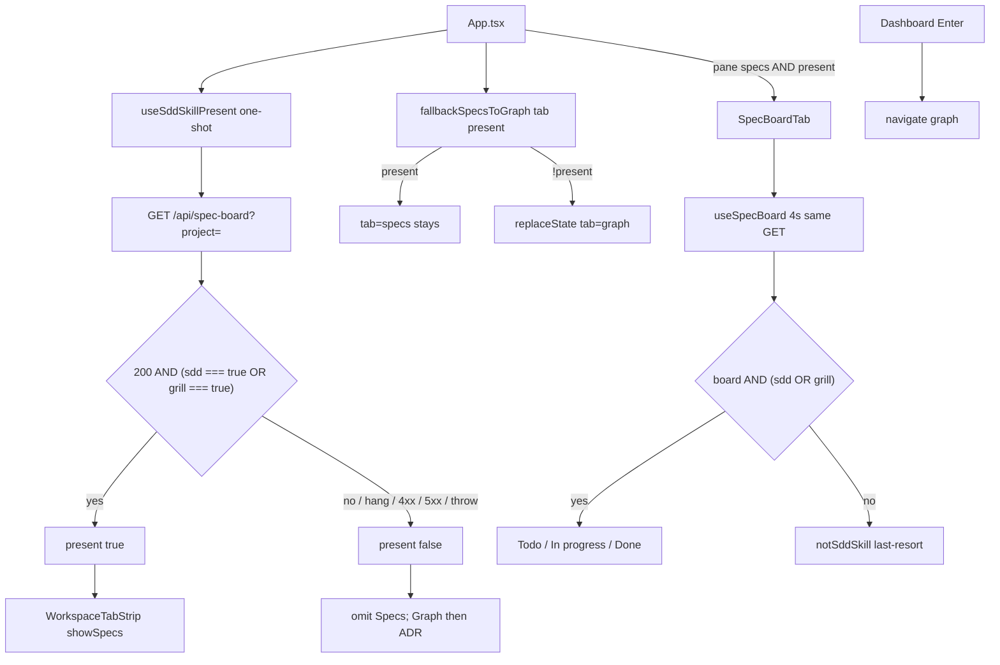

# Technical Plan — Spec-009: Specs tab grill presence
Status: Draft | Created: 2026-08-30
Spec: spec-009-t4x-specs-tab-grill-presence | Mode: FEATURE | Stack: unchanged

## Executive Summary
GET `/api/spec-board` already emits `grill_skill_present` and fills `epics[]` when `.grill/` exists without `.sdd-skill/` (spec-008 / `cbm_spec_board_read` + `cbm_spec_board_to_json`). The workspace strip still treats Specs as sdd-only: `useSddSkillPresent.bodyHasSkill` is `sdd_skill_present === true`, and `SpecBoardTab` replaces the Kanban with `notSddSkill` whenever sdd is false (even if grill is true).

This spec is graph-ui only. Presence becomes HTTP 200 AND (`sdd_skill_present === true` OR `grill_skill_present === true`) on the same one-shot GET. Hook export stays `useSddSkillPresent`. `fallbackSpecsToGraph` stays a boolean kernel. SpecBoardTab paints the Kanban on grill-only; `notSddSkill` remains last-resort when both flags are false (or `board` is null after load). No C/HTTP/MCP change. No second poll. No `.gamedev/` read. No `gamedev_skill_present` on this GET.

Tab label stays `tabs.specs` ("Specs"). Order when shown stays Graph | Specs | ADR. Enter / default workspace tab stays Graph. spec-008 Gherkin/tests that assert "Specs still requires sdd" / "grill true + sdd false → notSddSkill" are inverted or removed — not left green against the old Then.

## Technology Stack
Unchanged packages. Do not add npm or C libraries.

| Component | Tech | Version | Rationale |
| graph-ui | React + react-dom | ^19.0.0 | existing App + SpecBoardTab |
| graph-ui | TypeScript | ^5.7.0 | existing |
| graph-ui | Vite | ^6.4.3 | existing |
| graph-ui | Tailwind | ^4.1.0 | chrome tokens; no new CSS file |
| graph-ui | Vitest + Testing Library | ^4.1.0 / ^16.1.0 | fetch-mock / hook-mock |
| engine | C11 | Makefile.cbm | untouched (flags already on GET 200) |
| HTTP | GET `/api/spec-board` | existing path | one-shot strip; 4s poll stays pane-only |

## System Architecture


Flow:
1. Workspace mounts `useSddSkillPresent(project)` — one fetch, `setPresent(false)` until 200 + OR predicate. Never `setInterval(4000)`. Never `/api/skill-presence`.
2. `WorkspaceTabStrip` already takes `showSpecs={present}`. Graph | Specs | ADR when true; Graph | ADR when false. Label is `t.tabs.specs`.
3. `fallbackSpecsToGraph("specs", present)` rewrites to Graph while omitted (loading / neither / non-200). Grill-only `present === true` leaves `tab=specs`.
4. App mounts `SpecBoardTab` only when `paneTab === "specs" && present`. Host gate: Kanban if `board.sdd_skill_present === true || board.grill_skill_present === true`. Else existing `notSddSkill` copy (stale mount / both false / `!board` after load).
5. Enter stays `navigate("graph", name)`. Grill-only still shows the Specs tab and GraphTab.
6. `useSpecBoard` poll unchanged. Do not add a second presence GET. C GET shape unchanged.

Graph INIT (mcp_idx=yes): `useSddSkillPresent` callers = `App` + hook test. `fallbackSpecsToGraph` callers = `App` + route test. `cbm_spec_board_grill_skill_present` + `cbm_spec_board_to_json` already emit the flag. No missing 200 key.

## Directory Structure
```
graph-ui/src/hooks/useSddSkillPresent.ts        EDIT — bodyHasSkill: sdd OR grill; keep export name
graph-ui/src/hooks/useSddSkillPresent.test.ts    EDIT — invert sdd-only Then; grill-only / both / neither
graph-ui/src/hooks/useSpecBoard.ts               DO NOT CHANGE (POLL_MS 4000; same GET)
graph-ui/src/lib/route.ts                        DO NOT CHANGE (boolean kernel)
graph-ui/src/lib/route.test.ts                   DO NOT CHANGE unless comment-only
graph-ui/src/App.tsx                             EDIT only if comments/breadcrumbs; present wiring stays
graph-ui/src/App.test.tsx                        EDIT — mockAppFetch grill-only; strip/deep-link/Enter Gherkin
graph-ui/src/components/WorkspaceTabStrip.tsx    DO NOT CHANGE (showSpecs boolean)
graph-ui/src/components/WorkspaceTabStrip.test.tsx  DO NOT CHANGE
graph-ui/src/components/SpecBoardTab.tsx         EDIT — host gate sdd OR grill; last-resort both-false
graph-ui/src/components/SpecBoardTab.test.tsx    EDIT — invert spec-008 not-sdd-skill-when-grill; Kanban grill-only
graph-ui/src/lib/types.ts                        DO NOT CHANGE (flags already optional/required as today)
graph-ui/src/lib/i18n.ts                         DO NOT CHANGE (tabs.specs + notSddSkill stay)
graph-ui/src/lib/formatIndexedAt.ts              DO NOT CHANGE
graph-ui/src/lib/colors.ts                       DO NOT CHANGE
graph-ui/src/styles/globals.css                  DO NOT CHANGE
src/ui/spec_board.c                              DO NOT CHANGE
src/ui/http_server.c                             DO NOT CHANGE
src/mcp/mcp.c                                    DO NOT CHANGE
tests/test_spec_board.c                          DO NOT CHANGE unless flag emission regresses (then stop)
tests/test_httpd.c                               DO NOT CHANGE unless flag emission regresses (then stop)
Makefile.cbm                                     DO NOT CHANGE
```

`@sdd-*` breadcrumbs on every substantially edited file (constitution VII.2).

## Database Schema
None. No new SQLite table. `spec_archive` stays spec-006. Do not store presence.

## API Contracts
Prefer existing HTTP. No new path. No MCP board/presence tool. GET `/api/skill-presence` stays unused by the strip.

### GET /api/spec-board?project=<name>
Unchanged vs spec-008. Status codes unchanged (400 / 404 / 500 / 200). Additive keys already live:

```
{
  "sdd_skill_present": true|false,
  "grill_skill_present": true|false,
  "specs": [ ... ],
  "epics": [ ... ]
}
```

| Field | Strip / host rule this spec |
| sdd_skill_present | `=== true` counts as present |
| grill_skill_present | `=== true` counts as present; missing key → false |
| both false / missing grill + sdd false | omit Specs; `fallbackSpecsToGraph` → graph |
| HTTP not 200 / still in flight / throw | omit Specs |
| gamedev_skill_present | must not appear on this GET (spec-008; do not add) |
| has_more | never emitted |

POST `/api/spec-board` stays spec-only (epic id still 404 `spec not found`). Out of this spec's edits.

### Forbidden
- New `/api/skill-presence` call from the strip or a sibling presence URL
- Second poll for presence (`useSpecBoard` 4s stays board refresh only)
- New MCP tool
- Writing `.grill/` or `.sdd-skill/`
- Reading `.gamedev/` to decide the strip
- Emitting `gamedev_skill_present` on GET `/api/spec-board`
- Renaming the tab away from "Specs" / changing `tabs.specs`
- Changing Enter default away from Graph
- Changing Mixed Todo card rules, conversion, cap, EpicCard, archive, expand, `formatIndexedAt`, `colors.ts`
- Leaving spec-008 "Specs tab still requires sdd_skill_present" / "grill true + sdd false → notSddSkill" green against the old Then

## Answers to Questions for Architect

### Keep hook name `useSddSkillPresent` or rename?
Keep the export, file, and interface `UseSddSkillPresentResult`. Change `bodyHasSkill` only.

Rename is cheap (App import + hook + test). Rejected: SDD-ADR-010 already names this hook as the strip one-shot; Gherkin never names the hook; a file/export/interface rename is ceremony with no Then. Predicate + comments/`@human-debug` carry the OR. → SDD-ADR-039

### Keep `notSddSkill` as last-resort or drop the branch?
Keep last-resort. App mounts SpecBoardTab only when `present` is true, but `present` is one-shot while `useSpecBoard` polls: a later 200 with both flags false (or a test that mounts the host directly) can still reach the gate. Grill-only must not hit this branch (`grill_skill_present === true` → Kanban). Neither-skill omits the tab so the operator path does not open the pane. Existing `notSddSkill` copy is OK — no new i18n key. → SDD-ADR-040

Gate:

```
if (!board || !(board.sdd_skill_present === true || board.grill_skill_present === true)) {
  return notSddSkill;
}
```

Loading (`loading && !board`) stays the existing loading copy, not `notSddSkill`.

### Any C/HTTP work, or graph-ui only?
graph-ui only. Graph + spec-008 tests already emit `grill_skill_present` on 200 without sdd (`cbm_spec_board_grill_skill_present`, `cbm_spec_board_to_json`). Do not edit C/HTTP/MCP. Add C tests only if implementer finds a missing flag on an existing 200 — then stop and tell @architect; do not invent a C task. → SDD-ADR-041

Planner defaults 1–10 frozen. Grill ADR-001 (tab-without-sdd is this epic), ADR-006 (no `.gamedev/`), ADR-008 (same GET additive) apply.

## Key Decisions
- Keep `useSddSkillPresent`; present = 200 AND (sdd OR grill); missing grill = false → SDD-ADR-039
- Host Kanban on sdd OR grill; keep `notSddSkill` last-resort when both false / `!board` → SDD-ADR-040
- graph-ui only; no C/HTTP/MCP; no second poll → SDD-ADR-041

SDD-ADR-010 superseded in part (predicate only). One-shot GET, omit-while-loading, no skill-presence, no 4s strip poll stay.

## Performance Targets
| Target | Value |
| Strip | one GET `/api/spec-board` per workspace project; 0 setInterval 4000 |
| Poll | `useSpecBoard` 4000 ms unchanged; not used for strip membership |
| Dashboard / Graph / ADR | 0 new RPCs; 0 `get_graph_schema` |
| C GET | 0 extra fopen this spec |
| Coverage | >80% on touched graph-ui (reporter may be absent) |

## Security Considerations
- Loopback bind/auth unchanged. Do not widen.
- Presence is a boolean read of JSON already on GET 200. Do not fopen skill trees from graph-ui.
- GET 200 must leave `.grill/` and `.sdd-skill/` byte-identical (existing C; do not add writes).
- UI renders existing copy as text. No new HTML.
- Do not follow this spec into `/api/skill-presence` (existing `.gamedev/` stat stays that endpoint).

## Testing Strategy
Vitest + Testing Library. No live daemon. Playwright optional (constitution IX.4). English assertions.

C: do not add. Gherkin GET zero-write + no `gamedev_skill_present` stay owned by existing spec-008 `test_httpd.c` / `test_spec_board.c` (keep green if the suite is run).

Gherkin → owner (exactly one task per scenario):

| Gherkin scenario | Primary test | Task |
| Grill-only project shows the Specs tab | `App.test.tsx` strip order + a11y name | #3 |
| Grill-only Kanban paints an epic in Todo and empty spec columns | `SpecBoardTab.test.tsx` host | #2 |
| Deep-link tab=specs stays on Specs when grill-only | `App.test.tsx` | #3 |
| sdd plus grill still shows Specs | `App.test.tsx` | #3 |
| Limit — grill directory with no epics still shows Specs | `SpecBoardTab.test.tsx` pane (tab Then = Task #3 grill-only strip) | #2 |
| Limit — neither skill omits Specs and deep-link falls back to Graph | `App.test.tsx` | #3 |
| Limit — sdd-only without grill still shows Specs | `useSddSkillPresent.test.ts` present true | #1 |
| Limit — gamedev directory alone does not show Specs | `App.test.tsx` both flags false, no gamedev key in mock | #3 |
| Limit — Enter still opens Graph on a grill-only project | `App.test.tsx` | #3 |
| Error — GET 500 omits Specs | `App.test.tsx` (existing; keep green) | #3 |
| Error — GET 404 omits Specs | `useSddSkillPresent.test.ts` present false | #1 |
| Error — request still in flight omits Specs | `useSddSkillPresent.test.ts` present false | #1 |
| Error — GET does not write skill trees | existing spec-008 C; no new C | #3 |

Invert or delete, do not leave green:
- `useSddSkillPresent.test.ts`: "sets present true only on HTTP 200 and sdd_skill_present === true"
- `SpecBoardTab.test.tsx`: "does not show the picker when the project has no sdd-skill" (grill true → was notSddSkill)
- `SpecBoardTab.test.tsx`: "shows not-sdd-skill copy when sdd is false even if grill is true" (spec-008 Gherkin)

`fallbackSpecsToGraph` unit tests stay: `present` false → graph, true → specs. No signature change.

## Deployment Plan
- `scripts/build.sh --with-ui` (embed UI).
- No env var. No daemon flag. No schema migration.
- Old C already sends both flags. New UI ORs them. Old UI still sdd-only (acceptable; this binary ships the new UI).

## Risks & Mitigation
| Risk | Probability | Impact | Mitigation |
| spec-008 host/hook tests stay green on old Then | high | false close | invert/remove those its in the same tasks |
| App mock only toggles sdd | high | grill-only strip tests impossible | extend `mockAppFetch` with independent grill flag + optional epics |
| Drop notSddSkill entirely | med | stale poll both-false paints empty Kanban with tab still shown | ADR-040 last-resort |
| Rename hook mid-flight | med | missed App import / extra file churn | ADR-039 keep name |
| Second presence GET or poll | med | IV.3 / VIII | ADR-041; do not edit useSpecBoard |
| C "fix" for a flag that exists | low | scope leak | graph proved emission; no C task |
| gamedev-only shows Specs | low | ADR-006 leak | both flags false; do not read .gamedev/ |
| Enter default flipped to Specs | low | US-003 / IX.3 | do not edit Dashboard onSelectProject |

## Success Criteria
- [ ] All 5 US + all 13 Gherkin scenarios have exactly one Vitest (or existing C) owner
- [ ] Grill-only shows Specs + Kanban, not notSddSkill
- [ ] `?tab=specs` grill-only stays Specs; neither / hang / non-200 fallback Graph
- [ ] Enter still Graph; tab label Specs; order Graph \| Specs \| ADR
- [ ] Zero skill writes; zero new HTTP/MCP; zero second poll
- [ ] spec-008 sdd-only omit tests inverted
- [ ] @implementer can execute without a C change or hook rename

## External Integrations & Special Tools

| Tool | Type | Purpose | Tasks | Setup | Fallback |
| GET `/api/spec-board` | existing HTTP | flags + epics already on 200 | #1–#3 | fetch mock in tests | 404/500/hang omit Specs |
| grill-skill `.grill/` tree | skill filesystem (read-only, C already) | flag true without sdd | — | none this spec | missing dir → grill false |
| codebase-memory-mcp graph | session MCP | architect INIT only | — | mcp_idx=yes | file read (done) |

No new MCP tool. Do not call `index_repository`.

## Constitution validation
Checked against `.sdd-skill/docs/constitution.md` (draft — not rewritten):
- I.1–I.2: frozen spec only; no cycle-file writes
- II: React 19; no bare `any`; no new CSS file; `tabs.specs` unchanged; no new runtime
- III: chrome grayscale; no token change; `colorForLabel` locked
- IV.3: same GET; no new endpoint
- IV.4: no second freshness field
- V: every Gherkin mapped; Vitest; C only if emission regresses
- VI: loopback unchanged; no secrets
- VII: Specs tab accessible name; breadcrumbs
- VIII: no `get_graph_schema`; strip is one-shot
- IX.2: spec-005 expand + spec-006 archive + spec-007 `formatIndexedAt` + spec-008 EpicCard/order/cap stay
- IX.3: Enter still Graph

No constitution edit this spec (IX.2 append is @planner at close).

## Implementation breadcrumbs for @implementer
1. Do not rename `useSddSkillPresent` / the file / `UseSddSkillPresentResult`.
2. `bodyHasSkill`: `sdd_skill_present === true || grill_skill_present === true`. Missing grill → false. Strict `=== true`.
3. Do not edit `useSpecBoard` (no second poll). Do not call `/api/skill-presence`.
4. Do not change `fallbackSpecsToGraph` signature. App already passes `present`.
5. Do not change WorkspaceTabStrip product. Label key `tabs.specs`.
6. SpecBoardTab host: Kanban when sdd OR grill. Last-resort `notSddSkill` when `!board` or both flags false. Loading branch stays loading copy.
7. Grill-only MUST NOT show `notSddSkill`. Invert spec-008 host tests that assert that copy when grill is true.
8. Invert hook test that says present only when sdd is true.
9. Do not edit C, HTTP, MCP, Makefile.cbm. If a 200 is missing `grill_skill_present`, stop — do not invent C work.
10. Do not emit or mock-require `gamedev_skill_present`. Do not read `.gamedev/`.
11. Do not write `.grill/` or `.sdd-skill/`.
12. Do not change EpicCard, Mixed Todo order, conversion, cap, expand, archive, `formatIndexedAt`, `colors.ts`, `globals.css`.
13. Do not rename the tab. Do not change Enter away from Graph.
14. Extend `mockAppFetch` so sdd and grill are independent; optional `epics`. Default neither (existing `specBoard: "false"`) stays omit.
15. Deep-link grill-only: URL keeps `tab=specs`; GraphTab mock absent; SpecBoardTab mounted.
16. Neither-skill deep-link: `tab=graph`; Specs omitted. Keep the existing rewrite test as neither-skill (both false).
17. gamedev-only App test: 200 body with both flags false and no `gamedev_skill_present` key; Specs omitted. That is the UI Then. Do not add C.
18. GET zero-write: existing spec-008 C. Do not re-implement.
19. Breadcrumb headers on touched files (`@sdd-spec` this spec; `@sdd-decision` SDD-ADR-039..041).
20. Fixtures/mocks only. No live daemon. No Playwright unless @tester later requires CERTIFICATION.
