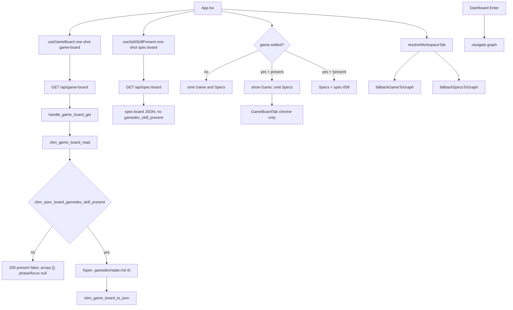

# Technical Plan — Spec-010: Game tab silent win
Status: Draft | Created: 2026-08-31
Spec: spec-010-c4h-game-tab-silent-win | Mode: FEATURE | Stack: unchanged

## Executive Summary
A path with `.gamedev/` as a directory gets a Game workspace tab and must not show Specs, even when `.sdd-skill/` and/or `.grill/` exist on the same root (grill ADR-001 silent win). Presence and chrome come from one new GET `/api/game-board?project=`. GET `/api/spec-board` stays gamedev-free. graph-ui never calls `/api/skill-presence`.

C adds a dedicated heap `cbm_game_board_t` (empty `inbox` / `preproduction` / `production` / `postproduction` this spec) plus `cbm_game_board_read` / `to_json` in a new `game_board.c`. Dir check reuses `cbm_spec_board_gamedev_skill_present`. `state.md` is fopen `"rb"` only.

graph-ui: closed set gains `game`. New `GameBoardTab` paints chrome only (phase label, focus, `/gamedev-skill continue`). `fallbackSpecsToGraph` stays a boolean kernel. Sibling `fallbackGameToGraph` plus a small `resolveWorkspaceTab` router send leftover `?tab=specs` to `tab=game` when gamedev is present. Dual one-shot fetch; in-flight omits Game and Specs.

No columns, cards, launcher, gate-review hint, MCP tool, or POST. Enter / default workspace tab stays Graph. Zero writes to skill trees.

## Technology Stack
Unchanged packages. Do not add npm or C libraries.

| Component | Tech | Version | Rationale |
| graph-ui | React + react-dom | ^19.0.0 | existing workspace shell |
| graph-ui | TypeScript | ^5.7.0 | existing |
| graph-ui | Vite | ^6.4.3 | existing |
| graph-ui | Tailwind | ^4.1.0 | chrome tokens; no new CSS file |
| graph-ui | Vitest + Testing Library | ^4.1.0 / ^16.1.0 | fetch-mock / hook-mock |
| engine | C11 | Makefile.cbm | new game_board.c + HTTP GET |
| SQLite | vendored | existing | untouched |
| HTTP | GET `/api/game-board` | new path | constitution IV.3 — spec-board stays gamedev-free |

## System Architecture


Flow:
1. Workspace mounts two one-shots: `useSddSkillPresent` (unchanged spec-009 GET spec-board) and `useGameBoard` (GET game-board). Never `setInterval`. Never `/api/skill-presence`.
2. `showGame` = game-board settled AND HTTP 200 AND `gamedev_skill_present === true`.
3. `showSpecs` = game-board settled AND NOT `showGame` AND spec-009 present (200 AND sdd OR grill). In-flight (`!settled`) omits both. game-board 500/throw: settled true, present false → omit Game; Specs follows spec-009.
4. Strip: `showGame` → Graph | Game | ADR. Else `showSpecs` → Graph | Specs | ADR. Else Graph | ADR. Never both Game and Specs.
5. URL: `resolveWorkspaceTab` applies `tab=specs` + `showGame` → `game` first, then `fallbackGameToGraph`, then `fallbackSpecsToGraph`. Inbound `tab=game` restore after omit-until-true (same idea as `pendingSpecsDeepLink`). Inbound `tab=specs` + gamedev present → `tab=game` (not Graph, not Specs).
6. Pane: `GameBoardTab` only when `paneTab === "game" && showGame`. Props = the one-shot board (no second fetch). No columns/cards.
7. Enter stays `navigate("graph", name)`.
8. C GET: `resolve_project_root_path` (same 400/404 strings as spec-board). Heap `cbm_game_board_t`. Read + to_json. No archive merge. No POST.

Graph INIT (mcp_idx=yes, project `Users-jmsolorzano-SWE-tools-codebase-memory-mcp`):
- `cbm_spec_board_gamedev_skill_present` (spec_board.c:1096) callers = `handle_skill_presence` + `spec_board_gamedev_presence` test. Not `cbm_spec_board_read` / `to_json`.
- `cbm_spec_board_read` inbound = `handle_spec_board_get` + `handle_spec_board_post` only.
- `dispatch_request` has `/api/spec-board*` and `/api/skill-presence*`. No game-board yet.
- `fallbackSpecsToGraph` callers = `App` + `route.test`. Boolean kernel; not enough for specs-on-gamedev.
- `useSddSkillPresent` callers = `App` + hook test. Keep; do not teach it game-board.
- `WORKSPACE_TABS` = `["graph","specs","adr"]`. `WorkspaceTabStrip` only `showSpecs`.
- bevy-tetris `.gamedev/state.md` is already compact `phase=02-production focus="..."`. Skill template 1.7.0+ is the same. Pre-1.7.0 files may still use `active_phase` / `director_focus` until an agent rewrites them (`/gamedev-skill update` does not migrate state.md).

## Directory Structure
```
src/ui/game_board.h                         NEW — cbm_game_board_t + read/to_json
src/ui/game_board.c                         NEW — dir reuse + state.md parse + empty arrays
src/ui/http_server.c                        EDIT — handle_game_board_get + dispatch GET only
src/ui/spec_board.c                         DO NOT CHANGE (read/to_json stay gamedev-free)
src/ui/spec_board.h                         DO NOT CHANGE (reuse gamedev present helper as-is)
Makefile.cbm                                EDIT — UI_SRCS += game_board.c; TEST_UI_SRCS += test_game_board.c
tests/test_game_board.c                     NEW — parse / present / empty arrays / bytes
tests/test_httpd.c                          EDIT — GET 200/400/404 + spec-board no gamedev field + no writes
src/mcp/mcp.c                               DO NOT CHANGE (no game-board tool)
src/discover/discover.c                     DO NOT CHANGE (do not add .gamedev to ALWAYS_SKIP this spec)
graph-ui/src/lib/types.ts                   EDIT — WORKSPACE_TABS + game; GameBoard type
graph-ui/src/lib/route.ts                   EDIT — fallbackGameToGraph + resolveWorkspaceTab
graph-ui/src/lib/route.test.ts              EDIT — lock `game` in closed set + kernels
graph-ui/src/lib/i18n.ts                    EDIT — tabs.game, state.md missing, phase labels (en+zh)
graph-ui/src/components/WorkspaceTabStrip.tsx
graph-ui/src/components/WorkspaceTabStrip.test.tsx
graph-ui/src/components/GameBoardTab.tsx    NEW — chrome only
graph-ui/src/components/GameBoardTab.test.tsx
graph-ui/src/hooks/useGameBoard.ts          NEW — one-shot GET /api/game-board
graph-ui/src/hooks/useGameBoard.test.ts
graph-ui/src/hooks/useSddSkillPresent.ts    DO NOT CHANGE
graph-ui/src/hooks/useSpecBoard.ts          DO NOT CHANGE
graph-ui/src/components/SpecBoardTab.tsx    DO NOT CHANGE (JSON shape / Kanban)
graph-ui/src/App.tsx                        EDIT — dual fetch, showGame/showSpecs, restore, pane
graph-ui/src/App.test.tsx                   EDIT — mockAppFetch gameBoard; silent-win / deep-link Gherkin
graph-ui/src/lib/formatIndexedAt.ts         DO NOT CHANGE
graph-ui/src/lib/colors.ts                  DO NOT CHANGE
graph-ui/src/styles/globals.css             DO NOT CHANGE
```

`@sdd-*` breadcrumbs on every new/substantially edited file (constitution VII.2).

## Database Schema
None. No new SQLite table. Do not store gamedev presence or chrome. `spec_archive` stays spec-006.

## API Contracts
New path required (constitution IV.3): spec-board must not emit `gamedev_skill_present`. No MCP game-board tool. No POST `/api/game-board`.

### GET /api/game-board?project=<name>
Only new HTTP path this spec.

| Status | Body | When |
| 400 | `{"error":"missing project parameter"}` | missing or empty `project` |
| 404 | `{"error":"project not found"}` | unknown catalog name (same string as spec-board) |
| 500 | `{"error":"out of memory"}` or `{"error":"board serialization failed"}` | calloc / to_json fail (same class as spec-board) |
| 200 | game-board JSON | known project, with or without `.gamedev/` |

200 body — all keys always present:

```
{
  "gamedev_skill_present": true|false,
  "phase": "01-preproduction"|"02-production"|"03-postproduction"|null,
  "focus": "<string>"|null,
  "continue": "/gamedev-skill continue"| "",
  "inbox": [],
  "preproduction": [],
  "production": [],
  "postproduction": []
}
```

| Field | Rule |
| gamedev_skill_present | `cbm_spec_board_gamedev_skill_present(root)` — true iff `root/.gamedev` is a directory |
| phase | when present and parse yields one of the three tokens → that token; else JSON `null`. Never English labels |
| focus | when present and parse yields a value → string (cap 512); else `null` |
| continue | present true → always `/gamedev-skill continue`. present false → `""` |
| inbox, preproduction, production, postproduction | always `[]` this spec (counts 0). Do not omit keys |

Present true + missing/unreadable `state.md`: phase null, focus null, continue set, arrays [].
Present false: phase null, focus null, continue `""`, arrays [].
Empty `.gamedev/` directory still present true.

### GET /api/spec-board
Unchanged. Must not emit `gamedev_skill_present`. Must not call `cbm_spec_board_gamedev_skill_present` from read/to_json.

### GET /api/skill-presence
Pre-existing. graph-ui must not call it. Do not change the handler.

### Forbidden
- POST `/api/game-board` or MCP game-board tool
- Emitting `gamedev_skill_present` on spec-board
- graph-ui fetch whose path contains `/api/skill-presence`
- Writing `.gamedev/`, `.sdd-skill/`, or `.grill/`
- Painting column headers or artifact cards
- Launcher button or gate-review hint
- Changing Enter default away from Graph
- Reusing `SpecBoardTab` as the Game host
- Collapsing the two fallbacks into one opaque function with no sibling kernels
- Thin JSON builder without `cbm_game_board_t` array slots

## Answers to Questions for Architect

### One Game pane vs reuse SpecBoardTab chrome only
NEW `GameBoardTab` (chrome only). Do not mount or subclass `SpecBoardTab`. Silent win must not paint Specs Kanban (Todo/EpicCard/Archive) on a gamedev path.

May copy chrome/token patterns: grayscale `bg-card` / `text-foreground` / 12px type, `useUiMessages`, accessible text — not the Kanban host gate, `useSpecBoard` poll, or spec-board JSON.

`SpecBoardTab.tsx` is do-not-change this spec. → SDD-ADR-042

### fallbackSpecsToGraph sibling vs one presence router
Keep `fallbackSpecsToGraph(tab, present)` as the boolean kernel (signature unchanged). Add `fallbackGameToGraph(tab, present)` with the same shape (`tab === "game" && !present` → `"graph"`).

Add small `resolveWorkspaceTab(tab, specsPresent, gamePresent)` that applies in this order:
1. `tab === "specs" && gamePresent` → `"game"` (not Graph)
2. `fallbackGameToGraph`
3. `fallbackSpecsToGraph`

Do not hide the two different fallbacks inside one undocumented function. App uses `showGame` / `showSpecs` (settled-aware) as the booleans passed into the router for pane + URL after settle. → SDD-ADR-043

### state.md parse keys
Evidence:
- Skill template (`~/.claude/skills/gamedev-skill/references/templates/state.md`): compact `phase=` / `focus=`.
- Real bevy-tetris `.gamedev/state.md`: compact `phase=02-production focus="..."`.
- Skill versioning.md: pre-1.7.0 on-disk names `active_phase` / `director_focus` (markdown table). `/gamedev-skill update` does **not** rewrite state.md. Next agent write migrates. CBM is not an LLM — compact-only would leave chrome empty on leftover files.

Parse this spec (fopen `"rb"`, never write):

| Priority | Keys | Shape |
| 1 | `phase` | compact `phase=` (spec_board-style `kv_extract`, quoted or unquoted) |
| 2 | `active_phase` | compact `active_phase=` OR line-start `active_phase:` |
| 1 | `focus` | compact `focus=` (quoted string may contain spaces) |
| 2 | `director_focus` | compact `director_focus=` OR line-start `director_focus:` |

Prefer compact `phase` / `focus` when both generations exist. Scan the whole file (legacy is not line-1-only). Emit JSON `phase` only if the value is exactly `01-preproduction` | `02-production` | `03-postproduction`; otherwise null. Focus cap 512. Missing file, fopen fail, or dir-at-path → unreadable (phase/focus null, continue still set when present). → SDD-ADR-044

### Heap: cbm_game_board_t now vs thin builder
Dedicated `cbm_game_board_t` now, heap calloc only (same class as spec-board — never stack). Empty array slots + counts 0 so epic 002 fills the same struct and GET path. Thin sprintf-only builder would be ripped later.

```
cbm_game_board_card_t { id[256], title[256] }  /* unused this spec */
cbm_game_board_t {
  bool gamedev_skill_present;
  char phase[32];     /* empty → JSON null */
  char focus[512];    /* empty → JSON null */
  char continue_cmd[64];
  cbm_game_board_card_t inbox[CBM_GAME_BOARD_MAX_CARDS];
  int inbox_count;    /* 0 */
  /* same for preproduction, production, postproduction */
}
```

`CBM_GAME_BOARD_MAX_CARDS` 64 (epic 002 cap; this spec never fills). New files `game_board.h` / `game_board.c` — do not grow gamedev fopen inside `spec_board.c` (read/to_json stay gamedev-free). Makefile.cbm must list the new .c. → SDD-ADR-045

Planner defaults 1–10 frozen. Grill ADR-001 (silent win), ADR-009 (map not launcher) apply.

## Key Decisions
- NEW GameBoardTab chrome only; do not reuse SpecBoardTab host → SDD-ADR-042
- Keep fallbackSpecsToGraph; add fallbackGameToGraph + resolveWorkspaceTab (specs-on-gamedev → game) → SDD-ADR-043
- Parse compact `phase=` / `focus=`; tolerate `active_phase` / `director_focus` aliases → SDD-ADR-044
- Dedicated `cbm_game_board_t` now with empty array slots; new GET family → SDD-ADR-045

Constitution IV.3: new endpoint is required because spec-board must stay gamedev-free. NOTE for @planner at close: IX.2 append — Specs = spec-009 AND game-board settled AND NOT gamedev (gamedev from game-board only). Do not edit constitution.md this turn.

## Performance Targets
| Target | Value |
| Strip | one GET `/api/game-board` + one GET `/api/spec-board` per workspace project |
| Poll | `useSpecBoard` 4000 ms unchanged; no game-board interval |
| GET game-board | one dir stat + optional one state.md fopen; arrays stay 0 |
| Dashboard / Graph / ADR | 0 `get_graph_schema` from this feature |
| Coverage | >80% on touched game_board + httpd Gherkin + GameBoardTab / App / route (reporter may be absent) |

## Security Considerations
- Loopback bind/auth unchanged. Do not widen.
- Path is fixed suffix `root/.gamedev/state.md`. Do not fopen query/body strings as paths.
- fopen `"rb"` only. Snapshot `.gamedev/`, `.sdd-skill/`, `.grill/` bytes around GET (trees must stay byte-identical; missing trees must not be created).
- JSON-escape `phase` / `focus` / `continue` via `cbm_json_escape`. UI renders as text, not HTML.
- `continue` is a display/copy string, not a process spawn.
- Do not follow this spec into `/api/skill-presence` from graph-ui.

## Testing Strategy
C: `tests/test_game_board.c` fixtures under `/tmp` (`th_mktempdir`). Never the real bevy-tetris or repo skill trees. HTTP: `tests/test_httpd.c` helper `ui_game_board_get` mirroring `ui_spec_board_get`.

Vitest + Testing Library. No live daemon. Playwright optional (constitution IX.4). English assertions.

`mockAppFetch` default `gameBoard` = HTTP 200 + `gamedev_skill_present: false` so existing spec-009 Specs tests stay green. Hang / 500 / present-true are explicit options.

Gherkin → owner (exactly one primary task per scenario):

| Gherkin scenario | Primary test | Task |
| gamedev-only project shows the Game tab | `App.test.tsx` strip order + a11y name | #4 |
| silent win hides Specs when sdd and grill also exist | `App.test.tsx` | #4 |
| Game chrome shows phase, focus, and continue | `GameBoardTab.test.tsx` | #3 |
| Deep-link tab=game stays when gamedev is present | `App.test.tsx` | #4 |
| Deep-link tab=specs on a gamedev path becomes tab=game | `App.test.tsx` | #4 |
| grill-only without gamedev still shows Specs and not Game | `App.test.tsx` | #4 |
| Limit — empty gamedev directory still shows Game | `GameBoardTab.test.tsx` pane; C parse in #1 | #3 |
| Limit — GET 200 with present false omits Game | `App.test.tsx` | #4 |
| Limit — Enter still opens Graph on a gamedev project | `App.test.tsx` | #4 |
| Limit — game-board 200 present true emits empty column arrays | `test_game_board.c` + `test_httpd.c` | #1 |
| Limit — spec-board still has no gamedev field | `test_httpd.c` (keep + assert) | #1 |
| Limit — sdd-only without gamedev still shows Specs | `App.test.tsx` | #4 |
| Limit — inbound tab=game restores after omit-until-true | `App.test.tsx` | #4 |
| Error — game-board still in flight omits Game and Specs | `App.test.tsx` | #4 |
| Error — game-board 500 omits Game and does not hide Specs | `App.test.tsx` | #4 |
| Error — unknown project is 404 | `test_httpd.c` | #1 |
| Error — missing project query is 400 | `test_httpd.c` | #1 |
| Error — tab=game without gamedev falls back to Graph | `App.test.tsx` | #4 |
| Error — GET does not write skill trees | `test_httpd.c` bytes; App asserts no skill-presence | #1 + #5 |

Task #2 owns kernel unit tests (WORKSPACE_TABS includes `game`, `readRoute` tab=game, both fallbacks, resolveWorkspaceTab). Task #5 owns leftover UI Thens + strip Graph\|Game\|ADR + no skill-presence on App fetch log if not already green in #4.

Invert or update, do not leave green:
- `route.test.ts`: `WORKSPACE_TABS` equals `["graph","specs","adr"]` → include `"game"` (closed set still ordered graph, specs, adr, game in the const; strip display order when Game shown is Graph \| Game \| ADR, not the const order).
- Decision: `WORKSPACE_TABS = ["graph", "specs", "adr", "game"]` so `isWorkspaceTab("game")` works. Strip builds its own display list. Update the lock test to the new const.

## Deployment Plan
- `scripts/build.sh --with-ui` (C + embed UI). Makefile.cbm must compile `game_board.c`.
- No env var. No daemon flag. No schema migration.
- Old UIs ignore unknown `/api/game-board` (404). New UI treats hang/non-200 as omit Game.

## Risks & Mitigation
| Risk | Probability | Impact | Mitigation |
| Reuse SpecBoardTab host | med | Specs Kanban on gamedev path | ADR-042 new pane |
| One opaque fallback hides specs→game vs game→graph | med | leftover tab=specs lands Graph | ADR-043 sibling + router order |
| Compact-only parse on leftover state.md | med | empty chrome | ADR-044 aliases |
| Thin JSON builder ripped in epic 002 | med | rewrite GET family | ADR-045 struct now |
| mockAppFetch default hang | high | all Specs tests omit Specs | default game-board 200 false |
| useSddSkillPresent taught game-board | med | second poll / wrong GET | App AND NOT only; hook unchanged |
| In-flight pane uses specsPresent | high | Specs flash | pane uses showSpecs (settled-aware) |
| Enter flipped to Game | low | US-001 / IX.3 | do not edit Dashboard onSelectProject |
| spec-board grows gamedev key | med | frozen lock | C assert no field; do not edit to_json |
| Makefile forgets game_board.c | med | link fail | Task #1 DoD lists UI_SRCS |

## Success Criteria
- [ ] All 6 US + all 19 Gherkin scenarios have a C and/or Vitest owner
- [ ] GET `/api/game-board` is the only new path; no POST; no MCP tool
- [ ] spec-board never emits `gamedev_skill_present`
- [ ] graph-ui never calls `/api/skill-presence`
- [ ] Silent win: Game shown ⇒ Specs omitted; in-flight omits both; 500 does not hide Specs
- [ ] Chrome map only; arrays []; Enter stays Graph
- [ ] Zero skill-tree writes
- [ ] @implementer can execute without reusing SpecBoardTab or collapsing fallbacks

## External Integrations & Special Tools

| Tool | Type | Purpose | Tasks | Setup | Fallback |
| gamedev-skill `.gamedev/` tree | skill filesystem (read-only) | dir present + state.md chrome | #1, #3 | none in CBM; fixtures in /tmp | missing dir → present false; missing state.md → chrome missing |
| GET `/api/game-board` | new HTTP | presence + chrome + empty arrays | #1–#5 | daemon in prod; C + fetch mock in tests | 400/404; 200 present false |
| GET `/api/spec-board` | existing HTTP | Specs presence unchanged | #4–#5 | fetch mock | spec-009 omit rules after game settled |
| GET `/api/skill-presence` | existing HTTP | unused by graph-ui | — | do not call | — |
| codebase-memory-mcp graph | session MCP | architect INIT only | — | mcp_idx=yes | file read (done) |

No new MCP tool. Do not call `index_repository`.

## Constitution validation
Checked against `.sdd-skill/docs/constitution.md` (draft — not rewritten):
- I.1–I.2: frozen spec only; no cycle-file writes to `.gamedev/`, `.sdd-skill/`, `.grill/`
- II: C11 `cbm_`; React 19; no new CSS file; i18n en+zh; no new runtime
- III: chrome grayscale; `colorForLabel` locked
- IV.3: new endpoint required — spec-board cannot carry gamedev without breaking the gamedev-free lock
- IV.4: no second freshness field
- V: every Gherkin mapped; C + Vitest; no live daemon for UI
- VI: loopback unchanged; fixed path suffix; no secrets
- VII: Game tab accessible name "Game"; breadcrumbs
- VIII: no `get_graph_schema`; two one-shots, no third tight poll
- IX.2 spec-009: Specs = 200 AND (sdd OR grill). This spec adds AND NOT gamedev from game-board only, in App, not in `useSddSkillPresent`
- IX.3: Enter still Graph

No constitution edit this spec (IX.2 append is @planner at close).

## Implementation breadcrumbs for @implementer
1. Do not add POST `/api/game-board` or an MCP game-board tool.
2. Do not write `.gamedev/`, `.sdd-skill/`, or `.grill/`. fopen `"rb"` only.
3. Do not emit `gamedev_skill_present` from spec-board read/to_json. Do not edit `spec_board.c` / `.h` except if a comment must say game-board now owns the GET (prefer leave them).
4. Reuse `cbm_spec_board_gamedev_skill_present` for the dir check. Do not duplicate a second `.gamedev` stat with different rules.
5. Implement read/to_json in `game_board.c`, not inside `cbm_spec_board_read`.
6. Heap calloc `cbm_game_board_t`. Never stack. Array counts stay 0.
7. JSON `phase` is the skill token or null. English labels live in graph-ui i18n only.
8. present false → `continue` `""`. present true → `/gamedev-skill continue` even when state.md is missing.
9. Parse keys: `phase` / `focus` first; aliases `active_phase` / `director_focus`. Valid phase tokens only.
10. graph-ui must not fetch `/api/skill-presence`.
11. Do not change `useSddSkillPresent` / `useSpecBoard` / `SpecBoardTab` product.
12. Do not reuse `SpecBoardTab` as Game host. New `GameBoardTab`. No column headers. No cards. No launcher button. No gate-review string.
13. Keep `fallbackSpecsToGraph` signature. Add `fallbackGameToGraph` + `resolveWorkspaceTab`.
14. `WORKSPACE_TABS` must include `game` so `readRoute` accepts `?tab=game`. Update the lock test.
15. `WorkspaceTabStrip`: add `showGame`. When true, tabs `["graph","game","adr"]` and ignore Specs even if `showSpecs` is also true (defensive). App must not pass both true.
16. App: `showGame = game.settled && game.present`. `showSpecs = game.settled && !showGame && specsPresent`. Pane uses these, not raw hook `present` while game is in flight.
17. `pendingGameDeepLink` for inbound `tab=game`. `pendingSpecsDeepLink` + gamedev present → replaceState `tab=game` (not restore Specs).
18. `mockAppFetch` default game-board 200 present false. Hang/500/true are opt-in.
19. Enter stays `navigate("graph", p)`.
20. i18n: `tabs.game` en "Game"; `state.md missing`; phase strings exactly as Gherkin. zh required. Tests assert English.
21. Do not edit `colors.ts` / `formatIndexedAt` / `globals.css`.
22. Breadcrumb headers on touched files (`@sdd-spec` this spec; `@sdd-decision` SDD-ADR-042..045).
23. Fixtures in `/tmp` only. No live daemon. No Playwright unless @tester later requires CERTIFICATION.
24. Makefile.cbm: `UI_SRCS` += `src/ui/game_board.c`; `TEST_UI_SRCS` += `tests/test_game_board.c`.
