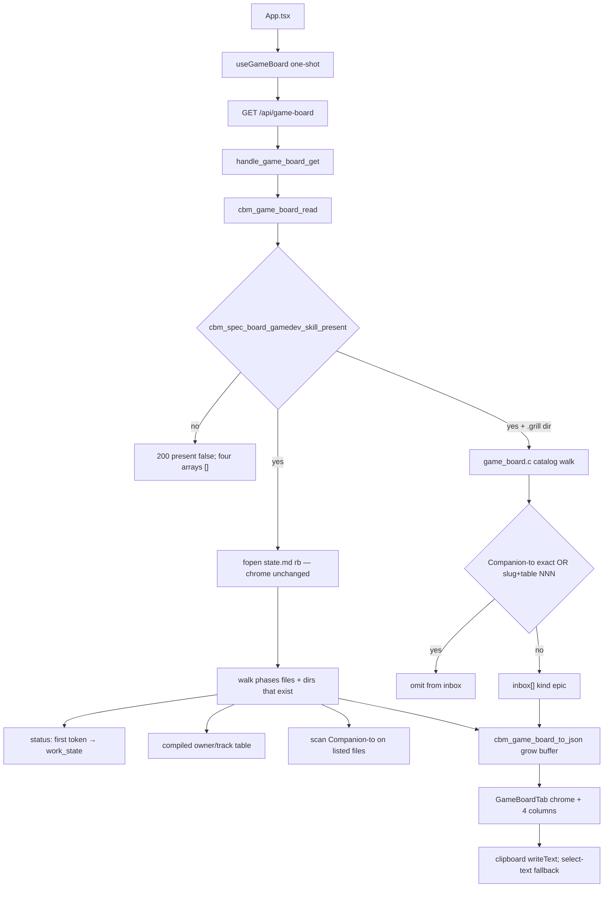

# Technical Plan — Spec-011: Game phase board
Status: Draft | Created: 2026-08-31
Spec: spec-011-q5n-game-phase-board | Mode: FEATURE | Stack: unchanged

## Executive Summary
spec-010 shipped GET `/api/game-board` and Game chrome with four empty arrays. This spec fills those arrays and paints four always-visible columns on the existing `GameBoardTab`. Same path, same 400/404 strings, same chrome fields. No POST, no MCP tool, no second poll URL.

C widens `cbm_game_board_card_t` and `cbm_game_board_to_json` (today hardcoded `[]`). `cbm_game_board_read` walks existing `.gamedev/phases/**` artifacts (fopen `"rb"`), maps header `status:` → work-state, assigns owner/track from a compiled filesystem.md table, and fills Inbox from a **new** grill catalog walk inside `game_board.c` (same index.md + epic-NNN algorithm as spec-008; conversion is Game-local: Companion-to on Game artifacts OR roadmap slug token + table NNN). Do not extract spec_board statics. Do not emit spec-board JSON keys (`column`, `gamedev_skill_present` on spec-board). Do not convert via `active.json`.

graph-ui: keep `useGameBoard` one-shot. Parse `unknown[]` → typed cards. `GameBoardTab` keeps spec-010 chrome and adds four columns + cards. Artifact continue copies `/gamedev-skill continue @role` via Clipboard API (select-text fallback; no toast). Inbox copies `/gamedev-skill continue`. No expand, archive, drag, or skill write.

## Technology Stack
Unchanged packages. Do not add npm or C libraries.

| Component | Tech | Version | Rationale |
| graph-ui | React + react-dom | ^19.0.0 | existing GameBoardTab |
| graph-ui | TypeScript | ^5.7.0 | existing |
| graph-ui | Vite | ^6.4.3 | existing |
| graph-ui | Tailwind | ^4.1.0 | chrome tokens; reuse `--color-epic-mark` |
| graph-ui | Vitest + Testing Library | ^4.1.0 / ^16.1.0 | fetch-mock / hook-mock |
| engine | C11 | Makefile.cbm | fill game_board.c; no new .c |
| SQLite | vendored | existing | untouched |
| HTTP | GET `/api/game-board` | existing path | constitution IV.3 — widen cards, no new path |

## System Architecture


Flow:
1. HTTP unchanged: `resolve_project_root_path` → calloc `cbm_game_board_t` → `cbm_game_board_read` → `cbm_game_board_to_json` → 200. Same 400/404. No POST. No archive merge.
2. present false: chrome empty (`continue` `""`), four counts 0. Do not opendir `.gamedev/phases` or `.grill/`.
3. present true: parse `state.md` as spec-010. Then list artifacts that exist (no placeholders). Then if `root/.grill` is a directory, catalog-walk epics, omit converted, cap 64. Independent of the three phase caps.
4. `to_json` emits the spec-010 chrome keys plus filled card objects. Replace the 8192 hardcoded `[]` snprintf with a grow buffer (same class as `cbm_spec_board_to_json`, local helper — do not share JSON code).
5. UI: one-shot `useGameBoard` (no `setInterval`). Pane receives the board prop (no second fetch). Four column headers always. `aria-current="true"` only on the phase column that matches JSON `phase`. Cards from the four arrays. Continue is a button that copies; card body is not a launcher and not an expand control.

Graph INIT (mcp_idx=yes, project `Users-jmsolorzano-SWE-tools-codebase-memory-mcp`; `get_architecture` + `search_graph` / `trace_path` / `get_code_snippet`; `check_index_coverage` cited paths):
- `cbm_game_board_read` (game_board.c:177) callers = `handle_game_board_get` + tests. Callees = `cbm_spec_board_gamedev_skill_present`, `read_whole_file`, `parse_state_md`. Does not walk phases today.
- `cbm_game_board_to_json` (game_board.c:204) callers = `handle_game_board_get` + tests. Callee = `cbm_json_escape`. Body hardcodes `"inbox":[],...`.
- `cbm_game_board_card_t` is `id[256], title[256]` (`game_board.h:21`). `CBM_GAME_BOARD_MAX_CARDS` 64 already.
- `handle_game_board_get` (http_server.c:531) is GET-only; no POST sibling.
- `useGameBoard` one-shot; `parseGameBoard` keeps arrays as `unknown[]`.
- `GameBoardTab` chrome only (phase/focus/continue `select-text`). Caller = `App`.
- spec_board grill helpers (`grill_fill_epics`, `grill_epic_converted`, …) are **static**. Conversion uses `specs[].companion_grill` + `source.grill_epic`. Must not be reused for Game Inbox.
- `spec_board.c` coverage: parse_partial line 242 (pre-existing). Do not point product work at that line.
- `--color-epic-mark #7d8ec9` already in `globals.css` (SDD-ADR-038).

## Directory Structure
```
src/ui/game_board.h                         EDIT — widen cbm_game_board_card_t
src/ui/game_board.c                         EDIT — artifact walk + inbox walk + conversion + grow to_json
src/ui/http_server.c                        DO NOT CHANGE product (handler already read→to_json)
src/ui/spec_board.c                         DO NOT CHANGE (no shared JSON; no export of grill_*)
src/ui/spec_board.h                         DO NOT CHANGE
Makefile.cbm                                DO NOT CHANGE (no new .c)
tests/test_game_board.c                     EDIT — artifact / inbox / conversion / cap / bytes
tests/test_httpd.c                          EDIT — GET objects + conversion + 400/404 stay + zero writes
src/mcp/mcp.c                               DO NOT CHANGE
graph-ui/src/lib/types.ts                   EDIT — GameBoardCard; arrays typed
graph-ui/src/lib/i18n.ts                    EDIT — Inbox header + work-state labels en+zh
graph-ui/src/hooks/useGameBoard.ts          EDIT — parse typed cards; keep one-shot
graph-ui/src/hooks/useGameBoard.test.ts     EDIT — card parse
graph-ui/src/components/GameBoardTab.tsx    EDIT — four columns + cards + copy control
graph-ui/src/components/GameBoardTab.test.tsx
graph-ui/src/App.tsx                        DO NOT CHANGE product unless a prop type forces it
graph-ui/src/App.test.tsx                   EDIT — invert spec-010 "no columns/cards"; keep silent-win
graph-ui/src/components/SpecBoardTab.tsx    DO NOT CHANGE
graph-ui/src/hooks/useSddSkillPresent.ts    DO NOT CHANGE
graph-ui/src/hooks/useSpecBoard.ts          DO NOT CHANGE
graph-ui/src/lib/colors.ts                  DO NOT CHANGE
graph-ui/src/styles/globals.css             DO NOT CHANGE
graph-ui/src/lib/formatIndexedAt.ts         DO NOT CHANGE
```

`@sdd-*` breadcrumbs on every new/substantially edited file (constitution VII.2). Update `@sdd-spec` / `@sdd-decision` on `game_board.*` and `GameBoardTab.tsx` to this spec + SDD-ADR-046..051.

## Database Schema
None. No new SQLite table. Do not store Game cards, conversion links, or archive flags. `spec_archive` stays spec-006 / spec-board.

## API Contracts
Same GET. Constitution IV.3: no new path. No POST `/api/game-board`. No MCP game-board tool.

### GET /api/game-board?project=<name>
Unchanged status codes:

| Status | Body | When |
| 400 | `{"error":"missing project parameter"}` | missing or empty `project` |
| 404 | `{"error":"project not found"}` | unknown catalog name |
| 500 | `{"error":"out of memory"}` or `{"error":"board serialization failed"}` | calloc / to_json fail |
| 200 | game-board JSON | known project |

200 body — all keys always present (chrome rules = spec-010):

```
{
  "gamedev_skill_present": true|false,
  "phase": "01-preproduction"|"02-production"|"03-postproduction"|null,
  "focus": "<string>"|null,
  "continue": "/gamedev-skill continue"| "",
  "inbox": [ GameBoardCard, ... ],
  "preproduction": [ GameBoardCard, ... ],
  "production": [ GameBoardCard, ... ],
  "postproduction": [ GameBoardCard, ... ]
}
```

Card object (every entry, all keys always present):

```
{
  "kind": "artifact"|"epic",
  "id": "<root-relative path>",
  "title": "<filename or directory name>",
  "track": "A"|"B"|"H"|null,
  "work_state": "pending"|"in_progress"|"done"|"blocked"|null,
  "owner": "@role"| "",
  "continue": "/gamedev-skill continue @role"| "/gamedev-skill continue",
  "summary": "<epic summary>"| "",
  "plan_title": "<plan title>"| ""
}
```

| Field | Artifact | Inbox epic |
| kind | `"artifact"` | `"epic"` |
| id | `.gamedev/...` no trailing slash | `.grill/plans/<slug>/epics/epic-NNN-<name>.md` |
| title | filename (`gdd.md`) or directory name (`SYS-001-movement`) | epic.md `name:` |
| track | `"A"` \| `"B"` \| `"H"` (never null) | JSON `null` |
| work_state | one of four strings (never null) | JSON `null` |
| owner | `@role` | `""` |
| continue | `/gamedev-skill continue @role` | `/gamedev-skill continue` |
| summary | `""` | epic.md `summary:` |
| plan_title | `""` | index.md title else plan.md `title:` else slug |
| column | not emitted | not emitted |
| has_more | never emitted on the board or on a card | same |

Caps: `CBM_GAME_BOARD_MAX_CARDS` 64 **per array**. Overflow omitted. Filling Inbox does not reduce phase slots.

present false: four arrays `[]` (do not walk).
present true + empty `.gamedev/`: arrays `[]`, chrome as spec-010 (phase/focus null, continue set).
No `.grill/`: `inbox` `[]`.

### GET /api/spec-board
Unchanged. Must not emit `gamedev_skill_present`.

### Forbidden
- New HTTP path, POST `/api/game-board`, MCP game-board tool
- graph-ui fetch whose path contains `/api/skill-presence`
- Writing `.gamedev/`, `.sdd-skill/`, or `.grill/`
- Sharing `cbm_game_board_to_json` / spec-board JSON builders
- Converting Inbox via `active.json`, kebab name, or plan-folder cite without table NNN
- Placeholder cards for missing files
- `has_more` field or control
- Expand, Archive, Unarchive, toast, drag, mark-done, launcher
- Painting Specs Kanban on Game (`SpecBoardTab` stays unused)
- Changing silent win, Enter→Graph, or spec-010 chrome field rules
- Parsing project `docs/agents.md` this spec (compiled table only)
- Adding a `setInterval` on `useGameBoard`

## Answers to Questions for Architect

### New walk in game_board.c vs shared grill helpers (no shared JSON)
**New walk in `game_board.c`.** Duplicate the spec-008 catalog algorithm (index.md GFM row order; unlisted plan dirs after, slug ascending; within a plan, `epic-NNN-*.md` by NNN numeric; `name:` / `summary:` / plan_title fallback). Static helpers named `game_grill_*` in this TU.

Do not export `grill_*` from `spec_board.c`. Do not add `grill_catalog.c` / Makefile source. Do not share `to_json`.

Why not extract: spec_board helpers are static and bound to `cbm_spec_board_t` + `source.grill_epic` + spec Companion-to. Game conversion is different (artifact Companion-to + roadmap; **not** `active.json`). Extracting would touch a closed spec-008 surface for no Gherkin Then.

Copy the Companion-to **token rule** (first `.grill/plans/`…`.md` on a line containing `Companion to:`; trailing notes after `.md` ignored; `strcmp` to epic `id`; token is never fopen'd). Scan only the Game files listed in US-004. → SDD-ADR-046

### Roadmap heading/table if sources disagree
**Both required, independently.** No heading/NNN parser.

Omit iff:
1. some scanned Game artifact has Companion-to token equal to that epic `id`, **OR**
2. plan slug is a contiguous token in `.gamedev/roadmap.md` **and/or** `.gamedev/game_context.md`, **AND** `.gamedev/roadmap.md` has a GFM table data row whose trimmed cell is exactly the 3-digit NNN (`001`) or `epic-NNN` (`epic-001`).

Token: exact slug substring with left/right not in `[A-Za-z0-9-]`. So `.grill/plans/inbox-plan/` cites `inbox-plan`; `inboxplanner` does not.

Table cells come from `roadmap.md` only. `game_context.md` may supply the slug token, never the NNN cell. Heading prose is not a cell. If a heading says one NNN and the table another, only the table cell counts. Plan-folder cite without a matching cell does not convert. Table NNN without a slug token does not convert. → SDD-ADR-047

### Heap bound
Keep `CBM_GAME_BOARD_MAX_CARDS` 64 per column. Widen the existing calloc'd `cbm_game_board_t` (never stack the board). Stop appending at 64 after sort.

Production listing may exceed 64 dirents before sort. Use a fixed scratch of `CBM_GAME_BOARD_LIST_MAX` 256 `{name, nnn, kind}` on the stack (or one malloc/free around the production fill). Sort, then copy at most 64. If more than 256 candidates exist, collect the first 256 dirents (extreme; bevy-sized fits). Do not add `has_more`. Do not heap-alloc per card. → SDD-ADR-048

### Project `.gamedev/docs/agents.md` vs filesystem.md default table
**Compiled filesystem.md / spec table only.** Do not fopen `docs/agents.md` this spec.

Skill `docs/agents.md` is prose + cluster tables (Owns column mixes paths and extra files). No Gherkin Then for override. A closed parse would be guesswork. Cards are never unlabeled: basename / prefix map is static in `game_board.c` (US-002 table). Present or absent agents.md does not change owner/track. A later spec may add override once a table contract exists. → SDD-ADR-049

| Artifact | owner | track |
| gdd.md | @game-designer | B |
| narrative-bible.md | @narrative-designer | B |
| style-guide.md | @art-director | B |
| tech-architecture.md | @tech-architect | A |
| audio-direction.md | @audio-director | B |
| production-plan.md | @producer | B |
| SYS-* directory | @gameplay-engineer | A |
| LVL-* directory | @level-designer | H |
| art/* directory | @content-artist | B |
| animation/* directory | @animator | B |
| audio/* directory | @sound-designer | B |
| ui/* directory | @ui-designer | B |
| playtest-log.md | @qa-lead | H |
| optimization.md | @performance-engineer | A |
| platform-integration.md | @platform-integrator | A |
| release-plan.md | @release-engineer | A |
| marketing-plan.md | @marketing-strategist | B |
| postmortem.md | @analyst | B |

### Poll interval vs spec-010 one-shot
**Keep one-shot.** `useGameBoard` stays project-keyed `useEffect` with no `setInterval`. Spec US-005 allows it. The walk is heavier than spec-010 (phases + grill + Companion-to scans). A 4s poll would re-run that on loopback and could re-settle presence. Operator remounts / changes project to refresh. Do not add a second fetch URL. `useSpecBoard` 4000 ms stays Specs-only. → SDD-ADR-050

### Clipboard API vs select-text fallback
**Clipboard first, select-text fallback, no toast either path.**

Continue control is a `<button type="button">` whose accessible name and visible text are the card `continue` string. On activate: `navigator.clipboard.writeText(continue)`. On throw / missing API: `selectNodeContents` on that button (user can Cmd+C). Do not show "Copied", `role="status"`, or any toast. Do not spawn a process.

Chrome pane continue (spec-010) stays a `select-text` `<p>`, not a button. Card continue is the Gherkin "continue control".

Tests stub `navigator.clipboard.writeText`. Denied path: assert no toast; text remains selectable. → SDD-ADR-051

Planner defaults 1–7 frozen. Grill ADR-002, ADR-003, ADR-005, ADR-006, ADR-009 apply.

## Artifact walk (implementer contract)

Emit a card only if the file or directory exists under `.gamedev/`. `cbm_is_dir` / regular-file check. No placeholder.

**Pre-production** (fixed order, present only) under `phases/01-preproduction/`:
`gdd.md`, `narrative-bible.md`, `style-guide.md`, `tech-architecture.md`, `audio-direction.md`, `production-plan.md`.

**Production** under `phases/02-production/`:
1. Immediate child **directories** of `systems/` whose name starts with `SYS-`. Loose `.md` in `systems/` are not cards.
2. Immediate child **directories** of `levels/` whose name starts with `LVL-`.
3. Immediate child **directories** of `art/`, then `animation/`, then `audio/`, then `ui/` (any name; files in those folders are not cards).
4. File `qa/playtest-log.md` if present.

Sort: SYS-* by NNN numeric then full name; then LVL-* by NNN then name; then art/* strcmp; animation/*; audio/*; ui/*; then playtest-log.md. NNN = leading digits after `SYS-` / `LVL-`; if none, sort after numbered (NNN = INT_MAX) then name.

**Post-production** (fixed order, present only) under `phases/03-postproduction/`:
`optimization.md`, `platform-integration.md`, `release-plan.md`, `marketing-plan.md`, `postmortem.md`.

Not cards: `state.md`, `game_context.md`, `roadmap.md`, `docs/`, `baseline/`, `history/`, `prompts/`, `backlog.md`, `assets_registry.md`.

`id` = root-relative path starting with `.gamedev/` (no trailing slash on directories). Title = basename.

**Header file for `status:`** (fopen `"rb"`):
- File card → that file.
- SYS-* → `spec.md` if present else pending.
- LVL-* → `level.md` if present else pending.
- art/animation/audio/ui child → `context.md` if present else pending.

**`status:` first token** (line containing `status:`; trim; first whitespace-delimited token):
| token | work_state |
| draft or missing | pending |
| in_review, needs_review, wip, ready | in_progress |
| approved, done | done |
| blocked | blocked |
| unknown | pending |

Many cards in one phase may be `in_progress`. Directory with no header file → pending.

## Inbox + conversion (implementer contract)

Eligible: every `epic-NNN-*.md` under `.grill/plans/*/epics/` (all plans, draft and closed, pending and detailed). Unreadable skipped. Cap 64 after omit.

Order: `.grill/index.md` GFM data rows (skip header/separator); unlisted plan dirs after, slug `strcmp` ascending; within a plan, NNN numeric. Same skip rules as spec-008 (`grill_dirent_rejected`: `/`, `\`, `..`).

Converted omit (US-004). `active.json` is **not** read.

Companion-to scan (existing files only): six pre-prod docs, five post-prod docs, `playtest-log.md`, and `spec.md` / `level.md` / `context.md` inside a listed folder if present. Collect tokens; `strcmp` to epic `id`.

## Key Decisions
- Grill catalog + Game conversion live in `game_board.c`; no spec_board extract; no shared JSON → SDD-ADR-046
- Roadmap omit = slug token (roadmap and/or game_context) AND roadmap table cell NNN; no heading parser → SDD-ADR-047
- Cap 64/column; scratch 256; widen card; grow to_json → SDD-ADR-048
- Owner/track from compiled table; do not parse project agents.md → SDD-ADR-049
- Keep `useGameBoard` one-shot → SDD-ADR-050
- Clipboard `writeText`; select-text fallback; no toast → SDD-ADR-051

Constitution IV.3: same GET. NOTE for @planner at close: IX.2 append — Game columns + filled arrays + Inbox conversion. Do not edit constitution.md this turn.

## Performance Targets
| Target | Value |
| Strip / pane | one GET `/api/game-board` per workspace project (one-shot) |
| Poll | none on game-board; `useSpecBoard` 4000 ms unchanged |
| GET | dir stat + state.md + bounded opendir/fopen; stop append at 64/column |
| Scratch | ≤256 production candidates before cap |
| Dashboard / Graph / ADR | 0 `get_graph_schema` from this feature |
| Coverage | >80% on touched game_board + httpd Gherkin + GameBoardTab / useGameBoard (reporter may be absent) |

## Security Considerations
- Loopback bind/auth unchanged. Do not widen.
- Paths are `root` + fixed suffixes / sanitized dirent names. Reject `/`, `\`, `..` in dirents. Query `project` is a catalog name, never a filesystem path into skill trees.
- Companion-to token is never fopen'd.
- fopen `"rb"` only. Snapshot `.gamedev/`, `.sdd-skill/`, `.grill/` bytes around GET (byte-identical; missing trees not created).
- JSON-escape all card strings via `cbm_json_escape`. UI renders as text, not HTML.
- `continue` is clipboard text, not a process spawn.
- Do not call `/api/skill-presence` from graph-ui.

## Testing Strategy
C: `tests/test_game_board.c` fixtures under `/tmp` (`th_mktempdir`). Never real bevy-tetris or repo skill trees. HTTP: existing `ui_game_board_get`. Keep 400/404/spec-board-no-gamedev/present-false-empty-arrays. Invert only tests that assumed present-true + files still emit `[]` when those files now exist — empty-dir still `[]`.

Vitest + Testing Library. No live daemon. Playwright optional (constitution IX.4). English assertions. Invert spec-010 GameBoardTab / App tests that lock "no columns/cards".

Gherkin → owner (exactly one primary task per scenario):

| Gherkin scenario | Primary test | Task |
| four column headers and current-phase highlight | `GameBoardTab.test.tsx` | #3 |
| existing gdd.md paints a Pre-production artifact card | C JSON #1 + pane #3 | #1 / #3 |
| SYS directory without spec.md is a Production card | `test_game_board.c` + pane #3 | #1 / #3 |
| two in_progress cards stay in Production | C + pane | #1 / #3 |
| unconverted grill epic paints in Inbox | C JSON #2 + pane #3 | #2 / #3 |
| Companion-to exact path omits the epic | `test_game_board.c` + GET bytes | #2 |
| roadmap slug plus table NNN omits the epic | `test_game_board.c` | #2 |
| click artifact copies continue at-role | `GameBoardTab.test.tsx` | #4 |
| click inbox copies continue without at-role | `GameBoardTab.test.tsx` | #4 |
| Limit — empty column has header and no placeholder | `GameBoardTab.test.tsx` | #3 |
| Limit — missing narrative-bible is not a placeholder | `test_game_board.c` | #1 |
| Limit — phase null highlights no phase column | `GameBoardTab.test.tsx` | #3 |
| Limit — 65th production card omitted | C + pane no "Has more" | #1 / #3 |
| Limit — closed grill plan leftover stays in Inbox | `test_game_board.c` | #2 |
| Limit — missing conversion link sits beside a SYS card | `test_game_board.c` | #2 |
| Limit — status ready maps to In progress | C + pane | #1 / #3 |
| Limit — no grill directory yields empty Inbox | C + pane | #2 / #3 |
| Limit — Inbox order is index.md then epic-NNN | `test_game_board.c` | #2 |
| Limit — present false still emits empty arrays | `test_game_board.c` / httpd (keep) | #1 |
| Limit — spec-board still has no gamedev field | `test_httpd.c` (keep) | #1 |
| Error — GET does not write skill trees | `test_httpd.c` bytes; App no skill-presence | #2 + #5 |
| Error — unknown project is still 404 | `test_httpd.c` (keep) | #1 |
| Error — missing project query is still 400 | `test_httpd.c` (keep) | #1 |
| Error — card activate does not expand or archive | `GameBoardTab.test.tsx` | #4 |
| Error — cards are not draggable | `GameBoardTab.test.tsx` | #4 |
| Error — plan-folder cite without NNN does not convert | `test_game_board.c` | #2 |
| Error — kebab name does not convert | `test_game_board.c` | #2 |
| Error — table NNN without slug cite does not convert | `test_game_board.c` | #2 |

Task #5 owns leftover UI Thens (chrome still visible; silent-win tests stay green; invert spec-010 no-columns lock if not already inverted in #3).

## Deployment Plan
- `scripts/build.sh --with-ui` (C + embed UI). No new Makefile source.
- No env var. No daemon flag. No schema migration.
- Old UIs ignore extra card keys. New UI treats malformed array entries as skipped (parse only objects with `kind` `artifact`|`epic`).

## Risks & Mitigation
| Risk | Probability | Impact | Mitigation |
| Extract spec_board grill_* | med | spec-008 regression; wrong conversion | ADR-046 new walk |
| Reuse grill_epic_converted | high | active.json hides Game Inbox | do not call it |
| 8192 to_json overflow | high | 500 on real boards | grow buffer ADR-048 |
| Cap before production sort | med | SYS-001 dropped, SYS-065 kept | scratch 256 then sort then 64 |
| Parse agents.md | med | unlabeled / wrong owner | ADR-049 compiled table |
| Poll 4s on heavy walk | med | strip flicker / extra IO | ADR-050 one-shot |
| Toast on copy | med | fails Gherkin | ADR-051 no toast |
| spec-010 tests lock no columns | high | Task #3 red | invert those tests |
| Placeholder for missing gdd sibling | med | fails missing-narrative Then | exist-only |
| Fuzzy kebab omit | low | false empty Inbox | exact path / slug+NNN only |

## Success Criteria
- [ ] All 6 US + all Gherkin scenarios have a C and/or Vitest owner
- [ ] Same GET; no POST; no MCP tool; no `has_more`
- [ ] spec-board never emits `gamedev_skill_present`
- [ ] graph-ui never calls `/api/skill-presence`
- [ ] Four headers always; empty = header only; aria-current on matching phase only
- [ ] Existing artifacts only; Inbox unconverted grill; converted omitted
- [ ] Continue copy @role / inbox without @; no toast / drag / expand / archive
- [ ] Zero skill-tree writes
- [ ] @implementer can execute without a new HTTP path or spec_board extract

## External Integrations & Special Tools

| Tool | Type | Purpose | Tasks | Setup | Fallback |
| gamedev-skill `.gamedev/` tree | skill filesystem (read-only) | artifacts + state.md + roadmap/game_context | #1–#3 | none in CBM; fixtures in /tmp | missing file → no card; missing state.md → chrome missing |
| grill-skill `.grill/` tree | skill filesystem (read-only) | Inbox catalog | #2–#3 | fixtures in /tmp | missing dir → inbox [] |
| GET `/api/game-board` | existing HTTP | chrome + filled arrays | #1–#5 | daemon in prod; C + fetch mock in tests | 400/404; 200 present false |
| GET `/api/spec-board` | existing HTTP | regression: no gamedev field | #1, #5 | fetch mock | unchanged |
| GET `/api/skill-presence` | existing HTTP | unused by graph-ui | — | do not call | — |
| Clipboard API | browser | copy continue | #4 | stub in Vitest | select-text |
| codebase-memory-mcp graph | session MCP | architect INIT only | — | mcp_idx=yes | file read (done) |

No new MCP tool. Do not call `index_repository`.

## Constitution validation
Checked against `.sdd-skill/docs/constitution.md` (draft — not rewritten):
- I.1–I.2: frozen spec only; no cycle-file writes to `.gamedev/`, `.sdd-skill/`, `.grill/`
- II: C11 `cbm_`; React 19; no new CSS file; i18n en+zh; no new runtime
- III: chrome grayscale; letter E reuses SDD-ADR-038; track is text A/B/H; `colorForLabel` locked
- IV.3: same GET; no new path
- IV.4: no second freshness field
- V: every Gherkin mapped; C + Vitest; no live daemon for UI
- VI: loopback unchanged; fixed suffixes; no secrets
- VII: column names accessible; continue button named; breadcrumbs
- VIII: no `get_graph_schema`; no third tight poll
- IX.2 spec-010: chrome / silent win / dual one-shot stay; this spec fills arrays on the same GET
- IX.3: Enter still Graph

No constitution edit this spec (IX.2 append is @planner at close).

## Implementation breadcrumbs for @implementer
1. Do not add POST `/api/game-board` or an MCP game-board tool.
2. Do not write `.gamedev/`, `.sdd-skill/`, or `.grill/`. fopen `"rb"` only.
3. Do not edit `spec_board.c` / `.h` / `mcp.c` / `Makefile.cbm`.
4. Do not call `grill_epic_converted` or read `active.json` for Game Inbox.
5. Widen `cbm_game_board_card_t` in place. Keep `CBM_GAME_BOARD_MAX_CARDS` 64. Heap calloc the board.
6. Replace hardcoded `[]` in `cbm_game_board_to_json` with a grow buffer. Emit card keys listed above. `track` / `work_state` JSON null when the C field is empty (epics). Artifacts always set both.
7. Do not emit `column` or `has_more`.
8. Artifact walk: exist-only; orders and names as "Artifact walk" above.
9. `status:` first token map including `ready` → `in_progress`.
10. Owner/track from the compiled table only. Do not fopen `docs/agents.md`.
11. Inbox walk: copy spec-008 catalog order as `game_grill_*`. Conversion = Companion-to exact OR (slug token + roadmap table NNN).
12. Companion-to: first `.grill/plans/`…`.md` on a `Companion to:` line; never fopen the token.
13. Roadmap: slug token in roadmap.md and/or game_context.md; NNN cell in roadmap.md table only.
14. present false → do not walk phases or grill.
15. graph-ui must not fetch `/api/skill-presence`.
16. Keep `useGameBoard` one-shot. Parse cards; skip objects without a valid `kind`.
17. Do not reuse `SpecBoardTab` / `EpicCard`. Inbox letter E uses `text-[var(--color-epic-mark)]` (token already exists).
18. Four headers always. Empty column = header, 0 cards, no "no artifacts in this phase". Do not dim other columns.
19. `aria-current="true"` only on the matching phase column. Inbox never. phase null → none.
20. spec-010 chrome stays (phase label, focus, continue `<p>`). Widen layout so four columns fit (drop `max-w-2xl` on the column row).
21. Continue **control** is a button; copies via clipboard; fallback select-text; no toast.
22. Card click (not the button) does not expand, Archive, or POST. `draggable={false}`. No local column reorder.
23. i18n: Inbox "Inbox"; work-state Pending / In progress / Done / Blocked. Reuse existing EN phase strings for the three phase headers. zh required. Tests assert English.
24. Invert spec-010 tests that assert no columns/cards on GameBoardTab. Keep silent-win / Enter Graph / no skill-presence.
25. `mockAppFetch` default game-board may stay present false with empty arrays. Present-true fixtures must include card objects when a Then needs them.
26. Do not edit `colors.ts` / `formatIndexedAt` / `globals.css`.
27. Breadcrumb headers on touched files (`@sdd-spec` this spec; `@sdd-decision` SDD-ADR-046..051).
28. Fixtures in `/tmp` only. No live daemon. No Playwright unless @tester later requires CERTIFICATION.
29. `continue_cmd` on the **board** stays spec-010 (`/gamedev-skill continue` when present). Card `continue` is a separate field (96 B is enough for `@marketing-strategist`).
