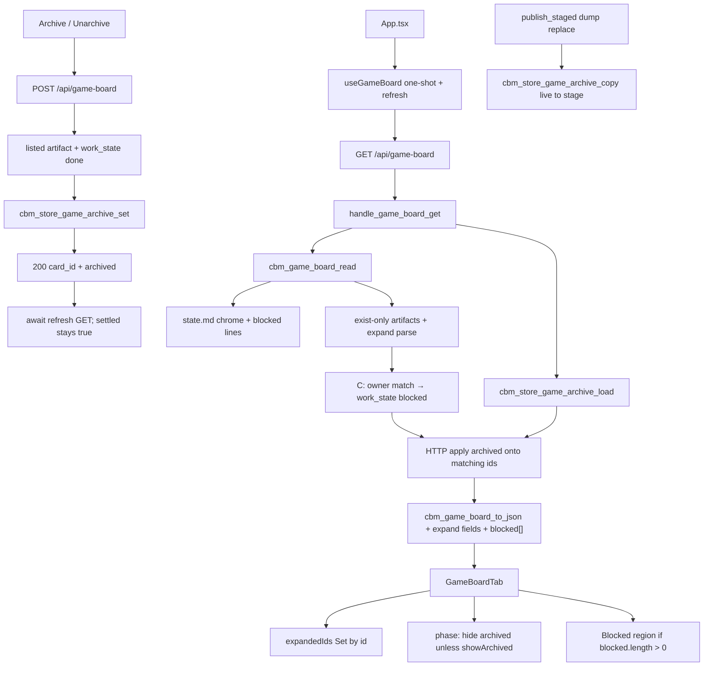

# Technical Plan — Spec-012: Game expand, archive, and deps
Status: Approved | Created: 2026-08-31
Spec: spec-012-m2k-game-expand-archive-deps | Mode: FEATURE | Stack: unchanged

## Executive Summary
spec-011 paints four Game columns with exist-only artifact cards and unconverted grill Inbox. Cards are still dead: no expand, no archive, no live blocked-by. spec-011 forbade POST `/api/game-board` and expand; this spec supersedes those two locks only.

GET `/api/game-board` stays the only board read (constitution IV.3). Additive card fields plus a top-level `blocked[]`. POST on that same path is archive-only (flag object, not the full board). `game_board.c` stays a skill-file reader (fopen `"rb"`). Archive flags live in a new `game_archive` table in the project `.db` — not `spec_archive`, not localStorage, not a skill sidecar. HTTP merges `archived` after `cbm_game_board_read`. Blocked overlay mutates `work_state` in C before JSON so POST 409 matches GET.

graph-ui: keep `useGameBoard` one-shot. Add `refresh()` that re-GETs without flipping `settled`/`present` (silent-win in-flight must not unmount Game). Title control expands in place (Set keyed by `id`, all start collapsed). Archive/Unarchive on expanded done artifacts. Session-only Show archived in pane chrome. Blocked strip above the four columns.

No MCP game-board tool. Zero writes to `.gamedev/`, `.sdd-skill/`, `.grill/`. Epic 004 ADR trio stays out.

## Technology Stack
Unchanged packages. Do not add npm or C libraries.

| Component | Tech | Version | Rationale |
| graph-ui | React + react-dom | ^19.0.0 | existing GameBoardTab |
| graph-ui | TypeScript | ^5.7.0 | existing |
| graph-ui | Vite | ^6.4.3 | existing |
| graph-ui | Tailwind | ^4.1.0 | chrome tokens |
| graph-ui | Vitest + Testing Library | ^4.1.0 / ^16.1.0 | fetch-mock / hook-mock |
| engine | C11 | Makefile.cbm | widen game_board; store + HTTP |
| SQLite | vendored | existing | new `game_archive` in project `.db` |
| HTTP | GET+POST `/api/game-board` | existing path | GET merge; POST mutate |

## System Architecture


Flow:
1. GET: `resolve_project_root_path` (unchanged 400/404). Heap `cbm_game_board_t`. `cbm_game_board_read` (still zero-write): presence, chrome, artifact walk, inbox walk, expand parse, blocked strip + overlay. Query-open project `.db`, `cbm_store_game_archive_load`, apply flags onto matching `card->id` only. `cbm_game_board_to_json` emits additive fields + `blocked`. Missing table / open fail after resolve → all `archived` false, still 200.
2. POST: yyjson body `{project, card_id, archived}`. Resolve project. Read board (overlay already applied). Inbox id or unknown → 404 `card not found`. `work_state` != `"done"` → 409 `card not done`, no write. Else mutation lock, `cbm_store_open_path`, `cbm_store_game_archive_set`, 200 flag object. Repeat same value is 200.
3. UI: `expandedIds` Set, `showArchived` useState(false). Both reset on `?project=` / remount. Title button toggles expand. Continue `stopPropagation` stays. After POST 200, `await refresh()` without clearing `settled`. Filter phase columns: hide `archived && work_state==="done" && !showArchived`. Inbox never filtered by archived.
4. Persist across dump publish: incremental clone already copies the whole `.db`. Full dump does not. `cbm_pipeline_publish_staged` copies `game_archive` from live `final_db_path` onto the stage after the existing `spec_archive` copy. Do not change `adr_fill`.

Graph INIT (mcp_idx=yes, project `Users-jmsolorzano-SWE-tools-codebase-memory-mcp`; `get_architecture` + `search_graph` / `trace_path`; `check_index_coverage` cited paths):
- `handle_game_board_get` (http_server.c:531) caller = `dispatch_request` GET-only today. Callees = `resolve_project_root_path`, `cbm_game_board_read`, `cbm_game_board_to_json`. No POST sibling.
- `cbm_game_board_read` (game_board.c:1246) callees = present, `parse_state_md`, `fill_artifacts`, `game_grill_fill_inbox`. Does not parse expand bodies or blocked lines today. Does not open SQLite.
- `cbm_game_board_card_t` lacks blurb/tasks/inputs/open/last_decision/recent/blocked_by/archived.
- `cbm_store_spec_archive_*` is the copy target for table shape — do not namespace Game ids into it. `cbm_store_spec_archive_copy` callers = `cbm_pipeline_publish_staged` + incremental. Add a sibling copy in the same live-open block.
- `useGameBoard` one-shot; parse skips unknown kind. `GameBoardTab` title is a `<p>` (not a control). spec-011 tests lock no Archive / no POST on card activate.
- `spec_board.c` `cbm_spec_board_extract_blurb` is hardcoded `## Executive Summary`. Do not call it. Do not edit `spec_board.c`.
- Coverage: `game_board.c/h`, `GameBoardTab.tsx`, `useGameBoard.ts`, `types.ts`, `i18n.ts` no_recorded_issue. `http_server.c` parse_partial 2057. `store.c` parse_partial 5470/5508/5574/6228 (outside archive). `pipeline.c` parse_partial 241-242. Read those files as ground truth.

## Directory Structure
```
src/store/store.h                     EDIT — game_archive row + set/load/copy
src/store/store.c                     EDIT — init_schema table; set/load/copy
src/ui/game_board.h                   EDIT — widen card + board blocked[]; extract prototypes if exported
src/ui/game_board.c                   EDIT — expand parse; blocked strip+overlay; to_json additive fields
src/ui/http_server.c                  EDIT — GET merge; POST mutate; dispatch POST
src/pipeline/pipeline.c               EDIT — publish_staged copy game_archive after spec_archive
Makefile.cbm                          EDIT — TEST_STORE_SRCS += test_store_game_archive.c
tests/test_store_game_archive.c       NEW — set/load/copy/missing table
tests/test_game_board.c               EDIT — expand JSON, overlay, caps, bytes
tests/test_httpd.c                    EDIT — GET merge + POST 200/400/404/409 + spec-board isolation
src/mcp/mcp.c                         DO NOT CHANGE
src/ui/spec_board.c                   DO NOT CHANGE
src/ui/spec_board.h                   DO NOT CHANGE
graph-ui/src/lib/types.ts             EDIT — expand fields; blocked[]; archived
graph-ui/src/lib/i18n.ts              EDIT — inputs + blockedStrip en+zh; reuse specBoard archive strings
graph-ui/src/hooks/useGameBoard.ts    EDIT — parse additive; refresh(); keep one-shot; do not unset settled on refresh
graph-ui/src/hooks/useGameBoard.test.ts
graph-ui/src/components/GameBoardTab.tsx  EDIT — title control; expand body; strip; archive; filter
graph-ui/src/components/GameBoardTab.test.tsx
graph-ui/src/App.tsx                  EDIT — pass project + refresh into GameBoardTab
graph-ui/src/App.test.tsx             EDIT — invert spec-011 no-expand/no-POST-on-activate locks that conflict
graph-ui/src/components/SpecBoardTab.tsx  DO NOT CHANGE
graph-ui/src/lib/colors.ts            DO NOT CHANGE
graph-ui/src/styles/globals.css       DO NOT CHANGE
graph-ui/src/lib/formatIndexedAt.ts   DO NOT CHANGE
```

`@sdd-*` breadcrumbs on every new/substantially edited file (constitution VII.2). Update `@sdd-spec` / `@sdd-decision` on `game_board.*`, `http_server.c` game-board handlers, `GameBoardTab.tsx`, `useGameBoard.ts` to this spec + SDD-ADR-052..057.

## Database Schema
New table in the project `.db` (filename = project name). Project key is the store file, not a column. Do not reuse `spec_archive`, `store_meta`, or `project_summaries`. Do not add this table to the hand-built sqlite writer DDL.

```sql
CREATE TABLE IF NOT EXISTS game_archive (
  card_id TEXT PRIMARY KEY,
  archived INTEGER NOT NULL CHECK (archived IN (0, 1)),
  updated_at TEXT NOT NULL
);
```

- `card_id` = GET card `id` (root-relative path; dirs have no trailing slash). C buffer `char card_id[256]` (match `cbm_game_board_card_t.id`, not spec_archive 192).
- UPSERT on set. Unarchive writes `archived=0`; do not DELETE (orphan-keep).
- Orphan row (id not on current board): keep; GET does not invent a card.
- `init_schema` adds the CREATE so write-open creates it. Query-open skips `init_schema` — load must probe `sqlite_master` like `cbm_store_spec_archive_load` and treat missing table as zero rows (all false).
- Cap load: `CBM_GAME_ARCHIVE_CAP` 512 (board max 256 plus leftover orphans).
- Relationships: none. No FK.

## API Contracts
Same GET path. Constitution IV.3: POST on this family because GET-only cannot mutate. No sibling `/api/game-archive`. No MCP tool.

### GET /api/game-board?project=<name>
Unchanged status codes:

| Status | Body | When |
| 400 | `{"error":"missing project parameter"}` | missing or empty `project` |
| 404 | `{"error":"project not found"}` | unknown catalog name |
| 500 | `{"error":"out of memory"}` or `{"error":"board serialization failed"}` | calloc / to_json fail |
| 200 | game-board JSON | known project |

200 body — spec-011 keys stay. Additive: card expand fields + `archived`; top-level `blocked` (always present, may be `[]`):

```
{
  "gamedev_skill_present": true|false,
  "phase": "01-preproduction"|"02-production"|"03-postproduction"|null,
  "focus": "<string>"|null,
  "continue": "/gamedev-skill continue"| "",
  "blocked": [ { "owner": "@slug", "task": "<string>", "blocked_by": "<string>" }, ... ],
  "inbox": [ GameBoardCard, ... ],
  "preproduction": [ GameBoardCard, ... ],
  "production": [ GameBoardCard, ... ],
  "postproduction": [ GameBoardCard, ... ]
}
```

Card object — spec-011 keys plus (every entry, all keys always present):

```
{
  "kind": "artifact"|"epic",
  "id": "<root-relative path>",
  "title": "<basename>",
  "track": "A"|"B"|"H"|null,
  "work_state": "pending"|"in_progress"|"done"|"blocked"|null,
  "owner": "@role"| "",
  "continue": "/gamedev-skill continue @role"| "/gamedev-skill continue",
  "summary": "<epic summary>"| "",
  "plan_title": "<plan title>"| "",
  "blurb": "<string>",
  "tasks": [ { "number": 1, "name": "<string>", "done": true|false }, ... ],
  "inputs": "<string>",
  "last_decision": "<string>",
  "open": "<string>",
  "recent": "<string>",
  "blocked_by": "<string>"|null,
  "archived": true|false
}
```

| Field | Artifact | Inbox epic |
| blurb / inputs / last_decision / open / recent | kind rules below | `""` |
| tasks | Track A checkbox list or `[]` | `[]` |
| blocked_by | overlay text or JSON `null` | JSON `null` |
| archived | merged flag, default false | false (Inbox never archived; POST 404) |
| has_more | never | never |

Caps: 64 cards/column (unchanged), 48 tasks, 16 blocked rows, 512-byte blurb/inputs/recent/last_decision/open. Overflow omitted. No `has_more`.

present false: four arrays `[]`, `blocked` `[]`, do not walk.

### POST /api/game-board
Body max 4096. yyjson (same family as spec-board POST).

Request:
```
{"project":"<name>","card_id":"<root-relative id>","archived":true|false}
```

200 (flag object, not full board):
```
{"project":"<name>","card_id":"<id>","archived":true|false}
```

Gherkin asserts `card_id` + `archived`. `project` is additive (parity with spec-board POST).

| Status | Body | When |
| 400 | `{"error":"..."}` | missing `project` or `card_id` (empty counts as missing) |
| 400 | `{"error":"invalid archived"}` | missing or non-boolean `archived` (string `"yes"` is 400) |
| 400 | `{"error":"invalid json"}` / `invalid body` | bad JSON / empty / oversize (same family as ADR/spec-board) |
| 404 | `{"error":"project not found"}` | unknown project (same string as GET) |
| 404 | `{"error":"card not found"}` | `card_id` not on current board, or Inbox epic id; no store write |
| 409 | `{"error":"card not done"}` | listed artifact but JSON `work_state` != `"done"` (after overlay); no persist |
| 423 | project busy | mutation lock held (same as ADR save); not in Gherkin |
| 500 | `{"error":"save failed"}` / cannot open store | persist fail |

Idempotent: same `archived` again → 200.

Dispatch: path `/api/game-board*` then GET vs POST (mirror spec-board). Other methods fall through (no 405 required).

### GET/POST /api/spec-board
Unchanged. POST a Game `card_id` that is not a spec id → 404 `{"error":"spec not found"}`. Must not set `game_archive`. Must not emit `gamedev_skill_present`.

### Forbidden
- New `/api/game-archive` or MCP game-board / archive tool
- graph-ui fetch whose path contains `/api/skill-presence`
- Writing `.gamedev/`, `.sdd-skill/`, or `.grill/`
- Reusing `spec_archive` or POST `/api/spec-board` for Game ids
- Sharing `cbm_game_board_to_json` / spec-board JSON builders or calling `cbm_spec_board_extract_blurb`
- Parsing `roadmap.md` into a graph or painting agents.md Needs as edges
- `has_more` on tasks or blocked
- Auto-expand on first paint; persist Show archived; confirm dialog; fourth "Archived" column
- Drag / mark-done / launcher / toast
- Changing silent win, Enter→Graph, conversion, four-column layout, clipboard
- `setInterval` on `useGameBoard`
- Unsetting `settled`/`present` on refresh (would unmount Game)

## Answers to Questions for Architect

### game_archive schema vs spec_archive namespace
**New `game_archive` table. `card_id TEXT PK`. Copy on publish_staged.** Evidence: `spec_archive.spec_id[192]` is a spec folder id. Game `id` is a path up to 255 bytes. Mixing tables would let a Game POST collide with a spec folder of the same string and would make spec-board POST accidentally mutate Game flags. Grill ADR-004 / planner default 2. Probe + UPSERT copy the spec_archive pattern. → SDD-ADR-052, SDD-ADR-053

### Blocked overlay in C vs UI-only
**C before JSON (planner default).** Gherkin Error "archive a blocked overlay card is 409" uses GET `work_state` `"blocked"`. If overlay were UI-only, POST would see header `done` and persist. Overlay all artifact cards whose `owner` equals that strip row's `owner` (`@` + slug). Inbox never overlaid. A card whose owner has no blocked line keeps spec-011 header `work_state` and `blocked_by` JSON null. → SDD-ADR-055

### useGameBoard poll vs one-shot + refresh
**Keep one-shot. Add `refresh(): Promise<void>`.** Spec US-006 allows spec-010 one-shot. A 4s poll would re-run the heavier walk (expand fopen + overlay) and could flicker presence. After POST 200 the UI must refetch so a later GET cannot resurrect a hidden card. `refresh` reuses the same GET and **must not** set `settled`/`present` to false (spec-010 in-flight omits Game). SDD-ADR-050 stays: no `setInterval`. → SDD-ADR-054

### Reuse spec-005 extract_blurb vs game_board-local
**game_board-local.** `cbm_spec_board_extract_blurb` is locked to `## Executive Summary`. Track A heading is `## What it does`; Inputs is first `## Inputs*`; fallback is header `open` / `last_decision`. Copy sentence-end (`.`/`?`/`!` + space or EOS), markdown-link strip, 512 truncate-walkback as static helpers in `game_board.c`. Export `cbm_game_board_extract_what_it_does` (and optionally last-Round / changelog-tail) for C tests without a full tree. Do not add `extract.c` / Makefile source. Do not include `spec_board.h` extract from game_board. → SDD-ADR-056

### Buffer sizes if 512 is tight on playtest Round
**Keep 512 on blurb, inputs, recent, last_decision, open.** Spec caps playtest Round at 512 bytes. Byte-truncate then walk back to last space if one exists in the window. JSON escape buffers ≥1024. Do not raise the spec cap.

### i18n reuse vs gameBoard copies
**Reuse `specBoard.archive` / `unarchive` / `showArchived` / `noTasksYet` (EN already matches Gherkin).** Add `gameBoard.inputs` ("Inputs" / "输入") and `gameBoard.blockedStrip` ("Blocked" / "已阻塞") for the strip region name and overlay prefix. Tests assert English. → SDD-ADR-057

Planner defaults 1–9 frozen. Grill ADR-004, ADR-007, ADR-010 apply.

## Expand parse (implementer contract)

fopen `"rb"` only. Missing/unreadable file degrades that card (empty strings / `[]`); GET stays 200.

**Header `last_decision` / `open`:** same header file as spec-011 `status:` (`kv_extract_colon_line` on `last_decision` / `open`). Trim. Emit raw (may be `none` or `—`). Blurb fallback: use `open` if non-empty and not `none`; else `last_decision` if non-empty and not `—`; else `""`. When `## What it does` has a non-empty body, do not use header as blurb (still emit `open` / `last_decision` fields). Prefer one fopen of the header/spec file for status + kv + Track A extract.

**Track A** (`track` `"A"`, SYS-* with `spec.md`, and file artifacts whose track is A):
- `blurb` = first 1–2 sentences of `## What it does` until next `## `. Sentence / links / 512 same as spec-005 extract. Missing heading or empty body → fallback chain above.
- `tasks` = that system's `tasks.md` checkbox lines `- [ ]` / `- [x]` / `- [X]` only. `number` = 1-based list order. `done` true iff `[x]` or `[X]`. Skip lines that after trim are empty, start with `<!--`, or contain `Subagent:` / `Path:`. Cap 48; omit overflow; no `has_more`. Name = rest of line after the checkbox token, trimmed.
- `inputs` = body of the first heading whose text after `## ` starts with `Inputs` (covers `## Inputs / Outputs` and `## Inputs`) until the next `## `. Cap 512. Missing/empty → `""`.

**Track B** and asset `context.md` (`track` `"B"`): `blurb` `""`; `inputs` `""`; `tasks` `[]`; expand UI shows `last_decision` and `open` when non-empty. No "No tasks planned yet".

**LVL-* (`track` `"H"`):** `last_decision` / `open` from `level.md`. `recent` = last 8 non-empty non-HTML-comment lines of `changelog.md` joined by newline. Missing changelog → `recent` `""`. HTML comment = trimmed line starts with `<!--`.

**playtest-log.md:** `recent` = last block that starts with a heading `## Round ` through the next `## Round ` or EOF, cap 512. Earlier Round is not copied. No Round heading → `recent` `""`.

**Inbox:** expand adds nothing. `blurb`/`inputs`/`recent`/`last_decision`/`open` `""`; `tasks` `[]`; `blocked_by` null; `archived` false.

**Never dump** full GDD, spec body, or review.md into a field.

## Blocked strip (implementer contract)

Source: same `.gamedev/state.md` buffer as chrome. Agent lines whose status token is `blocked`. Compact form:

```
slug:blocked:"task":"blocked-by"
```

Example: `gameplay-engineer:blocked:"Combat system v2":"Waiting on final boss design"`

- Skip the project-level `phase=` / `focus=` line.
- `needs_review`, `in_progress`, and `done` lines are not strip rows.
- `owner` JSON = `@` + slug (no extra `@` if slug already has it — spec-011 owners are `@role`; slug in state.md has no `@`).
- Order = document order. Cap 16. Overflow omitted. No `has_more`.
- Empty → JSON `blocked` `[]`; UI omits the region (no heading).

Overlay: for each strip row, every **artifact** card with `owner` equal to that row's `owner` gets `work_state` `"blocked"` (overrides header mapping) and `blocked_by` equal to that line's blocked-by text. If an owner has two blocked lines, last matching strip row in document order wins for overlay text (strip still lists both up to cap). Inbox never overlaid.

## Key Decisions
- New `game_archive` table; `card_id` PK 256; CAP 512; not `spec_archive` → SDD-ADR-052
- POST on `/api/game-board`; merge in HTTP after read; 200 flag object; publish_staged copy → SDD-ADR-053
- Keep `useGameBoard` one-shot; `refresh()` after POST; do not unset settled → SDD-ADR-054
- Blocked overlay in C before JSON; strip = `blocked` lines only → SDD-ADR-055
- game_board-local H2 extract; do not call spec_board extract_blurb → SDD-ADR-056
- i18n reuse specBoard archive/noTasksYet; add inputs + blockedStrip → SDD-ADR-057

Constitution IV.3: same GET family; POST added because GET-only cannot archive. NOTE for @planner at close: IX.2 append — Game expand + game_archive + blocked strip; spec-011 "no expand/archive/POST" superseded. Do not edit constitution.md this turn.

## Performance Targets
| Target | Value |
| Strip / pane | one GET `/api/game-board` per workspace project (one-shot) plus explicit refresh after POST |
| Poll | none on game-board; `useSpecBoard` 4000 ms unchanged |
| GET | spec-011 walk + bounded extra fopen (spec.md/tasks.md/changelog/playtest) + one query-open SELECT ≤512 |
| POST | one write-open + UPSERT |
| Heap | `cbm_game_board_t` stays calloc; never stack. Widened card (~14KB × 256) is acceptable |
| Dashboard / Graph / ADR | 0 `get_graph_schema` from this feature |
| Coverage | >80% on touched store/HTTP/game_board JSON + GameBoardTab / useGameBoard (reporter may be absent) |

## Security Considerations
- Loopback bind/auth unchanged. Do not widen.
- POST `card_id` is looked up on the current board (ids from the walk), never used as a client-supplied filesystem path into skill trees. fopen stays `root` + fixed suffixes / sanitized dirents.
- Mutation lock on POST (same as ADR / spec-board) so a persist does not land on a file `publish_staged` is about to replace.
- JSON-escape all new strings via `cbm_json_escape`. UI renders as text, not HTML.
- fopen `"rb"` only. Snapshot `.gamedev/`, `.sdd-skill/`, `.grill/` bytes around GET and POST (byte-identical; missing trees not created).
- Constitution VI.3 does not apply (archive is not delete). No confirm.
- Do not call `/api/skill-presence` from graph-ui.
- No secrets. Cache DBs stay under the user cache dir.

## Testing Strategy
C store: `tests/test_store_game_archive.c` via `cbm_store_open_memory` — set/load/copy/idempotent/missing table. Add to `TEST_STORE_SRCS`.

C board JSON: `tests/test_game_board.c` — expand fields, What-it-does vs open, playtest last Round, changelog last 8, 48-task cap, overlay, empty blocked, needs_review not a row, GET bytes. Fixtures under `/tmp` only.

C HTTP: `tests/test_httpd.c` — GET merge/orphan; POST 200/400/404/409; inbox POST 404; spec-board POST Game id 404 + game flags unchanged; skill-tree bytes around POST.

Vitest + Testing Library. No live daemon. Playwright optional (constitution IX.4). English assertions. Invert spec-011 GameBoardTab tests that lock "no expand / no Archive on title activate". Keep: card **body** click (not title) does not expand; continue does not toggle; `draggable={false}`; silent-win / no skill-presence.

Gherkin → owner (exactly one primary task per scenario):

| Gherkin scenario | Primary test | Task |
| Track A SYS card expands with blurb, tasks, and Inputs | C JSON #2 + pane #4 | #2 / #4 |
| Track B gdd expand shows header only | C + pane | #2 / #4 |
| Archive hides a done artifact without a confirm dialog | httpd POST #3 + pane #5 | #3 / #5 |
| blocked strip and overlay on that owner's cards | C overlay #2 + pane strip #4 | #2 / #4 |
| Limit — Inbox expand has no Archive and POST epic is 404 | pane #4 + httpd #3 | #3 / #4 |
| Limit — empty Track A tasks still expands | pane #4 | #4 |
| Limit — What it does wins over header open | `test_game_board.c` | #2 |
| Limit — missing Inputs heading omits the region | pane #4 | #4 |
| Limit — playtest recent is the last Round only | `test_game_board.c` | #2 |
| Limit — level recent is the last 8 changelog lines | `test_game_board.c` | #2 |
| Limit — Show archived is session-only and remount starts hidden | `GameBoardTab.test.tsx` | #5 |
| Limit — Unarchive restores the card while the toggle is off | pane #5 + POST #3 | #5 |
| Limit — two cards stay expanded and continue does not toggle | `GameBoardTab.test.tsx` | #4 |
| Limit — empty blocked omits the strip | `GameBoardTab.test.tsx` | #4 |
| Limit — needs_review is not a strip row | `test_game_board.c` | #2 |
| Limit — leftover archived on pending does not hide | pane #5 + GET merge #3 | #3 / #5 |
| Limit — orphan game_archive row does not invent a card | `test_httpd.c` | #3 |
| Limit — all artifacts in a column archived leaves header only | `GameBoardTab.test.tsx` | #5 |
| Limit — repeat archive is idempotent | `test_httpd.c` | #3 |
| Limit — 48 task cap omits the 49th | `test_game_board.c` | #2 |
| Error — archive a pending artifact is 409 and writes nothing | `test_httpd.c` | #3 |
| Error — archive a blocked overlay card is 409 | `test_httpd.c` | #3 |
| Error — unknown card_id is 404 | `test_httpd.c` | #3 |
| Error — missing project on POST is 400 | `test_httpd.c` | #3 |
| Error — invalid archived on POST is 400 | `test_httpd.c` | #3 |
| Error — unknown project on POST is 404 | `test_httpd.c` | #3 |
| Error — POST spec-board with a Game card_id does not archive | `test_httpd.c` | #3 |

Task #1 owns store Then (orphan row survives load; repeat set idempotent) — invent-card is HTTP #3.

## Deployment Plan
- `scripts/build.sh --with-ui` (C + embed UI). Makefile.cbm only adds `test_store_game_archive.c`.
- No env var. No daemon flag.
- Schema: `CREATE TABLE IF NOT EXISTS` on next write-open; GET without the table = all `archived` false.
- Old UIs ignore unknown card keys and `blocked`; new UI treats missing `archived` as `false`, missing `blocked` as `[]`.

## Risks & Mitigation
| Risk | Probability | Impact | Mitigation |
| Namespace into spec_archive | high | spec-board POST mutates Game / 192-byte truncate | ADR-052 dedicated table |
| Overlay UI-only | high | POST 409 Gherkin fail on blocked-done | ADR-055 C overlay |
| refresh unsets settled | high | Game unmounts (silent win in-flight) | ADR-054 keep settled true |
| 4s poll on heavy walk | med | strip flicker / extra IO | keep one-shot |
| Call extract_blurb | med | wrong heading / spec-005 coupling | ADR-056 local extract |
| spec-011 tests lock no expand | high | Task #4/#5 red | invert title-control cases; keep body-click no-expand |
| Full dump drops extra tables | high | flags vanish after Reindex | ADR-053 copy in publish_staged |
| Query-open GET on pre-table `.db` | high | SELECT fail → 500 | sqlite_master probe; missing = empty |
| Confirm / fourth column leak | med | Gherkin fail | DoD: zero dialog; Show archived in chrome |
| Stack widened board | med | overflow | heap calloc only |
| Duplicate "Blocked" badge + prefix | low | noisy but Gherkin `shows the text "Blocked"` still holds | overlay prefix + existing work-state label both OK |

## Success Criteria
- [ ] All 6 US + all Gherkin scenarios have a C and/or Vitest owner
- [ ] Same GET family; POST archive only; no MCP tool; no `has_more`
- [ ] spec-board never emits `gamedev_skill_present`; POST spec-board does not write game_archive
- [ ] graph-ui never calls `/api/skill-presence`
- [ ] Expand in place; no auto-expand; multi-open; continue does not toggle
- [ ] Done Archive hides on fresh visit; Show archived session-only; no confirm
- [ ] Blocked strip from state.md `blocked` lines; overlay in C; no roadmap graph
- [ ] Zero skill-tree writes
- [ ] @implementer can execute without a sibling path or spec_board extract

## External Integrations & Special Tools

| Tool | Type | Purpose | Tasks | Setup | Fallback |
| gamedev-skill `.gamedev/` tree | skill filesystem (read-only) | artifacts + state.md blocked lines | #2–#5 | none in CBM; fixtures in /tmp | missing file → empty fields; missing state.md → chrome missing + blocked [] |
| grill-skill `.grill/` tree | skill filesystem (read-only) | Inbox (unchanged walk) | #2–#4 | fixtures in /tmp | missing dir → inbox [] |
| GET/POST `/api/game-board` | existing HTTP family | read+merge / mutate flag | #2–#5 | daemon in prod; C + fetch mock in tests | GET degrade flags to false |
| GET/POST `/api/spec-board` | existing HTTP | regression: Game id 404 spec not found | #3 | fetch mock / httpd | unchanged |
| GET `/api/skill-presence` | existing HTTP | unused by graph-ui | — | do not call | — |
| Clipboard API | browser | copy continue (unchanged) | #4 | stub in Vitest | select-text |
| codebase-memory-mcp graph | session MCP | architect INIT only | — | mcp_idx=yes | file read (done) |

No new MCP tool. Do not call `index_repository`.

## Constitution validation
Checked against `.sdd-skill/docs/constitution.md` (draft — not rewritten):
- I.1–I.2: frozen spec only; no cycle-file writes to `.gamedev/`, `.sdd-skill/`, `.grill/`
- II: C11 `cbm_`; React 19; no new CSS file; i18n en+zh; no new runtime
- III: chrome grayscale; `colorForLabel` locked
- IV.3: same GET family; POST on this path because GET-only cannot archive
- IV.4: no second freshness field
- V: every Gherkin mapped; C + Vitest; no live daemon for UI
- VI.3: does not apply (not delete)
- VII: title control `aria-expanded`; Archive / Unarchive / Show archived / Blocked region accessible names; breadcrumbs
- VIII: no `get_graph_schema`; no third tight poll
- IX.2 spec-011: columns / conversion / clipboard / silent win stay; this spec adds expand + archive + deps on the same GET and supersedes "no expand / no POST"
- IX.3: Enter still Graph

No constitution edit this spec (IX.2 append is @planner at close).

## Implementation breadcrumbs for @implementer
1. Do not add `/api/game-archive` or an MCP game-board tool.
2. Do not write `.gamedev/`, `.sdd-skill/`, or `.grill/`. fopen `"rb"` only.
3. Do not reuse `spec_archive` or POST `/api/spec-board` for Game ids.
4. Do not edit `spec_board.c` / `spec_board.h` / `mcp.c`. Do not call `cbm_spec_board_extract_blurb`.
5. Do not parse `roadmap.md` into a graph or paint Needs edges.
6. Do not stack `cbm_game_board_t`. Widen the calloc'd struct. Keep `CBM_GAME_BOARD_MAX_CARDS` 64.
7. `cbm_game_board_read` must not set `archived` (HTTP merge). It must apply blocked overlay to `work_state` / `blocked_by`.
8. `blocked_by` JSON null when empty; `archived` JSON true/false; `tasks` always an array.
9. Do not emit `has_more` or `column`.
10. Track A tasks = checkbox dialect only, not spec-board `### Task #N` headings.
11. Blurb fallback skips `open` `none` and `last_decision` `—`; still emit those raw fields.
12. Inbox POST → 404 `card not found`. Overlay blocked → 409 `card not done`.
13. GET merge matching ids only. Orphan store row: keep; do not invent a card.
14. 409/404 POST must not call `cbm_store_game_archive_set`.
15. Dispatch: `/api/game-board*` GET vs POST. Mutation lock on POST like spec-board.
16. `publish_staged`: copy `game_archive` in the same live-open block as `spec_archive`. Missing live table is OK.
17. graph-ui must not fetch `/api/skill-presence`.
18. Keep `useGameBoard` one-shot. `refresh` must not set `settled`/`present` false.
19. Title control is a `<button>` with `aria-expanded`. Card body click does not toggle. Continue `stopPropagation` stays.
20. All cards start collapsed. Multi-open Set keyed by `id`. Project change / remount clears Set and Show archived.
21. Show archived lives in pane chrome (with spec-010 chrome), not Inbox header, not a fourth column. `aria-pressed` false on mount.
22. Archive only expanded artifact `work_state==="done"` && `archived===false`. Unarchive only expanded done && archived. Leftover archived on pending: show card; no Archive/Unarchive.
23. Inbox is never filtered by archived and never shows Archive/Unarchive/"No tasks planned yet".
24. Empty archived phase column = header only (spec-011 empty rule). No "No specs yet".
25. Blocked strip: `role="region"` accessible name "Blocked", above columns, below chrome. Click does nothing.
26. Collapsed card with non-null `blocked_by` still shows prefix + text.
27. i18n: reuse specBoard archive/unarchive/showArchived/noTasksYet; add gameBoard.inputs + blockedStrip. Tests assert English.
28. Invert spec-011 tests that assert title/card activate never expands. Keep body-click no-expand, no-drag, clipboard, silent-win.
29. After POST 200, `await refresh()`. Do not rely on a poll.
30. Breadcrumb headers on touched files (`@sdd-spec` this spec; `@sdd-decision` SDD-ADR-052..057).
31. Fixtures in `/tmp` only. No live daemon. No Playwright unless @tester later requires CERTIFICATION.
32. `cbm_game_board_task_t`: `int number`, `char name[192]`, `bool done`. Cap 48. No `current` field.
33. Do not edit `colors.ts` / `formatIndexedAt` / `globals.css`.
