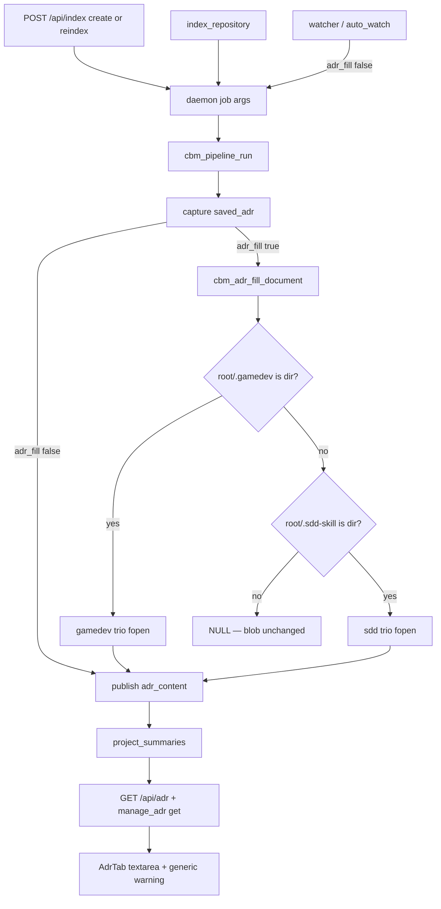

# Technical Plan — Spec-013: ADR fill from gamedev trio
Status: Approved | Created: 2026-08-31
Spec: spec-013-r9w-adr-fill-gamedev-trio | Mode: FEATURE | Stack: unchanged

## Executive Summary
spec-004 already splices a generated region on user-triggered index (`cbm_adr_fill_document` after ADR capture). The helper gates on `.sdd-skill/` as a directory and always opens the sdd trio. On a Game path that still has leftover `.sdd-skill/`, ADR describes MVP1.

This spec changes trio selection only. Same markers, extract window, splice, `adr_fill` flag, store blob, HTTP/MCP. If `.gamedev/` is a directory at `root_path`, open the gamedev trio only. Else keep spec-004 sdd. Neither directory: still return NULL (blob unchanged). No merge. No sdd fallback when a gamedev file is missing.

Pipeline, watcher skip, discover `ALWAYS_SKIP`, AdrTab copy, and POST `/api/adr` 32768 stay. No new endpoints.

## Technology Stack
Unchanged packages. Do not add npm or C libraries.

| Component | Tech | Version | Rationale |
| graph-ui | React + react-dom | ^19.0.0 | AdrTab chrome assertion only |
| graph-ui | TypeScript | ^5.7.0 | existing |
| graph-ui | Vite | ^6.4.3 | existing |
| graph-ui | Tailwind | ^4.1.0 | chrome tokens |
| graph-ui | Vitest + Testing Library | ^4.1.0 / ^16.1.0 | US-006 no-cycle-stamp |
| engine | C11 | Makefile.cbm | XOR inside existing `src/adr/adr_fill.c` |
| store | SQLite `project_summaries` | existing | no second table |

## System Architecture


User-triggered vs watcher is still the `adr_fill` flag (SDD-ADR-019). Do not hook fill to GET `/api/game-board`. Incremental persist already calls `cbm_pipeline_apply_adr_fill` / `adr_fill_would_change`; a trio switch on the next user job is a different fill result, so the existing would-change probe covers add/remove of `.gamedev/`.

Graph INIT (`mcp_idx=yes`, project `Users-jmsolorzano-SWE-tools-codebase-memory-mcp`; `get_architecture` + `search_graph` / `trace_path`; `check_index_coverage` cited paths):
- `cbm_adr_fill_document` (adr_fill.c:236) callees = `adr_skill_present` → `cbm_is_dir` on `.sdd-skill` only; then `adr_build_generated` opens the three sdd relatives. Callers = `cbm_pipeline_apply_adr_fill`, `cbm_pipeline_adr_fill_would_change` (and incremental via those).
- `adr_skill_present` (adr_fill.c:47) is the only presence gate. Replace with XOR select. Keep `adr_read_extract` / `adr_splice` / caps.
- `cbm_spec_board_gamedev_skill_present` (spec_board.c:1096) is the same `cbm_is_dir(root/.gamedev)` predicate. Do not include `spec_board.h` from `src/adr/`. Duplicate the join + `cbm_is_dir` locally (already the pattern for sdd).
- `ALWAYS_SKIP_DIRS` has `.sdd-skill` (SDD-ADR-023). `.gamedev` is not in the list. Do not add it this spec.
- Coverage: `adr_fill.c/h` and `test_adr_fill.c` no_recorded_issue. `pipeline.c` parse_partial 241-242. `pipeline_incremental.c` parse_partial 99-100/1146/1235 (outside fill). `discover.c` parse_partial 578. `mcp.c` parse_partial far from `cbm_mcp_index_want_adr_fill`. Read those files as ground truth. Do not treat pipeline/discover/mcp as this spec's edit set unless a test proves the hook is wrong (it is not).

## Directory Structure
```
src/adr/adr_fill.h                    EDIT — NULL comment: neither gamedev nor sdd dir
src/adr/adr_fill.c                    EDIT — XOR select + gamedev relatives; no spec_board include
tests/test_adr_fill.c                 EDIT — dual-tree, empty dir, partial, unreadable, switch-unit, sdd regression
tests/test_httpd.c                    EDIT — sibling gamedev tree helper + job Gherkin
tests/test_mcp.c                      EDIT — index_repository + manage_adr on gamedev tree
graph-ui/src/components/AdrTab.test.tsx  EDIT — assert no "gamedev-skill" on AdrTab
src/pipeline/pipeline.c               DO NOT CHANGE
src/pipeline/pipeline_incremental.c   DO NOT CHANGE
src/discover/discover.c               DO NOT CHANGE
src/mcp/mcp.c                         DO NOT CHANGE
src/daemon/application.c              DO NOT CHANGE
src/ui/spec_board.c                   DO NOT CHANGE
src/ui/game_board.c                   DO NOT CHANGE
src/ui/http_server.c                  DO NOT CHANGE (existing POST /api/index + GET/POST /api/adr)
graph-ui/src/components/AdrTab.tsx    DO NOT CHANGE (copy stays)
graph-ui/src/lib/i18n.ts              DO NOT CHANGE
graph-ui/src/lib/colors.ts            DO NOT CHANGE
```

`@sdd-*` breadcrumbs on every substantially edited file (constitution VII.2). Update `@sdd-spec` / `@sdd-decision` on `adr_fill.*` to this spec + SDD-ADR-058..061.

## Database Schema
No new table. No new column. No UNIQUE SQL.

ADR remains `project_summaries.summary`. Markers stay in-document. `indexed_at` stays the list stamp. Do not write generated-at or "from gamedev-skill" into the blob.

## API Contracts
Prefer existing HTTP/MCP. No new endpoints. No new MCP tool. No GET `/api/game-board` on the fill path.

### POST /api/index
Unchanged admission (spec-003). Create `{root_path}` and Reindex `{root_path, project}` both fill when a skill dir is present. Trio choice is inside the helper. Job success is independent of fill.

### MCP index_repository
Unchanged. After a successful run that owns that Path, the store blob matches GET `/api/adr`. Default fill on. Explicit `"adr_fill": false` stays watcher-only.

### GET /api/adr
Unchanged `{has_adr, content, updated_at}`.

### POST /api/adr
Unchanged whole-document. Body max stays 32768. Do not raise.

### manage_adr
Unchanged whole-document. `mode=get` is the same blob as GET `/api/adr`.

## Answers to Questions for Architect

### Local is-dir vs shared foundation helper
Local join + `cbm_is_dir` inside `adr_fill.c`, same as today's `adr_skill_present`. Meaning matches `cbm_spec_board_gamedev_skill_present` (directory, not file-at-path). Do not include `spec_board.h`. Do not add a new `foundation/` helper this spec — two five-line checks beat an adr→ui or adr→new-module link. → SDD-ADR-059

### `.gamedev` on `ALWAYS_SKIP_DIRS`
Not this spec. Fill is out-of-graph fopen either way. Adding `.gamedev` would drop GDD/state.md from the graph on already-indexed Game trees (coverage change, not an AC). `.sdd-skill` skip stays. → SDD-ADR-061

### `cbm_adr_fill_document` NULL
NULL means neither `.gamedev/` nor `.sdd-skill/` is a directory. Empty `.gamedev/` directory is present: return a marked document with no trio extracts (not NULL). File-at-path `.gamedev` is not present; sdd applies if that dir exists. → SDD-ADR-060

### Unreadable in tests
Match spec-004 / SDD-ADR-022: regular file + open/read fail. Reuse `af_make_unreadable` / `ui_make_unreadable` (`chmod 0`, then directory-at-path if the process can still read). Do not treat chmod-skip as job failure.

## Key Decisions
- XOR in the helper; pipeline flag and hook unchanged → SDD-ADR-058
- Local `cbm_is_dir`; no spec_board import → SDD-ADR-059
- NULL = neither skill dir; empty gamedev dir still marks → SDD-ADR-060
- Do not ALWAYS_SKIP `.gamedev` this spec → SDD-ADR-061

Planner defaults A frozen. No Gherkin change.

## Performance Targets
Same as spec-004: three short reads + one splice on user-triggered persist. No extra poll. No `get_graph_schema`. AdrTab stamp stays `useProjects` `indexed_at`.

## Security Considerations
- Loopback bind/auth unchanged.
- Trio paths are constants under `root_path`. No caller-supplied relative. No write-back to `.gamedev/`, `.sdd-skill/`, or `.grill/` (constitution I.2).
- ADR textarea stays text, not `dangerouslySetInnerHTML`.
- `adr_fill: false` is not an auth control. Do not advertise it on the MCP schema.
- 32768 body still bounded.

## Testing Strategy
C unit (`test_adr_fill.c`) for XOR/partial/unreadable/sdd regression. C HTTP/MCP for job Gherkin. Vitest for US-006 chrome (existing warning + no `gamedev-skill` substring on the AdrTab render). No live daemon for graph-ui DEVELOPMENT.

Gherkin → owner:

| Gherkin scenario | Primary test |
| Dashboard Reindex fills gamedev and omits leftover sdd | `test_httpd.c` after job; unit XOR covers extract |
| MCP index_repository fills the same gamedev blob | `test_mcp.c` manage_adr get + GET `/api/adr` |
| First create-index of a new Path with .gamedev/ | `test_httpd.c` bare POST `{root_path}` |
| Adding .gamedev/ overwrites generated in one job | `test_httpd.c` two jobs; unit can prove helper overwrite |
| ADR tab generic stamp + warning, no gamedev-skill | `AdrTab.test.tsx` isolated render |
| Limit — no .gamedev/ still fills sdd | existing spec-004 HTTP + unit stay green |
| Limit — only TECH_STACK; omit Purpose/Decisions; no sdd fallback | unit + HTTP |
| Limit — empty .gamedev/ no sdd fallback | unit + HTTP |
| Limit — .gamedev/ removed + sdd remains restores sdd | `test_httpd.c` |
| Limit — both skill dirs gone leaves last blob | `test_httpd.c` (helper NULL) |
| Limit — watcher incremental does not fill | existing watcher/`adr_fill:false` pattern with gamedev tree |
| Limit — extract omits tail past window | unit (2000-byte ARCHITECTURE_ADR) |
| Error — unreadable game_context omits Purpose; no sdd fallback | unit + HTTP; chmod or directory fixture |
| Error — manage_adr manual survives Reindex | `test_mcp.c` on gamedev tree |
| Error — generated-region edits replaced | `test_httpd.c` |

Keep spec-004 sdd fixtures green (`ui_adr_fill_tree`, `tool_index_repository_reports_store_backed_adr` on trees without `.gamedev/`).

## Deployment Plan
Rebuild daemon + UI (`scripts/build.sh --with-ui`). No cache migration. Next user-triggered index of a Path that now has `.gamedev/` overwrites generated. Watcher-only trees stay as they are until a user Reindex or `index_repository`.

## Risks & Mitigation
| Risk | Probability | Impact | Mitigation |
| Dual-tree still opens sdd relatives | high | leftover sdd strings in generated | XOR: do not call adr_join on sdd paths when gamedev dir |
| Missing gamedev file falls back to sdd | high | AC miss | select trio once; never mix relatives |
| Empty .gamedev/ returns NULL | med | leftover sdd wins | empty dir is present; splice empty generated |
| File-at-path .gamedev counted present | med | sdd skipped wrongly | `cbm_is_dir` only |
| Adding .gamedev to ALWAYS_SKIP | med | graph coverage change | do not; out of AC |
| adr → spec_board link | med | layering | local cbm_is_dir |
| spec-004 sdd HTTP fixtures grow a .gamedev dir | low | false XOR | keep sdd helpers writing .sdd-skill only |
| Incremental job skips fill after add .gamedev/ | low | stale generated | existing would-change vs new fill; do not touch hook unless a test fails |
| AdrTab assertion hits Game chrome | low | false fail | isolated AdrTab.test; do not mount GameBoardTab |
| chmod 0 ignored as root | low | unreadable skip | directory-at-path fallback (existing) |

## Success Criteria
- [ ] all 15 Gherkin scenarios have a C or Vitest owner
- [ ] leftover sdd unique strings absent when `.gamedev/` is a directory
- [ ] spec-004 sdd-only fixtures still pass
- [ ] watcher / `adr_fill` false never writes CBM-GENERATED
- [ ] no write-back to skill dirs
- [ ] @implementer can execute without a new endpoint or LLM

## External Integrations & Special Tools
None new.

| Tool | Type | Purpose | Tasks | Setup | Fallback |
| index_repository | MCP | user-triggered fill | #2 | daemon or in-process | C handle_tool |
| manage_adr | MCP | get/update same blob | #2 | existing | C unit |
| GET/POST /api/adr | HTTP | tab + replace Gherkin | #2 #3 | test_httpd / fetch mock | mock |
| POST /api/index | HTTP | create + Reindex fill | #2 | test_httpd | mock UI |
| codebase-memory-mcp graph tools | session MCP | architect INIT only | — | mcp_idx=yes | file/grep |

## Constitution validation
Checked against `.sdd-skill/docs/constitution.md` (draft — not rewritten this plan):
- I.1 / I.2: implement spec only; fill reads skill files; never writes cycle files
- II: C11 `cbm_`; React 19; i18n en+zh unchanged
- III: no GraphTab / `colorForLabel` touch
- IV.3: no new endpoint; `indexed_at` reused; admission unchanged
- V: every Gherkin mapped; C + Vitest
- VI: loopback; body still capped
- VII: breadcrumbs; accessible warning/stamp stay
- VIII: no schema RPC
- IX.5: user-triggered only; markers stay; fopen best-effort. IX.5 still names the sdd trio as the fill source — that is incomplete once XOR lands.

Proposed for @planner at close (do not edit constitution now):
- IX.5 MODIFIED: when `.gamedev/` is a directory, fill opens the gamedev trio only (no sdd merge/fallback). Else sdd trio if `.sdd-skill/` is a directory. `.gamedev` is not graph-skip this spec.
- IX.2 APPEND: spec-013 delivered gamedev XOR fill (SDD-ADR-058..061).

## Implementation breadcrumbs for @implementer
- Do not open sdd trio paths when `.gamedev/` is a directory.
- Do not fall back to sdd on missing/empty/unreadable gamedev files.
- Do not return NULL for an empty `.gamedev/` directory.
- Do not treat a file named `.gamedev` as present.
- Do not include `spec_board.h` from `adr_fill.c`.
- Do not add `.gamedev` to `ALWAYS_SKIP_DIRS`.
- Do not change `adr_fill` flag, watcher args, or pipeline hook unless a test proves it is wrong (it is not the intended edit).
- Do not hook fill to GET `/api/game-board` or `/api/skill-presence`.
- Do not write back to `.gamedev/`, `.sdd-skill/`, or `.grill/`.
- Do not copy GDD, DEV_LOG, playtest-log, constitution, or other non-trio files.
- Do not change AdrTab warning copy or add a cycle stamp.
- Do not change `colorForLabel` hex.
- Do not raise extract cap or POST `/api/adr` 32768.
- Keep spec-004 sdd-only fixtures green.
- Unreadable = exists as regular file and open/read fails (SDD-ADR-022).
- Fill failure must not fail the index job.
