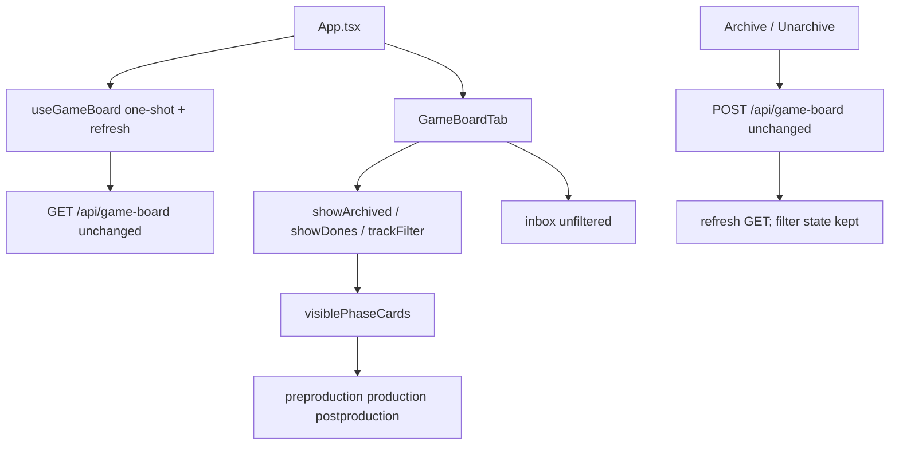

# Technical Plan — Spec-014: Game visibility filters
Status: Draft | Created: 2026-09-01
Spec: spec-014-x7m-filters | Mode: FEATURE | Stack: unchanged

## Executive Summary
spec-012 hides a phase card only when `work_state==="done" && archived && !showArchived`. Unarchived dones still paint. There is no track filter. Inbox and Archive POST stay.

This spec is graph-ui only. Extend `visiblePhaseCards` (GameBoardTab.tsx:60, callers: GameBoardTab only; App is transitive). Phase columns hide `work_state==="done"` unless Show Dones is pressed, and hide archived dones unless Show Dones AND Show archived are pressed. Exclusive Track A / B / All (default All; All includes A, B, H, and any other/null track). Inbox is never filtered.

No C, no SQLite, no new HTTP path or query param, no localStorage, no URL filter params. `useGameBoard` stays one-shot. Show archived i18n stays on `specBoard.showArchived` (SDD-ADR-057).

## Technology Stack
Unchanged packages. Do not add npm or C libraries.

| Component | Tech | Version | Rationale |
| graph-ui | React + react-dom | ^19.0.0 | existing GameBoardTab useState |
| graph-ui | TypeScript | ^5.7.0 | existing |
| graph-ui | Vite | ^6.4.3 | existing |
| graph-ui | Tailwind | ^4.1.0 | chrome tokens; no new CSS file |
| graph-ui | Vitest + Testing Library | ^4.1.0 / ^16.1.0 | Gherkin + invert spec-012 |
| engine | C11 | Makefile.cbm | DO NOT CHANGE |

## System Architecture


Flow:
1. GET JSON and POST archive stay spec-012. No `track` / `show_dones` / `show_archived` query params.
2. GameBoardTab holds `showArchived` (existing), `showDones` (default false), `trackFilter` (`"A" | "B" | "all"`, default `"all"`). Same `lastProjectRef` reset as expand + Show archived: remount / `project` change → Show Dones false, Show archived false, All pressed. GET refetch (same `project`) must not reset.
3. Chrome cluster (pane, not Inbox header, not a fifth column): Show archived, decorative `|`, Show Dones, decorative `|`, Track A, Track B, All. All five are `<button type="button">` with `aria-pressed`. Track trio is exclusive (exactly one pressed).
4. Phase columns use `visiblePhaseCards(cards, showArchived, showDones, trackFilter)`. Inbox uses `board.inbox` unchanged.
5. Empty filtered column = header only. No "No specs yet".

Graph INIT (mcp_idx=yes, project `Users-jmsolorzano-SWE-tools-codebase-memory-mcp`; `get_architecture` + `search_graph` / `trace_path`; `check_index_coverage` cited paths):
- `visiblePhaseCards` (GameBoardTab.tsx:60) callees = 0. Callers = `GameBoardTab` (hop 1). App is hop 2 via GameBoardTab. Predicate today: hide `done && archived && !showArchived` only.
- `GameBoardTab` inbound caller = `App`. Props: `board`, `project`, `refresh`. Chrome is a lone Show archived button (lines 423–432). Reset lives in the `lastProjectRef` render block (378–382).
- Coverage: `GameBoardTab.tsx`, `i18n.ts`, `SpecBoardTab.tsx`, `useGameBoard.ts`, `App.tsx` no_recorded_issue. Read those files as ground truth.
- Do not edit C (`game_board.c`, `http_server.c`, `store.c`, `mcp.c`, `spec_board.c`).

## Directory Structure
```
graph-ui/src/lib/i18n.ts                    EDIT — gameBoard.showDones + trackA/trackB/trackAll en+zh
graph-ui/src/lib/i18n.test.ts               EDIT — lock English names
graph-ui/src/components/GameBoardTab.tsx    EDIT — chrome cluster + predicate + reset
graph-ui/src/components/GameBoardTab.test.tsx  EDIT — Gherkin + invert spec-012
graph-ui/src/components/SpecBoardTab.test.tsx  EDIT — lock: no Show Dones / Track A / All

graph-ui/src/components/SpecBoardTab.tsx    DO NOT CHANGE
graph-ui/src/hooks/useGameBoard.ts          DO NOT CHANGE
graph-ui/src/App.tsx                        DO NOT CHANGE (unless a silent-win test breaks; prefer test invert)
graph-ui/src/lib/types.ts                   DO NOT CHANGE
graph-ui/src/lib/colors.ts                  DO NOT CHANGE
src/**                                      DO NOT CHANGE
```

`@sdd-*` breadcrumbs on every substantially edited file. Update `@sdd-spec` / `@sdd-decision` on `GameBoardTab.tsx` and `i18n.ts` to this spec + SDD-ADR-062..064.

## Database Schema
No change. Do not add columns, tables, or CBM keys for filter prefs.

## API Contracts
GET and POST `/api/game-board` stay spec-012 byte-for-byte (path, query, body, JSON keys). GET `/api/spec-board` unchanged.

### Forbidden
- New `/api/*` path or MCP filter tool
- GET query params `track`, `show_dones`, `show_archived`, or any filter param
- graph-ui fetch whose path contains `/api/skill-presence`
- Writing `.gamedev/`, `.sdd-skill/`, or `.grill/`
- localStorage / sessionStorage / URL query for these filters
- Radiogroup / `role="radio"` for Track (Gherkin asserts `aria-pressed`)
- Filtering Inbox
- Show Dones / Track controls on SpecBoardTab, Graph, ADR
- Changing Archive / Unarchive eligibility, POST body, expand, blocked strip, silent win, four columns, clipboard, no drag
- `setInterval` on `useGameBoard`; unsetting `settled`/`present` on refresh

## Key Decisions

### Client filter only; no HTTP or persist
Context: planner default 6. Constitution IV.3: prefer existing contracts.
Options: GET query params (server filter, extra C); localStorage (survives remount, fails remount-reset Gherkin); React state only.
Decision: React state on GameBoardTab. Same lifetime as Show archived.
Rationale: all Thens are paint/aria. C/HTTP would invent params the spec forbids.
Consequence: remount and `?project=` reset; GET refetch keeps state.
→ SDD-ADR-062

### AND hide supersedes spec-012 Show archived alone
Context: spec-012 `visiblePhaseCards` reveals archived done when Show archived is pressed. Human: archived done only if both toggles on.
Options: keep spec-012 OR (Show archived alone); AND; Show Dones replaces Show archived for dones.
Decision: a phase card with `work_state==="done"` is shown only if Show Dones is pressed; if also `archived`, Show archived must be pressed too. Leftover archived pending stays visible with Show Dones off (spec-012 leftover).
Rationale: matches US-002 and Error Gherkin (each toggle alone hides archived done).
Consequence: invert spec-012 tests that click Show archived alone and expect the archived done card.
→ SDD-ADR-063

### Exclusive aria-pressed trio; decorative `|`; i18n split
Context: planner questions (radiogroup vs pressed; `|` a11y; copy showArchived into gameBoard).
Options: radiogroup named Track (aria-checked); three `aria-pressed` buttons; duplicate Show archived under gameBoard.
Decision: five buttons, all `aria-pressed`. Track is exclusive in onClick (set `"A"` / `"B"` / `"all"`). Two `<span aria-hidden="true">|</span>` separators. Keep `t.specBoard.showArchived`. Add `gameBoard.showDones`, `trackA`, `trackB`, `trackAll`.
English (locked): "Show Dones", "Track A", "Track B", "All".
zh: 显示已完成 / 轨道 A / 轨道 B / 全部.
Rationale: Gherkin finds controls by accessible name and `aria-pressed`. Radiogroup would fail those Thens. SDD-ADR-057 already owns Show archived copy.
→ SDD-ADR-064

## Filter predicate (implementer contract)

```
visiblePhaseCards(cards, showArchived, showDones, track):
  drop if track === "A" && card.track !== "A"
  drop if track === "B" && card.track !== "B"
  // track === "all": keep A, B, H, other, null
  if card.work_state === "done":
    drop if !showDones
    drop if card.archived && !showArchived
  keep
```

Inbox: do not call this function.

Type: `type GameTrackFilter = "A" | "B" | "all"`. Keep the helper in GameBoardTab.tsx (do not add a new module).

## Chrome layout
One flex row (`flex flex-wrap items-center gap-2`, `self-start`) under existing phase/focus/continue:

1. Show archived (existing class tokens)
2. `|` (`aria-hidden`)
3. Show Dones (same `text-[10px]` pressed/unpressed tokens as Show archived)
4. `|` (`aria-hidden`)
5. Track A / Track B / All (same tokens; pressed = `text-foreground/70`)

Do not put these in `PhaseColumn` / Inbox header.

Reset in the existing `if (project !== lastProjectRef)` block:

```
setShowArchived(false)
setShowDones(false)
setTrackFilter("all")
```

(plus existing `setExpandedIds(new Set())`)

## Answers to Questions for Architect

### Segmented aria-pressed trio vs radiogroup named Track
**aria-pressed trio.** Gherkin Then clauses assert `aria-pressed` on controls named "Track A", "Track B", "All". A radiogroup uses `role="radio"` / `aria-checked` and would fail those Thens. Exclusive in the click handler, not in the role. → SDD-ADR-064

### Whether `|` is a decorative span
**Yes. `<span aria-hidden="true">|</span>`.** Visible text `|` for the chrome Then. Hidden from AT so it does not join accessible names. Two spans: after Show archived, after Show Dones.

### Keep Show archived i18n on specBoard vs copy into gameBoard
**Keep `specBoard.showArchived`.** SDD-ADR-057. New strings only for Show Dones + Track. → SDD-ADR-064

### Invert spec-012 tests that assume Show archived alone reveals an archived done card
**Yes. Required or the suite goes red when the predicate lands.** Named invert list is in tasks.md Task #1 / #2. Also invert first-paint tests that expect an unarchived done card without clicking Show Dones (`paints Done and Blocked work-state labels`, Archive happy path).

## Performance Targets
No new fetch. Filter is in-memory over ≤64 cards/column. Existing dashboard/workspace targets unchanged.

## Security Considerations
Loopback UI unchanged. No new write surface. Filter clicks must not POST. `aria-hidden` on `|` only. No secrets.

## Testing Strategy
Vitest + Testing Library on GameBoardTab (and a SpecBoardTab lock). Every Gherkin scenario maps to at least one test. C suite not this spec (constitution V.3: no C change). Playwright optional at DEVELOPMENT. Target >80% on touched GameBoardTab filter/chrome.

Skill-file byte Then: graph-ui does not fopen skill trees; assert no GET/POST from filter clicks and no localStorage keys. Do not add a C byte test.

## Deployment Plan
Same `scripts/build.sh --with-ui`. No migration. No env var.

## Risks & Mitigation
| Risk | Probability | Impact | Mitigation |
| spec-012 tests fail on first-paint done | high | suite red | invert list in tasks.md before claiming Task #1 done |
| radiogroup used for Track | medium | Gherkin aria-pressed fail | SDD-ADR-064; DoD names aria-pressed |
| Inbox accidentally filtered | low | leftover funnel disappears | Inbox branch stays `board.inbox` |
| filter query param added "for later" | low | violates US-004 | Forbidden list; Error Gherkin fetch spy |

## Success Criteria
- [ ] matches spec US-001..004 and all Gherkin
- [ ] no C / HTTP / schema change
- [ ] spec-012 leftover pending + Archive POST still green after invert
- [ ] Specs / Graph / ADR have no new controls
- [ ] @implementer can execute without guessing names, AND rule, or invert list

## External Integrations & Special Tools
None. Spec forbids MCP filter tool and `/api/skill-presence`.
