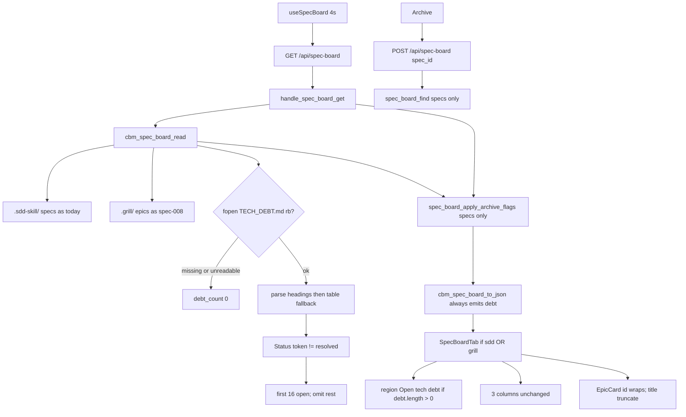

# Technical Plan — Spec-015: Specs debt and path
Status: Final | Created: 2026-09-02
Spec: spec-015-s5k-specs-debt-and-path | Mode: FEATURE | Stack: unchanged

## Executive Summary
GET `/api/spec-board` stays the only Specs board read. The C skill-file reader grows a third zero-write fopen: `{root}/.sdd-skill/baseline/TECH_DEBT.md`. It emits additive always-present `debt: [{id, title}]` (open TD-NNN only, cap 16, heading/file order). Conversion (`Companion to:` / `active.json.source.grill_epic`) does not change. CBM does not write, move, or rename `.sdd-skill/`, `.grill/`, or `.gamedev/`.

HTTP stays the spec-006/008 shape: `cbm_spec_board_read` → archive merge onto `specs[]` only → `cbm_spec_board_to_json`. POST `/api/spec-board` stays spec-only; an epic `id` is still 404 `spec not found`. No new path. No MCP debt tool. Do not read `.gamedev/epics_registry.md` or `.gamedev/backlog.md`.

graph-ui Specs pane paints a chrome strip above the three columns when `debt.length > 0`. Region accessible name is "Open tech debt" (aria-label; no required visible heading). Rows are dead text. Todo `EpicCard` keeps title truncate and wraps the full `epic.id` path. Spec / Artifact / Inbox id lines stay truncated. Graph, ADR, Game, and WorkspaceHeader never host this strip.

## Technology Stack
Unchanged packages. Do not add npm or C libraries.

| Component | Tech | Version | Rationale |
| graph-ui | React + react-dom | ^19.0.0 | existing SpecBoardTab |
| graph-ui | TypeScript | ^5.7.0 | existing |
| graph-ui | Vite | ^6.4.3 | existing |
| graph-ui | Tailwind | ^4.1.0 | wrap utilities; no new CSS file |
| graph-ui | Vitest + Testing Library | ^4.1.0 / ^16.1.0 | fetch-mock / hook-mock |
| engine | C11 | Makefile.cbm | spec_board.c + HTTP tests |
| SQLite | vendored | existing | untouched (no new table) |
| HTTP | GET+POST `/api/spec-board` | existing path | GET additive `debt`; POST spec-only |

## System Architecture


Flow:
1. GET: `resolve_project_root_path` (unchanged 400/404). Heap `cbm_spec_board_t`. `cbm_spec_board_read(root)`: sdd + grill as today; then `debt_fill`: join `{root}/.sdd-skill/baseline/TECH_DEBT.md`, `read_whole_file` (fopen `"rb"`). NULL or empty → `debt_count = 0`. Else `cbm_spec_board_parse_tech_debt` fills `debt[]` (open only, cap 16). Archive merge still specs-only. `to_json` always emits `"debt":[...]` (empty array when none). Never emit `has_more`.
2. Debt fill is independent of `sdd_skill_present`: grill-only with no file still 200 + `debt: []`. Do not require the sdd dir check before fopen.
3. POST: unchanged. `spec_board_find` iterates `specs[]` only. Epic path as `spec_id` → 404 `{"error":"spec not found"}`.
4. UI: if `(board.debt ?? []).length > 0`, paint `role="region"` `aria-label={t.specBoard.openTechDebt}` above the column row (same pane, not WorkspaceHeader). Each row is a `<p>`: `id` then title. No onClick, no clipboard, no expand. Missing `debt` on old mocks → `[]` → no strip. EpicCard id line: drop `truncate`, add `whitespace-normal break-all`. Title line keeps `truncate`.

Graph INIT (mcp_idx=yes, project `Users-jmsolorzano-SWE-tools-codebase-memory-mcp`; `get_architecture` + `search_graph` / `trace_path`; `check_index_coverage` cited paths):
- `cbm_spec_board_read` (spec_board.c:1105–1175) callers = `handle_spec_board_get` + `handle_spec_board_post`. Callees include grill fill + sdd reads. No TECH_DEBT.md fopen today. Add debt fill at end of read, after grill, still fopen `"rb"` only.
- `cbm_spec_board_to_json` (spec_board.c:1201–1265) callers = `handle_spec_board_get` only. Ends `specs` then `epics`. Append `,"debt":[...]` before the closing `}`. Grow buffer already via `board_json_append` (start cap 65536).
- `handle_spec_board_get` (http_server.c:488–519) stays read → archive merge → to_json. No grill/debt IO in HTTP.
- `EpicCard` (SpecBoardTab.tsx:100–112) callers = `Column` / `SpecBoardTab`. Title has `truncate`. Id line has `truncate` today — drop that class only.
- `SpecBoardTab` (SpecBoardTab.tsx:288–399) paints a single `flex gap-6` row of three `Column`s. Wrap that row in a column flex; strip first.
- `SpecCard` id line (SpecBoardTab.tsx:151) keeps `truncate`. `InboxCard` / artifact id (GameBoardTab.tsx:259, 301) stay truncated. Do not edit GameBoardTab.
- Game blocked strip (`role="region"` `aria-label={t.gameBoard.blockedStrip}`, GameBoardTab.tsx:318) is the a11y pattern to copy, not to share.
- Coverage: `spec_board.h`, `SpecBoardTab.tsx`, `types.ts`, `i18n.ts`, `GameBoardTab.tsx`, `WorkspaceHeader.tsx`, `test_spec_board.c`, `test_httpd.c` no_recorded_issue. `spec_board.c` parse_partial 242–242 (outside read/to_json). `http_server.c` parse_partial 2299–2299 (outside handle_spec_board_get). Read those files as ground truth.
- Do not call `index_repository`. Do not read `.gamedev/` from spec_board.

## Directory Structure
```
src/ui/spec_board.h                    EDIT — MAX_DEBT 16; debt_t; board.debt; parse prototype
src/ui/spec_board.c                    EDIT — debt_fill + parse; to_json always-emit debt
tests/test_spec_board.c                EDIT — parse/read Gherkin: heading/table/unknown/cap/skip/missing/unreadable/bytes
src/ui/http_server.c                   DO NOT CHANGE unless a compile forces a comment; dispatch stays
tests/test_httpd.c                     EDIT — GET debt JSON; no has_more; POST epic 404; GET bytes include TECH_DEBT.md
Makefile.cbm                           DO NOT CHANGE (no new .c)
src/mcp/mcp.c                          DO NOT CHANGE
src/ui/game_board.c                    DO NOT CHANGE
src/ui/game_board.h                    DO NOT CHANGE

graph-ui/src/lib/types.ts              EDIT — SpecBoardDebt; SpecBoard.debt?
graph-ui/src/lib/i18n.ts               EDIT — specBoard.openTechDebt en+zh
graph-ui/src/lib/i18n.test.ts          EDIT — lock English "Open tech debt"
graph-ui/src/components/SpecBoardTab.tsx
graph-ui/src/components/SpecBoardTab.test.tsx
graph-ui/src/components/WorkspaceHeader.test.tsx  EDIT — lock no TD-NNN / no Open tech debt
graph-ui/src/components/GameBoardTab.test.tsx     EDIT — lock no Open tech debt region
graph-ui/src/App.test.tsx              EDIT — Graph/ADR activate omits strip; grill-only Specs stays

graph-ui/src/components/GameBoardTab.tsx   DO NOT CHANGE
graph-ui/src/components/WorkspaceHeader.tsx DO NOT CHANGE
graph-ui/src/hooks/useSpecBoard.ts         DO NOT CHANGE (poll 4000; same GET)
graph-ui/src/hooks/useSddSkillPresent.ts   DO NOT CHANGE
graph-ui/src/lib/formatIndexedAt.ts        DO NOT CHANGE
graph-ui/src/lib/colors.ts                 DO NOT CHANGE
```

`@sdd-*` breadcrumbs on every new/substantially edited file (constitution VII.2). Update `@sdd-spec` / `@sdd-decision` on `spec_board.h`, `spec_board.c`, `SpecBoardTab.tsx` to this spec + SDD-ADR-065..068.

## Database Schema
None. No new SQLite table. `spec_archive` merge stays spec-006. Do not store debt in CBM.

## API Contracts
Prefer existing HTTP. No new path. No new MCP tool. GET `/api/game-board` JSON is unchanged this spec (no `debt` key there).

### GET /api/spec-board?project=<name>
Unchanged status codes: 400 missing project, 404 `{"error":"project not found"}`, 500 OOM/serialize, 200 otherwise.

Live 200 body — additive key. Spec and epic objects keep spec-008 fields.

```
{
  "sdd_skill_present": true|false,
  "grill_skill_present": true|false,
  "specs": [ { ...unchanged spec-006/008 fields... } ],
  "epics": [ { ...unchanged spec-008 fields... } ],
  "debt": [
    { "id": "TD-005", "title": "leftover cache" }
  ]
}
```

| Field | Rule |
| debt | always emitted. `[]` when file missing, unreadable, or zero open items. Length ≤ 16 |
| debt[].id | exact heading token `TD-` + digits (e.g. `TD-005`). Size cap 32 |
| debt[].title | trimmed text after `## TD-NNN:` on the heading line. Not a `Title:` field. Empty string if no colon remainder |
| has_more | never emitted |
| extra debt fields | never emit severity, category, status, color |

Caps: `CBM_SPEC_BOARD_MAX_SPECS` 64, `CBM_SPEC_BOARD_MAX_EPICS` 64, `CBM_SPEC_BOARD_MAX_TASKS` 48, `CBM_SPEC_BOARD_MAX_DEBT` 16. Filling debt does not reduce spec or epic slots.

### POST /api/spec-board
Unchanged. Body `{project, spec_id, archived}`. Lookup is `specs[]` only.

| Status | Body | When |
| 404 | `{"error":"spec not found"}` | `spec_id` is an epic path (or any id not on `specs[]`) |
| 404 | `{"error":"project not found"}` | unknown project (same string as GET) |

### Forbidden
- New `/api/tech-debt` or a second poll
- New MCP debt tool
- Putting debt objects inside `specs[]` / `epics[]` / Todo cards
- Emitting `has_more` or overflow copy
- Writing `.sdd-skill/`, `.grill/`, or `.gamedev/`
- Reading `.gamedev/epics_registry.md` or `.gamedev/backlog.md` from spec-board
- Changing Companion-to / `source.grill_epic` match
- Changing GET `/api/game-board` JSON or GameBoardTab
- Strip in WorkspaceHeader, Graph, ADR, or Game
- Severity / category / status word / color on rows
- Clipboard copy of TD-NNN
- Dropping `truncate` from SpecCard / Artifact / Inbox id lines
- Changing spec-005 expand, spec-006 archive, spec-007 `formatIndexedAt`, spec-014 Game filters

## Answers to Questions for Architect

### Always-emit `debt: []` vs omit key when empty
Always emit `"debt":[]`. Planner default. Old UIs ignore the key. New UI treats missing as `[]` (defensive) but C always writes the key so Gherkin `debt is []` is a present empty array, not a missing field. Omit-key would force every consumer to distinguish undefined vs empty.

### Status line regex (pipe vs standalone `Status:`)
Both, first match in the heading block wins. Heading block = from the `## TD-NNN` line up to (not including) the next line that starts with `## `.

Recognize `Status:` only as:
1. Standalone: trimmed line-start `Status:` then optional spaces, then token.
2. Pipe cell: a `|`-split cell whose trimmed text starts with `Status:` then optional spaces, then token.

Do not match a mid-sentence `Status:` inside Description prose. Token = following run until first whitespace, `|`, or EOL; then trim. Compare with `strcmp` to exact `"resolved"`. Case-sensitive label `Status:` (capital S). `resolvd`, `Resolved`, empty, `identified`, `deferred`, `in_progress`, unknown → open.

This-repo pipe line `ID: TD-001 | Category: … | Status: resolved | Identified: …` matches rule 2.

### Title extract: text after `## TD-NNN:` vs `Title:` field
Heading remainder. After matching `## TD-<digits>`, if the next non-space character is `:`, skip `:` and surrounding spaces; rest of that line (trimmed) is `title`. Do not read a `Title:` field and do not use the Debt Summary title cell. Gherkin Then is `"leftover cache"` from `## TD-005: leftover cache`.

### Wrap CSS: `break-all` vs `break-words`
Split by surface:
- Epic id line: drop `truncate`; add `whitespace-normal break-all`. Paths have no spaces; a 1/3 column would overflow a long kebab segment under `break-words`.
- Debt title line: `whitespace-normal break-words`. Gherkin long title is prose with spaces. `break-all` would shatter words.

Both: no `truncate`, no `text-overflow: ellipsis`. Assert computed `text-overflow !== "ellipsis"` and no class `truncate` on those lines.

### Visible heading vs aria-only
Accessible name only. `role="region"` + `aria-label={t.specBoard.openTechDebt}` (`en` = `"Open tech debt"`). No required visible `<h2>`. Same pattern as Game `blockedStrip`. Tests use `getByRole("region", { name: "Open tech debt" })`.

## Key Decisions
- Same GET; always-emit `debt: [{id, title}]`; cap 16; no `has_more` → SDD-ADR-065
- Parse in `spec_board.c` / `cbm_spec_board_read`; heading `Status:` (standalone or pipe cell) wins; `## Debt Summary` table is fallback; skip no-id; unknown = open; missing/unreadable → `[]` → SDD-ADR-066
- Specs-only strip; region aria-label; no required visible heading; dead text; debt titles `break-words` → SDD-ADR-067
- EpicCard id wraps (`break-all`); title truncate stays; Spec/Artifact/Inbox id locked → SDD-ADR-068

Planner defaults 1–10 frozen. Grill ADR-001 (chrome list, not a column), ADR-002 (open = Status ≠ resolved), ADR-005 (conversion untouched; no registry/backlog on Specs), ADR-006 (path wraps; same id field), ADR-007 (same GET additive), ADR-008 (strip above 3 columns; grayscale; not WorkspaceHeader) apply. Do not reopen.

## Performance Targets
| Target | Value |
| GET | existing 4s poll; one extra fopen of TECH_DEBT.md (≤ 4 MiB `SPEC_BOARD_MAX_FILE`) |
| POST | unchanged |
| Poll | `useSpecBoard` 4000 ms unchanged |
| Caps | 64 specs / 64 epics / 48 tasks / 16 open debt |
| Dashboard / Graph / ADR / Game | 0 new RPCs; 0 `get_graph_schema`; game-board GET untouched |
| Coverage | >80% on touched spec_board + httpd Gherkin + SpecBoardTab (reporter may be absent) |

## Security Considerations
- Loopback bind/auth unchanged. Do not widen.
- Debt path is a fixed join: `root_path` + `/.sdd-skill/baseline/TECH_DEBT.md`. Not taken from query or POST body.
- fopen `"rb"` only. GET/POST leave skill trees and `.gamedev/` byte-identical.
- JSON escape `debt[].id` / `debt[].title` via `cbm_json_escape`.
- UI renders id + title as text, not HTML. Rows are not buttons.
- POST `spec_id` is still looked up on `specs[]` only, never used as a filesystem path into TECH_DEBT.md.
- Do not follow this spec into `/api/skill-presence` or `/api/game-board`.

## Testing Strategy
C board: `tests/test_spec_board.c` fixtures under `/tmp` (`th_mktempdir`). Never the real repo `.sdd-skill/` or `.grill/`. fopen rb only. Buffer tests may call `cbm_spec_board_parse_tech_debt` without fopen.

C HTTP: `tests/test_httpd.c` existing `ui_spec_board_get` / `ui_spec_board_post`. GET debt JSON + no `has_more`. POST epic id 404 + byte snapshots including TECH_DEBT.md. Unknown project 404 unchanged. GET `/api/game-board` must not be required to change (existing game tests stay green).

Vitest: mock `useSpecBoard`. Missing `debt` must not crash. No live daemon. Playwright optional (constitution IX.4).

Gherkin → owner:

| Gherkin scenario | Primary test |
| Open heading item appears on GET and in the Specs strip | `test_spec_board.c` + `test_httpd.c` + `SpecBoardTab.test.tsx`; WorkspaceHeader lock |
| Todo epic id wraps the full path under the short name | `SpecBoardTab.test.tsx` |
| Companion-to still omits the converted epic | existing `test_spec_board.c` conversion + Vitest Todo omit |
| All-resolved TECH_DEBT.md omits the strip | `test_spec_board.c` `debt []` + Vitest no region |
| Limit — missing TECH_DEBT.md omits the strip | `test_spec_board.c` + Vitest |
| Limit — grill-only without TECH_DEBT.md still shows Specs | Vitest host (spec-009 OR) + no strip + no notSddSkill |
| Limit — heading Status wins when the summary table disagrees | `test_spec_board.c` |
| Limit — table Status is used when the heading has no Status token | `test_spec_board.c` |
| Limit — unknown Status token is open | `test_spec_board.c` |
| Limit — 17th open item is omitted | `test_spec_board.c` + Vitest no "Has more" |
| Limit — spec card id line still truncates | `SpecBoardTab.test.tsx` |
| Limit — long debt title wraps in the strip | `SpecBoardTab.test.tsx` |
| Limit — Graph ADR and Game do not show the strip | `App.test.tsx` Graph/ADR + `GameBoardTab.test.tsx` |
| Limit — activating a debt row does nothing | `SpecBoardTab.test.tsx` (no POST, no clipboard, no expand) |
| Error — unreadable TECH_DEBT.md still 200 with empty debt | `test_spec_board.c` (dir-at-path / open fail) |
| Error — heading block without a TD-NNN id is skipped | `test_spec_board.c` |
| Error — POST archive with an epic id is 404 and writes nothing | `test_httpd.c` (keep green) |
| Error — unknown project on GET is still 404 | `test_httpd.c` (existing; keep green) |
| Error — GET does not write skill trees or game files | `test_httpd.c` bytes: TECH_DEBT.md, active.json, `.grill/index.md` |

Existing host tests (grill-only Kanban, notSddSkill last-resort, 64-epic no Has more) stay green. Mocks `{ sdd_skill_present, specs }` without `debt` still work.

## Deployment Plan
- `scripts/build.sh --with-ui` (C + embed UI).
- No env var. No daemon flag. No schema migration.
- Old UIs ignore unknown `debt`. New UI treats missing as `[]`.
- This-repo live TECH_DEBT.md is all resolved → GET emits `debt: []`; strip omitted until a new TD is opened.

## Risks & Mitigation
| Risk | Probability | Impact | Mitigation |
| HTTP grows a TECH_DEBT reader | med | splits skill IO | ADR-066: parse in spec_board.c only |
| Omit `debt` key when empty | med | Gherkin `debt is []` ambiguous | ADR-065 always emit |
| Mid-prose `Status:` closes an item | med | false omit | only line-start or pipe cell |
| Title: field vs heading remainder | med | Gherkin title miss | heading remainder only |
| Strip in WorkspaceHeader | med | leaks onto Graph/ADR | ADR-067 SpecBoardTab only |
| `break-words` on path overflows | med | filename clipped | `break-all` on epic id only |
| Debt cards in Todo | med | kind E / conversion collision | chrome strip; not a card |
| Conversion "fix" while adding debt | low | spec-008 regress | do not touch `grill_epic_converted` |
| Existing to_json exact-string tests | high | Task #1 red | accept additive `debt` (empty when no file) |
| Game Inbox wrap this spec | med | grill epic-002 leak | do not edit GameBoardTab |

## Success Criteria
- [ ] All 6 US + all 19 Gherkin scenarios have a C and/or Vitest owner
- [ ] GET is the only Specs board read; POST stays spec-only
- [ ] Zero writes to `.sdd-skill/`, `.grill/`, or `.gamedev/` from this feature
- [ ] Zero debt rows in Todo / In progress / Done
- [ ] Conversion matcher and game-board JSON unchanged
- [ ] Graph hex and last-indexed TZ unchanged
- [ ] @implementer can execute without a sibling HTTP reader or MCP tool

## External Integrations & Special Tools

| Tool | Type | Purpose | Tasks | Setup | Fallback |
| sdd-skill `TECH_DEBT.md` | skill filesystem (read-only) | open TD-NNN list | #1–#2 | none in CBM; fixtures in /tmp | missing/unreadable → debt [] |
| grill-skill `.grill/` tree | skill filesystem (read-only) | conversion leftover + epic id wrap | #1–#4 | fixtures in /tmp | conversion unchanged |
| GET `/api/spec-board` | existing HTTP | additive board JSON | #1–#4 | daemon in prod; C + fetch mock in tests | 404 unknown project; 200 debt [] |
| codebase-memory-mcp graph | session MCP | architect INIT only | — | mcp_idx=yes | file read (done) |

No new MCP tool. Do not call `index_repository`.

## Constitution validation
Checked against `.sdd-skill/docs/constitution.md` (draft — not rewritten):
- I.1–I.2: frozen spec only; no cycle-file writes to `.sdd-skill/`, `.grill/`, or `.gamedev/`
- II: C11 `cbm_`; React 19; no new CSS file; i18n en+zh for the region name; no new runtime
- III: chrome grayscale; no severity color; `colorForLabel` locked
- IV.3: same GET/POST family; no sibling debt path
- IV.4: no second freshness field
- V: every Gherkin mapped; C + Vitest; no live daemon for UI
- VI: loopback unchanged; fixed join path; no secrets
- VII: region accessible name; breadcrumbs
- VIII: no `get_graph_schema` on this path; poll stays 4s
- IX.2: spec-005 expand + spec-006 archive stay on spec cards; spec-007 `formatIndexedAt` untouched; spec-008 conversion untouched; spec-009 OR host stays; spec-014 Game filters untouched

No constitution edit this spec (IX.2 append is @planner at close).

## Implementation breadcrumbs for @implementer
1. Do not add `/api/tech-debt` or an MCP debt tool.
2. Do not write `.sdd-skill/`, `.grill/`, or `.gamedev/`. fopen `"rb"` only.
3. Do not put TECH_DEBT fopen in `http_server.c`. Fill in `cbm_spec_board_read` after grill fill.
4. Do not put debt objects in `specs[]` or `epics[]`. Do not add kind E for debt.
5. JSON: always `"debt":[{id,title}]`. Never `has_more`, never severity/category/status.
6. Do not emit `gamedev_skill_present` on this GET. Do not read `.gamedev/` from spec_board.
7. Do not change `grill_epic_converted`, Companion-to extract, or `source.grill_epic`.
8. Do not edit `GameBoardTab.tsx`, `useGameBoard.ts`, `game_board.c`.
9. Do not change poll interval, spec-005 expand Set, spec-006 Archive, or `formatIndexedAt`.
10. Do not edit `colors.ts` / EdgeLines hex.
11. Heading id: `## ` then `TD-` + one or more digits. No match → skip the block.
12. Title = heading-line remainder after `TD-NNN:`. Not `Title:`.
13. Status: first standalone line-start or pipe cell `Status:` in the heading block. Else Debt Summary table row for that id. Else open.
14. Open iff token `strcmp` ≠ `"resolved"`. Cap 16 open in heading order. Duplicate id: first heading wins.
15. `## Debt Summary` then GFM `|` rows; header cells `ID` and `Status`; skip `---` separators. No that heading → no table fallback.
16. Unreadable file (fopen fail / dir-at-path / oversize): `debt_count` 0; still 200.
17. POST with epic id: existing 404 string; do not add a debt error string.
18. Heap-only `cbm_spec_board_t` (already calloc).
19. Existing host mocks without `debt` must not throw.
20. Strip is `<p>` rows inside `role="region"`; not buttons; not in WorkspaceHeader.
21. EpicCard id: `whitespace-normal break-all`; no `truncate`. Title keeps `truncate`. SpecCard id keeps `truncate`.
22. i18n key `specBoard.openTechDebt` en `"Open tech debt"`. Tests assert English. Letter E unchanged.
23. Breadcrumb headers on touched files.
24. Fixtures in `/tmp` only. Never parse this repo's live TECH_DEBT.md in tests.
25. `CBM_SPEC_BOARD_MAX_DEBT` 16 in spec_board.h next to the other caps.
26. Export `cbm_spec_board_parse_tech_debt` for buffer unit tests (like extract_blurb).
27. Stop appending open items at cap 16; do not invent overflow chrome.
28. This-repo all-resolved file is the live default omit; do not open a real TD to "see" the strip.
