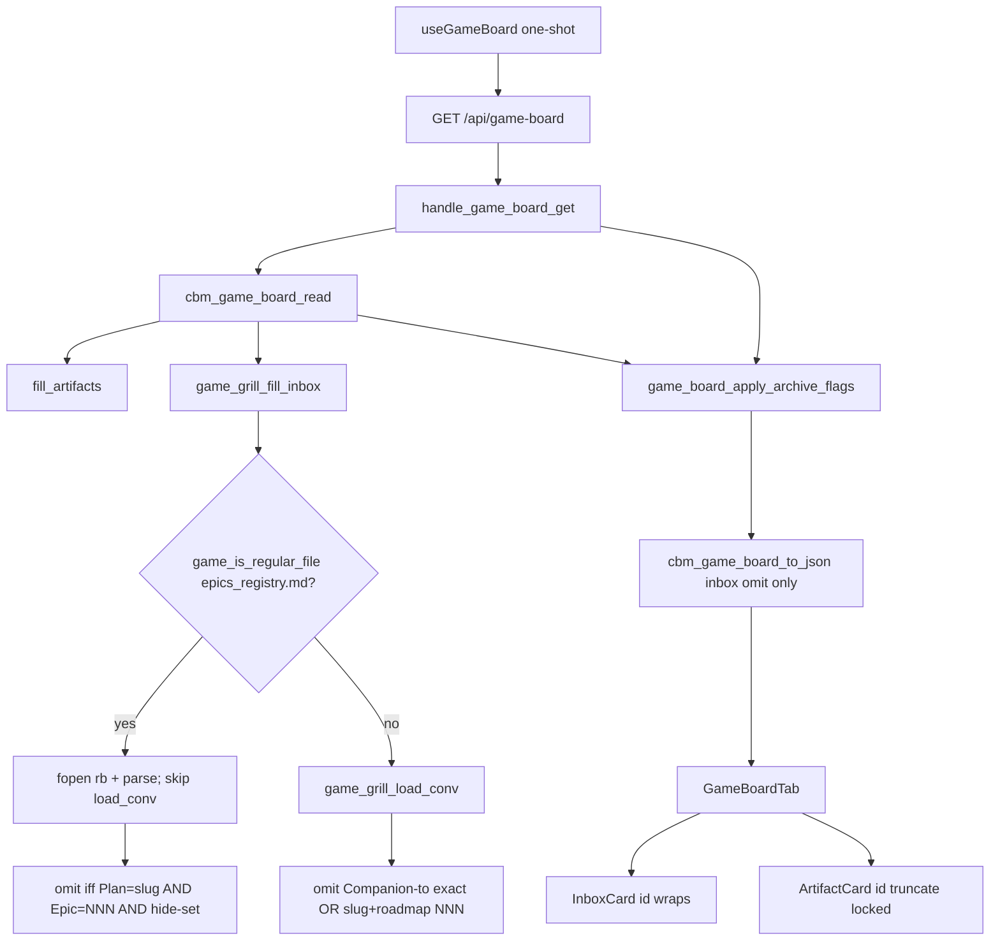

# Technical Plan — Spec-016: Game Inbox registry
Status: Final | Created: 2026-09-02
Spec: spec-016-d9v-game-inbox-registry | Mode: FEATURE | Stack: unchanged

## Executive Summary
GET `/api/game-board?project=` stays the only Game board HTTP read. Hide stays server-side omit from `inbox[]`. No new JSON key. No new path. No MCP registry tool. `game_board.c` stays zero-write fopen `"rb"`. CBM never creates `.gamedev/epics_registry.md`.

If `{root}/.gamedev/epics_registry.md` exists as a regular file (`game_is_regular_file`: `cbm_file_exists && !cbm_is_dir`), that file is the sole Inbox hide source — even when empty, header-only, unreadable, or zero parsed rows. Companion-to exact and roadmap slug+NNN must not omit. Skip `game_grill_load_conv` in that branch so prior tokens are not even loaded. If the path is absent or is a directory / non-regular, keep spec-011 hide unchanged.

Parse is local to `game_board.c` (do not import `spec_board`). graph-ui changes only `InboxCard` id chrome: drop `truncate`, add `whitespace-normal break-all` (same as spec-015 EpicCard). ArtifactCard id truncate stays. Specs conversion and `spec_board.c` do not read the registry.

## Technology Stack
Unchanged packages. Do not add npm or C libraries.

| Component | Tech | Version | Rationale |
| graph-ui | React + react-dom | ^19.0.0 | existing GameBoardTab InboxCard |
| graph-ui | TypeScript | ^5.7.0 | existing |
| graph-ui | Vite | ^6.4.3 | existing |
| graph-ui | Tailwind | ^4.1.0 | wrap utilities; no new CSS file |
| graph-ui | Vitest + Testing Library | ^4.1.0 / ^16.1.0 | class + computed-style locks |
| engine | C11 | Makefile.cbm | game_board.c hide predicate |
| SQLite | vendored | existing | untouched (no new table) |
| HTTP | GET+POST `/api/game-board` | existing path | GET omit from inbox[]; POST unchanged |

## System Architecture


Flow:
1. GET: `resolve_project_root_path` (unchanged 400/404). Heap `cbm_game_board_t`. `cbm_game_board_read` fills artifacts then `game_grill_fill_inbox`. Archive merge unchanged. `to_json` shape unchanged (no registry key).
2. `game_grill_fill_inbox` walk stays: all `.grill/plans/*/epics/` files, all plan statuses, cap 64. Only the hide call in `game_grill_append_epic` changes.
3. Present = `game_is_regular_file("{root}/.gamedev/epics_registry.md")`. Directory or missing → not present → US-003. Regular file + `read_whole_file` NULL (fopen fail, fseek fail, size > `GAME_BOARD_MAX_FILE` 1 MiB) → present, zero parsed rows → US-002 (no prior hide).
4. When present: do not call `game_grill_load_conv`. Hide iff a parsed row has Plan cell exact slug AND Epic cell integer NNN matching the filename, AND Status in {`in_progress`,`closed`,`parked`}. `not_started`, unknown, no-row, Epic 0, `evergreen`, Plan `native` → stay.
5. When absent: existing `game_grill_epic_converted` (Companion-to exact path OR slug token in roadmap.md|game_context.md AND roadmap table cell NNN / epic-NNN).
6. UI: InboxCard id line drops `truncate`, adds `whitespace-normal break-all`. TitleControl truncate stays. ArtifactCard id line at GameBoardTab.tsx:259 stays `truncate`.

Graph INIT (mcp_idx=yes, project `Users-jmsolorzano-SWE-tools-codebase-memory-mcp`; `get_architecture` + `search_graph` / `trace_path`; `check_index_coverage` cited paths):
- `cbm_game_board_read` (game_board.c:1895–1922) callers include `handle_game_board_get`. Callees: present check, `fill_artifacts`, `game_grill_fill_inbox`, `overlay_blocked`. Do not change this order.
- `game_grill_fill_inbox` (game_board.c:1820–1893) callers = `cbm_game_board_read` only. Today always `game_grill_load_conv`. Gate that load on !present.
- `game_grill_epic_converted` (game_board.c:1739–1758) callers = `game_grill_append_epic` only. Keep the function for the absent branch. Add a sibling hide that consults the registry when present.
- `game_grill_append_epic` (game_board.c:1760–1818) is the omit site (`if (converted) return` before fopen epic.md).
- `game_is_regular_file` (game_board.c:685–687) already exists; reuse. Do not invent a second stat helper.
- `game_grill_split_gfm_row` (game_board.c:1363–1389): cells[0] is the leading-pipe dummy; Epic=cells[1], Plan=cells[2], Status=cells[5]. Need n >= 6 or skip.
- `InboxCard` (GameBoardTab.tsx:278–307) id line: `font-mono truncate`. `ArtifactCard` id (line 259) stays truncated.
- `handle_game_board_get` (http_server.c:595–625) stays read → archive merge → to_json. No registry IO in HTTP. Coverage: http_server.c parse_partial 2299–2299 (outside this handler).
- Coverage: `game_board.c`, `game_board.h`, `GameBoardTab.tsx`, `test_game_board.c`, `test_httpd.c` no_recorded_issue. `spec_board.c` parse_partial 242–242 — do not edit. Read those files as ground truth.
- Do not call `index_repository`. Do not read the registry from spec_board.

## Directory Structure
```
src/ui/game_board.h                    EDIT — MAX_REGISTRY 256; parse prototype; breadcrumb
src/ui/game_board.c                    EDIT — present + parse + hide swap; skip load_conv when present
tests/test_game_board.c                EDIT — hide-set / present vs absent / last-wins / NNN / slug / unreadable / malformed / cap 64
src/ui/http_server.c                   DO NOT CHANGE (dispatch already correct)
tests/test_httpd.c                     EDIT — GET inbox omit/keep; 404; bytes; no create; spec-board leftover
Makefile.cbm                           DO NOT CHANGE
src/mcp/mcp.c                          DO NOT CHANGE
src/ui/spec_board.c                    DO NOT CHANGE
src/ui/spec_board.h                    DO NOT CHANGE

graph-ui/src/components/GameBoardTab.tsx
graph-ui/src/components/GameBoardTab.test.tsx
graph-ui/src/components/SpecBoardTab.tsx       DO NOT CHANGE
graph-ui/src/components/SpecBoardTab.test.tsx  EDIT only if a leftover lock is cheaper here than httpd
graph-ui/src/hooks/useGameBoard.ts             DO NOT CHANGE
graph-ui/src/lib/i18n.ts                       DO NOT CHANGE (no new empty-state string)
graph-ui/src/lib/types.ts                      DO NOT CHANGE (no new JSON key)
graph-ui/src/lib/colors.ts                     DO NOT CHANGE
```

`@sdd-*` breadcrumbs on every new/substantially edited file (constitution VII.2). Update `@sdd-spec` / `@sdd-decision` on `game_board.h`, `game_board.c`, `GameBoardTab.tsx` to this spec + SDD-ADR-069..071.

## Database Schema
None. No new SQLite table. `game_archive` merge stays spec-012. Do not store registry rows in CBM.

## API Contracts
Prefer existing HTTP. No new path. No new MCP tool. GET `/api/spec-board` JSON and conversion stay unchanged (must not fopen the registry).

### GET /api/game-board?project=<name>
Unchanged status codes: 400 missing project, 404 `{"error":"project not found"}`, 500 OOM/serialize, 200 otherwise.

Live 200 body — same keys as spec-012/014. Hide = omitted object in `inbox[]`. Never emit `has_more`. Never emit a registry array.

```
{
  "gamedev_skill_present": true,
  "inbox": [ { "id": ".grill/plans/<slug>/epics/epic-NNN-<name>.md", "title": "<name:>", ... } ],
  "preproduction": [ ... ],
  "production": [ ... ],
  "postproduction": [ ... ],
  "blocked": [ ... ]
}
```

| Field | Rule |
| inbox | unconverted leftovers after the active hide predicate; length ≤ 64 |
| has_more | never emitted |
| registry / epics_registry | never emitted |

Caps: `CBM_GAME_BOARD_MAX_CARDS` 64 per column including Inbox. `CBM_GAME_BOARD_MAX_REGISTRY` 256 unique Plan+NNN slots (last-wins overwrite does not consume a new slot; extra unique rows omitted). Filling registry does not change artifact slots.

### POST /api/game-board
Unchanged. Inbox epic id is still 404 (spec-012). Do not teach POST to write the registry.

### Forbidden
- New `/api/game-inbox` or a second poll
- New MCP registry tool
- Emitting `has_more` or “all tracked” copy
- Writing `.gamedev/`, `.sdd-skill/`, or `.grill/` (including creating `epics_registry.md`)
- Reading `epics_registry.md` from spec_board
- Applying Companion-to/roadmap hide when the registry regular file exists
- Dropping `truncate` from ArtifactCard / SpecCard / WorkspaceHeader path
- Filtering Inbox with Show Dones / Track
- Game debt chrome / `backlog.md` (grill epic-003)

## Answers to Questions for Architect

### Detect “present”: `stat` regular file vs successful fopen
Regular file exists. Reuse `game_is_regular_file` (`cbm_file_exists && !cbm_is_dir`). Unreadable (fopen/`read_whole_file` fail, including size > 1 MiB) is still present with zero parsed rows. Directory or other non-regular at that name is not present → spec-011 hide. Planner default.

### Skip loading Companion-to/roadmap when the registry file is present
Yes. When present, do not call `game_grill_load_conv`. Must not affect omit (US-002 already forbids prior hide). Skipping the load makes a leak of the old predicate a no-op. When absent, load as today.

### Wrap CSS: `break-all` vs `break-words`
Same as EpicCard: Inbox id drops `truncate`, uses `whitespace-normal break-all`. Paths have no spaces. Artifact id stays `truncate`. Title line may still truncate (TitleControl). Assert no class `truncate` on the Inbox id `<p>` and computed `text-overflow !== "ellipsis"` (jsdom: absence of truncate is enough if computed is empty).

### Table column index if a row has fewer cells than the template
Skip the row. Template is Epic | Plan | Name | Origin | Status. After `game_grill_split_gfm_row`, that is cells[1]..cells[5] and n >= 6. Origin is unused for hide but must be present as a cell so Status stays at index 5.

## Parse contract (implementer-facing)

Header / separator / unparseable data rows skipped. GET stays 200.

Epic cell: trim; optional leading exact `epic-` (case-sensitive); then the entire remainder must be one or more digits (leading zeros allowed). `001`, `1`, `epic-001` → NNN 1. Other text (`n/a`, `EPIC-001`, `epic-001-inbox`) → skip row.

Plan cell: trim; exact `strcmp` to the grill plan directory slug. Path leftover (`.grill/plans/inbox-plan`, `tech-debt-and-epics-registry/epics`) does not match `inbox-plan`. Cell `native` → skip row (never matches a grill slug).

Status cell: trim; hide tokens exact `in_progress`, `closed`, `parked`. `not_started`, `evergreen`, typo (`closd`), unknown → match Plan+NNN but hide=false.

Epic NNN 0: never hide, regardless of Status.

Duplicate Plan+NNN: last data row in file order wins (overwrite the stored hide flag). Earlier Status ignored.

Origin column: unused.

Export `cbm_game_board_parse_epics_registry(const char *md, cbm_game_board_registry_row_t *out, int *count)` for buffer unit tests. NULL/empty md → count 0. Does not fopen. Does not set present.

## Key Decisions
- Present = regular file; sole hide when present; absent keeps spec-011; skip `load_conv` when present → SDD-ADR-069
- Parse last-wins, integer NNN, exact slug, skip short/unparseable/`native` rows; fopen in game_board.c only → SDD-ADR-070
- InboxCard id wraps `break-all`; Artifact/Spec/header ids locked; SDD-ADR-068 Inbox lock lifted → SDD-ADR-071

Planner defaults 1–10 frozen. Grill ADR-003 (hide-set), ADR-004 (file present else ADR-006), ADR-005 (Specs conversion untouched), ADR-006 (path wraps), ADR-007 (same GET) apply. Do not reopen.

## Performance Targets
| Target | Value |
| GET | one extra `stat` + optional fopen of epics_registry.md (≤ 1 MiB `GAME_BOARD_MAX_FILE`); skip artifact Companion-to scan when present |
| POST | unchanged |
| Poll | `useGameBoard` one-shot unchanged |
| Caps | 64 Inbox cards; 256 unique registry Plan+NNN |
| Specs / Graph / ADR | 0 new RPCs; spec-board does not fopen the registry |
| Coverage | >80% on touched game_board hide + httpd Gherkin + InboxCard (reporter may be absent) |

## Security Considerations
- Loopback bind/auth unchanged. Do not widen.
- Registry path is a fixed join: `root_path` + `/.gamedev/epics_registry.md`. Not taken from query or POST body.
- fopen `"rb"` only. GET/POST leave skill trees byte-identical and do not create the file.
- Do not follow this spec into `/api/skill-presence` or spec-board.
- UI still renders `card.id` as text, not HTML.

## Testing Strategy
C board: `tests/test_game_board.c` fixtures under `/tmp` (`th_mktempdir`). Never this repo’s live `.gamedev/` or `.grill/`. fopen rb only. Buffer tests may call `cbm_game_board_parse_epics_registry` without fopen.

C HTTP: `tests/test_httpd.c` existing `ui_game_board_get`. Inbox omit/keep JSON. Unknown project 404 unchanged. GET bytes: registry (when present), `state.md`, `.grill/index.md`, `active.json`. Absent-file GET must not create `epics_registry.md`. GET `/api/spec-board` leftover: closed registry row still listed in `epics[]`.

Vitest: mock `useGameBoard`. No live daemon. Playwright optional (constitution IX.4).

Unreadable regular file: `game_is_regular_file` true and `read_whole_file` NULL. Prefer a file larger than `GAME_BOARD_MAX_FILE` (portable; Darwin owner can fopen chmod 000). Directory-at-path is the opposite class (not present).

Gherkin → owner:

| Gherkin scenario | Primary test |
| Registry in_progress omits the matching leftover | `test_game_board.c` + `test_httpd.c` + Vitest omit (mock already omitted) |
| Registry not_started keeps the epic in Inbox | `test_game_board.c` + Vitest |
| Registry closed and parked omit; no-row stays | `test_game_board.c` |
| File present and Companion-to does not hide an unlisted epic | `test_game_board.c` |
| File absent still hides via Companion-to | existing + keep green |
| Inbox id wraps the full path under the short name | `GameBoardTab.test.tsx` |
| Limit — empty registry file is present and does not apply prior hide | `test_game_board.c` |
| Limit — last duplicate Plan+NNN row wins | `test_game_board.c` (parse + read) |
| Limit — later not_started unhides after an earlier closed | `test_game_board.c` |
| Limit — Epic cell 1 and epic-001 match NNN 1 | `test_game_board.c` parse |
| Limit — Plan path leftover does not match the slug | `test_game_board.c` |
| Limit — file absent still hides via roadmap slug plus table NNN | existing + keep green |
| Limit — empty Inbox after hide keeps header only | `GameBoardTab.test.tsx` (no “all tracked” / “no artifacts in this phase”) |
| Limit — Inbox cap 64 still omits the 65th | existing + keep green when file absent |
| Limit — artifact id line still truncates | `GameBoardTab.test.tsx` |
| Limit — Specs Todo does not read the registry | `test_httpd.c` spec-board GET |
| Limit — Show Dones off still shows a visible Inbox card | existing + keep green |
| Limit — evergreen Epic 0 does not hide a grill card | `test_game_board.c` |
| Limit — unknown Status token does not hide | `test_game_board.c` |
| Limit — Plan native never matches a grill slug | `test_game_board.c` |
| Error — unreadable registry file is present with zero parsed rows | `test_game_board.c` (oversize regular file + Companion-to must not hide) |
| Error — malformed table row is skipped | `test_game_board.c` |
| Error — unknown project on GET is still 404 | `test_httpd.c` (existing; keep green) |
| Error — GET does not write skill trees or create the registry | `test_httpd.c` bytes + file-absent |

## Deployment Plan
- `scripts/build.sh --with-ui` (C + embed UI).
- No env var. No daemon flag. No schema migration.
- Old UIs already consume `inbox[]`. New wrap is CSS only.
- Games without the file keep spec-011 hide. Games with the file switch to registry-only the moment the file exists (including empty).

## Risks & Mitigation
| Risk | Probability | Impact | Mitigation |
| Treat directory-at-path as unreadable-present | med | prior hide off when file is a dir | ADR-069: only regular file is present |
| Load conv when present and reuse old predicate | med | Companion-to hides leftovers | skip `load_conv`; registry hide only |
| GFM cells[0] dummy forgotten | high | Status at wrong index | n >= 6; Epic=1 Plan=2 Status=5 |
| Path leftover in Plan matches via basename | med | hide wrong leftover | exact slug only |
| chmod 000 still readable on Darwin | med | unreadable test false-pass | oversize > 1 MiB as unreadable class |
| Wrap Artifact id while fixing Inbox | med | spec-015 leftover | edit InboxCard `<p>` only |
| spec_board starts reading the registry | low | Specs conversion leak | do not edit spec_board.c |
| Existing inbox convert tests go red | high | absent-file fixtures must stay | only change hide when present |

## Success Criteria
- [ ] All 6 US + all 23 Gherkin scenarios have a C and/or Vitest owner
- [ ] GET is the only Game board read; no new JSON key for hide
- [ ] Zero writes to `.sdd-skill/`, `.grill/`, or `.gamedev/`; file never created
- [ ] Registry sole hide when regular file present; spec-011 hide when absent
- [ ] Inbox id wraps; Artifact id truncates
- [ ] spec-board does not fopen the registry
- [ ] @implementer can execute without a sibling HTTP reader or MCP tool

## External Integrations & Special Tools

| Tool | Type | Purpose | Tasks | Setup | Fallback |
| gamedev-skill `epics_registry.md` | skill filesystem (read-only) | Inbox hide-set | #1–#2 | none in CBM; fixtures in /tmp | absent → spec-011 hide; present unreadable → 0 rows |
| grill-skill `.grill/` tree | skill filesystem (read-only) | Inbox walk + id wrap | #1–#3 | fixtures in /tmp | walk unchanged |
| GET `/api/game-board` | existing HTTP | omit from inbox[] | #1–#3 | daemon in prod; C + fetch mock in tests | 404 unknown project |
| GET `/api/spec-board` | existing HTTP | leftover lock | #2 | existing fixtures | must not read registry |
| codebase-memory-mcp graph | session MCP | architect INIT only | — | mcp_idx=yes | file read (done) |

No new MCP tool. Do not call `index_repository`.

## Constitution validation
Checked against `.sdd-skill/docs/constitution.md` (draft — not rewritten):
- I.1–I.2: frozen spec only; no cycle-file writes
- II: C11 `cbm_`; React 19; no new CSS file; no new i18n key; no new runtime
- III: chrome grayscale; letter E unchanged; `colorForLabel` locked
- IV.3: same GET/POST family; no sibling registry path
- IV.4: no second freshness field
- V: every Gherkin mapped; C + Vitest; no live daemon for UI
- VI: loopback unchanged; fixed join path; no secrets
- VII: breadcrumbs; no new interactive control
- VIII: no `get_graph_schema` on this path; one-shot stays
- IX.2: spec-011 walk/cap stay; spec-012 expand/archive stay; spec-014 Inbox unfiltered stays; spec-015 EpicCard wrap + Specs strip stay; ADR-068 Inbox truncate lock is lifted by ADR-071 only

No constitution edit this spec (IX.2 append is @planner at close).

## Implementation breadcrumbs for @implementer
1. Do not add a second GET or an MCP registry tool.
2. Do not write `.gamedev/`, `.sdd-skill/`, or `.grill/`. fopen `"rb"` only. Never create `epics_registry.md`.
3. Do not put registry fopen in `http_server.c`. Detect + parse inside `game_grill_fill_inbox`.
4. Do not edit `spec_board.c`. Do not read the registry from Specs.
5. Do not emit a registry JSON key. Hide = omit from `inbox[]`. Never `has_more`.
6. Present = `game_is_regular_file` only. Directory → absent branch.
7. When present: skip `game_grill_load_conv`. Do not call `game_grill_epic_converted`.
8. When absent: existing `game_grill_epic_converted` unchanged.
9. GFM: reuse `game_grill_split_gfm_row`. cells[1]=Epic, cells[2]=Plan, cells[5]=Status. n < 6 → skip.
10. Last-wins: overwrite hide for the same Plan+NNN. Cap 256 unique pairs.
11. Epic cell: trim; optional `epic-`; then all-digits → int. Else skip.
12. Plan cell exact slug. `native` skip. Path leftover does not match.
13. Hide-set: `in_progress` / `closed` / `parked` only. Epic 0 never hides.
14. Inbox walk and cap 64 stay. Overflow omit. No has_more.
15. InboxCard id: `whitespace-normal break-all`; no `truncate`. TitleControl stays.
16. ArtifactCard id keeps `truncate`. Do not edit SpecBoardTab.tsx / WorkspaceHeader / colors.ts / i18n.ts / types.ts / useGameBoard.ts.
17. Empty Inbox: header only. No “all tracked”. No new i18n string.
18. Unreadable test: regular file + `read_whole_file` NULL (oversize > 1 MiB). Not a directory.
19. Heap-only `cbm_game_board_t` (already calloc).
20. Fixtures in `/tmp` only.
21. Breadcrumb headers on touched files.
22. Existing absent-file Companion-to / roadmap tests must stay green.
23. `active.json` `source.grill_epic` still does not convert Game Inbox.
24. Game debt / `backlog.md` is out.
