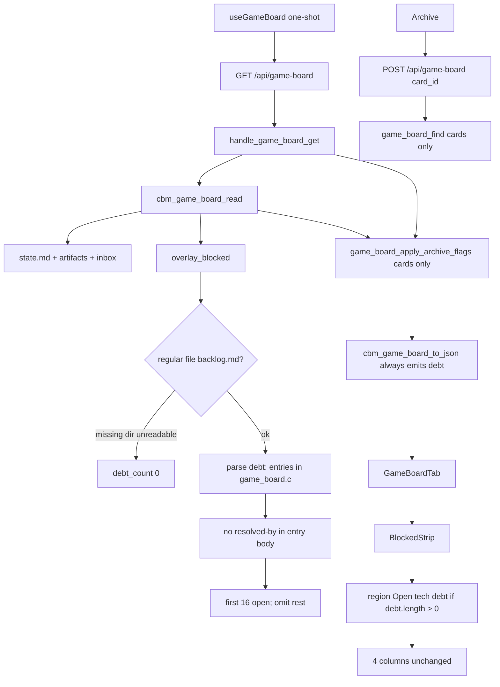

# Technical Plan — Spec-017: Game debt chrome
Status: Final | Created: 2026-09-03
Spec: spec-017-b4w-game-debt-chrome | Mode: FEATURE | Stack: unchanged

## Executive Summary
GET `/api/game-board?project=` stays the only Game board HTTP read. `game_board.c` grows one more zero-write fopen: `{root}/.gamedev/backlog.md`. It emits additive always-present `debt: [{id, title}]` (open `debt:<tag>` entries only, cap 16, file/start-line order). Inbox hide (spec-016) does not change. CBM does not write, move, or create `.gamedev/`, `.sdd-skill/`, or `.grill/`. Never create `backlog.md`.

HTTP stays the spec-012 shape: `cbm_game_board_read` → archive merge onto cards only → `cbm_game_board_to_json`. POST `/api/game-board` stays `{project, card_id, archived}`. Debt ids are not archive targets. No new path. No MCP debt tool. Do not call `cbm_spec_board_parse_tech_debt`. Do not fopen `backlog.md` from `http_server.c` or `spec_board.c`.

graph-ui Game pane paints a chrome strip after `<BlockedStrip />` and before the four columns when `debt.length > 0`. Region accessible name is "Open tech debt" (reuse `t.specBoard.openTechDebt`; no required visible heading). Rows are dead text. Graph, ADR, Specs, and WorkspaceHeader never host Game `debt` rows. Specs may still show its own spec-015 strip from TECH_DEBT.md.

## Technology Stack
Unchanged packages. Do not add npm or C libraries.

| Component | Tech | Version | Rationale |
| graph-ui | React + react-dom | ^19.0.0 | existing GameBoardTab |
| graph-ui | TypeScript | ^5.7.0 | existing |
| graph-ui | Vite | ^6.4.3 | existing |
| graph-ui | Tailwind | ^4.1.0 | wrap utilities; no new CSS file |
| graph-ui | Vitest + Testing Library | ^4.1.0 / ^16.1.0 | fetch-mock / hook-mock |
| engine | C11 | Makefile.cbm | game_board.c + HTTP tests |
| SQLite | vendored | existing | untouched (no new table) |
| HTTP | GET+POST `/api/game-board` | existing path | GET additive `debt`; POST card-only |

## System Architecture


Flow:
1. GET: `resolve_project_root_path` (unchanged 400/404). Heap `cbm_game_board_t`. `cbm_game_board_read(root)`: present / state / artifacts / inbox / overlay as today; then `debt_fill`: join `{root}/.gamedev/backlog.md`. Not a regular file or `read_whole_file` NULL → `debt_count = 0`. Else `cbm_game_board_parse_backlog_debt` fills `debt[]` (open only, cap 16). Archive merge still cards-only. `to_json` always emits `"debt":[...]` (empty array when none). Never emit `has_more`.
2. Debt fill runs only when `gamedev_skill_present` is true (same early return as today). Empty `.gamedev/` still present; missing backlog → `debt: []`.
3. POST: unchanged. `game_board_find` iterates card arrays only. A debt id as `card_id` → existing not-found path. Do not persist debt ids.
4. UI: if `(board.debt ?? []).length > 0`, paint `role="region"` `aria-label={t.specBoard.openTechDebt}` immediately after `<BlockedStrip />` and before the `grid-cols-4` row. Each row is a `<p>`: `id` then title. No onClick, no clipboard, no expand. Missing `debt` on old mocks → `[]` → no strip. Show Dones / Track / Show archived do not filter the strip.

Graph INIT (mcp_idx=yes, project `Users-jmsolorzano-SWE-tools-codebase-memory-mcp`; `get_architecture` + `search_graph` / `trace_path`; `check_index_coverage` cited paths):
- `cbm_game_board_read` (game_board.c:2024–2051) callers = `handle_game_board_get` + `handle_game_board_post`. Callees: present, `read_whole_file` state.md, `fill_artifacts`, `game_grill_fill_inbox`, `overlay_blocked`. Add `debt_fill` after `overlay_blocked`, still fopen `"rb"` only. Do not change inbox hide order.
- `cbm_game_board_to_json` (game_board.c:2208–2275) callers = `handle_game_board_get` only. Ends `postproduction` then `}`. Append `,"debt":[...]` before the closing `}`. Grow buffer already via `game_json_append` (start cap 8192). Add `game_json_emit_debt` next to `game_json_emit_blocked` (2185–2206).
- `handle_game_board_get` (http_server.c:595–625) stays read → archive merge → to_json. No backlog IO in HTTP. Coverage: http_server.c parse_partial 2299–2299 (outside this handler).
- `game_board_find` (http_server.c:650+) iterates inbox/pre/prod/post only. Do not teach it debt ids.
- `cbm_spec_board_parse_tech_debt` (spec_board.c:1437–1491) callers = `debt_fill` in spec_board.c only. LOCKED. Do not call from game_board.c.
- `BlockedStrip` (GameBoardTab.tsx:309–331) callers = `GameBoardTab` only. Omit when `rows.length === 0`. Keep.
- `GameBoardTab` (GameBoardTab.tsx:383–515) paints `<BlockedStrip />` then `grid grid-cols-4`. Insert Game debt strip between those two siblings.
- Specs `DebtStrip` (SpecBoardTab.tsx:216–227) already uses `whitespace-normal break-words` and `t.specBoard.openTechDebt`. Copy the JSX into GameBoardTab. Do not import SpecBoardTab. Do not edit SpecBoardTab.tsx.
- `fill_artifacts` walks `.gamedev/phases/` only. `backlog.md` is not in that walk today (zero matches in game_board.c). Keep that lock.
- Coverage: `game_board.c`, `game_board.h`, `GameBoardTab.tsx`, `types.ts`, `i18n.ts`, `test_game_board.c`, `test_httpd.c` no_recorded_issue. `spec_board.c` parse_partial 242–242 — do not edit. Read those files as ground truth.
- Do not call `index_repository`. Do not read `backlog.md` from spec_board.

## Directory Structure
```
src/ui/game_board.h                    EDIT — MAX_DEBT 16; debt_t; board.debt; parse prototype
src/ui/game_board.c                    EDIT — debt_fill + parse; to_json always-emit debt
tests/test_game_board.c                EDIT — parse/read Gherkin: comment/list/heading/resolved-by/cap/skip/missing/unreadable/dir/bytes/non-card
src/ui/http_server.c                   DO NOT CHANGE unless a compile forces a comment; dispatch stays
tests/test_httpd.c                     EDIT — GET debt JSON; no has_more; POST leftover bytes; spec-board leftover
Makefile.cbm                           DO NOT CHANGE (no new .c)
src/mcp/mcp.c                          DO NOT CHANGE
src/ui/spec_board.c                    DO NOT CHANGE
src/ui/spec_board.h                    DO NOT CHANGE

graph-ui/src/lib/types.ts              EDIT — GameBoardDebt; GameBoard.debt?
graph-ui/src/components/GameBoardTab.tsx
graph-ui/src/components/GameBoardTab.test.tsx
graph-ui/src/App.test.tsx              EDIT — Graph/ADR omit when Game debt is present
graph-ui/src/components/WorkspaceHeader.test.tsx  EDIT only if a Game-debt leak lock is cheaper here
graph-ui/src/components/SpecBoardTab.test.tsx     EDIT only leftover: Specs strip still spec-board

graph-ui/src/lib/i18n.ts               DO NOT CHANGE (reuse specBoard.openTechDebt)
graph-ui/src/lib/i18n.test.ts          DO NOT CHANGE (English lock already present)
graph-ui/src/hooks/useGameBoard.ts     DO NOT CHANGE (one-shot; same GET)
graph-ui/src/components/SpecBoardTab.tsx  DO NOT CHANGE
graph-ui/src/components/WorkspaceHeader.tsx DO NOT CHANGE
graph-ui/src/lib/colors.ts             DO NOT CHANGE
```

`@sdd-*` breadcrumbs on every new/substantially edited file (constitution VII.2). Update `@sdd-spec` / `@sdd-decision` on `game_board.h`, `game_board.c`, `GameBoardTab.tsx` to this spec + SDD-ADR-072..074.

## Database Schema
None. No new SQLite table. `game_archive` merge stays spec-012. Do not store debt in CBM.

## API Contracts
Prefer existing HTTP. No new path. No new MCP tool. GET `/api/spec-board` JSON is unchanged this spec (must not fopen `backlog.md`).

### GET /api/game-board?project=<name>
Unchanged status codes: 400 missing project, 404 `{"error":"project not found"}`, 500 OOM/serialize, 200 otherwise.

Live 200 body — additive key. Card and blocked objects keep spec-012/014/016 fields.

```
{
  "gamedev_skill_present": true,
  "phase": "02-production" | null,
  "focus": "...",
  "continue": "/gamedev-skill continue",
  "blocked": [ ... ],
  "inbox": [ ... ],
  "preproduction": [ ... ],
  "production": [ ... ],
  "postproduction": [ ... ],
  "debt": [
    { "id": "debt:gate-preproduction", "title": "missing GDD lock" }
  ]
}
```

| Field | Rule |
| debt | always emitted. `[]` when file missing, unreadable, directory-at-path, or zero open items. Length ≤ 16 |
| debt[].id | full token `debt:` + tag. Size cap 96 |
| debt[].title | start-line text after the tag, trimmed; strip wrapping `]`; strip trailing `-->`; cut at first ` — ` or ` -- `. Empty string allowed |
| has_more | never emitted |
| extra debt fields | never emit owner, target, severity, status, color |

Caps: `CBM_GAME_BOARD_MAX_CARDS` 64, `CBM_GAME_BOARD_MAX_BLOCKED` 16, `CBM_GAME_BOARD_MAX_DEBT` 16. Filling debt does not reduce card or blocked slots. Independent of `CBM_SPEC_BOARD_MAX_DEBT` 16.

### POST /api/game-board
Unchanged. Body `{project, card_id, archived}`. Lookup is card arrays only.

| Status | Body | When |
| 404 / existing not-found | existing string | `card_id` is a debt id (or any id not on a card) |
| 404 | `{"error":"project not found"}` | unknown project (same string as GET) |

### Forbidden
- New `/api/game-debt` or a second GET
- New MCP debt tool
- Putting debt objects inside `inbox[]` / phase arrays
- Emitting `has_more` or overflow copy
- Writing `.gamedev/`, `.sdd-skill/`, or `.grill/` (including creating `backlog.md`)
- Reading `backlog.md` from spec_board or HTTP
- Calling `cbm_spec_board_parse_tech_debt`
- Changing Inbox hide (registry or Companion-to/roadmap)
- Changing Specs TECH_DEBT.md parse or Specs strip
- Strip in WorkspaceHeader, Graph, ADR, or Specs (Game rows)
- Severity / owner / target / color on rows
- Clipboard copy of the debt tag
- Filtering debt with Show Dones / Track / Show archived
- Changing spec-012 expand/archive, spec-014 filters, spec-016 registry hide
- Dropping `truncate` from ArtifactCard; dropping Inbox/Epic wrap

## Answers to Questions for Architect

### Always-emit `debt: []` vs omit key when empty
Always emit `"debt":[]`. Planner default. Matches spec-015 / SDD-ADR-065. Old UIs ignore the key. New UI treats missing as `[]` (defensive) but C always writes the key so Gherkin `debt is []` is a present empty array, not a missing field. Omit-key would fork the two board contracts.

### Tag charset: allow `.` vs hyphen/alnum only
Lock `[A-Za-z0-9][A-Za-z0-9_-]*`. No `.` inside the tag. Planner default.

Scan the start line for the first `debt:` immediately followed by that tag body. `id` is the full token (`debt:` + tag). After the first tag character, consume the longest run of `[A-Za-z0-9_-]`. A following `.` is not part of the tag (it becomes title text). `debt:` with space, punctuation, or end after the colon is not a start.

### Wrap CSS: `break-all` vs `break-words`
Match the Specs strip. SpecBoardTab `DebtStrip` already uses `whitespace-normal break-words` (SpecBoardTab.tsx:221). Game debt title is prose with spaces (Gherkin long title). Use the same classes. No `truncate`. No `text-overflow: ellipsis`.

Path wrap stays InboxCard / EpicCard only (`break-all`). Artifact id truncate stays.

### Visible heading vs aria-only
Accessible name only. `role="region"` + `aria-label={t.specBoard.openTechDebt}` (`en` = `"Open tech debt"`). No required visible `<h2>`. Same pattern as Specs debt and Game `blockedStrip`. Tests use `getByRole("region", { name: "Open tech debt" })`.

### Reuse vs new i18n key
Reuse `t.specBoard.openTechDebt`. Do not add `t.gameBoard.openTechDebt`.

Same English is required by Gherkin. GameBoardTab already reuses `t.specBoard.showArchived` (SDD-ADR-057). `i18n.ts` / `i18n.test.ts` already lock `en` `"Open tech debt"` and zh `"未解决的技术债"`. A second key with the same string can drift. Game and Specs never mount together (silent win), so one accessible name cannot collide on screen.

## Parse contract (implementer-facing)

Export `cbm_game_board_parse_backlog_debt(const char *md, cbm_game_board_debt_t *out, int *count)` for buffer unit tests. NULL/empty md → count 0. Does not fopen.

Start line: any line (HTML comment, `-` / `*` / `+` list, ordered list, ATX heading, or prose) that contains a first `debt:` immediately followed by `[A-Za-z0-9][A-Za-z0-9_-]*`. `id` = that full token.

Not a start:
- `debt:` then space / punctuation / EOL
- `design` / `tech` without a `debt:` prefix
- A line with no `debt:` token

Entry body: from the start line through (not including) the next start line, the next ATX heading, or EOF. ATX heading = after at most 3 leading spaces the line begins with `##` (includes `###`). Blank lines do not end the entry. The start line itself is not an ender for its own body.

A `## debt:<tag> …` line is a start for a new entry and an ender for the previous one.

Closed iff the entry body contains the 11-character sequence `resolved-by` (hyphen, lowercase). Same line or a later body line. `Resolved-by` / `resolved_by` do not close.

Title: text on the start line after the tag, then:
1. trim leading/trailing whitespace
2. if the last non-space character is `]`, strip that one `]`
3. if the remainder ends with `-->`, strip `-->`
4. trim again
5. cut at the first ` — ` (em dash U+2014, spaces) or the first ` -- ` (space, two ASCII hyphens, space), whichever appears first
6. trim the kept prefix

Empty title is allowed. Owner/target after the cut are omitted.

Order = file / first-start-line order. Duplicate id: first start-line wins (even if that first entry is closed). Later same-id starts are skipped and do not consume a cap slot.

Include iff the start is valid and the body has no `resolved-by`. Cap 16 open. The 17th open (file order) is omitted. Closed entries do not consume a slot. Never emit `has_more`.

Unreadable = regular file + `read_whole_file` NULL (fopen fail, fseek fail, size > `GAME_BOARD_MAX_FILE` 1 MiB). Directory-at-path is not a regular file → count 0 (same class as missing). Prefer oversize for the unreadable test (Darwin may fopen chmod 000).

`debt_fill` path is a fixed join: `root_path` + `/.gamedev/backlog.md`. Reuse `game_is_regular_file` + `read_whole_file`. fopen `"rb"` only.

## Key Decisions
- Same GET; always-emit `debt: [{id, title}]`; cap 16 independent of cards/blocked/spec-board; no `has_more` → SDD-ADR-072
- Parse in `game_board.c` / `cbm_game_board_read`; tag charset no `.`; entry body until next start/`##`/EOF; `resolved-by` substring; never call `cbm_spec_board_parse_tech_debt`; HTTP/spec_board do not fopen backlog.md → SDD-ADR-073
- Game-only strip after BlockedStrip; reuse `specBoard.openTechDebt`; no required visible heading; dead text; titles `break-words` → SDD-ADR-074

Planner defaults 1–11 frozen. Grill ADR-001 (chrome list, not a column), ADR-002 (open = no `resolved-by`), ADR-007 (same GET additive), ADR-009 (after BlockedStrip; grayscale; no owner/target) apply. Do not reopen.

## Performance Targets
| Target | Value |
| GET | existing one-shot; one extra fopen of backlog.md (≤ 1 MiB `GAME_BOARD_MAX_FILE`) |
| POST | unchanged |
| Poll | `useGameBoard` one-shot unchanged |
| Caps | 64 cards / 16 blocked / 16 open game debt |
| Specs / Graph / ADR | 0 new RPCs; spec-board does not fopen backlog.md |
| Coverage | >80% on touched game_board + httpd Gherkin + GameBoardTab (reporter may be absent) |

## Security Considerations
- Loopback bind/auth unchanged. Do not widen.
- Debt path is a fixed join: `root_path` + `/.gamedev/backlog.md`. Not taken from query or POST body.
- fopen `"rb"` only. GET/POST leave skill trees byte-identical and do not create `backlog.md`.
- JSON escape `debt[].id` / `debt[].title` via `cbm_json_escape`.
- UI renders id + title as text, not HTML. Rows are not buttons.
- POST `card_id` is still looked up on card arrays only, never used as a filesystem path into backlog.md.
- Do not follow this spec into `/api/skill-presence` or spec-board.

## Testing Strategy
C board: `tests/test_game_board.c` fixtures under `/tmp` (`th_mktempdir`). Never this repo’s live `.gamedev/` or `.grill/`. fopen rb only. Buffer tests may call `cbm_game_board_parse_backlog_debt` without fopen.

C HTTP: `tests/test_httpd.c` existing `ui_game_board_get` / `ui_game_board_post`. GET debt JSON + no `has_more`. POST archive leftover: backlog.md byte-identical. Unknown project 404 unchanged. GET bytes: backlog.md (when present), `state.md`, `epics_registry.md`, `.grill/index.md`. Absent-file GET must not create `backlog.md`. GET `/api/spec-board` leftover: must not require backlog.md; Specs `debt[]` still from TECH_DEBT.md.

Vitest: mock `useGameBoard`. Missing `debt` must not crash. No live daemon. Playwright optional (constitution IX.4).

Existing `gb_assert_empty_arrays_json` must accept (and should assert) additive `"debt":[]`. Existing GameBoardTab "does not show Open tech debt on mount" stays green when `debt` is missing or `[]`.

Gherkin → owner:

| Gherkin scenario | Primary test |
| Open comment entry appears on GET and in the Game strip | `test_game_board.c` + `test_httpd.c` + `GameBoardTab.test.tsx`; WorkspaceHeader lock |
| List-item entry without resolved-by is open | `test_game_board.c` |
| resolved-by on a following line closes the entry | `test_game_board.c` + Vitest omit |
| design and tech tags without debt prefix are omitted | `test_game_board.c` |
| Limit — missing backlog.md omits the strip | `test_game_board.c` + Vitest |
| Limit — empty gamedev dir still shows Game and omits the strip | Vitest host (presence true, debt []) |
| Limit — same-line resolved-by closes the entry | `test_game_board.c` |
| Limit — blank line does not end the entry | `test_game_board.c` |
| Limit — next debt start ends the previous entry | `test_game_board.c` |
| Limit — 17th open item is omitted | `test_game_board.c` + Vitest no "Has more" |
| Limit — long debt title wraps in the strip | `GameBoardTab.test.tsx` |
| Limit — Graph ADR and Specs do not show Game debt rows | `App.test.tsx` Graph/ADR + Specs leftover |
| Limit — Specs strip still uses spec-board debt only | existing SpecBoardTab + keep green |
| Limit — activating a debt row does nothing | `GameBoardTab.test.tsx` |
| Limit — Show Dones off still shows the debt row | `GameBoardTab.test.tsx` |
| Limit — Blocked strip stays above the debt strip | `GameBoardTab.test.tsx` |
| Limit — heading with debt tag counts | `test_game_board.c` |
| Limit — debt colon with no tag body is skipped | `test_game_board.c` |
| Limit — backlog.md is still not a card | `test_game_board.c` |
| Limit — Inbox registry hide is unchanged | existing + keep green |
| Error — unreadable backlog.md still 200 with empty debt | `test_game_board.c` (oversize regular file) |
| Error — directory at backlog.md path still 200 with empty debt | `test_game_board.c` |
| Error — line without a debt tag is skipped | `test_game_board.c` |
| Error — unknown project on GET is still 404 | `test_httpd.c` (existing; keep green) |
| Error — GET does not write skill trees or create backlog.md | `test_httpd.c` bytes + file-absent |
| Error — POST archive does not write backlog.md | `test_httpd.c` |

## Deployment Plan
- `scripts/build.sh --with-ui` (C + embed UI).
- No env var. No daemon flag. No schema migration.
- Old UIs ignore unknown `debt`. New UI treats missing as `[]`.
- This-repo has no `.gamedev/` → Game tab omitted here; live default omit until a gamedev path is opened.

## Risks & Mitigation
| Risk | Probability | Impact | Mitigation |
| Call spec_board TECH_DEBT helper on backlog.md | med | wrong format / layering | ADR-073: local parse only |
| Omit `debt` key when empty | med | Gherkin `debt is []` ambiguous | ADR-072 always emit |
| Treat directory-at-path as unreadable-present | med | wrong class | not regular file → [] |
| `resolved-by` only on start line | med | next-line close missed | scan whole entry body |
| Blank line ends the entry | med | false open | body continues |
| Strip in WorkspaceHeader / filter row | med | leaks onto Graph or implies Track filter | ADR-074 after BlockedStrip only |
| New i18n key drifts from Specs English | med | Gherkin name miss | reuse specBoard.openTechDebt |
| `break-all` shatters prose titles | low | density vs Specs | match Specs `break-words` |
| Debt cards in Inbox | med | kind E / registry hide collision | chrome strip; not a card |
| Existing to_json exact-string tests | high | Task #1 red | accept additive `debt` (empty when no file) |
| spec-015 Game "no Open tech debt" test | high | false fail when debt [] | keep omit when missing/[] ; invert only when Game debt is mocked |

## Success Criteria
- [ ] All 6 US + all 26 Gherkin scenarios have a C and/or Vitest owner
- [ ] GET is the only Game board read; POST stays card-only
- [ ] Zero writes to `.sdd-skill/`, `.grill/`, or `.gamedev/`; backlog.md never created
- [ ] Zero debt rows in Inbox / pre / prod / post
- [ ] Inbox hide and Specs debt parse unchanged
- [ ] Graph hex and last-indexed TZ unchanged
- [ ] @implementer can execute without a sibling HTTP reader or MCP tool

## External Integrations & Special Tools

| Tool | Type | Purpose | Tasks | Setup | Fallback |
| gamedev-skill `backlog.md` | skill filesystem (read-only) | open debt:* list | #1–#2 | none in CBM; fixtures in /tmp | missing/unreadable/dir → debt [] |
| GET `/api/game-board` | existing HTTP | additive board JSON | #1–#3 | daemon in prod; C + fetch mock in tests | 404 unknown project; 200 debt [] |
| GET `/api/spec-board` | existing HTTP | leftover lock | #2 | existing fixtures | must not read backlog.md |
| codebase-memory-mcp graph | session MCP | architect INIT only | — | mcp_idx=yes | file read (done) |

No new MCP tool. Do not call `index_repository`.

## Constitution validation
Checked against `.sdd-skill/docs/constitution.md` (draft — not rewritten):
- I.1–I.2: frozen spec only; no cycle-file writes to `.sdd-skill/`, `.grill/`, or `.gamedev/`
- II: C11 `cbm_`; React 19; no new CSS file; reuse existing i18n en+zh; no new runtime
- III: chrome grayscale; no severity color; `colorForLabel` locked
- IV.3: same GET/POST family; no sibling debt path
- IV.4: no second freshness field
- V: every Gherkin mapped; C + Vitest; no live daemon for UI
- VI: loopback unchanged; fixed join path; no secrets
- VII: region accessible name; breadcrumbs
- VIII: no `get_graph_schema` on this path; one-shot stays
- IX.2: spec-012 expand/archive stay; spec-014 filters do not hide debt; spec-015 Specs strip + Epic wrap stay; spec-016 Inbox hide + Inbox wrap stay

No constitution edit this spec (IX.2 append is @planner at close).

## Implementation breadcrumbs for @implementer
1. Do not add a second GET or an MCP debt tool.
2. Do not write `.gamedev/`, `.sdd-skill/`, or `.grill/`. fopen `"rb"` only. Never create `backlog.md`.
3. Do not put backlog fopen in `http_server.c` or `spec_board.c`. Fill in `cbm_game_board_read` after `overlay_blocked`.
4. Do not call `cbm_spec_board_parse_tech_debt`. Do not import spec_board debt types.
5. Do not put debt objects in `inbox[]` or phase arrays. Do not add kind E for debt.
6. JSON: always `"debt":[{id,title}]`. Never `has_more`, never owner/target/severity.
7. Do not change `game_grill_fill_inbox`, registry present, or Companion-to/roadmap hide.
8. Do not edit `SpecBoardTab.tsx`, `spec_board.c`, `useGameBoard.ts`, `i18n.ts`, `colors.ts`, `WorkspaceHeader.tsx`.
9. Do not change poll interval, spec-012 expand Set, archive POST body, or `formatIndexedAt`.
10. Do not edit `colors.ts` / EdgeLines hex.
11. Start: first `debt:` + `[A-Za-z0-9][A-Za-z0-9_-]*`. `id` is the full token.
12. Title = after tag → trim → strip wrapping `]` → strip trailing `-->` → cut at first ` — ` or ` -- `.
13. Body until next start, next `##` (0–3 leading spaces), or EOF. Blank lines continue.
14. Closed iff `strstr` finds `resolved-by`. Cap 16 open in file order. Duplicate id: first start wins.
15. `design` / `tech` without `debt:` are out. Bare `debt:` skipped.
16. Unreadable file (fopen fail / oversize): `debt_count` 0; still 200. Directory-at-path: not regular → 0.
17. POST with a debt id: existing card-not-found path; do not add a debt error string.
18. Heap-only `cbm_game_board_t` (already calloc).
19. Existing host mocks without `debt` must not throw. `board()` helper may omit the key.
20. Strip is `<p>` rows inside `role="region"`; not buttons; after BlockedStrip; not in WorkspaceHeader.
21. Debt title line: `whitespace-normal break-words`; no `truncate`. Copy Specs DebtStrip JSX locally.
22. i18n: `t.specBoard.openTechDebt` only. Do not add `gameBoard.openTechDebt`. Tests assert English.
23. Breadcrumb headers on touched files.
24. Fixtures in `/tmp` only. Never parse a live backlog.md from this repo (there is none).
25. `CBM_GAME_BOARD_MAX_DEBT` 16 in game_board.h next to MAX_BLOCKED.
26. Export `cbm_game_board_parse_backlog_debt` for buffer unit tests (like registry parse).
27. Stop appending open items at cap 16; do not invent overflow chrome.
28. Existing `gb_assert_empty_arrays_json` should assert `"debt":[]` after Task #1.
29. Keep spec-015 GameBoardTab test: no region when debt missing/[]. Add paint tests only when debt is mocked non-empty.
30. `backlog.md` stays a non-card: do not add it to `fill_fixed_files` / Inbox walk.
